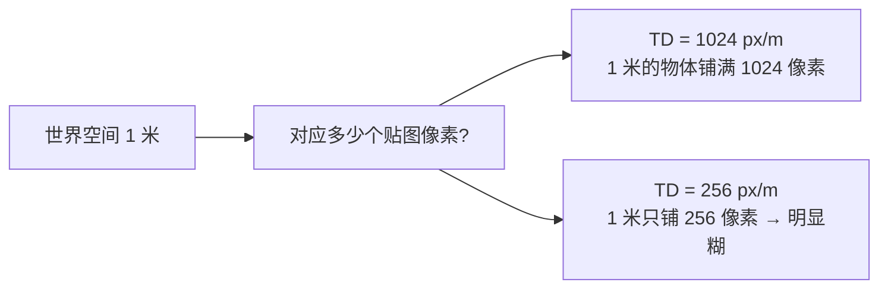
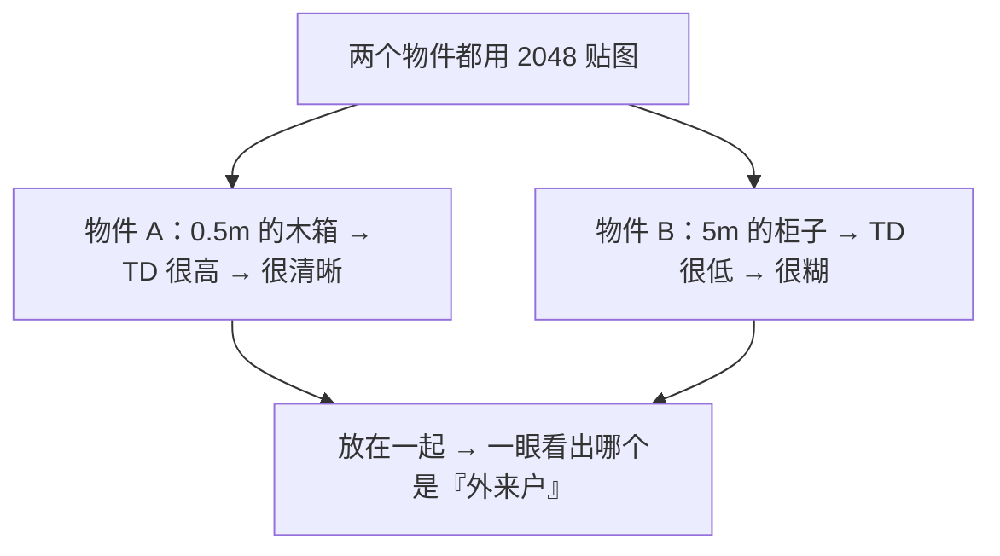
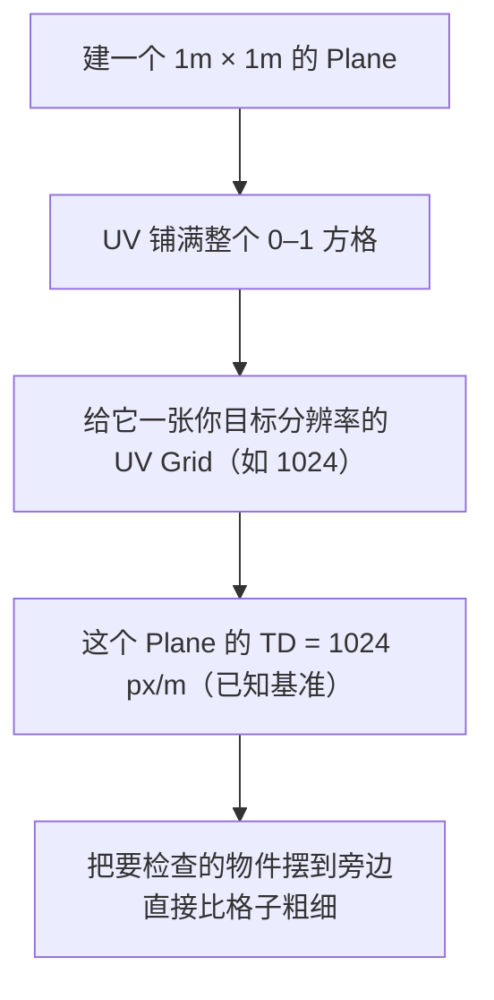
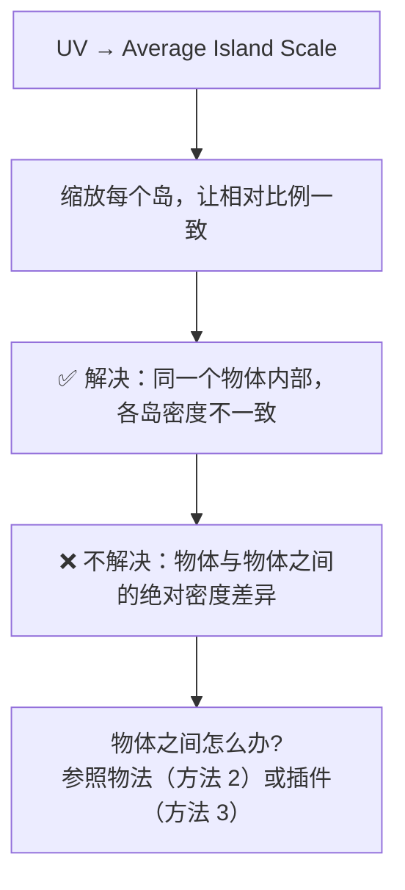
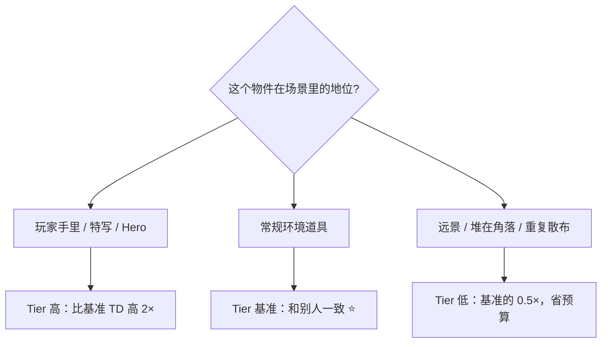
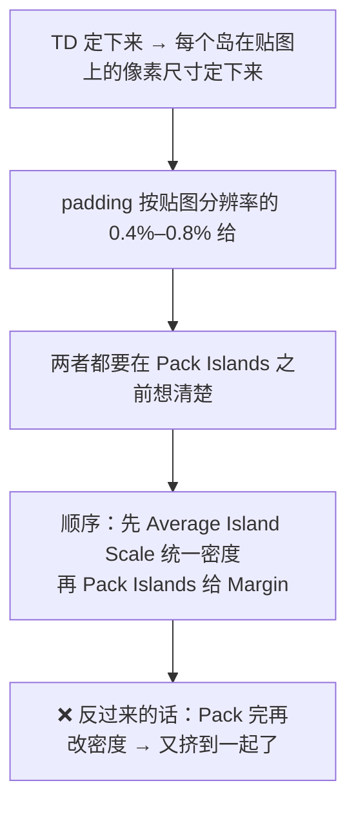

# 06 · 纹素密度与贴图分辨率

> 一句话：**纹素密度（Texel Density）=「1 米的世界空间占多少个贴图像素」。它决定了场景里所有物件的清晰度是否一致。**
> 依据：路线图 Stage 3/4 的密度与分辨率要求；UVPackmaster 3.4+ release notes（texel density in px/m，per-island）；TexTools（Texel Density 工具集）。

---

## 一、什么是纹素密度



| 常见单位 | 使用场景 |
| --- | --- |
| **px/m**（像素/米） | UVPackmaster 等现代工具、UE 常用 |
| **px/cm**（像素/厘米） | TexTools 传统单位、影视常用 |

> 换算：`1 px/cm = 100 px/m`。跟人协作时一定要确认单位，差 100 倍是最常见的事故。

### 为什么它比「贴图分辨率」更重要



**分辨率决定单个资产的上限，纹素密度决定资产之间是否协调。** 场景里所有同量级道具必须同一个 TD。

---

## 二、怎么算（不用插件也能算）

### 方法 1：按世界尺寸估（最快）

```text
TD ≈ 贴图边长 ÷ 该物体展开后对应的世界尺寸（沿最长边）

例：油桶高 0.9m，UV 展开后高度方向占了整张 1024 贴图的 100%
→ TD ≈ 1024 / 0.9 ≈ 1138 px/m

例：同一个油桶，展开后高度方向只占了贴图的 50%（另 50% 给了别的物件）
→ TD ≈ (1024 × 0.5) / 0.9 ≈ 569 px/m
```

### 方法 2：参照物法（推荐，可在场景里一直挂着）



> ⭐ **把这块「基准板」存进你的练习文件**，每次做新道具都摆出来比一下。这是零插件、零计算、最不容易搞错的办法。

### 方法 3：插件（精确到数值）

| 工具 | 能力 | 备注 |
| --- | --- | --- |
| **UVPackmaster 3.4+** | 支持按 **px/m** 定义 texel density，可**全局**或**逐岛**设置；排布时自动按 TD 缩放 | 付费 PRO |
| **UVPackmaster 4** | 加了 **TD tiers**：把岛分配到一个 tier，之后改 tier 的数值即可批量调整 | 付费 PRO |
| **TexTools** | `Texel Density` 面板：`Get / Set`、按选中面/整个物体/所有物体统一 | 免费，但要用 5.x 兼容的**社区 fork**（见 [`08`](08-练习项目-四个道具的UV.md) 资源段） |
| **Blender 内置** | `UV → Average Island Scale` | 只做「相对一致」，不给数值 |

---

## 三、内置手段能做到什么程度



> 内置手段 + 参照物法，对这条主线（做四五个道具）**完全够用**。插件是「要做 50 个资产」时才回本的效率工具，别在 Stage 3 就为了它分心。

---

## 四、分辨率怎么定

| 资产定位 | 贴图分辨率 | 说明 |
| --- | --- | --- |
| 小道具（箱、桶、杂物） | **512 / 1024** | 默认从 1024 起，远景道具降到 512 |
| 主角道具（工具箱、武器） | **2048** | 玩家会凑近看 |
| Hero 资产（开场特写、主角武器） | **4096** | 只给 1–2 个 |
| 地形 / 大面（共用 tiling） | 1024–2048 tiling | 靠重复平铺，不靠分辨率 |

### 硬性约束

- **必须是 2 的幂**（512/1024/2048/4096）：引擎的 mipmap 和压缩格式（BC/DXT/ASTC/ETC）都要求
- **非正方形可以用**（1024×2048），但正方形最省事
- **贴图是显存大头**：一张 2048 的 RGBA 未压缩 ≈ 16MB，压缩后（BC7）≈ 5.3MB。一个场景 20 张 2048 就是 100MB+
- **材质数 = draw call**：一个道具尽量 1–2 个材质（Stage 4 会强调）

---

## 五、什么时候允许密度不一致



> 这就是 UVPackmaster 4 的 **TD tiers** 想解决的问题：给岛分档，之后统一调档位数值，不用一个个重新分配。
> **但前提是「有意为之」**——每个道具属于哪一档是你定的，不是随机出现的。

---

## 六、TD 与 padding 的关系（别互相打架）



> 顺序不能反：**先统一密度 → 再排布 → 最后再检查一遍四件套。**

---

## 七、坑

- ❌ **px/m 和 px/cm 混用** → 差 100 倍。跟人协作/看教程时先确认单位
- ❌ **以为「贴图分辨率一样 = 清晰度一样」** → 忽略了物体尺寸差，场景里清晰度参差不齐
- ❌ **先 Pack 再统一密度** → 密度一改，岛的像素尺寸就变了，之前算好的 padding 全废
- ❌ **给所有道具无脑 2048** → 显存爆炸，远景道具根本用不上
- ❌ **非 2 的幂的贴图** → 引擎 mipmap / 压缩全部出问题
- ❌ **用 `Average Island Scale` 就以为密度「统一」了** → 它只统一物体内部，物体之间还得靠参照物法或插件

---

## 八、自检

| # | 自检点 | 通过标准 |
| - | ------ | -------- |
| ① | 概念 | 说出 TD 的定义，并解释为什么「两个物件都用 2048」仍然可能清晰度不一致 |
| ② | 计算 | 给一个 0.9m 高、UV 占满贴图的油桶，算出用 1024 贴图时的 TD（≈1138 px/m） |
| ③ | 参照物法 | 说出怎么用一块 1m Plane + UV Grid 做密度基准 |
| ④ | 分辨率 | 说出小道具 / 主角道具 / Hero 三档的分辨率，以及「必须 2 的幂」的原因 |
| ⑤ | 顺序 | 说出「先密度后排布」的原因 |
| ⑥ | **实操** | 给两个尺寸差 3 倍的道具，把它们调到「格子粗细一致」 |

---

## 九、速查

```text
【定义】
TD = 每 1 米世界空间占多少贴图像素（px/m）
注意单位：1 px/cm = 100 px/m ⚠️ 差 100 倍

【估算法】
TD ≈ 贴图边长 × (该岛占贴图的比例) ÷ 对应的世界尺寸
例：0.9m 油桶，占满 1024 → 1024/0.9 ≈ 1138 px/m
    占 50%            → (1024×0.5)/0.9 ≈ 569 px/m

【参照物法 ⭐ 零插件最稳】
建 1m×1m Plane → UV 铺满 0–1 → 贴目标分辨率的 UV Grid
这个 Plane 的 TD 已知 → 把物件摆旁边比格子粗细

【工具】
内置：UV → Average Island Scale（只统一物体内部）
UVPackmaster 3.4+：px/m，可全局/逐岛（付费）
UVPackmaster 4：TD tiers，分档批量调（付费）
TexTools：Texel Density Get/Set（免费，需 5.x 兼容 fork）

【分辨率】
小道具 512/1024 ｜ 主角道具 2048 ｜ Hero 4096
必须 2 的幂（mipmap + 压缩格式要求）
显存：2048 RGBA 未压缩 ≈16MB，BC7 ≈5.3MB
材质数 = draw call，一个道具 1–2 个材质

【密度分档】
Hero：基准 ×2 ｜ 常规：基准 ⭐ ｜ 远景/散布：基准 ×0.5
关键：必须是有意为之的分档，不是随机出现的差异

【顺序】
先 Average Island Scale 统一密度 → 再 Pack Islands 给 Margin
→ 最后重跑检查四件套
❌ 反了会白做
```

---

> **下一步**：[`07-第二套UV与光照贴图UV.md`](07-第二套UV与光照贴图UV.md) —— 主线其实只需要一套 UV；搞清楚什么情况下才需要第二套。
