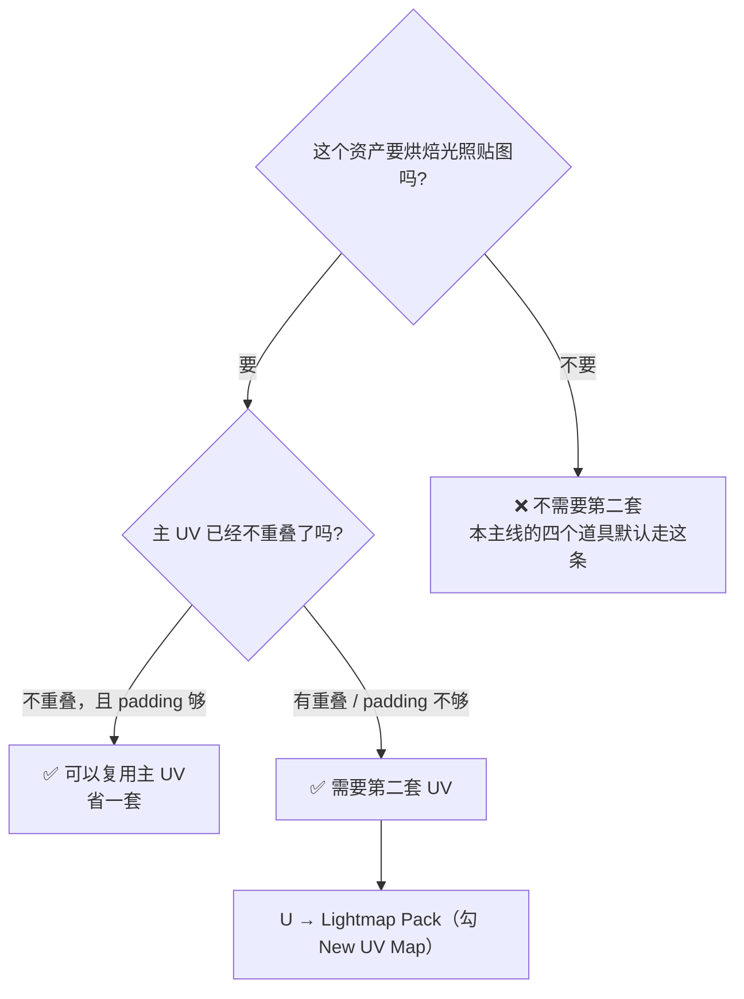
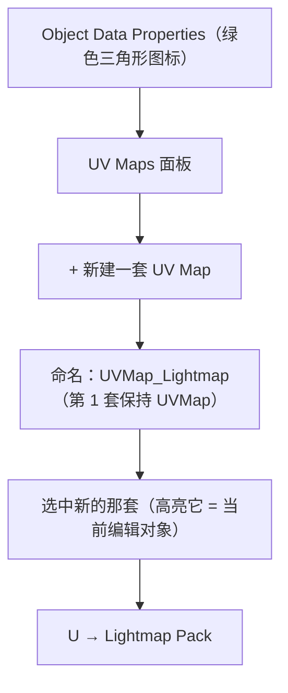
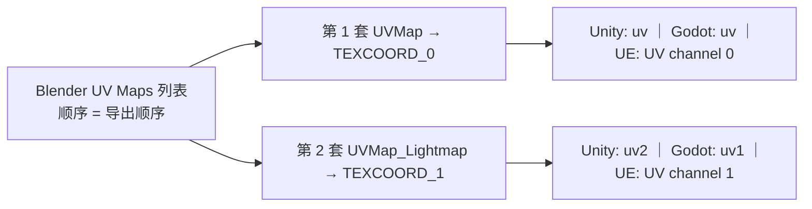

# 07 · 第二套 UV 与光照贴图 UV

> 一句话：**主 UV 负责「长什么样」，第二套 UV 负责「被光照亮成什么样」——它唯一的要求就是不重叠。**
> 依据：Blender 5.2 LTS 官方手册 · [UV Maps](https://docs.blender.org/manual/en/latest/modeling/meshes/uv/uv_texture_spaces.html#uv-maps) / [Editing UVs（Lightmap Pack）](https://docs.blender.org/manual/en/latest/modeling/meshes/uv/editing.html)；glTF 2.0 规范（TEXCOORD_0 / TEXCOORD_1）。

---

## 零、先订正：路线图的做法不是最优解

| | 路线图 Stage 3 的说法 | **更标准的做法** |
| - | ------------------- | ---------------- |
| 第二套 UV | 「把现有 UV 复制一份，重排成不重叠」 | **`U → Lightmap Pack` 并勾 `New UV Map`**：一步完成「新建 UV Map + 自动分岛 + 自动留边距 + 排布」 |

> 复制再重排当然可行（保留了主 UV 的岛形状，纹理连续性好），但它多一步，而且重排还得自己处理边距。
> **默认用 Lightmap Pack；只有当你希望光照图的岛形状和主 UV 一致时，才走「复制 + 重排」。**

---

## 一、什么时候需要第二套 UV



| 需要 | 不需要 |
| --- | --- |
| 引擎要做 **烘焙 GI / Lightmap**（Unity 的 Baked Lightmap、UE 的 Lightmass、Godot 的 Lightmap GI） | 全动态光照 |
| 主 UV 为了省空间**故意重叠**了重复结构 | 主 UV 已经不重叠且 padding 足够 |
| 主 UV 是按 tiling 设计的（超出 0–1 平铺） | UE5 用 Lumen/自动生成的 lightmap UV（引擎自己会生成） |

> 📌 **本主线的现实情况**：Stage 4 会把 AO / Normal 烘焙到**主 UV** 上（高模→低模），而真正的「光照贴图」是引擎里的事。
> 所以这四个道具**大概率不需要第二套 UV**——但你要知道它是什么、什么时候会用到，以及怎么用 GLB 带过去。

---

## 二、怎么建



> ⭐ **UV Maps 面板里高亮的那套 = 你正在编辑/展开的那套**。切换错了就会把主 UV 改掉——这是第二套 UV 最常见的翻车方式。
> 如果你用 `Lightmap Pack` 时勾了 **`New UV Map`**，它会自己新建并切过去，上面 3–5 步可以省掉。

---

## 三、Lightmap Pack 参数

| 参数 | 说明 | 建议 |
| --- | --- | --- |
| **Share Texture Space** | 多个选中物体**共用**同一块 0–1 空间（一整间屋子共用一张光照图） | 单个道具：**关**。做整室烘焙：**开** |
| **New UV Map** | ⭐ 直接新建一套 UV Map 来放结果，不动主 UV | **勾上**（除非你想就地覆盖当前这套） |
| **Margin** | 岛间距 | 光照图对 bleed 极敏感，比主 UV 给得更宽 |

> 光照图的 padding 为什么要更宽：光照图记录的是**低频的光照信息**，一旦邻岛像素渗进来，就是一块明显的明暗错误，而且它不靠高频细节掩盖。

---

## 四、导出：让引擎认到第二套



| 引擎 | 第 2 套 UV 叫什么 | 备注 |
| --- | --- | --- |
| **glTF / GLB** | `TEXCOORD_1` | 规范支持多套 UV，导出时 `Geometry → UVs: ON` |
| **Unity** | `uv2` | Mesh Import Settings 里确认 UV channel 都在 |
| **Godot 4** | `uv1` | 导入后可在材质里取 `UV2` |
| **Unreal 5** | UV channel 1 | 静态网格的 `Lightmap Coordinate Index` 指向它 |

> ⚠️ **各引擎的编号习惯不一样**（Unity 从 uv/uv2/uv3 数，Godot 从 uv/uv1/uv2 数）。**不要靠名字猜，导出后去引擎的导入设置里看一眼 channel 数量。**

---

## 五、坑

- ❌ **在 UV Maps 面板里没切换就展开** → 把主 UV 覆盖了 → 贴图全乱
- ❌ **烘焙 AO/Normal 时选错 UV** → 烘焙用的是材质里 `UV Map` 节点 / 默认的活动 UV，不是你以为的那套
- ❌ **第二套 UV 忘了检查重叠** → 光照图一半被另一半覆盖，引擎里出现整片发黑的物件
- ❌ **第二套 UV 的 padding 照抄主 UV** → 光照图 bleed 比主贴图明显得多
- ❌ **以为 UE5 也必须要手工做第二套** → UE5 可以自动生成 lightmap UV（`Generate Lightmap UVs`），Nanite + Lumen 场景更是基本用不上
- ❌ **导出后发现引擎只认到一套** → 检查 GLB 导出的 `Geometry → UVs`，以及引擎导入设置里的 UV channel 数量
- ❌ **给每个道具都做第二套** → 白花时间。先确认你的引擎/项目到底要不要 baked GI

---

## 六、自检

| # | 自检点 | 通过标准 |
| - | ------ | -------- |
| ① | 何时需要 | 说出需要第二套 UV 的 3 个条件，以及本主线四个道具为什么大概率不需要 |
| ② | 新建 | 说出 `Object Data → UV Maps → +` 的流程，以及「高亮 = 当前编辑对象」的坑 |
| ③ | Lightmap Pack | 说出 `New UV Map` / `Share Texture Space` / `Margin` 三个参数怎么给 |
| ④ | 与路线图的差异 | 说出为什么 `Lightmap Pack` 比「复制 + 重排」更推荐 |
| ⑤ | 导出 | 说出 glTF 的 `TEXCOORD_0/1` 对应关系，以及各引擎命名不一致的风险 |
| ⑥ | **实操** | 给一个道具，**10 分钟内**建出第二套 UV，导出 GLB 并在引擎里确认有 2 个 UV channel |

---

## 七、速查

```text
【要不要】
要 baked GI / Lightmap → 且主 UV 有重叠 → 需要第二套
全动态光照 / UE5 Lumen+Nanite → 不需要
本主线四个道具 → 大概率不需要，但要知道怎么做

【怎么建】
Object Data Properties → UV Maps → + → 命名 UVMap_Lightmap
⚠️ 面板里【高亮的那套 = 当前编辑对象】，切错了会覆盖主 UV

【Lightmap Pack】
U → Lightmap Pack
New UV Map ⭐        勾上（一步到位：新建+分岛+margin）
Share Texture Space  单个道具关 ｜ 整室烘焙开
Margin               比主 UV 更宽（光照 bleed 更明显）

【两套 UV 的分工】
UVMap（第1套）         → TEXCOORD_0 → 主贴图（BaseColor/Normal/Rough）
UVMap_Lightmap（第2套） → TEXCOORD_1 → 光照贴图，必须不重叠

【引擎命名 ⚠️ 各不相同】
Unity   uv / uv2
Godot   uv  / uv1
UE      UV channel 0 / 1（Lightmap Coordinate Index）
导出后一定去引擎导入设置里数一下 UV channel 数量
```

---

> **下一步**：[`08-练习项目-四个道具的UV.md`](08-练习项目-四个道具的UV.md) —— 把 01–07 全部落到 Stage 1/2 那四个道具上。
