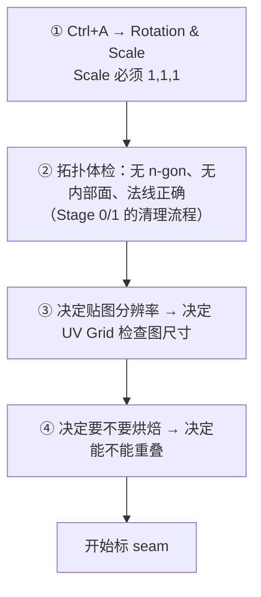
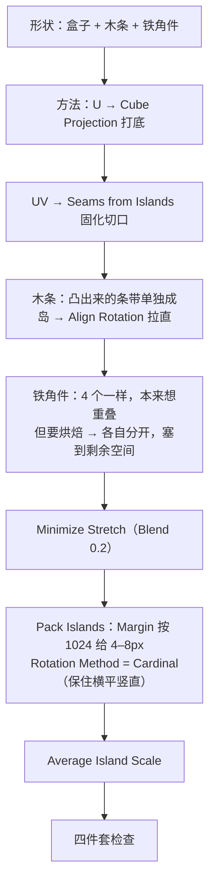
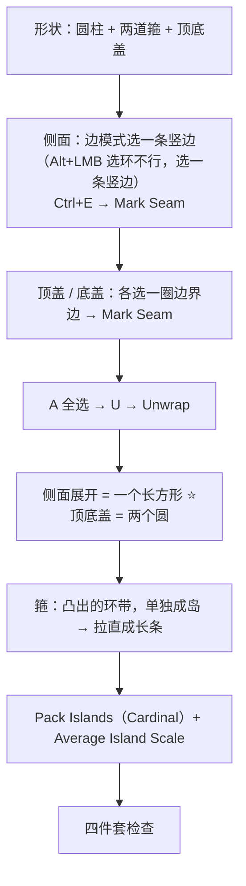
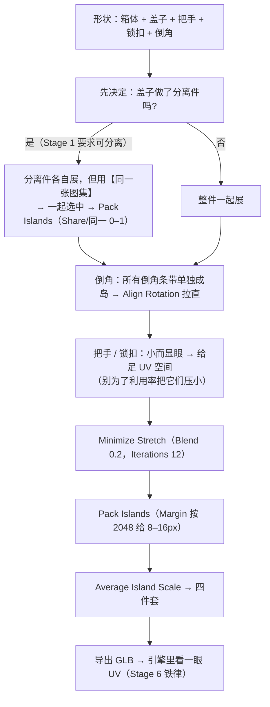
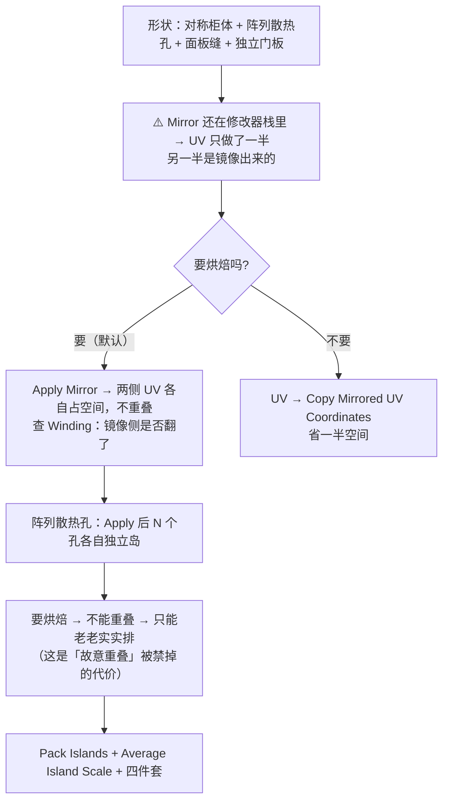
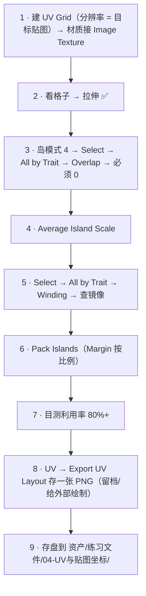

# 08 · 练习项目：四个道具的 UV

> 一句话：**UV 是「做出来才算会」的技能。这篇是 01–07 的收口——四个道具逐个过一遍，每个都有明确的展开方案和验收数字。**
> 前置：Stage 1/2 的四个道具（木箱 / 油桶 / 工具箱 / 科幻储物柜）已经建模完成、拓扑干净、尺寸是真实米制。

---

## 一、开工前：每个资产都要先做的 4 件事



| 道具 | 目标三角形数 | 贴图分辨率 | 要不要烘焙 | 能不能重叠 |
| --- | --- | --- | --- | --- |
| 木箱 | ≤800 | 1024 | 要（AO） | ❌ 不能 |
| 油桶 | ≤800 | 1024 | 要（AO） | ❌ 不能 |
| 工具箱 | ≤2500 | 2048 | 要（AO + Normal） | ❌ 不能 |
| 科幻储物柜 | ≤2500 | 2048 | 要（AO） | ❌ 不能 |

> 全部按「要烘焙」来做，因为 Stage 4 确实要烘 AO/Normal。**烘焙是默认的，所以重叠在这条主线上是禁止的。**

---

## 二、道具逐个过

### 2.1 木箱（入门）



| 检查项 | 目标 |
| --- | --- |
| 岛数 | 3–8 |
| 格子 | 正面/侧面必须是正方形（UV Grid 1024） |
| 重叠 | 0（要烘焙） |
| 利用率 | 80%+ |
| 硬边对齐 | 所有倒角边都标了 seam |

> **这个道具的重点是「熟悉流程」**：Cube Projection → Seams from Islands → 拉直 → Pack → 检查，这套链路走通一次，后面三个就是重复劳动。

---

### 2.2 油桶（回转体）



| 检查项 | 目标 |
| --- | --- |
| 岛数 | 3–6 |
| 侧面格子 | 必须是正方形——这是回转体的核心验收点 |
| 顶底盖圆 | 允许轻微拉伸（圆形摊平必然有变形），但不能到肉眼可见 |
| 重叠 | 0 |

> **为什么不用 Cube Projection**：圆柱在 6 个轴向上的投影会把侧面切成好几段，反而不如「一条竖 seam + Unwrap」干净。
> **这就是 03 决策树的意义**：形状不同，首选方法就不同。

---

### 2.3 工具箱（验收项目）⭐



| 检查项 | 目标 |
| --- | --- |
| 岛数 | 8–20 |
| 把手/锁扣 | 格子必须方正（这是玩家视线焦点） |
| 分离件 | 共用同一张图集，不能各自占满 0–1 |
| 重叠 | 0 |
| 利用率 | 80%+ |
| **闭环** | 导出 GLB 并在引擎里确认 |

> ⭐ **这是 Stage 3 的验收项目**。前面三个练的是手，这个练的是「多个分离件共享一张图集」这个真实工作流。

---

### 2.4 科幻储物柜（Mirror + Array 的坑）



| 检查项 | 目标 |
| --- | --- |
| Mirror 处理 | 已 Apply，两侧不重叠 |
| 手性 | `Select → All by Trait → Winding` 选中数 = 0（或只有看不见的面） |
| 散热孔 | N 个独立岛，padding 不能省 |
| 利用率 | 80%+（孔多的话可能到不了，允许降到 70%，但要说明理由） |

> 💡 **这个道具会让你真正体会到「要烘焙」的代价**：Stage 2 用 Array 复制出来的 8 个散热孔，本来可以共用一块 UV，但因为要烘焙，得排 8 份。
> **这就是为什么要先决定「要不要烘焙」再动手——它直接决定 UV 能不能重叠，进而决定你的工作量。**

---

## 三、通用收尾流程（每个道具都跑一遍）



### 命名与存放

```text
文件：../资产/练习文件/04-UV与贴图坐标/Prop_<名称>_<变体>_01.blend
     例：Prop_Crate_Wood_01.blend / Prop_Barrel_Metal_01.blend
UV 线框图：同名 _UV.png（Export UV Layout 导出）
材质命名：与道具一致，一个道具 1–2 个材质
```

---

## 四、记录表（自己填）

| # | 道具 | 三角形数 | 贴图分辨率 | 岛数 | 利用率(目测) | 重叠数 | 通过 | 文件路径 |
| - | ---- | -------- | ---------- | ---- | ------------ | ------ | ---- | -------- |
| 1 | 木箱 | | 1024 | | | | ⬜ | |
| 2 | 油桶 | | 1024 | | | | ⬜ | |
| 3 | 工具箱 | | 2048 | | | | ⬜ | |
| 4 | 储物柜 | | 2048 | | | | ⬜ | |

---

## 五、插件：装之前先看这段

| 插件 | 5.2 状态 | 什么时候需要 |
| ---- | -------- | ------------ |
| **UVPackmaster** | Superhive 标注 Blender **2.93–5.2**；官方文档写支持 `2.8x / 2.9x / 3.x / 4.x / 5.x`。<br/>现在是 **UVPackmaster 4**（3 代维护到 2027 年底，不再加新功能） | 要做几十个资产、或需要精确到 px/m 的 TD 时。**Stage 3 先不装**——内置的 Pack Islands 够用 |
| **TexTools** | 原版停更多年；目前靠**社区 fork**（`unclepomedev/TexTools-Blender`）维持 5.x 兼容（2026-01 还在修「Blender 5.0+ 的 UV 选择」） | 想要 `Texel Density Get/Set`、`Align/Rectify`、`Color ID` 时。<br/>⚠️ **装之前确认 fork 的最近提交时间** |
| Blender 内置 | 官方，`UV → Pack Islands / Average Island Scale / Minimize Stretch` | **默认就用它** |

> 📌 路线图写「TexTools（免费）—— 装之前先确认对 Blender 5.2 的兼容性」——这条提示是对的，而且比想象中更严重：**原版已经不动了，你要找的是社区 fork。**
> 📌 路线图写「UVPackmaster 免费版可用」——需自行核实：目前官方主推 **UVPackmaster 3/4 的 PRO 付费版**，单用户授权制。别默认它是免费的。

---

## 六、坑

- ❌ **先 Pack 再统一密度** → 白做（见 [`06`](06-纹素密度与贴图分辨率.md)）
- ❌ **Mirror 还没 Apply 就展 UV** → 只有半边有 UV，导出后另一半是乱的
- ❌ **分离件各自占满 0–1** → 它们应该共享同一张图集
- ❌ **为了利用率把把手/锁扣压得很小** → 玩家视线焦点最糊，本末倒置
- ❌ **UV Grid 用了和目标贴图不同的分辨率** → padding 和密度判断全错
- ❌ **忘记 Export UV Layout 留档** → 后面 Stage 4 想对照着画贴图时没有底图
- ❌ **展完不导出验证** → Stage 6 的铁律：第 1 个资产就跑通「导出 → 导入引擎 → 检查」闭环

---

## 七、自检

| # | 自检点 | 通过标准 |
| - | ------ | -------- |
| ① | 开工准备 | 说出每个资产开工前的 4 件事，尤其是「先决定要不要烘焙」 |
| ② | 方法选择 | 说出四个道具各自的**首选展开方法**，以及油桶为什么不选 Cube Projection |
| ③ | Mirror | 说出「要烘焙」和「不烘焙」两种情况下 Mirror 的 UV 处理方式 |
| ④ | 分离件 | 说出工具箱盖子为什么要和箱体共享同一张图集 |
| ⑤ | **实操** | 四个道具全部展完、四件套通过、并导出 GLB 在引擎里看过 |

---

## 八、速查

```text
【开工前 4 件事】
① Ctrl+A → Rotation & Scale
② 拓扑体检（无 n-gon / 无内部面 / 法线对）
③ 定贴图分辨率 → UV Grid 用同尺寸
④ 定要不要烘焙 → 决定能不能重叠

【四个道具】
木箱   Cube Projection → Seams from Islands → 拉直 → Pack   岛 3–8    1024
油桶   1 条竖 seam + Unwrap，顶底盖单列，箍单独成岛          岛 3–6    1024
工具箱 分离件共享同一张图集，倒角单独成岛拉直 ⭐验收项目        岛 8–20   2048
储物柜 Apply Mirror → 两侧不重叠 → 查 Winding                 岛 10–30  2048

【Mirror 二选一】
要烘焙 → Apply，两侧各占 UV，不重叠（查 Winding）
不烘焙 → Copy Mirrored UV Coordinates，省一半空间

【收尾流程】
UV Grid → 看格子 → Overlap(必须 0) → Average Island Scale
→ Winding → Pack Islands(Margin) → 目测 80%+
→ Export UV Layout 留档 → 存盘

【存放】
../资产/练习文件/04-UV与贴图坐标/Prop_<名称>_<变体>_01.blend
UV 线框图：同名 _UV.png

【插件】
内置够用（Pack Islands / Average Island Scale / Minimize Stretch）
UVPackmaster 4：2.93–5.2，付费 PRO，几十个资产或精确 TD 时才值
TexTools：原版停更，用社区 fork unclepomedev/TexTools-Blender
          ⚠️ 装前确认最近提交时间
```

---

> **下一步**：回到 [`笔记.md`](笔记.md) 做 Stage 3 的验收自检，然后进 Stage 4（材质 / PBR / 烘焙）——UV 排好了，才有资格谈「往这张图上烤什么」。
