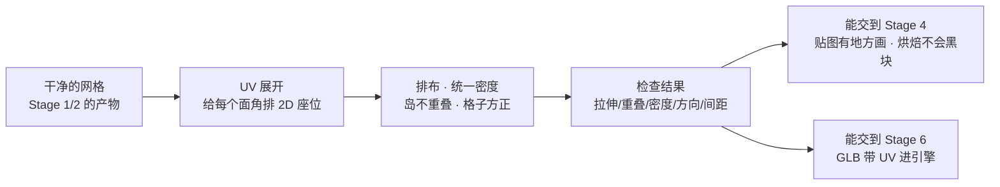
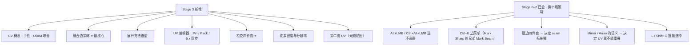
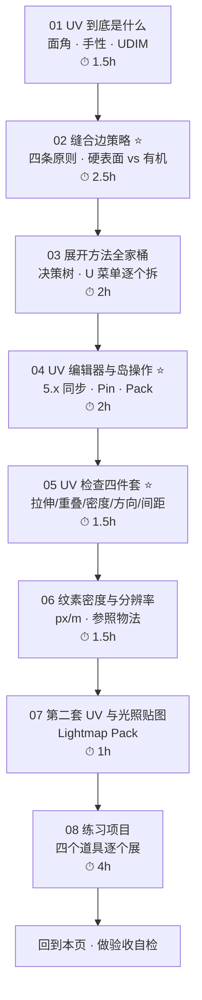
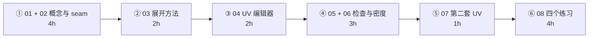

# Stage 3 · UV 与贴图坐标（12–16h）

> **一句话目标**：每个模型都有不重叠、不变形、排布合理的 UV。这是**游戏资产和「好看的渲染图」最大的分水岭**。
> 状态：⬜ 未开始　|　开工：　　　|　完成：
> 环境：**Blender 5.2 LTS** · macOS　|　前置：`00-基础` 已通（尤其 [`06-倒角-Bevel.md`](../00-基础/06-倒角-Bevel.md)）、`01-拓扑与建模思维` 已通（尤其 [`04-硬边控制四件套`](../01-拓扑与建模思维/04-硬边控制四件套-ShadeSmooth-Crease-Sharp-BevelWeight.md)）、`02-硬表面建模工作流` 已通（四个道具已建模）、`03-非破坏性流程与资产管理` 已通（尤其 Mirror / Array 的语义）

---

## 0. ⚠️ 先订正：路线图 Stage 3 里有六条需要按 5.x 修正

照着路线图学之前先看这张表。UV 是**老教程分歧最大**的一块——3.x/4.x 的很多「经验之谈」在 5.0 之后已经不成立。

| # | 路线图 / 常见说法 | **5.x 的实际情况** | 依据 |
| - | ---------------- | ------------------ | ---- |
| 1 | 5.x 的 UV 同步机制「比 4.x 少踩很多坑」——方向对，但没说清动作差异 | 5.0 的 **UVerhaul** 把同步选择整个重写，**默认开启且已修好**（选单个 face corner 不再连带选中相连的；同步模式下选面不再撕岛）。老教程教的「**关掉 UV Sync 那个按钮**」在 5.x **别照做** | Blender 5.0 Release Notes（UV EDITING · UVerhaul）／官方手册 [Selecting UVs](https://docs.blender.org/manual/en/latest/editors/uv/selecting.html) |
| 2 | 加一张棋盘格贴图（暗示要去下载） | **Blender 自带**：UV 编辑器 → Image → **New** → `Generated Type: UV Grid`。另一档 `Color Grid` 用来看 U/V 方向 | 官方手册 [Using the Test Grid](https://docs.blender.org/manual/en/latest/modeling/meshes/uv/applying_image.html#using-the-test-grid) |
| 3 | 第二套 UV =「把现有 UV 复制一份，重排成不重叠」 | 更标准的做法是 **`U → Lightmap Pack` 并勾 `New UV Map`**：一步完成「新建 UV Map + 自动分岛 + 自动 margin + 排布」。「复制+重排」只在你想让光照图的岛形状和主 UV 一致时才用 | 官方手册 [Editing UVs](https://docs.blender.org/manual/en/latest/modeling/meshes/uv/editing.html) |
| 4 | UVPackmaster「免费版可用，支持 2.93–5.2」 | 版本范围 ✅（Superhive 标注 **2.93–5.2**，官方文档写支持 `2.8x/2.9x/3.x/4.x/5.x`）。但**是否免费需自行核实**：目前官方主推 **UVPackmaster 3/4 的 PRO 付费授权**；且现在最新是 **UVPackmaster 4**（3 代维护到 2027 年底，不再加新功能） | uvpackmaster.com 文档 · Superhive 商品页 · UVPackmaster 4 发布帖 |
| 5 | TexTools「装之前先确认对 5.2 的兼容性」 | 提示对，且比想象中严重：**原版已停更多年**，目前靠**社区 fork**（`unclepomedev/TexTools-Blender`）维持 5.x 兼容（2026-01 仍在修「Blender 5.0+ 的 UV 选择」）。**装之前确认 fork 的最近提交时间** | GitHub · unclepomedev/TexTools-Blender |
| 6 | 「所有 UV 岛无重叠」 | 括号里的前提是重点：**要烘焙 → 零重叠；不烘焙 → 重复结构（螺丝/散热孔/对称件）的故意重叠是正确的优化**。别无条件执行 | 烘焙按 UV 位置回投影，重叠 = 互相覆盖 = 黑块 |

> 📌 第 1–3 条建议同步回 `Blender学习路线图.md`（Stage 3 清单第 207–212 行）；第 6 条同步回 [`速查/常见坑汇总.md`](../速查/常见坑汇总.md) 的「UV（Stage 3）」段。
>
> 📌 **跨阶段一条**：Blender 5.0 把布尔求解器 **`Fast` 改名为 `Float`**（官方 5.0 Release Notes 的 MORE MODELING & UV 段）。这会影响 [`../02-硬表面建模工作流/04-布尔与布尔后清理.md`](../02-硬表面建模工作流/04-布尔与布尔后清理.md) 的 Solver 一节与路线图 Stage 1 清单——按 `F3` 搜 solver 名或按你本机实际名称操作即可，逻辑不变。
>
> 📌 通用兜底：**快捷键按不出来或菜单位置对不上，一律 `F3` 搜命令名**，不要死记（你自己的笔记第 38 节已经这么做了）。

---

## 1. 本阶段在解决什么问题

Stage 1/2 结束，你已经有四个**拓扑干净、尺寸正确**的道具。但它们在引擎里还是白模——因为**没有任何一张贴图知道该贴在哪个位置上**。

所以本阶段只新增**四样东西**，其余都是「已有工具在新场景里的用法」：

1. **缝合边的判断力**（刀切在哪）——本阶段最核心的手艺
2. **展开方法的选择**（哪个形状用哪把刀）
3. **UV 编辑器的操作**（钉住、拉直、排布）——5.x 的同步机制在这
4. **检查的标准**（什么叫「展好了」）

> **本阶段和前面最大的不同**：Stage 0–2 追求「形状对」，Stage 3 追求「**没有唯一正确答案，只有对这个资产更合适的答案**」。所以这一阶段要多花时间在「判断」而不是「操作」上。

---

## 2. 学习路径（按顺序走完就是闭环）

| # | 文件 | 核心问题 | 预估 |
| - | ---- | -------- | ---- |
| 01 | [`01-UV到底是什么-坐标-手性-UDIM.md`](01-UV到底是什么-坐标-手性-UDIM.md) | UV 存在面角上意味着什么、手性怎么翻、UDIM 为什么不用于游戏 | 1.5h |
| 02 | [`02-缝合边策略-Seam.md`](02-缝合边策略-Seam.md) ⭐ | 刀该切在哪、切几刀、Mirror/倒角怎么处理 | 2.5h |
| 03 | [`03-展开方法全家桶-Unwrap-SmartUV-CubeProjection.md`](03-展开方法全家桶-Unwrap-SmartUV-CubeProjection.md) | 六种展开方法各自适合什么形状 | 2h |
| 04 | [`04-UV编辑器与岛操作-Pin-Pack-5x同步.md`](04-UV编辑器与岛操作-Pin-Pack-5x同步.md) ⭐ | 5.x 同步机制、Pin、Pack Islands 全参数 | 2h |
| 05 | [`05-UV检查四件套-拉伸-重叠-密度-方向.md`](05-UV检查四件套-拉伸-重叠-密度-方向.md) ⭐ | 怎么证明 UV 是好的 | 1.5h |
| 06 | [`06-纹素密度与贴图分辨率.md`](06-纹素密度与贴图分辨率.md) | TD 怎么算、分辨率怎么定 | 1.5h |
| 07 | [`07-第二套UV与光照贴图UV.md`](07-第二套UV与光照贴图UV.md) | 什么时候需要第二套 UV、怎么做、怎么导出 | 1h |
| 08 | [`08-练习项目-四个道具的UV.md`](08-练习项目-四个道具的UV.md) | 把 01–07 用一遍 | 4h |

> 合计约 **16h**，落在路线图 12–16h 区间（上限）。
> **02 和 08 不要压缩**：前者是本阶段唯一真正的技术活，后者是唯一能证明你学会了的东西。
> **07 可以压缩到 0.5h 甚至跳过实操**——本主线四个道具大概率不需要第二套 UV，但要知道它是什么、什么时候会用到。

---

## 3. 必学清单

> 判断标准不是「我看过了」，而是「不看教程能当场做出来 / 说出来」。每条后面标了出处。

### 模块 1 · UV 到底是什么（[01](01-UV到底是什么-坐标-手性-UDIM.md)）

- [ ] 说出 **UV 存在 face corner 上而不是顶点上**，并解释为什么这让 seam 成为可能
- [ ] 说出 UV 空间是 0–1 方格、`u` 向右 `v` 向上、超出部分默认重复平铺
- [ ] 说出拉伸 / 剪切 / 面积失真三类变形，各对应什么检查手段
- [ ] 说出 4 个最容易产生**镜像 UV**的来源，以及用 `Select → All by Trait → Winding` 怎么查
- [ ] 说出本主线**为什么不用 UDIM**
- [ ] 说出 `TEXCOORD_0` / `TEXCOORD_1` 分别干什么

### 模块 2 · 缝合边策略（[02](02-缝合边策略-Seam.md)）⭐

- [ ] 说出「seam 只是属性，不改几何」，以及 **哪些展开方法看 seam、哪些不看**
- [ ] 说出四条切法原则，并解释**沿硬边切为什么能避免光照接缝**
- [ ] 说出硬表面「拆纸箱」与有机「剥橘子」两套思路的差别
- [ ] 会用 `Alt+LMB` / `Ctrl+Alt+LMB` / `L` / `Shift+G` 快速标 seam
- [ ] 会用 **`UV → Seams from Islands`** 从岛反标 seam（出形 → 精修的枢纽）
- [ ] 说出「切太少 / 切太多」各自的代价；说出**什么时候可以故意重叠**
- [ ] 说出 Mirror「要烘焙 / 不烘焙」两种处理方式
- [ ] 说出倒角条带为什么要单独成岛

### 模块 3 · 展开方法（[03](03-展开方法全家桶-Unwrap-SmartUV-CubeProjection.md)）

- [ ] 给「木箱 / 油桶 / 岩石 / 标牌」各能在 10 秒内说出首选方法与理由
- [ ] 说出 `Unwrap` 的 `Angle Based` vs `Conformal` 各自适用场景
- [ ] 说出 `Smart UV Project` 的 `Angle Limit` / `Island Margin` / `Stretch to UV Bounds`
- [ ] 知道 `Lightmap Pack` 的 `New UV Map` 是干什么的
- [ ] 知道 `Follow Active Quads` 只吃规整 Quad 网格
- [ ] 能背出「出形 → Seams from Islands → 精修 → Minimize Stretch → Pack → Average Scale」这条链路

### 模块 4 · UV 编辑器与岛操作（[04](04-UV编辑器与岛操作-Pin-Pack-5x同步.md)）⭐

- [ ] 说出 5.0 **UVerhaul** 改了什么，以及「老教程让关同步」在 5.x 为什么不适用
- [ ] 会用 `4`（岛选择）、`Ctrl+L`、`Y`（Select Split）、Sticky 三种模式
- [ ] 会用 `P` / `Alt+P` / `Shift+P`，说出 Pin 的 3 个使用场景
- [ ] 说出 `Pack Islands` 的 `Shape Method` / `Rotation Method` / `Margin` / `Merge Overlapping` 怎么选
- [ ] 说出 `Minimize Stretch` 的 `Blend` 为什么不该给 0
- [ ] 知道 5.x 新增的 `Arrange/Align Islands`、`Move on Axis`（Numpad 8246）、`Custom Region`

### 模块 5 · 检查四件套（[05](05-UV检查四件套-拉伸-重叠-密度-方向.md)）⭐

- [ ] 会用 Blender **内置**生成 UV Grid（Image → New → Generated Type: UV Grid）
- [ ] 知道检查图的尺寸**必须等于目标贴图分辨率**，以及为什么
- [ ] 会用 `Select → All by Trait → Overlap`，并说出「要烘焙 / 不烘焙」的不同结论
- [ ] 会用 `Select → All by Trait → Winding` 查镜像
- [ ] 会按贴图边长的 **0.4%–0.8%** 给 padding，并说出不留边距会导致什么（要提到 mipmap）
- [ ] 每次都能跑完「UV Grid → 拉伸 → Overlap → Average Scale → Winding → Pack → 利用率」这条流程

### 模块 6 · 纹素密度与分辨率（[06](06-纹素密度与贴图分辨率.md)）

- [ ] 说出 TD 的定义，并解释为什么「两个物件都用 2048」仍可能清晰度不一致
- [ ] 会给一个已知尺寸的物体估算 TD
- [ ] 会用「1m Plane + UV Grid」做**密度参照板**（零插件最稳的办法）
- [ ] 说出小道具 / 主角道具 / Hero 三档分辨率，以及「必须 2 的幂」的原因
- [ ] 说出「先统一密度 → 再排布」的顺序原因

### 模块 7 · 第二套 UV（[07](07-第二套UV与光照贴图UV.md)）

- [ ] 说出需要第二套 UV 的 3 个条件
- [ ] 知道 UV Maps 面板里**高亮的那套 = 当前编辑对象**（最常见的翻车点）
- [ ] 会用 `Lightmap Pack` 的 `New UV Map` / `Share Texture Space` / `Margin`
- [ ] 说出 glTF 的 `TEXCOORD_0/1` 对应，以及各引擎命名不一致的风险

### 模块 8 · 练习（[08](08-练习项目-四个道具的UV.md)）

- [ ] 木箱：岛 3–8，1024，格子方正
- [ ] 油桶：岛 3–6，1024，侧面长方形格子方正
- [ ] 工具箱（验收项目）：岛 8–20，2048，**分离件共享同一张图集**
- [ ] 储物柜：岛 10–30，2048，Mirror 已 Apply、两侧不重叠、Winding 通过

---

## 4. 时间怎么切（12–16h 拆成 6 段）

| 段 | 内容 | 产出 |
| - | ---- | ---- |
| ① | 读 01 + 02，在木箱上把 seam 标完并 Unwrap 一遍 | 一个「seam 已标好」的 .blend + 自画的切法决策 |
| ② | 读 03，用油桶走一遍「回转体 = 一条竖 seam」 | 方法与形状的对照表（自己写一遍） |
| ③ | 读 04，把木箱的岛拉直、钉住、排布一遍 | Pack Islands 参数表（自己记一份） |
| ④ | 读 05 + 06，给两个尺寸差 3 倍的道具调到密度一致 | 一张 UV Grid 检查图 + 密度参照板 |
| ⑤ | 读 07，在工具箱上建一次第二套 UV（练手，可不做进最终资产） | 一个带 2 套 UV 的 .blend |
| ⑥ | 做 08 的四个道具 | 四个 .blend + UV 线框图 PNG + 记录表 |

> 单次动手不超过 **45 分钟**就起来动一动。UV 是**最费眼**的一个阶段——你要同时盯格子方正度、岛间距、利用率三个地方，而且没有「撤销一步就好」的快感，往往是重展一遍。

---

## 5. 练习项目

| # | 项目 | 要点 | 岛数 | 贴图 | 完成度 |
| --- | --- | --- | --- | --- | --- |
| 1 | 木箱 | Cube Projection → Seams from Islands → 拉直 → Pack | 3–8 | 1024 | ⬜ |
| 2 | 油桶 | 1 条竖 seam + Unwrap，顶底盖单列，箍单独成岛 | 3–6 | 1024 | ⬜ |
| 3 | **工具箱**（验收项目） | 分离件共享同一张图集，倒角单独成岛拉直 | 8–20 | 2048 | ⬜ |
| 4 | 科幻储物柜 | Apply Mirror → 两侧不重叠 → 查 Winding | 10–30 | 2048 | ⬜ |

> 详细方案、参数、「做崩了怎么救」见 [`08-练习项目-四个道具的UV.md`](08-练习项目-四个道具的UV.md)。
> 文件存到 `../资产/练习文件/04-UV与贴图坐标/`，命名用 `Prop_<名称>_<变体>_01`（规范见 [`../07-资产规范与引擎导出/笔记.md`](../07-资产规范与引擎导出/笔记.md)）。

---

## 6. 验收标准（可判定，不是感觉）

- [ ] 所有 UV 岛无重叠（**在要烘焙的前提下**）
- [ ] 棋盘格检查：玩家会盯着的面，格子基本是正方形
- [ ] 纹理空间利用率 80%+
- [ ] 硬边 / 倒角边与 UV 缝合边对齐（避免光照接缝）
- [ ] 同场景道具的纹素密度一致
- [ ] **导出跑通一次**：GLB 导入引擎后 UV 正常（路线图 Stage 6 的铁律：**第 1 个资产就跑通闭环**）

### 6 条自检（全部通过才算 Stage 3 完成）

| # | 自检点 | 怎么判定 |
| - | ------ | -------- |
| ① | seam 说得清 | 给一个带倒角的木箱，能说出刀切在哪、为什么沿硬边切，并**5 分钟内标完** |
| ② | 方法选得对 | 给「木箱 / 油桶 / 岩石 / 标牌」四种形状，各能在 10 秒内给出首选展开方法与理由 |
| ③ | 检查跑得完 | 拿一个展完的道具，**5 分钟内**跑完四件套（拉伸/重叠/密度/方向）并给出每项结论 |
| ④ | padding 有依据 | 说出 1024 / 2048 贴图各自该给多少 padding，并解释不留边距在 mipmap 下的表现 |
| ⑤ | 密度算得出 | 给一个 0.9m 高、UV 占满贴图的油桶，算出 1024 贴图下的 TD（≈1138 px/m） |
| ⑥ | 闭环 | 工具箱已导出 GLB 并在引擎里确认 UV 与贴图坐标正常 |

---

## 7. 常见坑

> 前三条是路线图原有的（第 1 条已加限定、第 3 条已补前提），后面是本阶段补充的。够通用的坑应该同步到 [`速查/常见坑汇总.md`](../速查/常见坑汇总.md)。

- ❌ **不标缝合边直接 Unwrap** → 展开一团乱麻（⚠️ 只对 `Unwrap` 成立，`Smart UV Project`、`Cube Projection`、`Lightmap Pack` 自己算切口，不看 seam）
- ❌ **为了「塞满 UV 空间」把岛排太挤** → 烘焙时像素溢出（mipmap 一到就露馅）
- ❌ **忘了 UV 有方向 / 手性** → 贴图镜像（`Select → All by Trait → Winding` 查；贴一张带「F」的测试图目测）
- ❌ **照 4.x 老教程关掉 UV Sync** → 5.x 同步已重写且默认开启，关了反而看不到完整 UV 全貌
- ❌ **以为棋盘格要去网上下载** → Blender 自带：`Image → New → Generated Type: UV Grid`
- ❌ **检查图的分辨率和最终贴图不一致** → padding 与密度判断全错
- ❌ **无条件要求「零重叠」** → 不烘焙的重复结构（螺丝/散热孔/对称件）重叠是正确的优化
- ❌ **先 Pack 再统一密度** → 密度一改，岛的像素尺寸变了，之前算好的 padding 全废
- ❌ **Minimize Stretch 的 Blend 直接给 0** → 拉伸是小了，但岛被拉变形，硬表面的横平竖直全没了
- ❌ **Mirror 没 Apply 就展 UV** → 只有半边有 UV，导出后另一半是乱的
- ❌ **分离件各自占满 0–1** → 它们应该共享同一张图集
- ❌ **把 `Mark Sharp` 当成 `Mark Seam`** → 都在 `Ctrl+E` 菜单里，容易点错；Sharp 管法线，Seam 管 UV
- ❌ **UV Maps 面板没切换就展开** → 把主 UV 覆盖了
- ❌ **为了利用率把把手/锁扣压得很小** → 玩家视线焦点最糊，本末倒置

---

## 8. 资源

> 本阶段**只允许 1–2 个主资源**（路线图第 7 节防弃坑规则）。

- **主资源 1**：本目录 [`01`](01-UV到底是什么-坐标-手性-UDIM.md)–[`08`](08-练习项目-四个道具的UV.md)（UV 这套流程自己写得清清楚楚，比逛教程省时间）
- **主资源 2**：官方手册 5.2 LTS · [UVs](https://docs.blender.org/manual/en/latest/modeling/meshes/uv/index.html)（权威，且本目录每一篇都标了对应页面）
- Blender 5.0 Release Notes · **UVerhaul** 段（搞清 5.x 与老教程的差异，必读）
- YouTube · **Grant Abbitt**「Detailed Game Assets」系列（UV 部分，免费）
- YouTube · **Imphenzia**（低模游戏资产，免费；他的 UV 思路很贴合小道具）
- CG Cookie · *Press Start: Learn Blender by Making a Game-Ready Asset*（Jonathan Lampel，5h，付费）—— 最贴这条主线，UV 是其中一章
- **插件（非必需）**：UVPackmaster 4（付费 PRO，2.93–5.2）；TexTools（免费，**用社区 fork** `unclepomedev/TexTools-Blender`，装前看最近提交时间）

> ⚠️ **Stage 3 先不装插件**。内置的 `Pack Islands` / `Average Island Scale` / `Minimize Stretch` 对四个道具完全够用。
> 插件是「要做几十个资产」时才回本的效率工具，现在装只会分散注意力。

---

## 我的记录

### ____-__-__ · 第 __ 次练习

- **练了什么**：
- **卡点**：
- **怎么解决的**：
- **下次要注意**：

---

## 阶段复盘

1. 学会了什么（3 条以内，用自己的话）：
2. 踩过的坑（≥3 条；够通用的同步到 `速查/常见坑汇总.md`）：
3. 还差什么（Stage 4 要补的）：
4. 产出物清单（文件路径 + 岛数 + 贴图分辨率 + UV 线框图）：

---

> **下一步**：Stage 4 材质 / PBR / 烘焙（[`../05-材质PBR与烘焙/笔记.md`](../05-材质PBR与烘焙/笔记.md)）。
> 本阶段留下的最重要的一条判断习惯是：**动手前先问「要不要烘焙」**——这一个答案决定了 UV 能不能重叠，进而决定你后面所有的工作量。它会一直管到 Stage 4 的烘焙（重叠 UV 烤出来的图全是黑块）。
