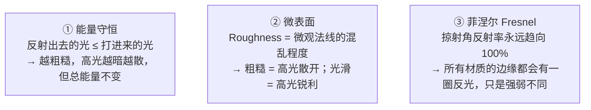
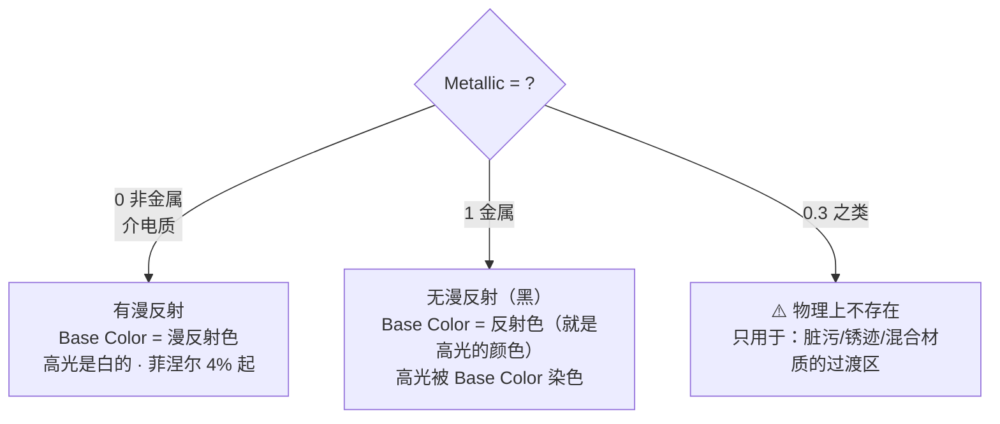
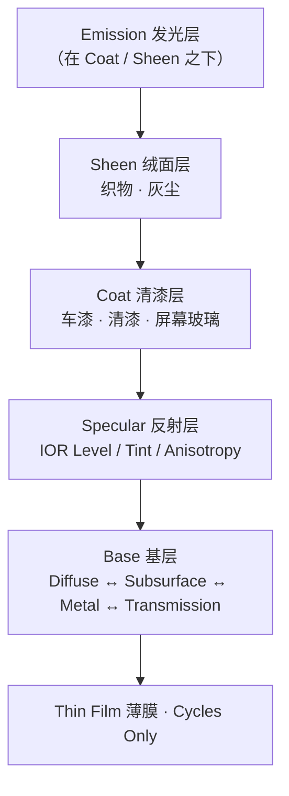

# 01 · PBR 原理与 Principled BSDF 全解

> 一句话：**PBR 不是「看起来更真的渲染」，是一套「不能乱给值」的约束。Principled BSDF 的每个输入都对应一个物理量，给错了没有人会报错，只会看起来怪。**
> 依据：官方手册 5.2 · Principled BSDF（5.x 起基于 **OpenPBR Surface** 模型）；Blender 4.0 Release Notes（Principled 重写）。

---

## 一、先立规矩：PBR 到底在约束什么

老式渲染是「调参数直到好看」。PBR 是「先规定物理规则，再在规则里调」。三条规则：



> **这三条直接决定了三件事**：为什么不能有「全黑但很强高光」的材质；为什么 Roughness 是唯一能救高光的参数；为什么金属和非金属的 Base Color 含义完全不同。

---

## 二、金属 vs 非金属：PBR 里最核心的一组区别



| 属性 | 非金属（Metallic = 0） | 金属（Metallic = 1） |
| ---- | ---------------------- | -------------------- |
| 漫反射 | ✅ 有（这是它的主色） | ❌ 无（漫反射是黑的） |
| Base Color 的含义 | 漫反射颜色（反照率 albedo） | **反射颜色**（就是高光的颜色） |
| 高光颜色 | 白（IOR 决定强度，约 2%–5% 起） | Base Color 本身 |
| 典型反照率 | 0.02–0.4（很暗！最亮的白漆也才 0.8） | 0.6–1.0（很亮） |
| Roughness 影响 | 高光模糊 + 漫反射略暗 | **整体观感全靠它**：0.1 是镜面金属，0.6 是磨砂铝 |

> **最容易犯的错**：把金属材质的 Base Color 调成暗灰色（比如 0.2）。物理上等于「一种吸收 80% 光的奇怪金属」，看起来像脏塑料。
> **自检口诀**：**金属 = 亮 + 有色；非金属 = 暗 + 无色高光。**

---

## 三、Principled BSDF 的分层（5.x / OpenPBR）

5.x 的 Principled 是一层一层叠上去的，理解顺序后参数是「从上往下读」的：



| 层 | 输入 | 游戏资产用不用 |
| -- | ---- | -------------- |
| Base | **Base Color / Metallic / Roughness / Normal** | ✅ 天天用 |
| Specular | IOR Level（≈ 老版 Specular）/ Tint / Anisotropy | ⚠️ 基本保持默认 0.5 |
| Transmission | Weight | ❌ 玻璃才用，游戏里走半透明材质 |
| Coat | Weight / Roughness / IOR / Tint | ❌ 车漆才用；**glTF 需要扩展支持，别指望它过桥** |
| Sheen | Weight / Roughness / Tint | ❌ 布料 / 灰尘，同上 |
| Emission | **Color / Strength** | ✅ 灯牌、屏幕 |
| Thin Film | Thickness / IOR | ❌ Cycles Only，烘焙成贴图再说 |

> **游戏资产的现实**：glTF 主规范只认 Base Color / Metallic / Roughness / Normal / Emission / Alpha。**Coat、Sheen、Subsurface、Thin Film 都不在核心规范里**——需要就烤进贴图，别指望引擎帮你算。

---

## 四、常用输入逐个拆

### 4.1 Base Color ⭐

| 材质类型 | 该怎么给 | 典型值（sRGB 亮度） |
| -------- | -------- | ------------------- |
| 非金属 | 反照率，**整体偏暗** | 0.02–0.4 |
| 金属 | 反射色，**整体偏亮** | 0.6–1.0 |

- ❌ 非金属给 0.8 → 像打了灯的自发光物体，怎么打光都很"平"
- ❌ 金属给 0.15 → 像脏塑料，没有金属感
- ✅ 实测方法：把 Roughness 拉到 1、Metallic 拉到 0 看漫反射；再拉 Metallic=1 看反射色

### 4.2 Roughness ⭐ 最常调的参数

- `0` = 完美镜面（**不真实**，会在引擎里疯狂闪烁）→ 游戏资产最低给 **0.05**
- `1` = 完全漫反射（能量全散，看起来发灰）→ 最高给 **0.95**
- 它是**唯一**能在不改贴图的情况下救高光的参数；一个材质「不对」，先动它

### 4.3 Metallic ⭐

- 几乎总是 **0 或 1**
- 中间值只在三种情况用：金属上的锈/漆层过渡、混合材质、程序化遮罩的边缘羽化
- ⚠️ 用贴图时，Metallic 图**不要有渐变模糊**——除非你明确想要脏污过渡；否则把图做成纯黑白（引擎里叫 "metalness mask"）

### 4.4 IOR 与 Specular › IOR Level

| 参数 | 作用 | 默认值 |
| ---- | ---- | ------ |
| **IOR** | 折射率，决定反射强度。1.5 ≈ 玻璃；非金属常见 1.4–1.6 | 1.5 |
| **Specular › IOR Level** | **老教程里的 `Specular`**。0.5 = 不调整，0 = 完全没反射，1 = 双倍 | 0.5 |

> 4.0 之前教程说的「Specular = 0.5」就是现在的 `IOR Level = 0.5`。**游戏资产默认别动它**，动它是为了配合 specular 贴图（Specular 工作流才需要）。

### 4.5 其他会用到的

| 输入 | 说明 | 备注 |
| ---- | ---- | ---- |
| **Normal** | 法线贴图入口，**必须过 Normal Map 节点** | 直接插图片 = 凹凸全错 |
| **Alpha** | 透明，通常接 Image Texture 的 Alpha 输出 | glTF 支持，但排序问题多，能不做就不做 |
| **Emission Color / Strength** | 发光。Strength = 1 时物体「不受光」 | glTF 支持，>1 会走 `KHR_materials_emissive_strength` 扩展 |
| **Diffuse Roughness** | Cycles Only，Oren-Nayar 粗糙漫反射 | 游戏资产基本不用 |
| **Thin Wall** | 薄壁模式（纸、叶子） | 少用 |

---

## 五、⭐ 材质数值速查表

> 这是本阶段最值得抄一遍的东西。**参考区间不是标准答案**，但能挡掉 90% 的「看着怪但说不出哪里怪」。

### 5.1 非金属（Metallic = 0）

| 材质 | Base Color（sRGB） | Roughness |
| ---- | ------------------ | --------- |
| 木炭 / 煤 | 0.02–0.05 | 0.8–0.95 |
| 橡胶（轮胎） | 0.05–0.08 | 0.8–0.9 |
| 混凝土 | 0.2–0.4 | 0.7–0.9 |
| 旧木材 | 0.15–0.35 | 0.6–0.85 |
| 砖 | 0.25–0.4 | 0.7–0.9 |
| 沙 / 土 | 0.35–0.5 | 0.85–0.95 |
| 皮肤 | 0.25–0.4 | 0.4–0.6 |
| 塑料（哑光） | 0.4–0.6 | 0.4–0.6 |
| 白漆 | 0.7–0.85 | 0.15–0.35 |
| 雪 | 0.75–0.9 | 0.7–0.9 |

### 5.2 金属（Metallic = 1）

| 材质 | Base Color（sRGB，RGB 三组） | Roughness |
| ---- | ---------------------------- | --------- |
| 银 / 抛光铝 | 0.95–0.97 | 0.05–0.15 |
| 金 | 1.00 / 0.77 / 0.34 | 0.1–0.4 |
| 黄铜 | 0.91 / 0.75 / 0.42 | 0.2–0.5 |
| 铜 | 0.95 / 0.64 / 0.54 | 0.2–0.5 |
| 铁 | 0.56 / 0.57 / 0.58 | 0.4–0.7 |
| 不锈钢 | 0.68–0.80 | 0.15–0.45 |
| 磨砂 / 喷砂铝 | 0.85–0.92 | 0.35–0.55 |
| 生锈铁 | 0.45–0.6（锈处 Metallic 降到 0.2–0.4） | 0.7–0.9 |

### 5.3 按 Roughness 反推「像什么」


---

## 六、5.x 与老教程的参数名对照

看 3.x / 4.0 之前的教程时，这几处会对不上：

| 老说法 | 5.x 现在叫什么 | 说明 |
| ------ | -------------- | ---- |
| `Specular` | **`Specular › IOR Level`** | 0.5 = 不变，语义一致但名字变了 |
| `Specular Tint` | **`Specular › Tint`** | 变成了颜色输入（金属边缘染色用，F82 模型） |
| `Clearcoat` | **`Coat Weight`** | 且 Coat 层被移到 Emission 之上，多了 IOR/Tint |
| `Velvet` | **`Sheen`** | 4.0 起换成 Microfiber 模型 |
| `Emission` / `Emission Strength` | **`Emission Color` / `Emission Strength`** | 4.0 起默认值改为「白色 + 强度 0」 |
| `Subsurface Color` | 已移除 | 4.0 起 SSS 直接用 Base Color，另有 Scale |
| — | **新增** `Diffuse Roughness` / `Thin Film` / `Thin Wall` | Cycles Only 为主 |

> ⚠️ 4.0 还重做了**能量守恒**（多层叠加更守恒），所以老教程里同一套参数在 5.x 可能**略暗或略亮**——这是正常的，不要拿老渲染图去对参数。

---

## 七、坑

- ❌ **金属给暗色 Base Color** → 像脏塑料（金属就该亮）
- ❌ **非金属给亮色 Base Color**（0.8+）→ 像自发光，打光打不出立体感
- ❌ **Metallic 给 0.5** 当「半金属」→ 物理上不存在，看起来不伦不类
- ❌ **Roughness 给 0 或 1** → 一个闪瞎、一个发灰 → 卡在 0.05–0.95
- ❌ **把 AO 画进 Base Color 里当"阴影"** → 光照一变就穿帮（AO 只该乘在环境光上）。游戏里的折中做法见 02
- ❌ **Coat / Sheen / SSS 全开** → glTF 主规范不认，进引擎全丢，还拖慢 Blender
- ❌ **照抄老教程的 Specular 值却找不到输入框** → 现在叫 IOR Level

---

## 八、自检

| # | 自检点 | 通过标准 |
| - | ------ | -------- |
| ① | 金属 vs 非金属 | 说出两者在「漫反射有无」和「Base Color 含义」上的区别 |
| ② | 数值 | 报出「旧木 / 磨砂钢 / 白漆 / 黄铜」四组的 Metallic + Roughness 区间 |
| ③ | 禁区 | 说出 Base Color 与 Roughness 各自的取值禁区及后果 |
| ④ | 分层 | 说出 Principled 的分层顺序（Emission 在 Coat 之下、Specular 在 Base 之上） |
| ⑤ | 版本差异 | 说出 `Specular` → `IOR Level` 等 ≥3 处改名 |
| ⑥ | 游戏视角 | 说出哪些层 glTF 主规范不认，以及应对方式 |

---

## 九、速查

```text
【PBR 三条约束】
能量守恒：反射光 ≤ 入射光（越粗糙，高光越散但总能量不变）
微表面：Roughness = 微观法线混乱度
菲涅尔：掠射角反射率趋向 100%（边缘都有反光）

【金属 vs 非金属】
Metallic=0  有漫反射 · Base Color = 漫反射色 · 高光白 · 反照率 0.02–0.4
Metallic=1  无漫反射 · Base Color = 反射色   · 高光被染色 · 0.6–1.0
Metallic=0.5 ⚠️ 物理上不存在（只用于脏污/过渡）

【取值禁区】
Base Color：非金属 0.02–0.4（非金属给亮 = 自发光感）
             金属 0.6–1.0（金属给暗 = 脏塑料感）
Roughness：0.05–0.95（0 疯狂闪烁，1 发灰）
Metallic：几乎总是 0 或 1

【Roughness 直觉】
0.05–0.1 镜面/抛光金属/湿地
0.2–0.35 新漆/抛光石/玻璃
0.4–0.6  磨砂金属/旧漆/皮肤
0.65–0.85 木材/混凝土/布料
0.9+     橡胶/土/雪

【5.x 参数重命名】
Specular      → Specular › IOR Level（0.5 = 不调整）
Specular Tint → Specular › Tint（颜色输入）
Clearcoat     → Coat Weight（+ IOR / Tint）
Velvet        → Sheen
Emission      → Emission Color / Emission Strength

【glTF 主规范只认】
Base Color / Metallic / Roughness / Normal / Emission / Alpha
（Coat · Sheen · SSS · Thin Film 不在核心规范 → 需要就烤进贴图）
```

---

> **下一步**：[`02-贴图通道-色彩空间与ORM打包.md`](02-贴图通道-色彩空间与ORM打包.md) —— 参数知道给什么值了，接下来是这些值怎么装进图片、以及最容易翻车的色彩空间。
