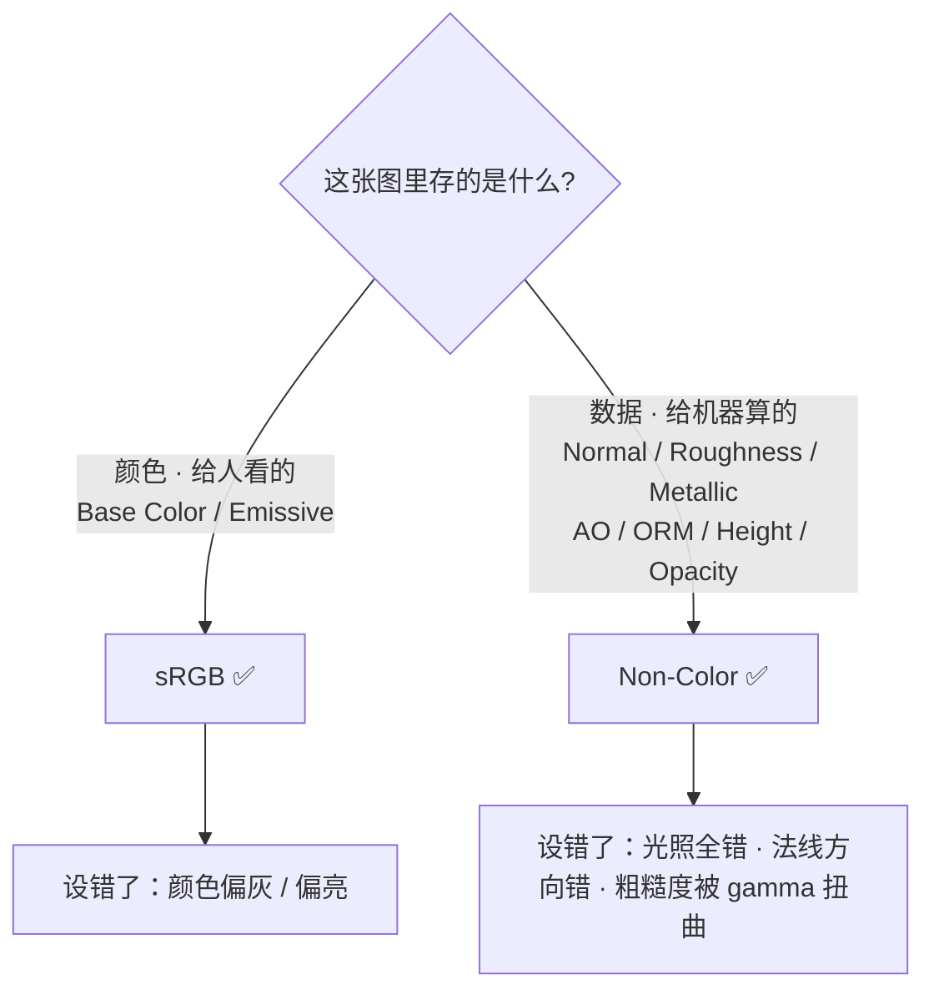
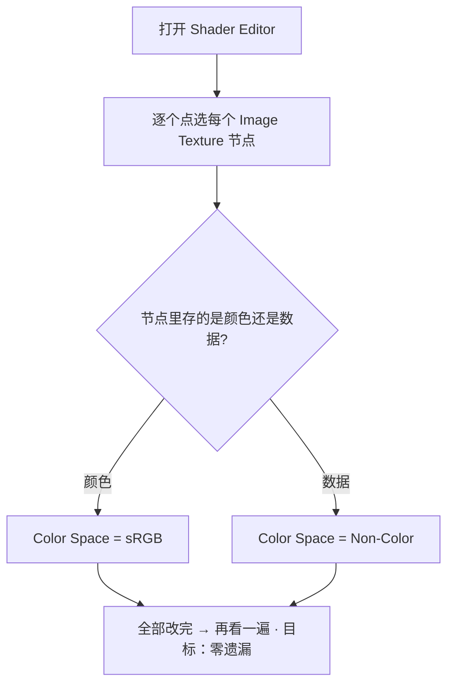
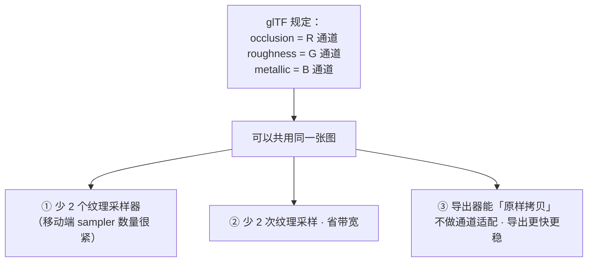
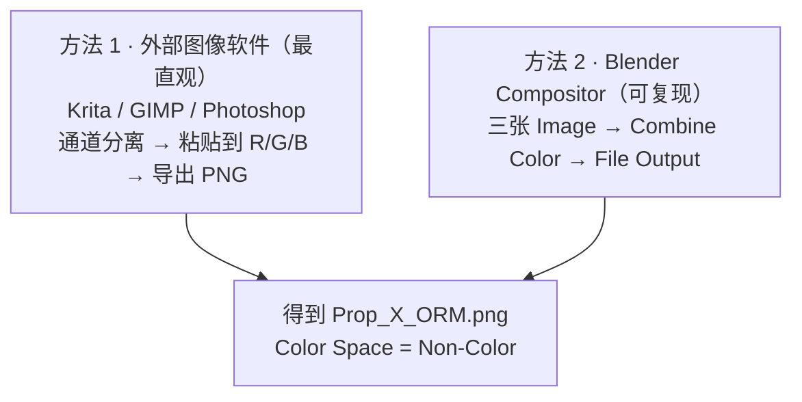
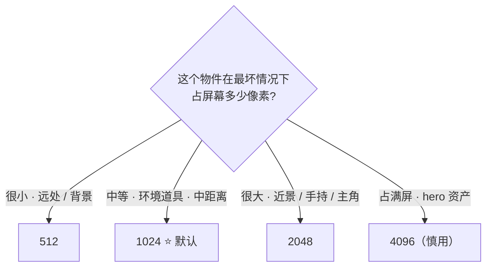

# 02 · 贴图通道、色彩空间与 ORM 打包

> 一句话：**贴图不是「图片」，是「数据」。把数据当图片处理（色彩空间设错、通道排错），材质就废了，而且不会有任何报错。**
> 依据：官方手册 5.2 · [glTF 2.0 导出](https://docs.blender.org/manual/en/latest/addons/import_export/scene_gltf2.html)（Metallic and Roughness / Baked Ambient Occlusion / Normal Map 段）；官方手册 Color Management（Non-Color 是 OCIO 配置里的数据空间）。

---

## 一、贴图通道全家福

| 贴图 | 存什么 | 通道 | 色彩空间 | 游戏资产必需度 |
| ---- | ------ | ---- | -------- | -------------- |
| **Base Color**（Albedo） | 表面反照率，**不带光照信息** | RGB | **sRGB** | ⭐ 必需 |
| **Normal** | 切线空间法线偏移 | RGB | **Non-Color** | ⭐ 必需（不加面数的细节全靠它） |
| **Roughness** | 粗糙度 0–1 | 单通道 | **Non-Color** | ⭐ 必需 |
| **Metallic** | 金属度 0/1（遮罩） | 单通道 | **Non-Color** | ⭐ 必需（有金属时） |
| **AO** | 环境光遮蔽（烘焙出来的接触阴影） | 单通道 | **Non-Color** | ✅ 强烈建议 |
| **ORM** | 上面三张的合体：R=AO、G=Rough、B=Metal | RGB | **Non-Color** | ⭐ 引擎侧首选 |
| **Height / Displacement** | 高度（视差或位移用） | 单通道 | Non-Color | ⚪ 可选 |
| **Emissive** | 自发光颜色 | RGB | sRGB | ⚪ 灯牌 / 屏幕 |
| **Opacity** | 透明度遮罩 | 单通道 | Non-Color | ⚪ 能不做就不做 |

> **最重要的禁忌**：Base Color 里**不能有光照**。把阴影、AO、高光画进 Albedo，是新手最常犯也最难自查的错——它在 Blender 里看起来"更立体"，进了引擎叠加上真实光照就变成"脏"。

---

## 二、色彩空间：本阶段第一铁律



| 设错方向 | 后果 |
| -------- | ---- |
| Normal 设成 sRGB | 引擎把法线数据当颜色做 gamma 解码 → **凹凸全错**，光照方向诡异 |
| Roughness 设成 sRGB | 0.5 被解码成 ≈0.21 → 全场变镜面，油光发亮 |
| Base Color 设成 Non-Color | 颜色偏亮偏灰，"洗白"感 |
| AO 设成 sRGB | 遮蔽强度被压扁，暗角不够深 |

### 2.1 5.x 有 ACES 了，这条规则变了吗？

**没变。** 5.0 重写了色彩管理（新增 ACES 1.3/2.0 视图、宽色域工作空间、HDR），但 `Non-Color` 依然是 OCIO 配置里专门给「非颜色数据」的空间，语义就是「不做任何变换」。

> ⚠️ 需要注意的是**别把视图变换（View Transform）烤进贴图**：如果你用「Save as Render」或截图的方式导出 Albedo，贴图里就带上了 ACES/AgX 的色调映射 → 进引擎二次映射，颜色全糊。
> **烘焙和存盘走 Image Editor（或直接存 PNG），不走渲染输出。**

### 2.2 色彩空间审计（做完材质必做一遍）



> 材质一旦多起来，肉眼扫一遍很容易漏。**养成习惯：每次导出 GLB 前，从 Base Color 开始顺着节点树点一遍。**

---

## 三、ORM 打包：把三张灰度图合成一张

### 3.1 为什么要打包



> 官方手册原话：如果贴图连接方式不符合这个约定，导出器**会尝试把图适配成正确形式**——代价是**导出时间变长**，而且适配结果未必是你想要的。

### 3.2 通道映射（记死这张表）

| 通道 | 存什么 | 接哪里 |
| ---- | ------ | ------ |
| **R** | Ambient Occlusion | `glTF Material Output` 节点的 `Occlusion` 输入（单独导出） |
| **G** | Roughness | `Separate RGB` 的 G → Principled 的 **Roughness** |
| **B** | Metallic | `Separate RGB` 的 B → Principled 的 **Metallic** |

### 3.3 怎么合成 ORM



**方法 2 的具体步骤**（想脚本化 / 复现时用）：

```text
1 Compositing 工作区 → 勾 Use Nodes
2 Add → Input → Image ×3，分别加载 AO / Roughness / Metallic
   （三个节点的 Color Space 都设 Non-Color）
3 Add → Converter → Combine Color（4.x 起 "Combine RGB" 改叫 Combine Color）
   Image_AO.Color → R ／ Image_Rough.Color → G ／ Image_Metal.Color → B
4 Add → Output → File Output
   格式 PNG，Color Space 设 **Non-Color**（默认是 Follow Scene，必须改！）
   设置输出路径，如 //textures/Prop_X_ORM
5 渲染尺寸设为贴图分辨率（如 1024×1024）
6 按 F12 → 得到 ORM 图
```

| 坑 | 解法 |
| -- | ---- |
| File Output 的 Color Space 忘了改 | 默认 `Follow Scene` 会按 sRGB 编码 → 数据被 gamma 扭曲 → **必须设 Non-Color** |
| 三张源图分辨率不一致 | 先统一到同一分辨率再合成 |
| 合成后看起来"花花绿绿" | 正常。ORM 是数据图，人眼看着是彩色噪点就对了 |

---

## 四、分辨率怎么定



| 分辨率 | 适用 | 说明 |
| ------ | ---- | ---- |
| 512 | 小道具、移动端、远处背景 | 单个文件 ≈ 0.7MB（PNG 8bit） |
| **1024** | **环境道具默认**（桶、箱、门） | 4 张图 ≈ 10–16MB，性价比最高 |
| 2048 | 主角道具、近距离交互物、第三人称手持 | 4 张图 ≈ 40–60MB |
| 4096 | 只给 hero 资产（1–2 个） | 显存杀手，先问预算 |

### 4.1 三条硬规矩

1. **必须是 2 的幂**（512 / 1024 / 2048…）。非 POT 贴图在部分平台会被自动补齐，还影响 mipmap。
2. **同一资产的所有贴图用同一分辨率**（Base Color 可以降一档省内存，但 **Normal 绝不能降**）。
3. **和 Stage 3 的纹素密度对齐**：分辨率高但 UV 岛排得稀 → 白给。分辨率的终点是「屏幕上 1 纹素 ≈ 1 像素」。

---

## 五、命名规范

```
Prop_Toolbox_01_BaseColor.png
Prop_Toolbox_01_Normal.png
Prop_Toolbox_01_ORM.png
Prop_Toolbox_01_AO.png        （可选，若不打进 ORM）
Prop_Toolbox_01_Emissive.png  （可选）
```

| 规则 | 说明 |
| ---- | ---- |
| 前缀 | 资产名 + 变体号，与网格命名一致（见 Stage 6） |
| 后缀 | **Basecolor / Normal / ORM / AO / Emissive / Height** |
| 格式 | PNG（法线与 ORM **不要用 JPEG**） |
| 目录 | `资产/练习文件/05-材质PBR与烘焙/textures/` |

> 💡 **和 Node Wrangler 联动**：`Ctrl+Shift+T`（Add Principled Setup）靠**文件名里的关键词**判断这张图该接哪个输入（basecolor / normal / rough / metal / height / emission…），并自动设好 Color Space。命名里带上这些词，导入一整套 PBR 贴图就是 3 秒的事。关键词列表可在插件偏好里查看和修改。

---

## 六、文件格式与位深

| 项 | 建议 | 理由 |
| -- | ---- | ---- |
| **格式** | **PNG** | glTF 只支持 PNG / JPEG；其他格式导出时会被自动转换（导出变慢） |
| JPEG 能用吗 | 只给 Base Color，且体积敏感时 | 有损压缩会在法线上产生块状伪影 → **Normal / ORM 绝不用 JPEG** |
| **位深** | 8bit 足够 | Height / Displacement 这类需要连续灰度的用 16bit 或 EXR |
| 32-bit Float | 烘焙时可勾（防色带） | 存盘成 PNG 后仍是 8bit；只在"法线出现明显色带"时才折腾这个 |
| Alpha 通道 | 不需要就关 | 白占 25% 体积 |

---

## 七、坑

- ❌ **Normal 设成 sRGB**（说第三遍了）→ 光照全错
- ❌ **AO / ORM 设成 sRGB** → 遮蔽被压扁，脏不出来
- ❌ **把阴影或 AO 画进 Base Color** → 引擎里叠加真实光照后变成"脏抹布"，且无法通过调光修复
- ❌ **ORM 的三个通道排错**（AO 塞进 G）→ 引擎里粗糙度变成遮蔽，全资产发黑
- ❌ **File Output 忘记改 Color Space** → 合成的图被 sRGB 编码一遍
- ❌ **Normal 用 JPEG** → 块状伪影，光照一打全是马赛克
- ❌ **分辨率给 4096 只为"清楚点"** → 显存和包体双双爆掉，且大部分时候在屏幕上根本看不出差别
- ❌ **贴图不存盘 / 存到临时目录** → 重开 .blend 全是空图；导出时贴图丢失
- ❌ **Base Color 与 ORM 分辨率不一致** → UV 相同但采样错位

---

## 八、自检

| # | 自检点 | 通过标准 |
| - | ------ | -------- |
| ① | 通道 | 说出 6 种贴图各存什么、各用什么色彩空间 |
| ② | ORM | 说出 R/G/B 三个通道分别是什么，以及 `Separate RGB` 怎么接 |
| ③ | 打包 | **实操**：把三张灰度图合成一张 ORM，且色彩空间正确 |
| ④ | 审计 | **实操**：给一个 6 节点的材质，30 秒内找出所有设错的 Color Space |
| ⑤ | 分辨率 | 给一个「第三人称视角的木箱」，说出给多少分辨率、理由 |
| ⑥ | 命名 | 写出一套 4 张图的完整文件名 |

---

## 九、速查

```text
【色彩空间铁律】
给人看的颜色    → sRGB         （Base Color · Emissive）
给机器算的数据  → Non-Color    （Normal · Roughness · Metallic · AO · ORM · Height）
设错不报错，只会看起来怪

【ORM 通道映射】
R = Ambient Occlusion   → glTF Material Output › Occlusion
G = Roughness           → Separate RGB › G › Principled Roughness
B = Metallic            → Separate RGB › B › Principled Metallic
（不打包也可以，但多 2 个 sampler；打包后导出器可原样拷贝）

【Compositor 合成 ORM】
Image ×3（都设 Non-Color）→ Combine Color（R=AO G=Rough B=Metal）
→ File Output：格式 PNG，Color Space = **Non-Color**（默认 Follow Scene 必须改！）
→ 渲染尺寸设成贴图分辨率 → F12

【分辨率】
512  小道具 / 移动端 / 远景
1024 环境道具默认 ⭐
2048 主角道具 / 近景
4096 hero 资产（慎用）
必须是 2 的幂；同资产同分辨率；Normal 不要降档

【命名】
Prop_Toolbox_01_BaseColor.png
Prop_Toolbox_01_Normal.png
Prop_Toolbox_01_ORM.png
后缀带 basecolor/normal/rough/metal 关键词 → Node Wrangler Ctrl+Shift+T 可自动识别

【格式】
PNG 优先；glTF 只支持 PNG/JPEG（其他会被自动转换）
Normal / ORM 绝不用 JPEG；8bit 足够；不需要就关掉 Alpha
```

---

> **下一步**：[`03-节点搭建与glTF兼容性.md`](03-节点搭建与glTF兼容性.md) —— 图准备好了，接下来是把它们接成一棵「引擎认得」的节点树。
