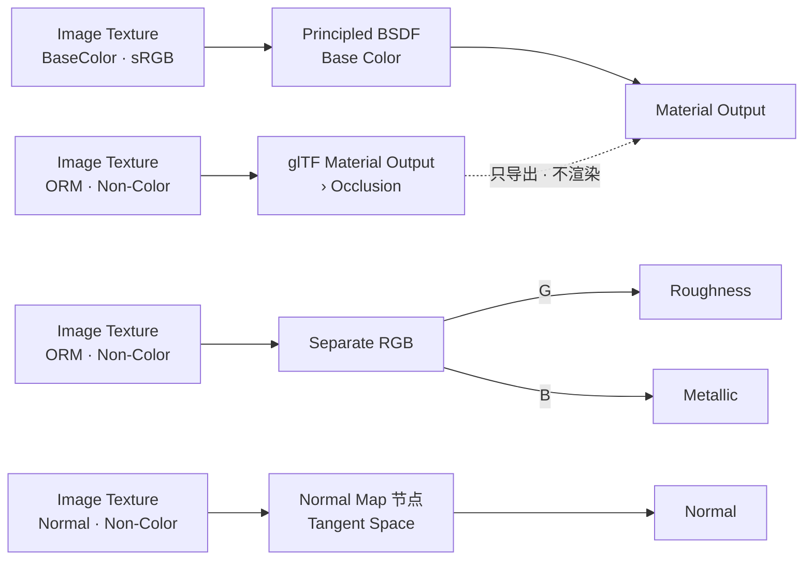
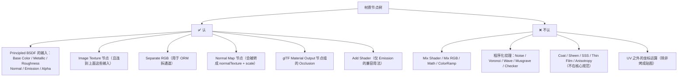
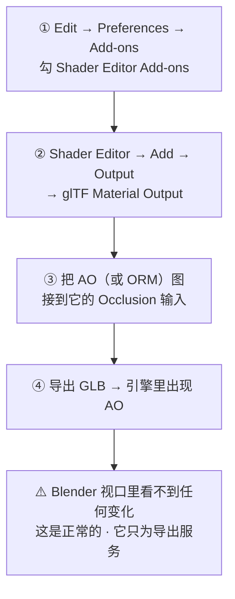
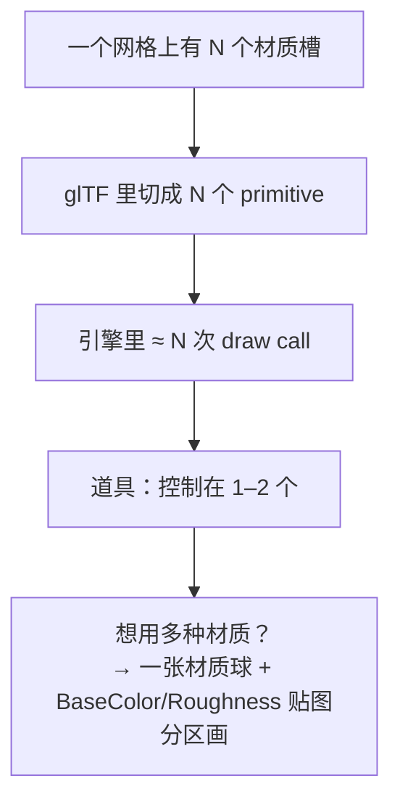
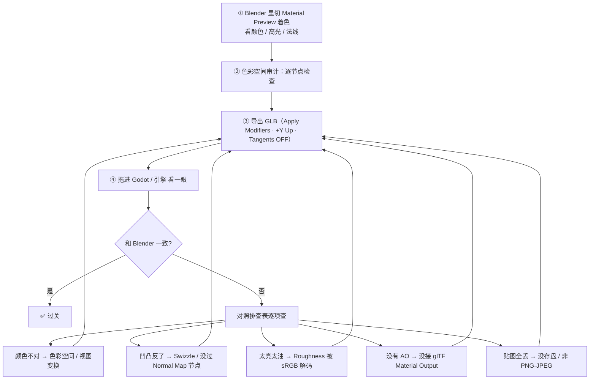

# 03 · 节点搭建与 glTF 兼容性

> 一句话：**glTF 导出器的唯一真源是 Principled BSDF 上那几个输入。你在旁边搭的任何"聪明节点"，引擎全看不见。**
> 依据：官方手册 5.2 · [glTF 2.0 导出](https://docs.blender.org/manual/en/latest/addons/import_export/scene_gltf2.html)（Exported Materials / Metallic and Roughness / Baked Ambient Occlusion / Normal Map / Emissive 段）。

---

## 一、标准 PBR 节点树（照这张图接）



| 连接 | 要点 |
| ---- | ---- |
| BaseColor → Base Color | Color Space = **sRGB** |
| ORM → `Separate RGB` → G → Roughness、B → Metallic | ORM 图 Color Space = **Non-Color** |
| Normal 图 → **Normal Map 节点** → Principled Normal | ⚠️ **中间必须有 Normal Map 节点**，直接插图片凹凸全错；节点保持默认 Tangent Space |
| ORM（同一张）→ `glTF Material Output` 的 Occlusion | 只影响导出，**在 Blender 里没有视觉效果**（正常） |

> **为什么用 Separate RGB 而不是三张单独的图？** 官方手册明确建议这个排布，因为导出器能识别出「符合 glTF 约定」，从而**直接把贴图原样拷进文件**；否则它会尝试适配（慢，且结果不可控）。

---

## 二、导出器认什么 / 不认什么



| 你想做的事 | 引擎里会不会生效 | 替代方案 |
| ---------- | ---------------- | -------- |
| 用 Mix RGB 把 AO 乘进 Base Color | ❌ 丢 | **乘进贴图文件**（Compositor 或图像软件） |
| 用 ColorRamp 调对比度 | ❌ 丢 | 调完**烘焙成贴图** |
| 用 Noise 做污渍 | ❌ 丢 | 烘焙 / Texture Paint 画进贴图 |
| 用 Mix Shader 混合两种材质 | ❌ 丢 | 用一张材质球 + 贴图区分区域（材质 ID 思路） |
| 用 Coat 做清漆 | ❌ 主规范不认 | 需要就引擎里开对应扩展，或烤进 Roughness |
| 用 Emission 做灯牌 | ✅ 生效 | Strength > 1 时走 `KHR_materials_emissive_strength` 扩展 |

> **一句话判据**：导出器看的是「Principled 的输入上挂了哪张图」。中间所有运算节点都被当作**不存在**。

---

## 三、AO 怎么导出去（本阶段最容易漏的一步）

Principled BSDF **没有 AO 输入**，Blender 里也没有任何节点排布能让 AO 按 glTF 的方式生效。官方给的解法：



| 注意 | 说明 |
| ---- | ---- |
| 节点组名必须精确 | `glTF Material Output`，输入名必须是 `Occlusion` |
| 加菜单的开关 | 开 `Preferences → Add-ons → Shader Editor Add-ons`，才能从 `Add → Output` 里加到它 |
| 可以接 ORM 同一张图 | glTF 的 occlusionTexture 只读 R 通道，与 ORM 共用完全合法 |
| Blender 里没效果 | 别怀疑自己，官方手册明说「effect need not be shown in Blender」 |

> 如果嫌麻烦，最简方案是**不打 ORM，单独一张 AO 图**接进去。代价是多一个 sampler，但胜在所见即所得。

---

## 四、Emission 与 Alpha

| 通道 | 怎么接 | 备注 |
| ---- | ------ | ---- |
| **Emission** | Image → Principled 的 `Emission Color`；强度用 `Emission Strength` | 只有 emissive 一个用途时：Base Color 设黑、Roughness 设 1.0（手册建议，避免其他通道干扰） |
| **Alpha** | Image 的 Alpha 输出 → Principled 的 Alpha | 透明排序问题多，能用不透明网格解决就别用 |

---

## 五、材质数量 = draw call



- 道具（箱、桶、工具箱）：**1–2 个材质**
- 大件（载具、机柜）：3–4 个顶天
- 螺丝、铆钉这类细节：**做进同一个网格 + 用 Normal 贴图假造**，绝不做成独立材质

> 进阶做法（Substance 常用）：用一张「材质 ID 图」在贴图层面区分木 / 铁 / 漆，引擎侧仍是一个材质球。

---

## 六、Node Wrangler 效率三件套

| 快捷键 | 功能 | 什么时候用 |
| ------ | ---- | ---------- |
| **`Ctrl+Shift+T`** | Principled Texture Setup：选中 Principled 后一次导入整套贴图，**自动建节点 + 自动设 Color Space + 自动连线** | ⭐ 导入 CC0 素材时省 10 分钟（靠文件名关键词识别类型） |
| **`Ctrl+Shift+LMB`** | 预览某个节点的输出（接临时 Emission 到输出） | 调试某张图对不对 |
| **`Ctrl+T`** | 给选中的纹理节点补 Texture Coordinate + Mapping | 要缩放/平移贴图时 |
| `Alt+R` | Reload Images：重载节点树里所有贴图 | 在外部改完贴图后 |
| `Shift+P` | 把选中节点装进 Frame | 节点树乱了 |
| `Shift+S` | 切换节点类型（保留连线） | 改主意时 |

> 快捷键按不出来？**`F3` 搜命令名**（macOS 上 `Ctrl` 与系统快捷键冲突时尤其有用）。

---

## 七、验证流程（每做完一个材质就跑一遍）



> **Material Preview 而不是 Rendered**：最终渲染会走 View Transform（ACES/AgX），和引擎看到的不是一回事。用 Material Preview 的 HDRI 环境光检查最接近引擎。

---

## 八、坑

- ❌ **Normal 图直插 Principled 的 Normal 输入** → 没过 Normal Map 节点 → 凹凸全错
- ❌ **用了 Mix RGB 把 AO 乘进 Base Color** → Blender 好看，导出全丢
- ❌ **AO 没接 `glTF Material Output`** → 白烤一场
- ❌ **节点组名/输入名写错**（`gltf material output` 小写之类）→ 导出器找不到，静默忽略
- ❌ **以为 Blender 里能看到 AO 效果** → 看不到是正常的，别反复折腾节点
- ❌ **一个道具 6 个材质** → 6 次 draw call
- ❌ **贴图没存盘就导出** → GLB 里没有图，且导出时不报错
- ❌ **用了程序化纹理（Noise 等）** → 引擎只有一张纯色
- ❌ **用渲染截图当 Albedo** → 视图变换被烤进贴图，进引擎二次映射

---

## 九、自检

| # | 自检点 | 通过标准 |
| - | ------ | -------- |
| ① | 标准树 | **实操**：从零搭出「BaseColor + ORM + Normal + AO 导出」的节点树 |
| ② | 认与不认 | 说出 3 个导出器认的、3 个不认的节点类型 |
| ③ | AO | 说出 AO 导入 glTF 的唯一官方解法及所需节点组名 |
| ④ | draw call | 说出「材质槽 → primitive → draw call」的关系与道具的目标数量 |
| ⑤ | 工具 | 说出 Node Wrangler 三件套的快捷键与用途 |
| ⑥ | 验证 | **实操**：导出 GLB 并在引擎里对比，能列出 ≥3 条排查项 |

---

## 十、速查

```text
【标准 PBR 节点树】
BaseColor(sRGB)  → Principled › Base Color
ORM(Non-Color)   → Separate RGB › G → Roughness ／ B → Metallic
Normal(Non-Color)→ Normal Map 节点(Tangent) → Principled › Normal
ORM(同一张)      → glTF Material Output › Occlusion（只为导出，Blender 里无效果）
⚠️ Normal 必须经过 Normal Map 节点，不能直接插

【导出器认的】
Principled 的输入：Base Color / Metallic / Roughness / Normal / Emission / Alpha
Image Texture · Separate RGB（ORM 拆通道）· Normal Map · glTF Material Output

【导出器不认的】
Mix Shader · Mix RGB · Math · ColorRamp · 程序化纹理(Noise/Voronoi/...)
Coat · Sheen · SSS · Thin Film · Anisotropy（不在核心规范）
→ 想要就烤进贴图

【AO 导出三步】
① Preferences → Add-ons → 勾 Shader Editor Add-ons
② Shader Editor → Add → Output → glTF Material Output
③ 把 AO / ORM 图接到 Occlusion 输入
（节点组名与输入名必须精确；Blender 里看不到效果属正常）

【材质数量】
材质槽 → glTF primitive → 引擎 draw call
道具 1–2 个；细节（螺丝/铆钉）做进网格 + Normal 贴图假造

【Node Wrangler】
Ctrl+Shift+T   一键导入整套 PBR 贴图（自动设 Color Space + 连线）⭐
Ctrl+Shift+LMB 预览节点输出
Ctrl+T         补 Texture Coordinate + Mapping
Alt+R          重载所有贴图
（按不出来 → F3 搜命令名）

【验证闭环】
Material Preview 检查 → 色彩空间审计 → 导出 GLB → 引擎对比 → 排查表
颜色不对→色彩空间｜凹凸反了→Swizzle/没过节点｜太油→Roughness 被解码
没 AO→没接节点组｜贴图丢了→没存盘
```

---

> **下一步**：[`04-烘焙原理与Cycles烘焙设置.md`](04-烘焙原理与Cycles烘焙设置.md) —— 节点会搭了，但贴图从哪来？答案是烘焙。
