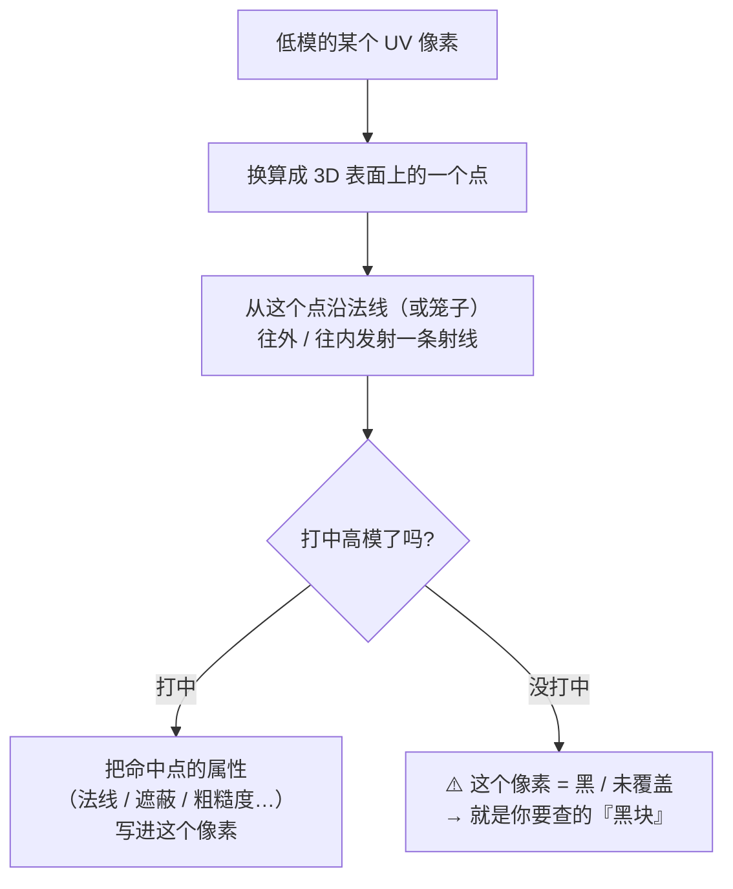
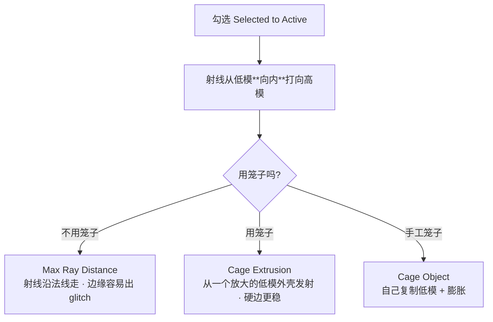
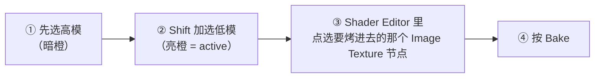
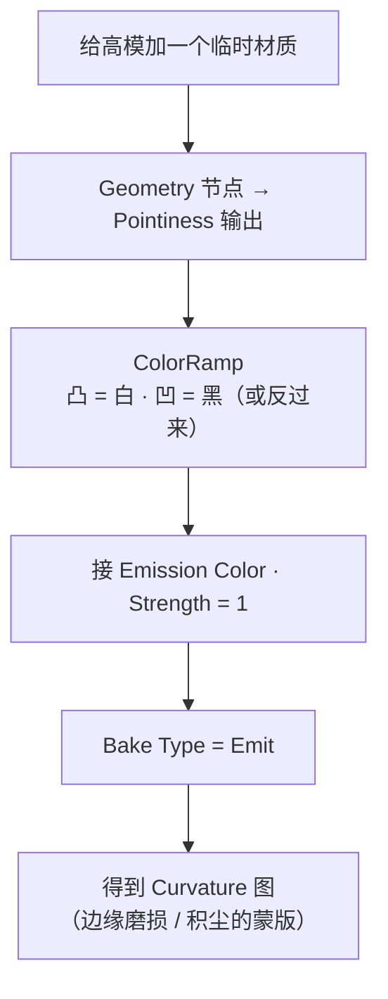

# 04 · 烘焙原理与 Cycles 烘焙设置

> 一句话：**烘焙 = 沿着低模的 UV，一个像素一个像素地问「这个位置的高模表面长什么样」，把答案写进图片。**
> 依据：官方手册 5.2 · [Render Baking](https://docs.blender.org/manual/en/latest/render/cycles/baking.html)；Blender 5.0 Release Notes（Multiresolution Baking 增强）。

---

## 一、烘焙到底在干什么



> 理解了这张图，所有烘焙问题都归为两类：**射线没打中**（黑块）和**射线打错了地方**（串味、糊掉）。

---

## 二、前置条件（缺一不可）

| 条件 | 说明 |
| ---- | ---- |
| **渲染引擎 = Cycles** | Bake 面板在 `Render Properties → Bake`，属于 Cycles。视口可以继续用 EEVEE，但**烘焙时必须切 Cycles** |
| **有 UV** | 没 UV 直接报错；UV 有重叠 → 重叠区域互相覆盖 |
| **有目标图像** | 材质里要有 `Image Texture` 节点，且 **5.x 起必须是「选中 + 激活」的那一个** |
| **高模可见** | 被隐藏（视口或渲染隐藏）的对象**不参与烘焙**——这是最阴的坑 |
| **Scale 已 Apply** | 高模低模都要 `Ctrl+A → Scale`（未 Apply 会整体歪掉） |

---

## 三、Bake Type 全表（12 种）

| Bake Type | 烤什么 | 常用度 | 备注 |
| --------- | ------ | ------ | ---- |
| **Normal** ⭐ | 法线（高模 → 低模） | ⭐⭐⭐ | 游戏资产主力。Space 默认 Tangent |
| **Ambient Occlusion** ⭐ | 环境光遮蔽 | ⭐⭐⭐ | 忽略场景灯光，按 World 设置算；**可配 Selected to Active** 烤出高模的缝隙暗部 |
| **Emit** ⭐ | 自发光 / 任何自定义数据 | ⭐⭐⭐ | **Curvature 就靠它**（Pointiness → Emission） |
| **Roughness** | 材质粗糙度 | ⭐⭐ | 把程序化材质转成贴图时用 |
| **Diffuse** | 漫反射通道 | ⭐⭐ | **只勾 Color（不勾 Direct/Indirect）** = 烤出纯 Albedo |
| **Combined** | 全部材质 + 光照（不含高光） | ⭐ | 做 lightmap / 预烘焙光照 |
| **Shadow** | 阴影与光照 | ⭐ | 同上 |
| **UV** | UV 坐标（R/G 通道，B=1） | ⭐ | 导出 UV 模板图给图像软件画 |
| **Position** | 世界空间坐标 | ⚪ | 程序化效果用 |
| **Environment** | 世界环境贴图 | ⚪ | 特殊用途 |
| **Glossy** / **Transmission** | 高光 / 透射通道 | ⚪ | 少见 |

> ⚠️ **没有 Curvature 类型**。翻遍下拉框也找不到——要用 `Emit` + `Pointiness`（见第八节）。

---

## 四、Selected to Active：高模 → 低模的核心开关



| 参数 | 什么时候出现 | 怎么给值 |
| ---- | ------------ | -------- |
| **Max Ray Distance** | **不勾** Cage 时 | 从 0.02 起二分试（米制、1m 级道具）。太大 → 串面糊掉；太小 → 黑块 |
| **Cage Extrusion** | **勾选** Cage 时 | 同上，通常比 Ray Distance 略大 |
| **Cage Object** | 指定手工笼子时 | 必须与低模**拓扑一致**（顶点数与顺序相同），否则射线全错 |

### 4.1 选择顺序（错一次就白烤）



> **active 必须是低模**（最后选的那个）。顺序反了 → 射线从高模往里打 → 结果全错，而且看起来"像烤成功了"。

### 4.2 手工 Cage 怎么做

```text
1 选中低模 → Alt+D 复制（链接复制，保证拓扑一致）
2 复制体 → Edit 模式 → A 全选 → Alt+S 沿法线向外膨胀一点点
3 退出编辑模式，把复制体移开一点（别挡住）
4 选中低模 → Bake 面板勾选 Cage → Cage Object 选那个复制体
```

> 官方手册提醒：Cage 与被烘焙对象**必须有相同拓扑**（面数与面序一致），所以必须用复制而不是重新建模。`Alt+D` 天然满足。

---

## 五、Normal 烘焙的两个关键设置

| 设置 | 默认 | 说明 |
| ---- | ---- | ---- |
| **Normal Space** | `Tangent` ⭐ | 切线空间，独立于物体变换与形变 → **动画物体也能用**。Object 空间只在特殊场合用 |
| **Swizzle R / G / B** | `+X / +Y / +Z` | **这就是 OpenGL 约定**，与 glTF / Unity / UE / Godot 一致 → **不要动** |

> 只有当目标明确要 **DirectX（-Y）** 法线时，才把 G 改成 `-Y`。改错了的表现是：所有凸起变成凹陷。

---

## 六、Output / Clear Image / Margin

| 设置 | 说明 | 建议 |
| ---- | ---- | ---- |
| **Target › Image Textures** | 5.x 起**只烤到「active 且 selected」的 Image Texture 节点**；材质里没有选中激活的节点 → 这个材质什么都不烤 | 每次烘焙前点一下目标节点 |
| **Target › Active Color Attribute** | 烤到顶点色属性（顶点烘焙） | 低模顶点够密时才用 |
| **Clear Image** | 烘焙前先清空图像 | ⭐ **开着**。不清空时"没烤到的区域"会保留上一次的结果，害你误判 |
| **Margin › Type** | `Extend`（外扩边缘像素）/ `Adjacent Faces`（跨接缝取相邻面像素） | 默认 Extend 够用；接缝明显时试 Adjacent Faces |
| **Margin › Size** | 边缘外扩像素数 | 1024 → **8–16px**；2048 → 16–32px。太小 → mipmap 下接缝黑边 |

> Margin 的作用：**防止 UV 接缝在纹理过滤/mipmap 时露出背景色**。烘焙时它会自动生成，不用手动扩边。

---

## 七、Bake from Multires（5.0 大幅增强）

雕刻 → 烘焙的正规路径（Stage 5 会用到）：

| 项 | 说明 |
| -- | ---- |
| 原理 | 比较 Multiresolution 修改器的 **Viewport Levels（低）** 与 **Render Levels（高）** 两级 |
| 三种类型 | `Normals` / `Displacement` / **`Vector Displacement`**（5.0 新增） |
| 5.0 增强 | 支持 **n-gon**；**只烤到选中且激活的图像**；Subdivision Level 与 UV Interpolation 与 Subdivision Surface 修改器对齐；修了一批非零细分级别下的烘焙 bug |
| 前提 | 网格上挂了 Multiresolution 修改器，且**不需要**额外的低模 |

---

## 八、Curvature 没有类型？用 Emit 自己做



| 注意 | 说明 |
| ---- | ---- |
| Pointiness 基于几何 | **完全没有倒角的硬边，值是突变的** → 曲率图会有硬切口。想拿到好看的曲率，模型要有倒角 |
| 正负方向 | 凸出为正、凹陷为负（大致范围 −1 ~ 1）→ ColorRamp 两端取到 0–1 |
| 替代方案 | 用 `Bevel` 节点（小半径）代替 Pointiness，硬表面道具上效果更可控 |
| 用途 | **当蒙版用**：边缘露白做掉漆、凹处变黑做积尘（见 06） |

---

## 九、常用烘焙配方速查

| 想要 | Bake Type | 关键设置 |
| ---- | --------- | -------- |
| 高模细节的 Normal | **Normal** | Space = Tangent；Swizzle 保持 +X/+Y/+Z |
| AO（含高模缝隙） | **Ambient Occlusion** | 勾 Selected to Active；Samples 128–512（噪点多就加） |
| Curvature | **Emit** | Pointiness / Bevel → ColorRamp → Emission |
| 把程序化材质转成 Albedo | **Diffuse** | Influence **只勾 Color**，不勾 Direct / Indirect |
| 把程序化材质转成 Roughness | **Roughness** | — |
| Metallic 遮罩 | **Emit** | 没有 metalness 通道 → 手工给金属部分白/其他黑的自发光材质烤出来，或直接手绘 |
| UV 模板图（给外部画） | **UV** | 导出成图，在图像软件里照着画 |
| Lightmap（预烘焙光照） | **Combined** | 需要第二套不重叠 UV（见 Stage 3） |

---

## 十、坑

- ❌ **渲染引擎没切 Cycles** → 找不到 Bake 面板 / 烤出来是空的
- ❌ **没选中目标 Image Texture 节点**（5.x 新行为）→ 什么都没烤，界面还不报错
- ❌ **选择顺序反了**（低模先选）→ active 是高模 → 结果全错
- ❌ **高模被隐藏** → 不参与烘焙 → 烤出来是低模自己
- ❌ **Ray Distance 给 0** → 满图黑块；**给太大** → 细节糊成一片
- ❌ **Cage 用了不同拓扑的物体** → 射线错乱
- ❌ **忘勾 Clear Image** → 上一轮残留让你以为烤成功了
- ❌ **Margin 给 0** → 接缝在 mipmap 下漏黑边
- ❌ **low-poly 没 Apply Scale** → 射线偏移，细节整体错位
- ❌ **烘焙完不存盘** → 关掉文件全丢（**唯一一个有这个风险的环节**）

---

## 十一、自检

| # | 自检点 | 通过标准 |
| - | ------ | -------- |
| ① | 原理 | 说出「射线 + UV 采样」的模型，并解释黑块是怎么来的 |
| ② | 前置 | 说出 5 项前置条件 |
| ③ | Bake Type | 说出 ≥6 种类型各自烤什么，并指出**没有** Curvature |
| ④ | 参数 | 说清 Max Ray Distance / Cage Extrusion / Cage Object 的出现条件与关系 |
| ⑤ | 顺序 | 说出正确的选择顺序与「active 是谁」 |
| ⑥ | Normal | 说出 Space 与 Swizzle 的默认值及为什么别动 |
| ⑦ | Curvature | **实操**：用 Emit + Pointiness 烤出一张曲率图 |

---

## 十二、速查

```text
【前置 5 项】
① 渲染引擎 = Cycles（Bake 面板在 Render Properties）
② 有 UV 且无重叠
③ 材质里有目标 Image Texture 节点，且**已选中**（5.x 只烤 selected+active）
④ 高模可见（隐藏的对象不参与）
⑤ 高模低模都 Ctrl+A → Scale

【Bake Type 常用 5 种】
Normal            法线 ⭐（Space=Tangent，Swizzle +X/+Y/+Z 别动）
Ambient Occlusion 遮蔽 ⭐（可 Selected to Active）
Emit              自发光 / Curvature / 自定义数据 ⭐
Roughness         程序化粗糙度转贴图
Diffuse           只勾 Color = 烤出纯 Albedo
（另有 Combined / Shadow / UV / Position / Environment / Glossy / Transmission）
⚠️ 没有 Curvature 类型

【选择顺序】
先高模 → Shift 加选低模（低模 = active 亮橙）→ 点选目标 Image 节点 → Bake

【射线距离】
不用 Cage → Max Ray Distance
用 Cage   → Cage Extrusion ／ 手工 Cage Object（拓扑必须一致）
调法：从 0.02 二分试；黑块=太小，糊=太大
手工 Cage：Alt+D 复制低模 → Alt+S 膨胀 → 设为 Cage Object

【Output / Margin】
Target = Image Textures（只烤 selected+active）
Clear Image = ON（否则残留会误导你）
Margin Size：1024→8–16px，2048→16–32px（防接缝漏底）

【Curvature 配方】
Geometry→Pointiness → ColorRamp → Emission Color，Strength=1 → Bake Type=Emit
（硬边没倒角时值会突变；需要好看的曲率就先倒角）

【Bake from Multires（5.0）】
Viewport Levels = 低模级 ／ Render Levels = 高模级
类型：Normals / Displacement / Vector Displacement
5.0 增强：n-gon · 只烤选中激活图像 · 与 SubD 修改器对齐
```

---

> **下一步**：[`05-高模到低模烘焙实战与排错.md`](05-高模到低模烘焙实战与排错.md) —— 参数都认识了，现在真的烤一遍，然后学会烤坏了怎么救。
