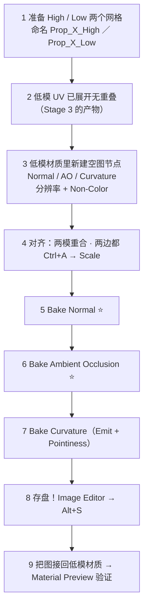
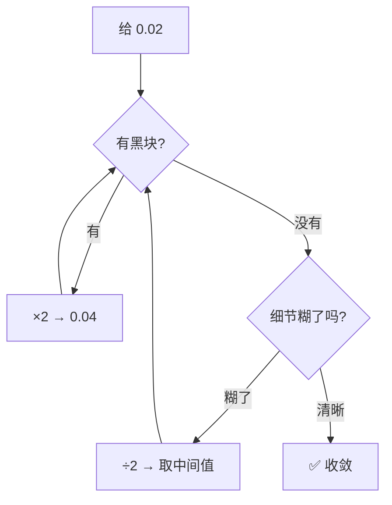
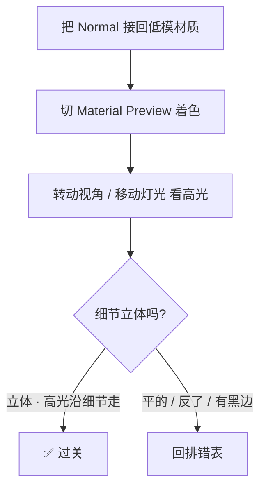

# 05 · 高模 → 低模烘焙实战与排错 ⭐

> 一句话：**烘焙 30 秒，排错 30 分钟。本页的价值不在流程，在那张排错表。**
> 依据：官方手册 5.2 · [Render Baking](https://docs.blender.org/manual/en/latest/render/cycles/baking.html)；Blender 5.0 Release Notes（烘焙目标行为变更）。

---

## 一、完整流程（照着做一遍）



### Step 1 · 准备高低模

| 项 | 要求 |
| -- | ---- |
| 命名 | `Prop_Toolbox_High` / `Prop_Toolbox_Low`，别叫 Cube.001 |
| 位置 | 完全重合，朝向一致 |
| 低模 | UV 已展开、无重叠、已 Pack（Stage 3） |
| 高模 | 可以任意拓扑（三角、n-gon、雕刻都行），它只是"信息来源" |
| Scale | **两边都 `Ctrl+A → Scale & Rotation`** |

### Step 2 · 建目标图像

```text
Shader Editor → 选中低模材质 → Add → Texture → Image Texture → New
  Name:         Prop_Toolbox_Normal
  Width/Height: 1024 × 1024
  Color Space:  Non-Color   ⚠️ 新建时就要选
  Alpha:        取消勾选（省 25% 体积）
  32-bit Float: 可选（法线出现色带时才勾）
```

> 节点**先不要连到任何地方**。它只是"要烤进去的那张纸"。

### Step 3 · 烘焙 Normal

```text
1 渲染引擎 = Cycles（Device 建议 GPU Compute）
2 Shader Editor 里 **点选** Prop_Toolbox_Normal 那个节点
3 3D 视口：先选 High，Shift 加选 Low（Low = 亮橙 active）
4 Render Properties → Bake：
   Bake Type:          Normal
   Selected to Active: ✅
   Normal Space:       Tangent
   Swizzle:            +X / +Y / +Z（默认，别动）
   Max Ray Distance:   0.02 起试
   Clear Image:        ✅
   Margin Size:        16（1024 贴图）
5 按 Bake → 等
6 Image Editor → Alt+S 立刻存盘
```

### Step 4 · 烘焙 AO 与 Curvature

| 图 | 设置差异 |
| -- | -------- |
| **AO** | Bake Type = `Ambient Occlusion`；仍勾 Selected to Active；噪点多就把 Samples 加到 128–512 |
| **Curvature** | 给**高模**临时挂一个材质：`Geometry → Pointiness → ColorRamp → Emission Color`，Strength=1 → Bake Type = `Emit`。烤完把临时材质删掉 |

### Step 5 · 存盘（最重要的 3 秒）

```text
Image Editor 里切到那张图 → Alt+S（Save）／ Shift+Alt+S（Save As）
存到 资产/练习文件/05-材质PBR与烘焙/textures/
```

> ⚠️ **烘焙结果只存在于内存里**。不存盘 = 关掉 .blend 全丢，而且**没有任何提示**。

---

## 二、烘焙前 8 项检查（每次都过一遍）

| # | 检查 | 不做会怎样 |
| - | ---- | ---------- |
| ① | 低模 UV 无重叠、已 Pack、岛间距 ≥ 8px（1024 时） | 重叠区互相覆盖；接缝漏底 |
| ② | 高低模都 `Ctrl+A → Scale & Rotation` | 射线偏移，细节整体错位 |
| ③ | 高低模位置重合、朝向一致 | 烤出"偏移的细节" |
| ④ | 高模**没有被隐藏**（视口与渲染都可见） | 烤出来是低模自己 |
| ⑤ | 渲染引擎 = Cycles，Samples 够（AO 128–512） | 找不到面板 / 满是噪点 |
| ⑥ | 目标图像：分辨率、名称、**Color Space = Non-Color** | 法线数据被当颜色处理 |
| ⑦ | Shader Editor 里**点选了**目标 Image Texture 节点 | **5.x 起什么都不烤，且不报错** |
| ⑧ | Clear Image = ON；Margin 已设 | 上一轮残留误导判断；接缝漏底 |

### 💡 进阶技巧：烘焙代理（要反复烤时用）

```text
1 选中低模 → Alt+D 复制一份（链接复制，拓扑一致）
2 复制体的材质槽 → Link 设为 **Object**（这样两个复制体能有不同材质）
3 复制体专门放烘焙用的空图节点；原低模保留最终材质
4 每次重烤只需在代理上操作，不用来回拔线
```

---

## 三、⭐ 排错表（烤坏了先查这里）

| 症状 | 可能原因 | 排查动作 |
| ---- | -------- | -------- |
| **整张全黑** | ① 没选中目标 Image 节点（5.x 新行为）② 低模不是 active ③ 高模没选中 / 被隐藏 ④ Max Ray Distance = 0 ⑤ 材质里根本没有图像节点 | 按 8 项检查逐条过 |
| **大部分正常，局部黑斑** | 射线打不到（低模内凹、高模有洞、距离太小） | 加大 Ray Distance；检查高模是否封闭；改用 Cage |
| **细节糊成一团 / 串面** | Ray Distance / Cage Extrusion 太大；高模上挨得近的部件互相串 | 减小距离；把高模按部件拆开分别烤 |
| **图上的细节位置不对** | 高低模没对齐；没 Apply Scale；Cage 与被烤对象拓扑不一致 | 重新对齐 + Apply；Cage 必须用 Alt+D 复制体 |
| **接缝黑边 / 白边** | Margin 太小；UV 岛间距不够 | Margin 加到 16–32；回 Stage 3 把 UV 岛间距拉开 |
| **凹凸反了**（凸变凹） | Swizzle 的 G 被改成 `-Y`；或引擎里 normal scale 给了负值 | 恢复 `+Y`；引擎侧 scale 保持 1 |
| **只有一半有内容** | 高模只选了一部分；UV 有重叠 | 重新全选高模；UV 编辑器里查出重叠岛 |
| **烤出来是低模自己的形状，没细节** | 没勾 Selected to Active；或高模不可见 / 未选中 | 勾选 + 确认选择顺序 |
| **AO 图全是噪点** | Samples 太少 | 128 → 512 |
| **边缘一圈锯齿 / 硬切口** | 没用 Cage，射线沿法线发散导致边缘 glitch | 勾 Cage，或做手工 Cage（见 04） |
| **图看起来发灰 / 对比度不对** | 新建图像时色彩空间选了 sRGB | 重建图像，选 Non-Color |
| **尺寸不对** | 新建图像时尺寸填错 | 重建（烘焙不会自动改尺寸） |
| **极慢 / 内存爆掉** | 高模面数大 + 多个高模对象（手册：每个源对象有固定 CPU 内存开销） | 先把高模 `Ctrl+J` 合成一个；降 Samples |

### 3.1 二分法调 Ray Distance



> 目标不是"找一个万能值"，而是**找到刚好不打空的最小值**。场景尺度变了（改单位、缩放模型）这个值就要重调。

---

## 四、质量检查：怎么判断烤得好不好

| 图 | 正确长什么样 | 异常信号 |
| -- | ------------ | -------- |
| **Normal** | 平坦区域是**淡紫蓝**（约 RGB 128,128,255）；有细节处出现彩色渐变 | 大片纯黑 / 纯白像素 = 射线未命中或严重错误；整体偏灰 = 色彩空间错了 |
| **AO** | 大部分接近白，缝隙、内角变暗，过渡柔和 | 整体发灰 = 遮蔽不足；块状噪点 = Samples 不够 |
| **Curvature** | 凸边偏白、凹角偏黑，边缘连续 | 硬边处出现"刀切"般的突变 = 模型没倒角（正常现象，但不好当蒙版用） |

### 4.1 唯一可靠的检查方式



> **不要靠看图判断法线对不对**。人的眼睛看不出 (128,128,255) 里藏着的方向错误——只有把它接回材质、让光打上去才能看出来。

---

## 五、文件与复用

```text
资产/练习文件/05-材质PBR与烘焙/
├── Prop_Toolbox.blend
└── textures/
    ├── Prop_Toolbox_01_Normal.png
    ├── Prop_Toolbox_01_AO.png
    ├── Prop_Toolbox_01_Curvature.png   （中间产物，可不进引擎）
    └── Prop_Toolbox_01_ORM.png         （合成后）
```

| 规则 | 说明 |
| ---- | ---- |
| 烘焙图 = 中间产物 | Curvature / AO 往往不直接进引擎，而是合成进 ORM 或当手绘蒙版 |
| 存盘路径 | 用相对路径（`//textures/...`），跟着 .blend 走，换电脑不丢 |
| Fake User | 若担心被 Blender 当成孤儿数据清掉，给图勾上 Fake User（Image Editor 里盾牌图标） |

---

## 六、坑

- ❌ **烘焙完不存盘**（第三次说，因为有第三次就会有人踩）
- ❌ **5.x 没选中目标节点就按 Bake** → 静默失败
- ❌ **选择顺序反了** → 全错但不报错
- ❌ **高模隐藏了还反复找原因** → 第一件事就检查可见性
- ❌ **用 sRGB 新建法线图** → 烤完一切看着"正常"，进引擎全错
- ❌ **Ray Distance 抄别人教程的 0.1** → 你的场景尺度不同，值完全不同
- ❌ **一个 500 万面的高模直接烤** → 卡死 → 先 Join、降 Samples、或分部件烤
- ❌ **低模 UV 有重叠还硬烤** → 重叠区域互相覆盖，且无法修复（只能重展 UV）
- ❌ **烤完不接回材质验证** → 贴图看着有内容就以为成功了

---

## 七、自检

| # | 自检点 | 通过标准 |
| - | ------ | -------- |
| ① | 流程 | **实操**：不看教程，从高低模烤出 Normal + AO 并立刻存盘 |
| ② | 检查 | 背出烘焙前 8 项检查 |
| ③ | 排错 | 给一张「局部黑斑的 Normal 图」，说出 ≥3 个原因与排查动作 |
| ④ | 调参 | 说清二分法调 Ray Distance 的逻辑 |
| ⑤ | 质量 | 说出 Normal 图平坦区的正确颜色，以及唯一可靠的验证方式 |
| ⑥ | Curvature | **实操**：烤出一张曲率图并说明它的用途 |

---

## 八、速查

```text
【完整流程】
准备 High/Low → 低模建空图(Non-Color) → 对齐+Apply Scale
→ Cycles → 点选目标节点 → 先选 High 再 Shift 选 Low(active)
→ Bake Type=Normal / Selected to Active / Tangent / +X+Y+Z
→ Ray Distance 0.02 起 → Bake → 立刻 Alt+S 存盘

【烘焙前 8 项】
① 低模 UV 无重叠 · 已 Pack · 岛间距够
② 高低模都 Ctrl+A → Scale & Rotation
③ 两模重合、朝向一致
④ 高模未被隐藏
⑤ Cycles + Samples 够（AO 128–512）
⑥ 目标图：分辨率 / 名称 / **Color Space = Non-Color**
⑦ **已点选目标 Image Texture 节点**（5.x 只烤 selected+active）
⑧ Clear Image=ON · Margin=16(1024)

【排错速查】
全黑          → 没选节点 / active 不是低模 / 高模隐藏 / 距离=0
局部黑斑      → 距离太小 · 高模有洞 · 内凹处打不到
糊 / 串面     → 距离太大 · 部件太近 → 减小或分部件烤
位置不对      → 没对齐 / 没 Apply Scale / Cage 拓扑不一致
接缝漏底      → Margin 太小 / UV 岛间距不够
凹凸反了      → Swizzle G 被改成 -Y
AO 噪点       → Samples ↑
边缘锯齿      → 用 Cage
发灰          → 目标图建成了 sRGB
慢/爆内存     → 高模 Ctrl+J 合并 · 降 Samples

【质量判断】
Normal 平坦区 = 淡紫蓝 (128,128,255)
大片纯黑白 = 射线未命中；整体偏灰 = 色彩空间错
✅ 唯一可靠验证：接回材质 → Material Preview → 转视角看高光

【存盘】
Image Editor → Alt+S（Save）／ Shift+Alt+S（Save As）
路径用 //textures/ 相对路径；重要图可勾 Fake User
```

---

> **下一步**：[`06-Texture-Paint与手绘细节.md`](06-Texture-Paint与手绘细节.md) —— 烘焙给了你"底子"（法线、遮蔽、曲率），接下来用它们当蒙版画细节。
