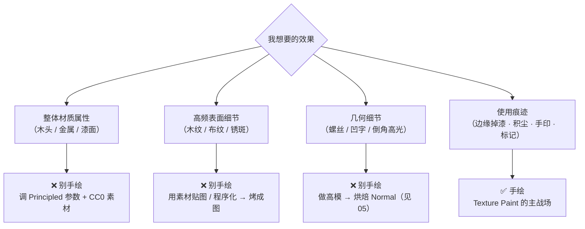
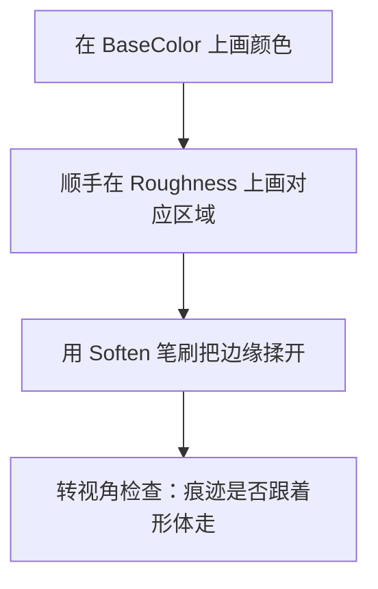
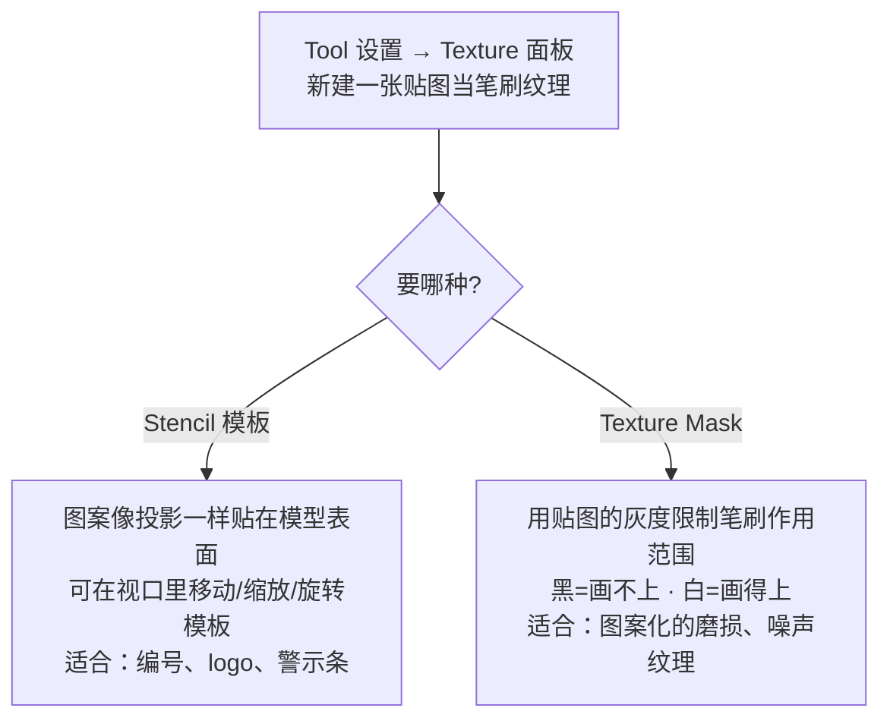
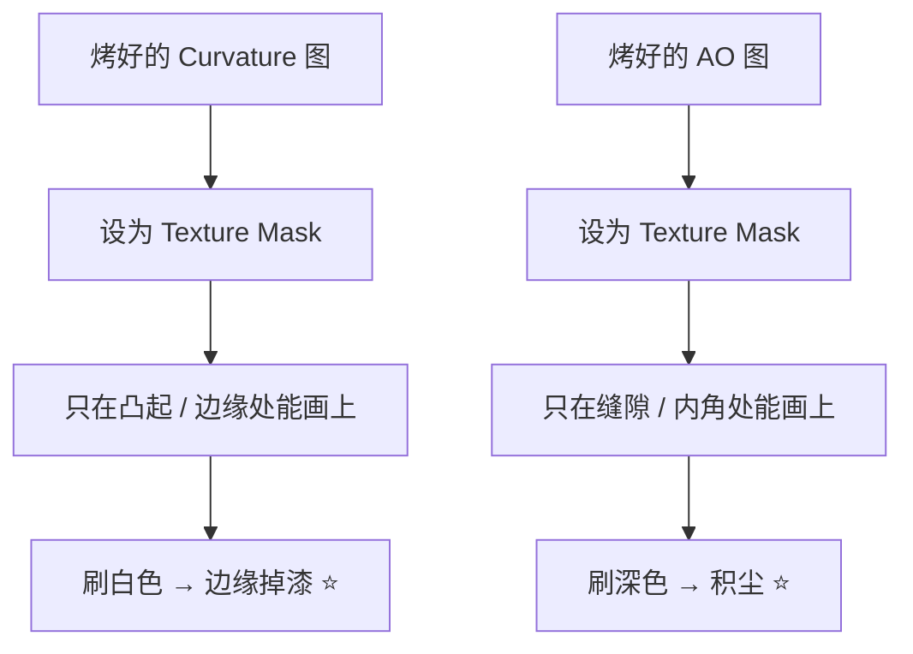

# 06 · Texture Paint 与手绘细节

> 一句话：**手绘的定位是"加细节"，不是"造材质"。基础材质靠数值和素材，手绘只负责那些「不可能靠参数生成」的东西：磨损、积尘、标记、文字。**
> 依据：官方手册 Texture Paint / Sculpt-Paint；实践部分基于烘焙产物（AO / Curvature）当蒙版的常规流程。

---

## 一、先决定：这个细节该不该手绘



> 判断标准：**能靠「参数 / 素材 / 烘焙」拿到的，绝不手绘**。手绘是不可复现的、最贵的一种细节来源。

---

## 二、进入 Texture Paint 前的准备

| 条件 | 说明 |
| ---- | ---- |
| **有 UV** | 没 UV 没法定位笔刷 |
| **材质里有 Image Texture 节点** | Texture Paint 画在材质里**激活的那张图**上 |
| **图已选对** | Shader Editor 里点选要画的节点；Tool 设置里的 Paint Slots 也能切换 |
| **分辨率已定** | **在最终分辨率上画**，不要画完再放大 |

```text
3D 视口左上角模式下拉 → Texture Paint
（快捷键记不住 / 菜单对不上 → F3 搜 "Texture Paint Mode"）
```

---

## 三、画笔核心设置

| 设置 | 作用 | 常用值 |
| ---- | ---- | ------ |
| **Radius** | 笔刷大小 | `F` 拖动调整，`[` / `]` 微调 |
| **Strength** | 每笔的不透明度 | `Shift+F` 拖动；画痕迹常用 0.2–0.5（多叠几层更自然） |
| **Stroke Method** | Space（沿笔迹连续）/ Line / Dots / Anchored | 默认 Space |
| **Spacing** | 笔迹间距（%） | 太大 → 一串圆点；太小 → 糊。常用 1%–5% |
| **Falloff** | 边缘羽化曲线 | 默认 smooth；做硬边标记可拉直 |
| **Symmetry** | 镜像绘制（X / Y / Z） | 对称道具开 X 镜像省一半时间 |

| 笔刷类型 | 用途 |
| -------- | ---- |
| **Draw** | 常规画色 |
| **Soften / Smear** | 柔化、涂抹（把生硬的边缘揉开） |
| **Clone** | 从别处克隆像素（修重复纹理的接缝） |

> 常用快捷键（按不出来就 `F3` 搜命令名）：`F` 笔刷大小 · `Shift+F` 强度 · `[` `]` 大小微调 · `Ctrl+LMB` 取色。

---

## 四、三种常用技法

### 4.1 直接画（脏污、锈迹、磨损）



> **关键**：画了颜色就要画对应的 Roughness（掉了漆的地方通常更粗糙 / 更哑）。只画颜色 = 看起来像贴纸。

### 4.2 Stencil / Texture Mask（印章式图案：文字、标记）



| | Stencil | Texture Mask |
| - | ------- | ------------ |
| 本质 | 把图案投影到表面 | 用灰度图当笔刷的遮罩 |
| 视口操作 | 勾选后在视口里拖动/缩放/旋转模板（具体按键以 Tool 设置提示为准） | 无 |
| 适合 | 文字、编号、logo | 噪声状的污渍、边缘磨损 |

### 4.3 ⭐ 用烘焙图当蒙版（本阶段最实用的技法）



| 想要 | 用哪张图当 Mask | 刷什么 |
| ---- | --------------- | ------ |
| 边缘掉漆、露金属 | **Curvature**（凸=白） | 在 BaseColor 上刷底色，在 Roughness/Metallic 上刷对应值 |
| 缝隙积尘 | **AO**（缝=黑 → 记得反转） | 刷暗色 |
| 顶部落灰 | 用 **Position / 顶点色** 或手工判断 | 刷灰白，降低饱和 |

> 这是「手绘」和「烘焙」真正的连接点：**烘焙出的图不是给引擎看的，是给你当蒙版用的**。Curvature 图通常根本不会进引擎。

### 4.4 替代路径：UV 模板 + 外部软件

```text
Bake Type = UV → 导出 UV 布局图
→ 在 Krita / GIMP / Photoshop 里照着模板画
→ 存回贴图路径 → Blender 里 Alt+R 重载
```

> 需要精细插画（比如复杂的标识、漫画风格）时走这条。日常磨损在 Blender 里画更快。

---

## 五、存盘与收尾

| 步骤 | 说明 |
| ---- | ---- |
| **存盘** | Image Editor → `Alt+S`（Save）／ `Shift+Alt+S`（Save As） |
| **重载** | 在外部改完图 → 节点编辑器里 `Alt+R`（Node Wrangler Reload Images） |
| **色彩空间复查** | 手绘过程中新建的图（Roughness 之类）别忘了设 **Non-Color** |
| **别画在 Normal 图上** | 见下面的坑 |

---

## 六、坑

- ❌ **在 Normal 图上直接画** → 法线数据被破坏，光照全错。**Normal 只由烘焙产生**，要改就回高模重烤
- ❌ **只画 BaseColor 不画 Roughness** → 痕迹像贴纸，光一打就穿帮
- ❌ **Strength 给 1.0 一笔到底** → 死板、不可撤销感强 → 0.2–0.5 多层叠加
- ❌ **在低分辨率图上画完再放大** → 全是糊的 → 一开始就定好目标分辨率
- ❌ **UV 有拉伸的地方画图案** → 图案被拉变形 → 先回 Stage 3 修 UV
- ❌ **画完不存盘** → 与其它烘焙图一样的下场
- ❌ **把烘焙图（AO/Curvature）直接当材质贴图用** → 它们是蒙版不是材质；AO 直接乘进 Base Color 会让资产变脏（正确做法见 02/03）

---

## 七、自检

| # | 自检点 | 通过标准 |
| - | ------ | -------- |
| ① | 定位 | 说出「什么该手绘、什么不该」，各举 2 个例子 |
| ② | 准备 | 说出进入 Texture Paint 的 4 项前提 |
| ③ | 笔刷 | 说出 Radius / Strength / Spacing 的作用与常用值 |
| ④ | 蒙版 | **实操**：用 Curvature 图当 Texture Mask，刷出边缘掉漆 |
| ⑤ | 禁忌 | 说出为什么不能直接在 Normal 图上画 |
| ⑥ | 收尾 | 说出存盘与重载的快捷键 |

---

## 八、速查

```text
【什么时候手绘】
整体材质 → 调参数 / CC0 素材
高频细节 → 素材 / 程序化 → 烤成图
几何细节 → 高模 → 烘焙 Normal
使用痕迹 → ✅ 手绘（Texture Paint）

【准备】
UV + 材质里有 Image Texture 节点 + 点选要画的那张 + 分辨率已定
模式切换：视口左上角模式下拉 → Texture Paint（按不出就 F3 搜）

【笔刷】
Radius    F 拖动 ／ [ ] 微调
Strength  Shift+F 拖动（痕迹常用 0.2–0.5 多层叠）
Spacing   1%–5%（太大=圆点串，太小=糊）
Symmetry  对称道具开 X
笔刷类型  Draw / Soften(柔化) / Smear(涂抹) / Clone(克隆)

【三大技法】
① 直接画：BaseColor + Roughness 同时画，Soften 揉边
② Stencil：图案投影（文字/logo）｜Texture Mask：灰度图限制笔刷范围
③ ⭐ 烘焙图当蒙版：
   Curvature（凸=白）→ 刷边缘掉漆
   AO（缝=黑，记得反转）→ 刷缝隙积尘
   （烘焙图是给你当蒙版的，不一定进引擎）

【禁忌】
❌ 不在 Normal 图上画（法线只由烘焙产生）
❌ 不只画 BaseColor（要同步 Roughness）
❌ 不画完再放大（一开始就定好分辨率）

【存盘】
Alt+S 保存 ／ Shift+Alt+S 另存 ／ Alt+R 重载所有贴图
```

---

> **下一步**：[`07-练习项目-工具箱完整PBR.md`](07-练习项目-工具箱完整PBR.md) —— 把 01–06 全部用一遍，做出第一个「能进引擎」的完整 PBR 资产。
