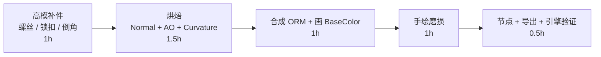
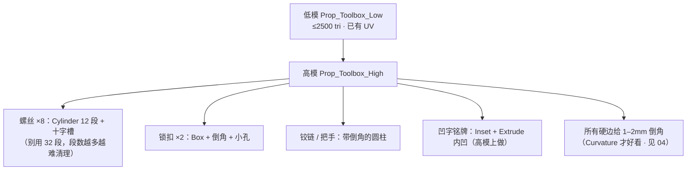
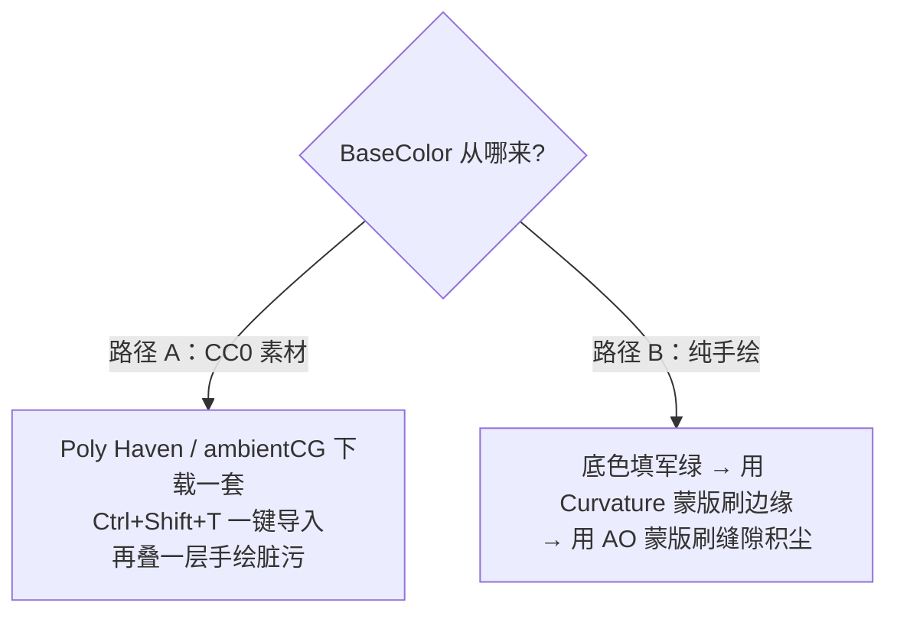
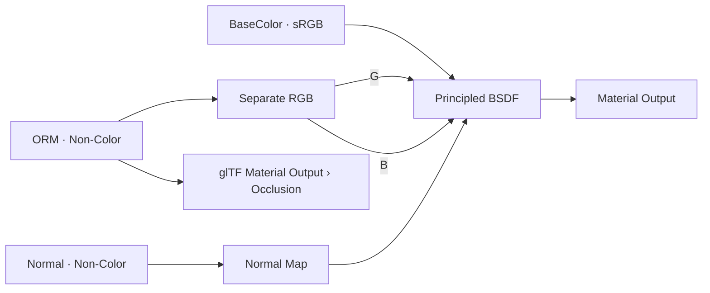

# 07 · 练习项目：工具箱完整 PBR（验收项目）

> 一句话：**这是 Stage 4 的验收项目——目标是「导出 GLB 进引擎，和 Blender 里长得一样」。做到一半不算数。**
> 依据：本目录 01–06 六篇；预算与命名见 [`../07-资产规范与引擎导出/笔记.md`](../07-资产规范与引擎导出/笔记.md)。

---

## 一、目标与预算

| 项 | 目标 |
| -- | ---- |
| 资产 | Stage 1 做的工具箱（带把手、锁扣、可分离盖子） |
| 真实尺寸 | **0.40 × 0.25 × 0.20 m**（400 × 250 × 200 mm） |
| 低模面数 | **≤ 2,500 tri** |
| 高模面数 | 不限（练习用 20k–50k 足够，别真去建 500 万面） |
| 材质数 | **1 个**（进阶可试 2 个） |
| 贴图 | 1024（若当近景主角道具则 2048），**4 张** |
| 总工时 | 约 5h |



---

## 二、Step 1 · 高模补件（把细节做成「高模」，不给低模加面）



| 规则 | 说明 |
| ---- | ---- |
| 高模可以随便糙 | 三角、n-gon、重叠都行——它只是"信息来源" |
| 但**必须有倒角** | 完全硬边的话 Pointiness 值突变，曲率图会有刀切口 |
| 螺丝别做成独立物体 | 不要进最终低模；全靠 Normal 贴图假造 |
| 高模与低模**完全重合** | 位置、朝向一致，两边都 `Ctrl+A → Scale` |

---

## 三、Step 2 · 材质与贴图规划

**一个材质槽，四张图。** 金属件与漆面靠贴图分区（材质 ID 思路），不靠多个材质球。

| 图 | 内容 | 色彩空间 |
| -- | ---- | -------- |
| `Prop_Toolbox_01_BaseColor.png` | 军绿漆 + 金属件的反射色 | **sRGB** |
| `Prop_Toolbox_01_Normal.png` | 螺丝 / 锁扣 / 倒角高光 | Non-Color |
| `Prop_Toolbox_01_ORM.png` | R=AO、G=Roughness、B=Metallic | Non-Color |
| `Prop_Toolbox_01_Curvature.png` | 中间产物（**不进引擎**） | Non-Color |

### 3.1 材质分区与数值（照 01 的数值表给）

| 区域 | Metallic | Roughness | Base Color（sRGB） |
| ---- | -------- | --------- | ------------------ |
| 箱体喷漆 | **0** | 0.45 | 军绿 ≈ 0.25–0.30（如 `#4A5240`） |
| 锁扣 / 铰链（钢） | **1** | 0.30 | 0.72–0.78 灰 |
| 把手（磨砂铝） | **1** | 0.50 | 0.85–0.92 灰 |
| 磨损露底处 | 0.6–0.8（过渡） | 0.65–0.8 | 比漆更亮的灰 |

> 灰度换算：Roughness 0.45 → 8bit 值 ≈ **115**；0.30 → **77**；0.50 → **128**。Metallic 用纯 0 或 255。

---

## 四、Step 3 · UV 复查（Stage 3 的产物）

- [ ] 无重叠（烘焙光照/法线前提下必清）
- [ ] 岛间距 ≥ 8px（1024 时）
- [ ] 棋盘格检查无明显拉伸
- [ ] **倒角边与缝合边对齐**（避免法线接缝，见 Stage 3）

---

## 五、Step 4 · 烘焙（照 05 的流程走）

| 图 | Bake Type | 关键参数 |
| -- | --------- | -------- |
| **Normal** | `Normal` | Selected to Active ✅ · Space=Tangent · Swizzle +X/+Y/+Z · Max Ray Distance **0.02 起二分试** · Margin 16 |
| **AO** | `Ambient Occlusion` | Selected to Active ✅ · Samples **256**（有噪点加到 512） |
| **Curvature** | `Emit` | 高模临时材质：Pointiness → ColorRamp → Emission（Strength=1） |

```text
选择顺序：先点 High → Shift 点 Low（Low=active）
每次烘焙前：在 Shader Editor 里点选目标 Image Texture 节点
每次烘焙后：Image Editor → Alt+S 立刻存盘
```

- [ ] Normal 图平坦区是淡紫蓝（128,128,255）
- [ ] 无黑块、无串面
- [ ] 三张图都已存盘

---

## 六、Step 5 · 合成 ORM（照 02 的 Compositor 方法）

```text
R ← AO（烘焙）
G ← Roughness 图（手绘/合成：底 115，锁扣 77，把手 128，磨损 179）
B ← Metallic 图（底 0，锁扣与把手 255，磨损处 150–200）
```

| 检查 | 说明 |
| ---- | ---- |
| File Output 的 Color Space | **必须设 Non-Color**（默认 Follow Scene 会按 sRGB 编码） |
| 三张源图分辨率 | 都是 1024 |
| 合成结果 | 看起来"花花绿绿"是正常的（数据图） |

---

## 七、Step 6 · BaseColor

**两条路，选一条：**



> ⚠️ **BaseColor 里绝对不能有阴影和 AO**（01 与 02 都强调过）。素材图的 AO 版不要用；如果下载的图自带明暗，先在图像软件里压平。

---

## 八、Step 7 · 手绘磨损（照 06 的蒙版技法）

1. `Curvature` 图设为 **Texture Mask** → 只在凸起/边缘能画上 → 在 BaseColor 上刷浅灰（掉漆）
2. 同步在 **Roughness** 上刷（掉漆处更粗糙，值 179 左右）
3. `AO` 图设为 Texture Mask（反转）→ 只在缝隙能画上 → 刷深色（积尘）
4. 用 **Soften** 笔刷把生硬的边缘揉开
5. 转视角检查：痕迹是否跟着形体走

---

## 九、Step 8 · 节点树 + 导出准备



| 检查 | 说明 |
| ---- | ---- |
| 色彩空间审计 | 逐个节点点一遍：只有 BaseColor 是 sRGB |
| AO 已接 | `glTF Material Output` 节点组的 `Occlusion` 输入（Blender 里看不到效果属正常） |
| 无 Blender 专有节点 | 树里没有 Mix Shader / Mix RGB / Math / 程序化纹理 |
| 材质槽 | 1 个 |
| 贴图存盘 | 3 张（BaseColor / Normal / ORM）都在磁盘上 |

---

## 十、Step 9 · 导出 GLB 并验证

```text
File → Export → glTF 2.0 (.glb)
Format:            glTF Binary (.glb)
Include:           Selected Objects ✅
Apply Modifiers:   ON ✅
Transform:         +Y Up ON ✅
Geometry:          UVs ON · Normals ON · Tangents OFF
Compression:       按需（Draco 需确认引擎支持）
```

**验证清单**（引擎里逐项打勾，参照 03 的排查表）：

| # | 检查项 | 通过 |
| - | ------ | ---- |
| ① | 颜色与 Blender Material Preview 一致 | ⬜ |
| ② | 螺丝、锁扣的凹凸方向正确（凸是凸） | ⬜ |
| ③ | 金属件有金属感、漆面不反光过度 | ⬜ |
| ④ | 缝隙有 AO 暗角 | ⬜ |
| ⑤ | 材质数量 = 1 | ⬜ |
| ⑥ | 贴图 3 张都在（无丢失） | ⬜ |
| ⑦ | 面数 ≤ 2500 tri | ⬜ |
| ⑧ | 尺寸 0.4 × 0.25 × 0.2 m（UE5 记得 Import Scale = 100） | ⬜ |

---

## 十一、产出物清单

```text
资产/练习文件/05-材质PBR与烘焙/
├── Prop_Toolbox.blend              （含 High / Low 两个网格）
├── textures/
│   ├── Prop_Toolbox_01_BaseColor.png   1024 · sRGB
│   ├── Prop_Toolbox_01_Normal.png      1024 · Non-Color
│   ├── Prop_Toolbox_01_ORM.png         1024 · Non-Color
│   └── Prop_Toolbox_01_Curvature.png   1024 · 中间产物
└── shots/
    ├── blender_material_preview.png    （Blender 截图）
    ├── engine_check.png                （引擎截图）
    └── textures_flat.png               （三张贴图平铺）
```

---

## 十二、坑（这个项目上特有的）

- ❌ **忘记删高模 / 参考图就导出** → 引擎里出现一个巨大的重叠网格 → 导出前 `Limit to Selected Objects`
- ❌ **螺丝做进低模** → 面数瞬间超预算 → 做成高模烤 Normal
- ❌ **下载的素材自带明暗** 直接当 Albedo → 引擎里双层阴影，脏得洗不掉
- ❌ **只画了掉漆的颜色没改 Roughness** → 看起来像贴纸
- ❌ **Metallic 图给了渐变灰** → 引擎里出现"半金属"的怪异反光 → 用纯黑白遮罩（磨损过渡区除外）
- ❌ **忘了接 `glTF Material Output`** → 引擎里完全没有 AO，还以为烘焙失败了
- ❌ **贴图没存盘就导出** → GLB 导出成功但材质全白，且不报错

---

## 十三、自检（全部打勾才算 Stage 4 完成）

| # | 自检点 | 通过标准 |
| - | ------ | -------- |
| ① | 数值 | 报出箱体 / 锁扣 / 把手三处的 Metallic + Roughness，并说出依据 |
| ② | 烘焙 | Normal 图无黑块；能说出你最终用的 Ray Distance 是多少、怎么试出来的 |
| ③ | ORM | 说出三个通道各是什么；能解释为什么图看起来是彩色的 |
| ④ | 兼容性 | 节点树里没有任何导出器不认的节点 |
| ⑤ | 手绘 | 能演示用 Curvature 当蒙版刷边缘掉漆 |
| ⑥ | 闭环 | **引擎里的截图与 Blender 并排对比通过，8 项验证全绿** |

---

> **下一步**：回到 [`笔记.md`](笔记.md) 做阶段验收与复盘。
> 这个项目做完，你手上就有了一个**真正完整的游戏资产**——几何、UV、贴图、引擎验证全过一遍。Stage 5 的有机资产只是把「高模」换成雕刻出来的模型，烘焙与材质这一段 100% 复用。
