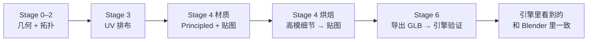
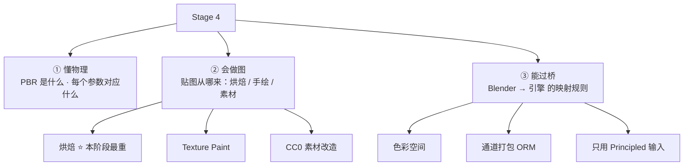
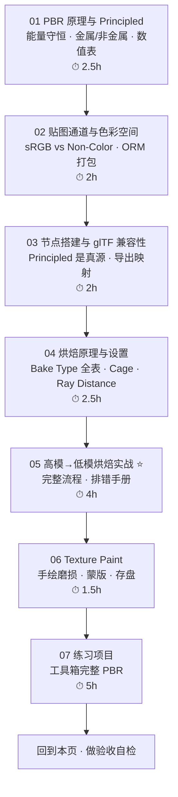
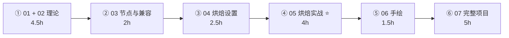

# Stage 4 · 材质 / PBR / 烘焙（15–20h）

> **一句话目标**：做出引擎能原样吃进去的 PBR 材质，而不是只有 Blender 里好看的节点。
> 状态：⬜ 未开始　|　开工：　　　|　完成：
> 环境：**Blender 5.2 LTS** · macOS　|　前置：`04-UV与贴图坐标` 必须先做完（**烘焙的前提是低模有干净 UV**）、`02-硬表面建模工作流` 的道具拿来做练习

---

## 0. ⚠️ 先订正：路线图 Stage 4 有 7 处说法需要按 5.x 改

照着路线图学之前先看这张表。这个阶段是「Blender 里好看」和「引擎里正确」分家的地方，错一条就要返工一整轮烘焙。

| # | 路线图的说法 | **5.x 的实际情况** | 依据 |
| - | ------------ | ------------------ | ---- |
| 1 | 烘焙「Normal / AO / **Curvature**」 | **Blender 没有 Curvature 烘焙类型**。官方 Bake Type 只有：Combined / Ambient Occlusion / Shadow / Position / Normal / UV / Roughness / Emit / Environment / Diffuse / Glossy / Transmission。Curvature 要自己做：`Geometry → Pointiness`（或 Bevel 节点）→ ColorRamp → Emission，再烘焙 **Emit** | 官方手册 5.2 · Render Baking（Bake Type 全表） |
| 2 | 烘焙设置里的 `Extrusion 0.02–0.05` | 名字要分情况：**不勾 Cage 时叫 Max Ray Distance，勾了 Cage 才是 Cage Extrusion**。数值也不能背——它取决于你的场景尺度（米制下 0.02–0.05 只是「1 米级道具」的经验值），判断标准是「有没有射线打不中的黑块」 | 官方手册 Selected to Active 段 |
| 3 | 只说「烘焙 AO」，没说 AO 怎么进引擎 | **Principled BSDF 没有 AO 输入**，Blender 里也没有任何节点排布能让 AO 按 glTF 的方式生效。要导出 AO，必须接一个名为 `glTF Material Output` 的自定义节点组的 **Occlusion** 输入；或者干脆把 AO 打进 ORM 贴图的 R 通道 | 官方手册 glTF 2.0（5.1）· Baked Ambient Occlusion |
| 4 | 「材质没有 Blender 专有节点（Mix Shader 之类引擎不认）」 | 方向对，说法不准。glTF 导出器的**唯一真源是 Principled BSDF 的 Base Color / Metallic / Roughness / Normal / Emission 输入**；`Mix Shader` 会被忽略是小事，**`Mix RGB / Math / ColorRamp` 这类数据节点同样不会被导出**——比如用 Mix RGB 把 AO 乘进 Base Color，Blender 里很好看，导出就全丢。要乘就乘进贴图文件 | 官方手册 glTF 2.0 · Exported Materials |
| 5 | Metallic、Roughness 各给一张贴图 | glTF 规定 **metallic 存 B 通道、roughness 存 G 通道，且鼓励共用同一张图**。不按这个排布，导出器会「尝试适配」（导出变慢，还容易出错）。正确做法：一张 ORM 图 → `Separate RGB` → G 接 Roughness、B 接 Metallic | 官方手册 glTF 2.0 · Metallic and Roughness |
| 6 | （没提）烘焙目标的行为变了 | **5.0 起只烘焙到「选中且激活」的那张 Image Texture 节点**；材质里没有选中激活的图像节点 → 这个材质什么都不烤（老教程里「放三个节点挨个烤」的做法在 5.x 会全部烤进同一张）。每次烘焙前记得在 Shader Editor 里点一下目标节点 | 官方手册 Output › Target；Blender 5.0 Release Notes（Bake only to selected and active images） |
| 7 | Principled BSDF 的 Specular 输入 | 5.x 的 Principled 已改为基于 **OpenPBR Surface** 模型，老教程里的 `Specular = 0.5` 现在叫 **`Specular › IOR Level`（0.5 = 不调整，0 = 无反射，1 = 双倍）**；另外多了 Coat IOR/Tint、Sheen、Thin Film、Diffuse Roughness 等。看 3.x/4.0 之前的教程时参数名会对不上 | 官方手册 5.2 · Principled BSDF；Blender 4.0 Release Notes |

> 📌 第 1、3、5、6 条建议同步回 `Blender学习路线图.md`（Stage 4 必学清单第 244 行附近）；第 3、4、6 条同步回 [`速查/常见坑汇总.md`](../速查/常见坑汇总.md) 的「材质 / 烘焙」段。
>
> 📌 通用兜底：**快捷键按不出来或菜单对不上，一律按 `F3` 搜命令名**，不要死记位置。

---

## 1. 本阶段在解决什么问题

Stage 0–3 你做出的是一个「几何正确、拓扑干净、UV 不重叠」的**灰模**。它离「资产」还差最后一层：表面长什么样、进引擎后还认不认。

本阶段其实是**三件事叠在一起**，很多人只做了第一件就以为完事了：

> **③ 是绝大多数人的失分点**：贴图做得再好，色彩空间设错、AO 没接出去、用了引擎不认的节点，进引擎就全废。**每次做完都要真的导出一次 GLB 看一眼**。

---

## 2. 学习路径（按顺序走完就是闭环）

| # | 文件 | 核心问题 | 预估 |
| - | ---- | -------- | ---- |
| 01 | [`01-PBR原理与Principled-BSDF全解.md`](01-PBR原理与Principled-BSDF全解.md) | 每个参数到底在控制什么物理量 | 2.5h |
| 02 | [`02-贴图通道-色彩空间与ORM打包.md`](02-贴图通道-色彩空间与ORM打包.md) | 哪些图必须 Non-Color、怎么打成一包 | 2h |
| 03 | [`03-节点搭建与glTF兼容性.md`](03-节点搭建与glTF兼容性.md) | 什么节点能过桥、什么节点会丢 | 2h |
| 04 | [`04-烘焙原理与Cycles烘焙设置.md`](04-烘焙原理与Cycles烘焙设置.md) | 12 种 Bake Type、Cage、Ray Distance 怎么调 | 2.5h |
| 05 | [`05-高模到低模烘焙实战与排错.md`](05-高模到低模烘焙实战与排错.md) | 完整烤一遍 + 烤坏了怎么救 | 4h |
| 06 | [`06-Texture-Paint与手绘细节.md`](06-Texture-Paint与手绘细节.md) | 手绘加脏污/磨损，以及存盘 | 1.5h |
| 07 | [`07-练习项目-工具箱完整PBR.md`](07-练习项目-工具箱完整PBR.md) | 把上面 6 篇用一遍 | 5h |

> 合计约 **19.5h**，落在路线图 15–20h 区间内。
> **04 + 05 不要压缩**（合计 6.5h）：烘焙是这个阶段唯一「做错了要整个重来」的环节。
> **02 和 03 可以合并一个晚上**：它们都是「过桥规则」，读一遍 + 实操验证一次就够。
> **01 别跳**：PBR 值给错（比如金属 roughness 给 0.8）比拓扑烂更毁观感，而且没人会提醒你。

---

## 3. 必学清单

> 判断标准不是「我看过了」，而是「不看教程能当场做出来 / 说出来」。每条后面标了出处。

### 模块 1 · PBR 原理与 Principled（[01](01-PBR原理与Principled-BSDF全解.md)）

- [ ] 说出 **金属 / 非金属** 的两个核心区别（漫反射有无、Base Color 的含义）
- [ ] 说出 `Metallic` 为什么应该**几乎总是 0 或 1**，中间值的物理意义是什么
- [ ] 报出 5 组常用材质的 Roughness 参考值（见 01 的数值表）
- [ ] 说出 Base Color 的亮度禁区（金属 0.75–1.0 / 非金属 0.02–0.25 之类）
- [ ] **5.x 参数名对得上**：`Specular › IOR Level`（老教程的 Specular）、`Coat Weight`、`Emission Color/Strength`
- [ ] 知道 Principled 现基于 **OpenPBR Surface**，与 Substance/引擎的命名可对齐

### 模块 2 · 贴图通道与色彩空间（[02](02-贴图通道-色彩空间与ORM打包.md)）

- [ ] 一张表说清每个通道存什么：BaseColor / Normal / Roughness / Metallic / AO / Height
- [ ] **色彩空间铁律**：Color 类 = `sRGB`，数据类 = `Non-Color`（含 Normal / Rough / Metal / AO / ORM / Height）
- [ ] 会做一次「色彩空间审计」：逐个 Image Texture 节点检查，零遗漏
- [ ] 会把 AO / Roughness / Metallic 合成一张 **ORM**（R=AO、G=Rough、B=Metal）
- [ ] 贴图分辨率决策：按「最坏情况下占屏幕多少像素」给 512 / 1024 / 2048
- [ ] 命名规范：`Prop_<名称>_<变体>_<通道>`（后缀要跟 Node Wrangler 的 tag 对齐）

### 模块 3 · 节点搭建与 glTF 兼容性（[03](03-节点搭建与glTF兼容性.md)）

- [ ] 搭出标准 PBR 节点树：Image → (Separate RGB) → Principled；Normal 图必须过 **Normal Map 节点**
- [ ] 说出 glTF 导出器**认哪些输入**：Base Color / Metallic / Roughness / Normal / Emission / Alpha
- [ ] 说出**不认哪些**：Mix Shader、Add Shader（仅 Emission 特例）、Mix RGB、Math、ColorRamp、程序化纹理
- [ ] 会用 `glTF Material Output` 节点组把 **AO 导出去**（需先开 Shader Editor Add-ons 才能从菜单加）
- [ ] Node Wrangler 三件套：`Ctrl+Shift+LMB` 预览 / `Ctrl+Shift+T` 一键 PBR 贴图组 / `Ctrl+T` 加坐标
- [ ] 材质数量控制：一个道具 1–2 个材质槽，说出「一个材质 ≈ 一次 draw call」的代价

### 模块 4 · 烘焙原理与设置（[04](04-烘焙原理与Cycles烘焙设置.md)）

- [ ] 说出烘焙的本质：**把「表面某点的属性」按 UV 采样写进像素**
- [ ] 说出 12 种 Bake Type 各自烤什么，以及你常用的 4 种（Normal / AO / Emit / Roughness）
- [ ] 说清 **Cage / Cage Extrusion / Max Ray Distance** 的关系（什么时候用哪个）
- [ ] 知道 `Selected to Active` 的选择顺序：**先高模，Shift 加选低模（低模是 active）**
- [ ] 知道 5.0 起 **Target = Image Textures 且必须是「选中 + 激活」的节点**
- [ ] 会调 **Margin**（Type 与 Size）解决接缝溢出
- [ ] 知道 `Bake from Multires` 在 5.0 的增强（矢量位移 / n-gon / 只烤选中图像）

### 模块 5 · 高模 → 低模实战与排错（[05](05-高模到低模烘焙实战与排错.md)）⭐

- [ ] 走完一遍完整流程（对齐 → 检查 → 建图 → 烤 → 存盘）不看教程
- [ ] 烘焙前 8 项检查能背出来
- [ ] 见到「全黑 / 花斑 / 错位 / 接缝 / 反了」五种症状，各能说出 2 个以上排查方向
- [ ] 会做手工 Cage（复制低模 → 沿法线膨胀 → 设成 Cage Object）
- [ ] **Curvature 会用 Emit + Pointiness 烤出来**
- [ ] 烘焙完立刻存盘（Image Editor → `Alt+S`），养成肌肉记忆

### 模块 6 · Texture Paint（[06](06-Texture-Paint与手绘细节.md)）

- [ ] 切到 Texture Paint 模式，能在指定贴图上画
- [ ] 会用 **Stencil / Texture Mask** 做印章式图案（文字、标记）
- [ ] 会用烘焙出来的 **AO / Curvature 当蒙版**刷积尘与边缘磨损
- [ ] 知道手绘的定位：**加细节，不是造基础材质**
- [ ] 画完存盘

### 模块 7 · 练习（[07](07-练习项目-工具箱完整PBR.md)）

- [ ] 工具箱有完整 4 张图：BaseColor / Normal / ORM（+ 可选 AO）
- [ ] 高模细节（螺丝、锁扣、凹字）已烤进 Normal，且不加面数
- [ ] 导出 GLB 并在引擎里看过，视觉与 Blender 一致

---

## 4. 时间怎么切（15–20h 拆成 6 段）

| 段 | 内容 | 产出 |
| - | ---- | ---- |
| ① | 读 01 + 02：PBR 数值表 + 色彩空间 + ORM | 一张自己抄的「材质数值速查表」+ 一套命名规范 |
| ② | 读 03：搭标准节点树，用 Node Wrangler 导入一套 CC0 材质 | 一个「引擎兼容」的节点树截图 |
| ③ | 读 04：12 种 Bake Type 扫一遍，重点练 Normal 与 AO | 同一模型用不同 Ray Distance 烤出的对比图 |
| ④ | 读 05 + 实战：木箱或工具箱烤一遍 Normal + AO + Curvature | 三张烘焙图 + 一份排错记录 |
| ⑤ | 读 06：手绘磨损 | 手绘前后对比 |
| ⑥ | 做 07：工具箱完整 PBR + **导出 GLB 验证** | 完整贴图组 + 引擎截图 |

> 单次动手不超过 **45 分钟**。Stage 4 是「等待型」工作——烘焙要等、导出要等，很适合在等待时做复盘笔记，但**不要趁等待去做别的事**：烘焙参数调错时的典型死循环就是「一边等一边开别的窗口，回头忘了自己改过哪个值」。

---

## 5. 练习项目

| # | 项目 | 要点 | 目标 | 完成度 |
| --- | --- | --- | --- | --- |
| 1 | **木箱 PBR**（热身） | 一套 CC0 木纹贴图接上 + 色彩空间检查 + 导出验证 | 1024，1 个材质 | ⬜ |
| 2 | **高模 → 低模烘焙** | 螺丝/锁扣做高模，烤进低模的 Normal + AO + Curvature | Normal 无黑块 | ⬜ |
| 3 | **工具箱完整 PBR**（验收项目） | 4 张图 + 手绘磨损 + 导出 GLB 进引擎 | ≤2500 tri，1024/2048 | ⬜ |

> 详细参数、步骤、「做崩了怎么救」见 [`07-练习项目-工具箱完整PBR.md`](07-练习项目-工具箱完整PBR.md)。
> 文件存到 `../资产/练习文件/05-材质PBR与烘焙/`，贴图命名用 `Prop_<名称>_<变体>_<通道>`（规范见 02）。

---

## 6. 验收标准（可判定，不是感觉）

- [ ] 材质只有 Principled BSDF + 贴图，**无任何需要引擎计算的 Blender 节点**
- [ ] 所有 Image Texture 节点的 Color Space 审计通过（Color = sRGB，其余 = Non-Color）
- [ ] 导入引擎后视觉与 Blender 里基本一致（高光、法线方向、明暗都对）
- [ ] **贴图已全部存盘**（烘焙完不存会丢！重开 .blend 就是黑图）
- [ ] 材质数量 ≤ 2（道具）
- [ ] 导出 GLB → 引擎 → 截图，与 Blender 视口并排对比过

### 6 条自检（全部通过才算 Stage 4 完成）

| # | 自检点 | 怎么判定 |
| - | ------ | -------- |
| ① | 数值可信 | 报出「磨砂钢 / 旧木 / 哑光漆 / 黄铜」四组 Metallic + Roughness，并说出依据 |
| ② | 色彩空间 | 给一个材质，30 秒内找出所有设错的 Color Space 节点 |
| ③ | 通道打包 | 说出 ORM 三个通道各存什么，并说出 glTF 里 `Separate RGB` 该怎么接 |
| ④ | 烘焙会收尾 | **实操**：给一个高/低模，不看教程烤出无黑块的 Normal + AO，并立刻存盘 |
| ⑤ | 排错 | 给一张「满地黑斑的 Normal 图」，说出 ≥3 个可能原因及对应排查动作 |
| ⑥ | 闭环 | 工具箱导出 GLB 进引擎，法线方向、金属感、AO 都对，无丢贴图 |

---

## 7. 常见坑

> 前三条是路线图原有的（第 1 条已按 5.x 补充），后面是本阶段新增的。够通用的坑同步到 [`速查/常见坑汇总.md`](../速查/常见坑汇总.md)。

- ❌ **Normal 贴图设成 sRGB** → 光照全错。**Non-Color，再说一遍**
- ❌ **烘焙前没 Apply Scale / 没清重叠 UV** → 出一堆黑块
- ❌ **一个道具 8 个材质** → 8 次 draw call，性能直接崩
- ❌ **5.x 起没选中目标 Image Texture 节点就点 Bake** → 什么都没烤，还以为成功了（手册：Target = Image Textures，只烤「active and selected」）
- ❌ **选择顺序搞反**（先选低模再选高模）→ active 是高模，射线从高模往里打，结果全错 → **先高模，Shift 加选低模**
- ❌ **高模被隐藏了**（视口或渲染里隐藏）→ 不参与烘焙 → 烤出来是低模自己的形状，明明没错却"没细节"
- ❌ **Ray Distance 给太大** → 射线穿过一堆面，细节糊成一团；**给太小** → 打不到高模，出黑块 → 从 0.02 起二分试
- ❌ **以为有 Curvature 烘焙类型** → 翻遍下拉框也找不到 → 用 `Emit` + `Pointiness`
- ❌ **用 Mix RGB 把 AO 乘进 Base Color 就完事** → Blender 里好看，导出全丢 → 要乘就乘进贴图文件（或进引擎再乘）
- ❌ **AO 没接 `glTF Material Output`** → 引擎里完全没有 AO → 白烤
- ❌ **Normal 图直接插 Principled 的 Normal 输入，中间没过 Normal Map 节点** → 凹凸全错
- ❌ **Swizzle 乱改** → 法线方向反了（凹凸变凸起）。Blender 默认 `+X / +Y / +Z` 就是 glTF / Unity / UE / Godot 通用的 OpenGL 约定，**不要动**；只有明确要 DirectX 才把 G 改成 `-Y`
- ❌ **Margin 太小** → UV 接缝处黑边（mipmap 一到就露馅）→ 1024 给 8–16px
- ❌ **烘焙完不存盘** → 关掉 .blend 全丢，且**没有任何报错**
- ❌ **贴图不是 PNG/JPEG** → glTF 要求 PNG 或 JPEG，其他格式导出时会被自动转换（导出变慢）

---

## 8. 资源

- **主资源 1**：官方手册 5.2 · [Render Baking](https://docs.blender.org/manual/en/latest/render/cycles/baking.html) —— 烘焙参数的唯一权威，第 4、5 节就是要把它读薄
- **主资源 2**：官方手册 5.2 · [Principled BSDF](https://docs.blender.org/manual/en/latest/render/shader_nodes/shader/principled.html) —— 参数含义与 OpenPBR 分层
- **主资源 3**：官方手册 · [glTF 2.0 导出](https://docs.blender.org/manual/en/latest/addons/import_export/scene_gltf2.html) —— 「Blender → 引擎」的过桥规则，第 3 节基本是它的翻译
- YouTube · **Grant Abbitt**「Node School: Materials」（免费）
- YouTube · **SouthernShotty**「How PROS Texture: 3 Easy Methods」（免费）
- 免费素材：Poly Haven（CC0 贴图 / HDRI）、ambientCG（CC0 PBR 材质）
- 付费：GameDev.tv · *Blender Environment Artist*（Grant Abbitt + Rick Davidson，14.5h，适配 5.1，评分 4.7+）

> 本阶段**只允许 1–2 个主资源**（路线图第 7 节防弃坑规则）。建议：官方手册 + 一门课。

---

## 我的记录

### ____-__-__ · 第 __ 次练习

- **练了什么**：
- **卡点**：
- **怎么解决的**：
- **下次要注意**：

---

## 阶段复盘

1. 学会了什么（3 条以内，用自己的话）：
2. 踩过的坑（≥3 条；够通用的同步到 `速查/常见坑汇总.md`）：
3. 还差什么（Stage 5 要补的）：
4. 产出物清单（文件路径 + 贴图清单 + 引擎截图）：

---

> **下一步**：Stage 5 有机资产（[`../06-有机资产雕刻与重拓扑/笔记.md`](../06-有机资产雕刻与重拓扑/笔记.md)）。
> 本阶段留下的最重要的一条肌肉记忆是：**烘焙完立刻存盘，导出完立刻验证**——这两步省下来的不是时间，是「以为做完了结果发现全丢」的那种崩溃。Stage 5 的高模→低模烘焙会 100% 复用本阶段的第 4、5 篇，烤熟了再走。
