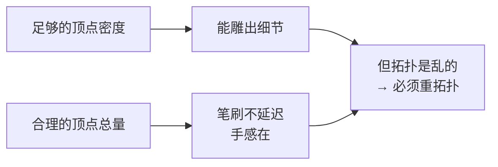
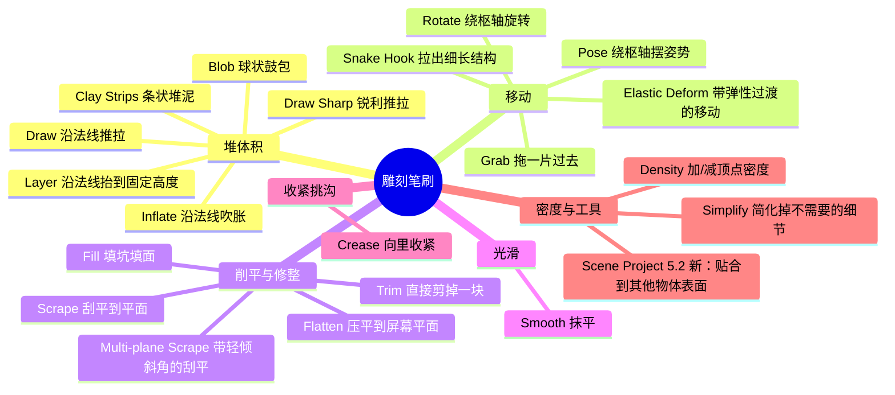
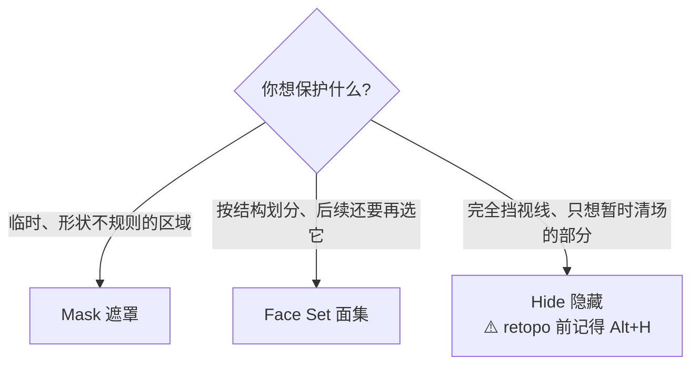

# 01 · 雕刻模式全解：笔刷、对称、保护区域与 5.x 行为变化

> 对应：[`笔记.md`](笔记.md) 模块 1　|　⏱ 约 3h
> 目标：把「工具架上四十个笔刷」压缩成**六类按作用记**，并搞清楚 5.x 改了哪些行为。

---

## 1.1 雕刻模式到底在干什么

一句话：**雕刻 = 按笔刷形状位移顶点**。仅此而已。

这个定义推出三条铁律：

| 推论 | 含义 |
| --- | --- |
| 顶点不够 → 雕不出细节 | 一个 8 顶点的 Cube，再怎么雕也是块橡皮。这就是马上要用 **Voxel Remesh** 补密度的原因（见 [02](02-自适应雕刻三选一-VoxelRemesh-Dyntopo-Multires.md)） |
| 顶点太多 → 卡 | 50 万顶点上一笔一笔拉，笔刷延迟会让手感完全消失。所以必须有**分级控制顶点密度的策略**——同样见 02 |
| 它会移动顶点，但**不会自动整理拓扑** | 雕塑的结果永远不可能直接进引擎，这是 Stage 5 存在的原因 |

---

## 1.2 进雕刻模式前必须先做的两件事

### ① `Ctrl+A → Rotation & Scale`（Object Mode）

**为什么比硬表面更致命**：笔刷的作用范围是**物体局部空间里的圆**。如果 Object Scale 不是 `(1,1,1)`，这个圆在视口里就会被拉伸成椭圆，你完全对不准要改的地方；左右两侧对称的物体，会发现「左边雕得动、右边雕不动」这种鬼故事。

> Stage 0 的老规矩在这里升级成了硬要求：**动雕刻之前必 Apply**。

### ② 决定「哪些地方不许动」——一开始就想好

- 对称的部分 → 开 **Symmetry**（下一节）
- 保持不动的部分 → **Mask / Face Set**
- 遮挡视线的部分 → **Hide**

雕刻是个很「粘」的操作：笔刷过去一片都受影响。先画好保护区，比事后补救省一半时间。

---

## 1.3 四十个笔刷怎么记：按「作用」分成六类

不要按名字背。按「它对顶点做了什么」分类，一共六类：

更实用的做法——**只先练熟这 6 个**：

| 笔刷 | 作用与与其他笔刷的区别 | 典型误用 |
| --- | --- | --- |
| **Draw** | 沿法线方向推拉，最基本的加减体积 | 强度给太大→石膏手感。0.3–0.5 起步 |
| **Clay Strips** | 条状堆泥，一边推一边压平，**快速建立体积感**，雕刻起手式 | ⚠️ 5.2 起**不再强制开启 Rake 旋转**（1320c2b539）——老教程里「它会自动跟着笔画转向」的行为现在不默认发生 |
| **Grab** | 拖着一大片顶点移动，**改大比例（整体体块）**用 | 拿 Grab 去抠细节 → 又慢边缘又糊；细节交给 Draw |
| **Smooth** | 抹平。在整个雕刻流程里它用到的时间不少于 Draw | 只用 Smooth 不用 Scrape→表面越来越糊 |
| **Crease** | **把顶点向内收紧**，形成一道沟或一道棱 | ❌ 最大误解：以为它是「划一条线」。它是**收紧**，不是画线 |
| **Scrape** | 沿**屏幕平面**（或锁定轴）把不平的地方刮平，岩石断面、机械断面都靠它 | 把它当橡皮擦用——一路刮过去会把本来想要的起伏也抹平 |

> 练法：拿一个 Cube → `Shift+A` 后再按 **`F` 调小笔刷** → 依次用这 6 个笔刷在同一个地方各画两笔，直接看差别。**这一个动作比看一小时教程有用。**

剩下的笔刷用到时再查：

- `Snake Hook` —— 拉出细长结构（触手、枝干、布料褶皱的边）
- `Elastic Deform` —— 比 Grab 更「软」的移动，边缘会自然过渡
- `Inflate` / `Blob` —— 鼓包
- `Layer` —— 把所有顶点沿法线抬/压到固定「高度层」，把某一片推成同一个「高度层」很好用
- `Fill` / `Flatten` —— 填坑 / 压平
- `Multi-plane Scrape` —— Scrape 带一個可以调的倾角，做「带一定斜坡的平面」
- `Trim`（Box / Lasso / Line Project 等手势工具）—— **直接剪掉一块**，对起型非常快
- `Density` / `Simplify` —— 加/减局部顶点密度
- `Pose` / `Rotate` —— 需要**整体摆动某个部位**时用（与 Grab 的区别：它们绕一个枢轴转，而不是平移）
- **`Scene Project`（5.2 新增）** —— 把当前物体顶点推向场景中**其他物体**的表面，效果类似给网格加了个 Shrinkwrap。典型用法：把一块布料贴到角色身体或地形表面上

---

## 1.4 对称 Symmetry

位置在雕刻模式 Sidebar（`N`）的 `Symmetry` 面板。

| 设置 | 作用 | 什么时候用 |
| --- | --- | --- |
| `X / Y / Z` | 沿该轴镜像对称——这一侧画一笔，对称侧跟着动 | 生物、上下对称的道具 |
| `Tile Offset X/Y/Z` | 让笔刷作用**平移一个单位**后再施加一次（不是镜像） | 做环绕/重复结构。**入门阶段用不到，别去碰** |
| `Radial`（径向对称） | 绕 Z 轴对称 N 次 | 花瓶、海星这类轴对称装饰 |
| `Feathering`（羽化） | 让对称作用在接缝处渐弱 | 开了对称之后接缝处出现一条怪线时打开它 |
| `Lock X/Y/Z` | 锁住某个轴：顶点在该轴上不位移 | 想让某个面保持绝对平面时很好用 |

> ⚠️ **5.0 的行为变化**：① 统一笔刷设置（size / strength / color）**按模式独立**，不再整个场景共享（4434a30d40）——雕刻中调的笔刷大小不会再影响 Texture Paint；② **径向对称存为 mesh 属性而非 scene 属性**（d73b8dd4f3），变成**每个物体各自一份**。老教程说「对称是全场景共用的」已经过期。

> **先决条件**：沿某轴对称的前提是该轴真的对称——物体的**原点要在对称轴上**，且网格在这一半和另一半几何上基本对应。雕歪了才想起开对称，是没有补救的。

---

## 1.5 保护不想被笔刷影响的部分

雕刻的第一原则不是「怎么雕」，是**「怎么别雕到不该雕的地方」**。

| 手段 | 快捷键 / 怎么开 | 特点 |
| --- | --- | --- |
| **Mask（遮罩）** | Mask 笔刷或用 `Mask Gesture` 工具（`Ctrl+LMB` 拖动通常是反向遮罩） | 遮住的部分完全不受笔刷影响。可以 `Invert Mask`、`Clear Mask`、`Blur Mask` |
| **Face Set（面集）** | 各种 Face Set 操作（默认快捷键不全，**用 `F3` 搜 `Face Set`**） | 把网格划分成若干「组」，方便整体选中/隐藏/隔离。做「这个区域单独处理」很舒服 |
| **Hide（隐藏）** | `H` 隐藏选中部分 / `Shift+H` 只显示选中 / `Alt+H` 全部恢复 | 遮挡视线的部分先藏起来。**注意：隐藏的面不会参与部分计算，重拓扑时会遗漏**——retopo 之前必须 `Alt+H` 全部恢复 |

---

## 1.6 ⚠️ 5.x 行为变化清单（跟着老教程学必看）

| # | 变化 | 影响 | 版本 |
| - | ---- | ---- | ---- |
| 1 | **Brush Size 单位从「半径」改成「直径」**（8188dbd246） | ⭐ 最大的一条。照 4.x 教程抄数值，笔刷观感**大一倍**。你的第一反应会是「我手抖」，其实是单位变了 | 5.0 |
| 2 | 统一笔刷设置按**模式**独立（4434a30d40） | 雕刻里调的大小/强度不再串到 Texture Paint | 5.0 |
| 3 | 径向对称改为 **per-mesh 属性**（d73b8dd4f3） | 每个物体可以有不同的径向对称设置 | 5.0 |
| 4 | 笔刷 size / strength / jitter **支持自定义压感曲线**（5f8311f596） | 有笔的话，这是手感提升最大的一项 | 5.0 |
| 5 | Grab / Snake Hook / Elastic Deform / Pose / Boundary / Thumb / Rotate **不再显示压感开关**（0e2316c2bc） | 老教程让你「关掉 Grab 的压感」，界面上找不到了 | 5.0 |
| 6 | 笔刷与调色板颜色改为**场景线性色彩空间**存储（6aa11a304c） | 用笔刷颜色存非颜色数据的做法需要手动修正 | 5.0 |
| 7 | **Multires 新增 `Conform Base`**（fee064e524） | 见 [02](02-自适应雕刻三选一-VoxelRemesh-Dyntopo-Multires.md) | 5.0 |
| 8 | 形变类的 Undo 数据压缩到**至少小一半**（8536fd1223） | 能存更多撤销步 | 5.0 |
| 9 | 新增 **Scene Project** 笔刷（f08e061cb7） | 见 1.3 | 5.2 |
| 10 | **Sculpt 模式内可直接 Add Primitive**（Cube / Cone / Cylinder / UV Sphere / Icon Sphere）（9c185de6bd） | 不用退出去加基础体了 | 5.2 |
| 11 | **Paint / Clay Strips 不再强制开启 Rake 旋转**（1320c2b539） | Clay Strips 手感与老教程演示不同 | 5.2 |
| 12 | **进入 Dyntopo 不再弹二次确认**（aae0f54d09） | 误触更容易丢 UV / 顶点色 / Face Sets | 5.2 |
| 13 | Color Filter 在 Fill 模式下用**场景统一色**；`Ctrl+X` 可用任意工具填当前色（afc6d7a463） | 顶点色绘制流程更快 | 5.2 |

---

## 1.7 快捷键

> 原则：**先和你已有的 [`00-基础/07-快捷键速查表.md`](../00-基础/07-快捷键速查表.md) 并表看**。一周只新增 3–5 个。记不住的一律 `F3` 搜命令名。

### 雕刻模式专用

| 快捷键 | 作用 |
| ------ | ---- |
| `F` 拖动 | **笔刷大小**（拖拽调大小 + 再点确认） |
| `Shift+F` 拖动 | **笔刷强度** |
| `[` / `]` | 笔刷大小微调（比 `F` 更常用） |
| `X` | **切换正负方向**（凸起 / 凹陷） |
| `Ctrl` 按住 | 临时反向（比如 Draw 临时变成往里推） |
| `Shift` 按住 | 临时切成平滑（边雕边抹，手感非常关键） |
| `R` 拖动 | 设 Voxel / Dyntopo 的 resolution（带交互式网格预览，`Shift` 提精度，按住 `Ctrl` 相对当前值调整） |
| `Ctrl+R` | **执行 Remesh**（Voxel 或 Dyntopo，两者互斥共用这一对快捷键） |
| `Alt+S`（Edit Mode） | Shrink/Fatten：沿法线整体膨胀 / 收缩（**做手工 Cage 用的就是这个**） |

### 从 Edit Mode 继承、重拓扑时天天用

| 快捷键 | 作用 |
| ------ | ---- |
| `Tab` | Object / Edit 模式切换 |
| `1` / `2` / `3` | 顶点 / 边 / 面选择 |
| `H` / `Shift+H` / `Alt+H` | 隐藏 / 只显示选中 / 全部恢复 |
| `Alt+LMB` / `Ctrl+Alt+LMB` | 选 Loop / 选 Ring |
| `G G` | 边滑动 |
| `F` / `F2` | 补面 |
| `Shift+Tab` | 开关吸附（Snapping） |
| `Shift+N` | 重算法线 |
| `M → By Distance` | 合并重叠顶点 |
| `Ctrl+Alt+S` / `Ctrl+S` | Save Incremental / 保存 |

---

## 1.8 常见坑

- ❌ **雕刻前没 Apply Rotation & Scale** → 笔刷是椭圆的、对称侧雕不动
- ❌ **照老教程的笔刷数值** → 5.0 起 Size 是直径，大一倍
- ❌ **顶点密度没给够就开始刻细节** → 雕出来全是糊的，反复 Draw 也没用（这不是手的问题，是拓扑密度不够）
- ❌ **把 Crease 当画笔用「划线」** → 它是向内收紧，划出来的不是线而是沟
- ❌ **全程用 Smooth 修正整体体积** → 形状越来越糊，最后变成一块鹅卵石。轮廓调整要用 Grab，平面要用 Scrape
- ❌ **在还没几个方面把握时就揪细节** → 雕刻唯一的正确顺序是**从大到小**：大体积（Grab / Clay Strips）→ 中等起伏（Draw / Scrape）→ 细节（Crease / 小笔刷 Draw）。反过来做必然返工
- ❌ **隐藏了面忘了恢复就 retopo / 导出** → 隐藏的部分不见了
- ❌ **Dyntopo 开了之后忘了它会丢 UV / 顶点色 / Face Sets** → 见 [02](02-自适应雕刻三选一-VoxelRemesh-Dyntopo-Multires.md)
- ❌ **不开 Save Incremental 就开始雕** → 雕刻是最高频需要「回到十分钟前」的工作，一个不小心就要从头来

---

> **下一篇**：[`02-自适应雕刻三选一-VoxelRemesh-Dyntopo-Multires.md`](02-自适应雕刻三选一-VoxelRemesh-Dyntopo-Multires.md)
> 这一篇解决「怎么动」，下一篇解决最关键的问题——**雕刻需要密度，密度从哪来、以及拿到密度的代价是什么**。那是整个 Stage 5 的分叉点。
