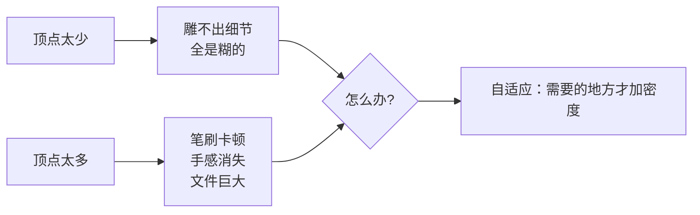
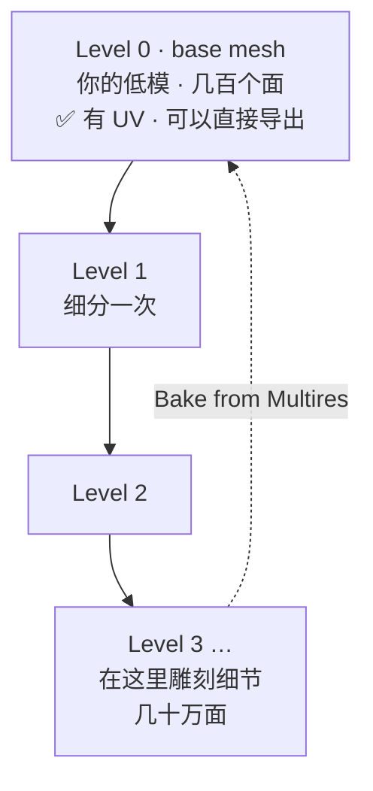
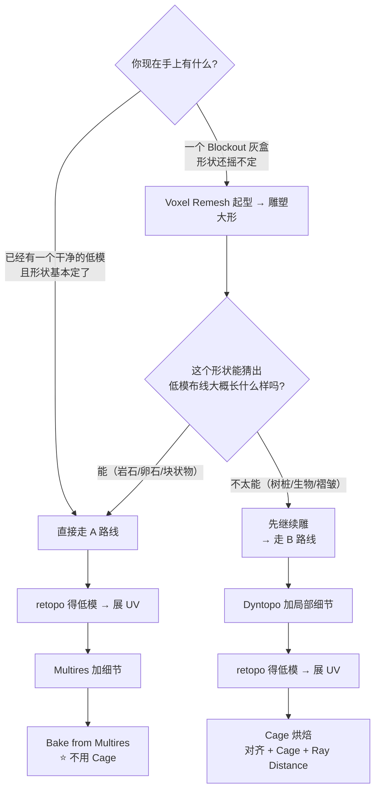

# 02 · 自适应雕刻三选一：Voxel Remesh / Dyntopo / Multires

> 对应：[`笔记.md`](笔记.md) 模块 2　|　⏱ 约 3h
> 目标：拿到「雕刻需要密度，密度从哪来」这个问题的答案，并知道三种方案的**代价各是什么**。
> 官方依据：[Adaptive Resolution 手册](https://docs.blender.org/manual/en/latest/sculpt_paint/sculpting/introduction/adaptive.html)、[Remeshing 手册](https://docs.blender.org/manual/en/latest/modeling/meshes/retopology.html)

---

## 2.1 为什么必须「自适应」

[01](01-雕刻模式全解-笔刷-对称-快捷键.md) 说过：雕刻 = 位移顶点。于是密度是个两难：

**自适应**的意思是：不要在开工前决定整个模型的密度，而是让 Blender **在你下笔的地方**动态提供密度。

Blender 给了三条路，它们不能互换，而且代价完全不同：

| | **Voxel Remesh** | **Dyntopo** | **Multires** |
| --- | --- | --- | --- |
| 一句话 | 一次性把整个网格重建成均匀密度 | 下笔处自动细分，随意加 | 保留一个干净的 base level，往上叠加细分层 |
| 触发方式 | 手动（`Ctrl+R`） | 自动（下笔即加） | 手动预设 Levels，然后雕刻在高层 |
| 典型时机 | **起型 / 推倒重来** | **中途**加局部细节 | 已有干净低模后**分级**加细节 |

---

## 2.2 最关键的一张表：三者各自会毁什么

**这是整个 Stage 5 最值得背下来的一张表。** 顺序错了就白干。

| | Voxel Remesh | Dyntopo | Multires |
| --- | --- | --- | --- |
| UV 图 | ❌ **会丢**（官方：丢失全部 mesh data layers） | ❌ **会丢或损坏** | ✅ 保留（这就是它的价值） |
| 颜色属性（顶点色） | ✅ 保留（需勾 `Attributes`，5.2 起改用插值） | ❌ **会丢或损坏** | ✅ 保留 |
| Face Sets | ✅ 可重投影（勾 `Attributes`） | ❌ **会丢或损坏** | ✅ 保留 |
| Paint Mask | ✅ 可重投影（勾 `Attributes`） | — | ✅ 保留 |
| 需要干净 quad 基础 | 不需要 | 不需要 | ⚠️ **强烈建议** |
| 性能 | 一次性，之后很流畅 | 越雕越慢 | 分级加载，总体最好 |
| 输出能否直接进引擎 | ❌ 均匀网格无走向，不适合 | ❌ 更不适合 | ✅ base level 就是你的低模 |
| 限制 | **不能用于带 Multires 的物体**；要求封闭体积 | **与 Voxel Remesh 互斥** | — |

### 由此推出的三条铁律

1. **UV 一定是最后才做的**。
   Voxel Remesh 和 Dyntopo 都会毁掉 UV，所以**任何展开工作都要排在这两个操作之后**；而且一旦你又按了一次 `Ctrl+R`，之前的 UV 就没了。

2. **顶点色和 Face Sets 也要排在后面。**
   Dyntopo 会毁掉它们。想用顶点色（见 [04](04-有机资产的面数与UV策略.md)），**别开 Dyntopo**。

3. **Multires 是唯一「能保存成果」的方案**，但它要求你手上先有一个干净的四边形网格。这也是为什么会存在「低模优先」的路线（见 2.5）。

---

## 2.3 Voxel Remesh：起型神器

### 怎么用

位置：Sculpt 模式 Sidebar（`N`）→ `Tool` → `Remesh`（Object Mode 里则在 `Properties → Data → Remesh`）。

**快捷键：**
- `R` 拖动 —— 设 voxel size，屏幕上会出现**交互式网格预览**。向中心移 = 变小变密，向外移 = 变大变疏；按 `Shift` 提高微调精度，按住 `Ctrl` 则相对当前值调整。
- `Ctrl+R` —— 执行重生成。

> `R` / `Ctrl+R` 这一对是 Voxel Remesher 与 Dyntopo **共用**的（因为两者互斥），它会作用于当前启用的那个。

### 参数逐个说

| 参数 | 作用 | 怎么给值 |
| --- | --- | --- |
| **Voxel Size** | 每个格子的边长，决定密度 | 看那条**交互式网格**：格子大小 ≈ 你想容忍的最小起伏。可以先按大致目标面数反复试 2–3 次，不要指望一次到位 |
| **Sample Voxel Size** | 在模型上**点一块区域**来自动定出 voxel size | 模型上已有某块区域密度正合适时，用它去配平其他部分 |
| **Adaptivity** | 平坦处自动减面 | ⚠️ **> 0 会引入三角面，并禁用 Fix Poles**。想保留干净四边形就给 0 |
| **Fix Poles** | 花性能减少「极点」数量，让布线更顺 | 打算后续用 quad workflow 时打开 |
| **Preserve Volume** | 尝试保住原有体积 | 默认开。薄壳类模型关掉可能更贴合原形状 |
| **Attributes**（Paint Mask / Face Sets / Color Attributes） | 决定哪些东西重投影到新网格上 | 想保住的都勾上 |

### 已知限制（官方原文，最容易翻车的两条）

> ⚠️ **Remesh 只认原始 mesh data** —— 它会**忽略**由修改器（generative modifiers）、形态键 Shape Keys、绑定 rigging 生成的几何。
> ⚠️ **Mesh 上有 Multiresolution 修改器时，Remesh 直接不可用。**

第三条隐蔽限制：**它要求网格是封闭体积**。有洞，且洞比 voxel size 还大 → 结果会很怪。官方建议先用 Edit Mode 或 `Mask Slice and Fill Holes` 补洞。

### Voxel Remesh 出来的东西为什么不能直接用

它给的是**均匀的、没有走向的**网格。均匀意味着：
- 该省面的平地浪费了大量面
- 该有线的地方（比如岩石的棱、布料的褶皱走向）完全没有线跟着走
- 加 SubD 会崩，因为它不是为细分准备的

所以 Voxel Remesh **永远是中间产物**。

---

## 2.4 Dyntopo：中途加局部细节

### 在哪、怎么开

Sculpt 模式 Sidebar → `Tool` → `Dyntopo`。三个模式：
- `Disabled` —— 关
- `Relative Detail` —— 密度是**相对的**：你把相机推近，它就变得更细；推远则变粗（**推荐**）
- `Constant Detail` —— 固定密度。控制最精确，但不小心就会在一小块上堆出几十万面

同样用 `R` 设 density、`Ctrl+R` 填满 resolution（Constant Detail 模式下）。

### 什么时候该用

- 你已经用 Voxel Remesh 起了型，某一小块（比如岩石的凹坑、树枝的分叉）需要**局部更高密度**
- 形状还没定，不想停下来按 `Ctrl+R`

### 代价

- ❌ **会丢失或损坏自定义属性**：UV 图、颜色属性、Face Sets（官方原文）
- ❌ 与 Voxel Remesher **互斥**，两者共用同一对快捷键
- ❌ 部分雕刻功能的支持受限，且**越雕越慢**
- ⚠️ **5.2 起进入 Dyntopo 不再弹二次确认**（aae0f54d09）——以前那个「这可能会丢数据，确定吗」的拦路虎没了，手滑的代价变大了

### 一条实操纪律

> 开 Dyntopo 之前先 `Ctrl+Alt+S` 存一个增量版本。
> 并且：**做完这一小块，立刻关掉 Dyntopo 回到普通模式**。开着 Dyntopo 干整个项目是最常见的自毁方式——速度掉得你以为是电脑坏了，而且 UV 已经悄悄没了。

---

## 2.5 Multires：唯一通往「低模」的那条路

### 本质

Multires 是一个**修改器**。它保留一个 base level（基础层，也叫 base mesh），然后往上叠若干细分层，你雕刻的内容存在这些层里。

> **Level 0 就是你的游戏低模。** 这句话是 Multires 的全部价值——它让你同时拥有「可以 export 的低模」和「可以雕的高模」，而且两者**天然对齐**。

### 硬约束

- ⚠️ **强烈建议 base mesh 是干净的 quad**：不要非流形破面，不要「只有两条边的极点」（官方原文）
- ⚠️ **Voxel Remesh 在带 Multires 的物体上不可用**——想要 Remesh 就先把 Multires 删掉/应用掉

### 面板上要知道的几件事

| 项 | 说明 |
| --- | --- |
| `Levels Viewport` / `Render` / `Sculpt` | 三个独立的分级：视口显示到几级、渲染到几级、雕刻在第几级。**视口给低一级是提升手感的常用手法** |
| Subdivision Type `Simple` / `Catmull-Clark` | `Catmull-Clark` 会平滑；想要保持棱角用 `Simple` |
| **`Apply Base`** | 把当前低层的形态作为新的 base |
| **`Conform Base`（5.0 新增）** ⭐ | 把 base mesh 的顶点**移到细分后的位置上去**。用它可以在保留 UV 与 Shape Keys 的前提下，让低模去贴合你已经改好的高模形状 |
| `Save External` | 把位移数据存成外部 `.btx` 文件，避免 `.blend` 体积爆炸 |

### `Conform Base` vs `Apply Base`（容易搞混）

| | `Apply Base` | `Conform Base`（5.0+） |
| --- | --- | --- |
| 干什么 | 把当前 base 的形态固化下去 | 把 base 顶点拉去贴合已经细分/雕刻出的形状 |
| 什么时候用 | 想把现有某一层当作新的基础层 | **你已经雕完了，想把低模拉去贴合它** |
| 直觉 | 「往下合并」 | 「往上追上」 |

> 做游戏资产时，`Conform Base` 的用处是：**低模又不贴合了怎么办**——不用重新重拓扑，用它让低模追上新形状。

---

## 2.6 决策：走「低模优先 A」还是「高模优先 B」

这是本篇最重要的一节。

| | **A · 低模优先** | **B · 高模优先** |
| --- | --- | --- |
| 顺序 | 低模 → Multires → 雕 → bake | 雕 → retopo → bake |
| 烘焙方式 | **`Bake from Multires`** | **`Selected to Active`（要 Cage）** |
| 难在哪 | 起型时要预先想布线 | retopo + 对齐 + Cage 三步全是难点 |
| 适合 | 岩石、卵石、简单的块状物、场景道具 | 树桩、生物、复杂的褶皱与落差 |
| 建议 | **先学这条** | 练完 A 再开 B |

> **为什么推荐先学 A**：`Bake from Multires` **完全绕开了 Cage**。因为低模就是 Multires 的 Level 0，两者本来就没错位。
> B 路线的三个坑（低模没对齐、Cage 膨胀值不对、Ray Distance 不对）会同时炸，新手很难判断是哪个。而 A 路线让你先看一眼「成功的烘焙长什么样」，再去学怎么修 B 的坑。

---

## 2.7 常见坑

- ❌ **Voxel Remesh 之后去找 UV** → UV 已经没了。**UV 永远在最后做**
- ❌ **Voxel Remesh 出不来结果** → 三种可能：① 网格有洞且洞 > voxel size；② 物体上挂着 Multiresolution 修改器；③ 有修改器在生成几何（Remesh 无视它们的结果）
- ❌ **开了 Adaptivity 又想要干净的 quad** → Adaptivity > 0 必然引入三角面且禁用 Fix Poles
- ❌ **在 Remesh 之前先 Apply 所有修改器** → 不必要。Remesh 只吃原始 mesh data，你只需要理解为「修改器的结果不会被算进去」
- ❌ **长期开着 Dyntopo** → 越雕越慢 + UV/顶点色悄悄没了 + 5.2 起还没有二次确认提醒你
- ❌ **给带 Multires 的物体 Voxel Remesh** → 直接不支持，报错都不一定说得清楚
- ❌ **Multires 的 base 是 Voxel Remesh 出来的网格** → 拓扑太乱，细分后满网格都是极点，雕刻时会莫名其妙起「褶皱」
- ❌ **只盯着 Level 加** → `Levels Viewport` 给太高会让单独一笔等待几秒。**视口给低 1–2 级，雕刻的手感会完全不同**
- ❌ **重拓扑的新物体上想用 `Bake from Multires`** → 不行。它只认同一个物体自己的 base level ↔ 最高 level。要用只能用 Cage 烘焙

---

> **下一篇**：[`03-重拓扑-从雕塑到低模.md`](03-重拓扑-从雕塑到低模.md)
> 这一篇决定了「用哪种方式生成网格」，下一篇解决那个没有捷径的活——**怎么把一堆乱拓扑变成能进引擎的低模**。这是本 Stage 里唯一既费时间又不能跳的一步。
