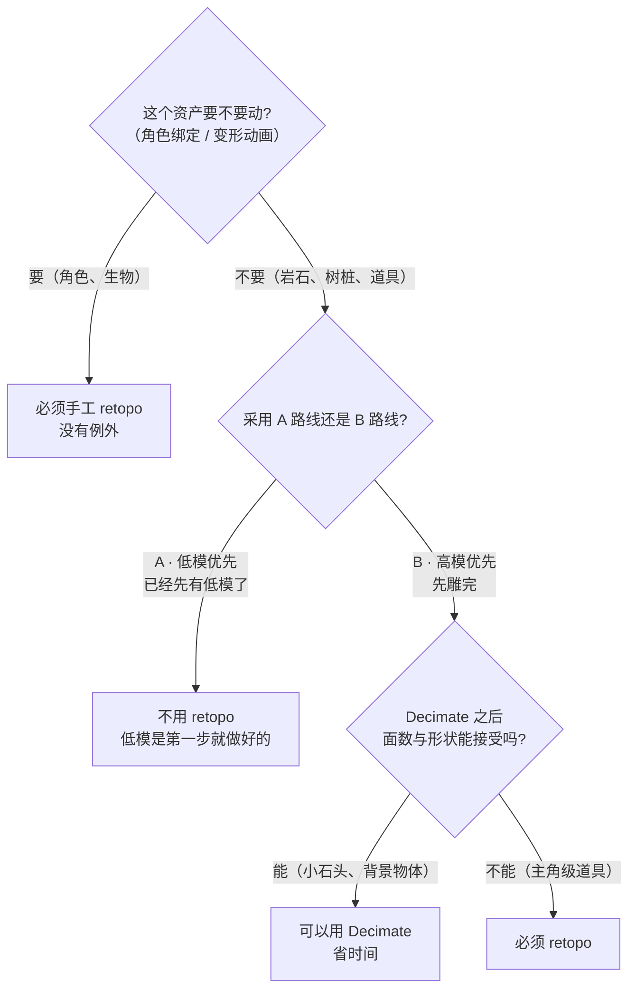
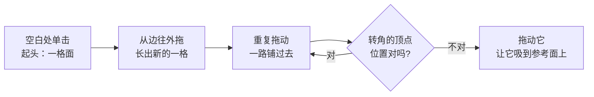
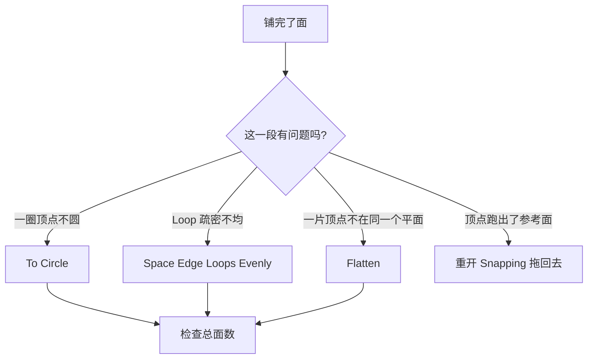
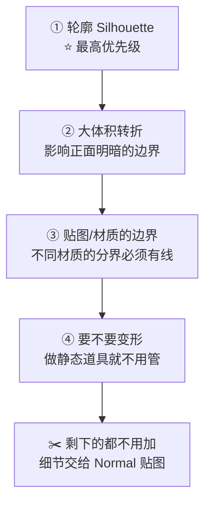

# 03 · 重拓扑：从雕塑到低模

> 对应：[`笔记.md`](笔记.md) 模块 3　|　⏱ 约 4.5h（**本 Stage 最贵的部分，没有捷径**）
> 目标：拿到一个几十万面的雕塑，能重铺出一份**几百面、能导出进引擎、远看轮廓不塌**的低模。
> 官方依据：[Retopology 手册](https://docs.blender.org/manual/en/latest/modeling/meshes/retopology.html)

---

## 3.1 这一步到底在干什么

> **重拓扑 = 用一个新网格「描」出一件旧网格的形状。**

不是简化，不是优化，是**重新画一遍**。区别很重要：

| 操作 | 本质 | 结果能不能用 |
| --- | --- | --- |
| **Decimate（精简）** | 按算法删掉一些边 | ❌ 拓扑随机、布线没走向，加 SubD 必崩，烘焙出来的 Normal 到处是伪影 |
| **Remesh（重写网格）** | 按算法重建一个均匀网格 | ❌ 均匀但无走向（见 [02](02-自适应雕刻三选一-VoxelRemesh-Dyntopo-Multires.md)） |
| **Retopology（重拓扑）** ⭐ | 人（或半自动工具）沿形状走向铺线 | ✅ 布线符合几何走向，能 SubD、能绑定、能烘焙 |

### 什么时候可以「不重拓扑」

别默认每个东西都要 retopo。先看这张表：



> 一句话规则：**做游戏资产时，「这东西会不会动」和「它离镜头多近」决定你要不要手工 retopo。**
> 本章练的是「必须手工做」的情况，因为只有练过才知道它贵在哪里，以后才会主动避免。

---

## 3.2 官方三件套：缺一个都会慢一倍

手册里明说了 retopology 的三个手段，**三个都要开**：

| # | 设施 | 在哪 | 解决什么 |
| - | ---- | ---- | -------- |
| ① | **Retopology 叠层** | 3D 视口右上角 Overlays → `Retopology` | 让你**穿过新网格看到参考网格**，而且会自动淡出超过一定距离的部分 |
| ② | **Poly Build 工具** | Edit Mode 工具栏 | 快速铺面：点一下出一格面，不用「挤出再补面」两步 |
| ③ | **Snapping（吸附）** | `Shift+Tab` 开关 + 顶部 `Snapping` 菜单 | 让新顶点自动贴到参考网格表面上 |

### ① Retopology 叠层 vs X-Ray

很多人用 `Alt+Z`（X-Ray）代替它，很吃亏：

| | X-Ray | Retopology 叠层 |
| --- | --- | --- |
| 看到什么 | **全部**线框，包括被前面挡住的那一侧 | 只显示参考网格在你灰模「下方一定距离内」的部分 |
| 后果 | 一堆重影，很容易把背后的轮廓当成正面 | 参考面清晰，重拓扑速度差 2–3 倍 |

> 叠层里有一档**距离阈值**（自动淡出距离外的部分）。目标就是这个：让参考网格只在你需要的地方露出轮廓。

### ② Snapping 的正确设置（最常配错的一步）

```text
顶部 Snapping 菜单（磁铁图标）
├─ Snap To ................ Face / Face Project / Face Nearest
├─ Affect ................. Move / Scale / Rotate 全勾（retopo 时至少要 Move）
├─ ⭐ Project Individual Elements ... 【必开】
└─ Snap Target ............ Closest / Center / Median / Active
```

三条要点：

| 设置 | 怎么选 |
| --- | --- |
| **Snap To** | `Face` 是默认够用的选项（贴到面的最近点）。`Face Project` 会沿视线投射，适合从某个视角「贴框」。`Face Nearest` 贴最近的网格元素（包含顶点边），有时边缘会跳到奇怪的地方 |
| ⭐ **`Project Individual Elements`** | **必须开**。它让每个被拖动的顶点各自向参考面投射。不开的话，整组顶点会一起往某个「平均」位置跑，新网格直接变形 |
| **Snap Target** | retopo 阶段用 `Closest` 最顺手 |

---

## 3.3 Poly Build 实操：把面铺出来

Poly Build 是 retopo 的主力工具。记住三种手势就够：

| 手势 | 效果 |
| --- | --- |
| 在**空白处**单击 | 新建一个「从零开始的四边形」 |
| 悬停到已有元素上**拖动** | 直接拖动它（自动跟着吸附） |
| 从已有**边 / 顶点**往外拖 | 直接长出一格新的四边形，且自动与原来的边缝合 |
| 按住 `Ctrl` 单击 | 删除 / 溶解（具体行为以 `F3` 搜 `Poly Build` 看到的为准） |



**配套的三个习惯：**

1. 一边铺一边用 `Ctrl+R` 加环、`Alt+LMB` 选环、`G G` 滑动——这些从 Stage 0 就会的工具在 retopo 里是主力。
2. `F2`（或 `F`）补面：选中一条开放边就能自动补一个 quad。
3. **先稀疏地铺一圈再补**：不要一开始就一格一格贴着细节走。先用比较宽的「大格子」把整体体积圈住，确认轮廓对了，再细分。一开始就贴细节 = 一定返工。

---

## 3.4 ⭐ 5.2 新福利：LoopTools 三件套已内置

这一条很多人不知道，直接影响了 retopo 的效率：

| 原 LoopTools 功能 | 5.2 内置名 | 来源 commit |
| ----------------- | ---------- | ----------- |
| `Circle` | **`To Circle`** | d2fabc952a |
| `Space` | **`Space Edge Loops Evenly`** | abf193c6f8 |
| `Flatten` | **`Flatten`** | b35c52b395 |

> 官方的说法是「用 C++ 从头重写，性能更好并修了多个边角情况」。所以：
> - LoopTools 插件**仍然建议开着**（它还有其他功能）
> - 但这三件事 5.2 已经自带，**用 `F3` 搜这三个名字就能直接调**

### 它们在 retopo 里干什么

| 算子 | 用途 |
| ---- | ---- |
| **`To Circle`** | 把一圈歪歪扭扭的顶点变成正圆。树桩断面、管口、孔洞必备 |
| **`Space Edge Loops Evenly`** | 让一组 Loop 之间间距均匀。解决「线挤在一起，另一边又太疏」 |
| **`Flatten`** | 把一组顶点压到一个平面上。做平台的平整面、器物底面 |



---
## 3.5 另一条路：Shrinkwrap 修改器（半自动）

如果你不想一格一格铺，可以让 Blender 自动把你的新网格「包」到参考网格上去。

做法：

```text
① 复制一份雕塑作为参考体（或直接用原高模）
② 新建/target 一份本是 retopo 用的低模（比如一个密度合适的 UV Sphere、Cube）
③ 给低模加 Shrinkwrap 修改器：
   Target ................ 参考高模
   Mode .................. Project（沿某轴的法线投射）
   Surface Accuracy ...... ⭐ 想要贴合，就勾 Only Nearest Surface Point
   Affect ................ 一般会限制沿某个轴
④ 视情况 Apply，然后再手动修补明显错误的区域
```

### 什么时候用它

| 适用 | 不适用 |
| ---- | ------ |
| 形状接近某个基础体拓扑（卵石、头颅、球状、块状） | 形状有分支 / 洞 / 复杂的落差（比如树枝、手、椅腿） |
| 愿意用「拓扑没那么讲究」换时间 | 要求干净 quad 布线的项目 |
| 静态道具，不需要绑定 | 需要绑定的东西（穿帮会很严重） |

> **实际感受**：Shrinkwrap 是「先速成，再手修」的策略——它的产出通常是**不能直接用**，但已经接近目标，你只需要把明显错的地方修一修。对低预算的小块岩石很合适。

---

## 3.6 五种手段怎么选（一张表总结）

| 手段 | 速度 | 质量 | 要不要买 | 用在哪 |
| ---- | ---- | ---- | -------- | ------ |
| **Poly Build + Snapping + Retopo 叠层** | 慢 | ⭐ 最好 | 免费 | **本 Stage 要练的主力**：所有重要资产 |
| **Shrinkwrap + 手修** | 中 | 中 | 免费 | 接近基础体拓扑的形状，先跑一版再修 |
| **F2 + 挤出 / 环形布线** | 慢 | 好 | 免费 | 结构相对规整、能沿某条边逐步推进的部位 |
| **Decimate** | ⭐ 最快 | 差 | 免费 | **不重拓扑时的备选**：背景小物、不可见部分 |
| **RetopoFlow（第三方付费）** | 快 | 好 | 付费 | 做量产 / 做角色时值得投资。本路线不要求 |

> 主线建议：**先用免费的手工方式做完 2–3 个资产**。等你自己感受到慢在哪了，再决定要不要买插件——那时你也才真正知道插件省的是哪一段。

---

## 3.7 ⭐ 低模到底该保留几条线

这是 retopo 唯一真正难的地方：**不是「能不能铺出来」，而是「该在哪收工」。**

### 四条判据（按优先级）



| # | 判据 | 为什么 | 例子 |
| - | ---- | ------ | ---- |
| ① | **轮廓（Silhouette）** | 这是唯一**贴图救不回来**的东西。Normal 图只改面内明暗，**完全不改变剪影** | 远处看一块石头是不是石头，只看轮廓 |
| ② | **大体积转折** | 从这里明暗会突然翻转，没有线就是一条糊边 | 岩石的一道棱线、树桩断面的边 |
| ③ | **材质边界** | 两种材质要分开 UV / 分开顶点色区域，边界必须有线 | 木头到苔藓、铁皮到锈 |
| ④ | **变形需求** | 角色关节处要有多圈 Loop，不然动起来会塌 | 做角色时才需要考虑 |

> **删线的反向检查**：如果你删掉这一圈线，远处轮廓会变吗？不会 → 删掉。
> 再补一条**视觉重点**原则：**玩家视线焦点给面数，看不见的地方（背面、贴地的一面）给到最低**。

### 一个反例

```
❌ 错：为了「更安全」，给整块岩石均匀铺 2000 面
   → 远看和 500 面的版本没区别，多了 4 倍的开销

✅ 对：整个石头 400 面，其中一半集中在
   ① 那道从侧面看很明显的棱线上
   ② 顶部一处最有辨识度的缺口轮廓上
```

---

## 3.8 一个完整的 retopo 作业流程（checklist）

按顺序走，不要跳：

```text
[ ] 1. 确认高模：Alt+H 恢复全部隐藏部分，清除 Mask
[ ] 2. 高模 Ctrl+A → Rotation & Scale
[ ] 3. 高模设为 display type = Wire（或者作为参考），防止误选
[ ] 4. 新建低模基础体 → Shift+Ctrl+Alt+C → Origin 与高模对齐
[ ] 5. 开 Overlays → Retopology 叠层，设好距离阈值
[ ] 6. 开 Snapping：Snap To = Face，Project Individual Elements = ON
[ ] 7. 用 Poly Build 从大处起：先稀疏地铺一圈，确认轮廓后再细分 ⭐
[ ] 8. 补完之后：
        8a. 检查完全包裹住高模（可能会有地方凹进去了）
        8b. 检查三角形 / N-gon ← 允许少量，但不能一片
        8c. 用 To Circle / Space Edge Loops Evenly / Flatten 整理布线
[ ] 9. 面数收进目标预算
[ ] 10. Shift+N 重算法线；M → By Distance 清理重叠顶点
[ ] 11. ⭐ 展 UV（下一篇），然后才能进烘焙
[ ] 12. 与高模对比：把视野推远，只看轮廓，判断像不像
```

---

## 3.9 常见坑

- ❌ **忘了 `Alt+H` 恢复全部隐藏部分** → 高模缺一块，你的低模也跟着缺
- ❌ **`Project Individual Elements` 没开** → 整组顶点会一起挪向某个平均位置，新网格直接变形
- ❌ **用 X-Ray 代替 Retopology 叠层** → 满屏重影，参考错背面
- ❌ **一格一格贴着细节铺** → 比例正确不了。**先控制大轮廓，再细化**
- ❌ **高模的 Scale 没 Apply** → 做到一半发现新顶点往一个方向漂
- ❌ **铺完了才发现低模比高模小了一圈 / 凹进去了** → 务必检查包覆关系：**低模必须完全包住高模**（烘焙时低模在外面才能接到射线）
- ❌ **全程一样密度** → 一半的面浪费在看不见的地方。用 3.7 的四条判据重新判断
- ❌ **给不会动的东西铺了绑定位 loop** → 静态道具不需要，白白多给面数
- ❌ **Decimate 完直接拿去烘焙** → 随机拓扑会让烘焙出的 Normal 到处是 artifacts
- ❌ **把「面数越少越好」当成目标** → 目的是「用最少的面数保住轮廓」。达到预算就够了，再往下减就开始丢轮廓了
- ❌ **retopo 完忘了 `Shift+N` 重算法线** → 烘焙出黑块（这个在 Stage 4 已经踩过一次）

---

> **下一篇**：[`04-有机资产的面数与UV策略.md`](04-有机资产的面数与UV策略.md)
> 重拓扑给你的是几何壳。下一篇给它定量：**面数控制在多少算合格、以及它要不要展 UV、展哪种**。做完那篇，这个资产才算真正进入 Stage 4 画过的烘焙环节。

