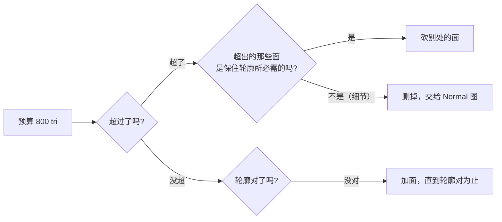
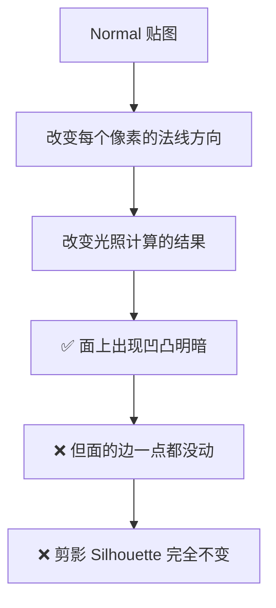
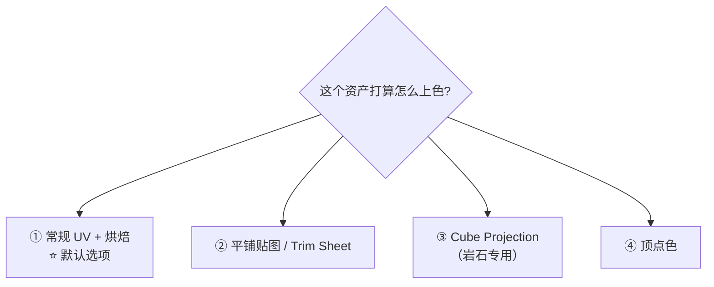

# 04 · 有机资产的面数与 UV 策略

> 对应：[`笔记.md`](笔记.md) 模块 4　|　⏱ 约 2h
> 前置：[03 重拓扑](03-重拓扑-从雕塑到低模.md) 做完才有「低模」可言；[Stage 3 UV](../04-UV与贴图坐标/笔记.md) 的技能在这里原样复用，只是决策点不同。

---

## 4.1 面数预算：先知道天花板在哪

重拓扑时面数给多少，不是主观决定，而是看 Stage 6 的预算表：

| 资产类型（三角形数） | 移动端 | PC / 主机 | UE5 Nanite |
| --- | --- | --- | --- |
| 环境道具（岩石、木箱、树桩） | **800** | **2,500** | 不限（但仍要 LOD0 兜底） |
| 手持道具（枪、刀） | 1,500 | 4,000 | 不适用 |
| 主角角色 | 3,000 | 10,000 | 不适用 |

> 数值来自路线图 Stage 6，是业界常见区间，**具体以你项目的性能预算为准**。

对照本阶段的三个练习：

| 练习 | 目标 tri | 为什么 |
| ---- | -------- | ------ |
| 岩石组（3 块） | 每块 **300–800** | 岩石可以是「一个形状 + 一张 Normal 图」，捏一套变体就能铺一地 |
| 树桩 | **≤1,200** | 有断面、有几条根，比岩石复杂，但仍是环境道具 |
| 破损木箱（验收） | **≤2,500** | 有机 + 硬表面混合，且可能有分离件 |

---

## 4.2 ⭐ 为什么「轮廓」永远不能靠贴图

这是本 Stage 最重要的一条认知。

**推出两条推论：**

1. 用不了多少贴图能救的东西 = 面内的细节。
   细小的皱纹、孔洞、每一个小凸起 → **交给 Normal**。
2. 贴图救不了的东西 = 轮廓。
   远看的整体形状、关键的缺口/棱 → **必须给面数**。

> 💡 **一个快速验证方法**：把你的低模和原高模并排放好，把视口推远到「只看得清剪影」的程度。如果这时还能分辨出来哪个是哪个，说明低模省过头了。

---

## 4.3 低模 UV：四条路，选一条

重拓扑之后你手上有一个干净低模。它要不要展 UV，取决于**你怎么给它上贴图**。

### ① 常规 UV + 烘焙（默认）

**做法**：标缝合边 → `U → Unwrap` → Pack Islands → 用它来烘焙高模的 Normal / AO。

**适用**：绝大多数情况。它是 Stage 4 已经走过的路，也是道具级手绘贴图的标准做法。

**要求**（这些 Stage 3 都学过）：
- 烘焙的前提下 UV **不能有重叠** → 用 `Select → All by Trait → Overlap` 检查
- 岛的间距要有 padding，否则烘焙时像素溢出
- 同场景内的物件 UV 密度要一致

### ② 平铺贴图 / Trim Sheet（不求新 UV）

**做法**：低模还是要有 UV（因为它是承接贴图的必要接口），但你不再手绘，而是**使用一张可以平铺的贴图**重复利用。

**适用**：多个同类资产共用一套贴图（比如要在场景里铺一地同种岩石）。

**代价**：岛可以重叠（同一个纹理区域在多个位置复用），但需要接缝处理。

### ③ Cube Projection（岩石真的很适合）

**做法**：`Edit Mode → A 全选 → U → Cube Projection`。六个方向投影成六个岛，两条缝合边都不用标。

> ⚠️ 注意 Stage 3 的老知识：**Cube Projection 不读缝合边**，它自己算切口。

**为什么适合岩石**：岩石这种形状不规则的体块，手动找缝合边很难，而且它的贴图一般是噪声类、岩层类的 CC0 贴图——对 UV 是否横平竖直并不敏感。

**代价**：会在投影交界处产生明显的拉伸带（因为投影是按坐标轴的）。用在能接受这点拉伸的资产上，别用在需要精细排版的资产上。

### ④ 顶点色（看着诱人，坑最多）

> 5.2 对这一条是利好：**voxel remesher 现在会插值顶点与角标属性**（见 [笔记.md](笔记.md) 第 0 节第 1 条），反复 remesh 不再把颜色啃碎。

**做法**：在雕塑上直接画顶点色（RGBA 四个通道可以当四张灰度蒙版用）。

**适用**：低多边形 / 风格化场景，不想给每个资产单独配贴图。

**⚠️ 三个导出陷阱**（最坑的三个）：

| # | 陷阱 | 说明 |
| - | ---- | ---- |
| 1 | **材质没引用顶点色 → glTF 导出器不导出** | 属性必须在材质节点树里真的被用到，导出器才会写出去。这是「顶点色导出后变白」的头号原因 |
| 2 | **多材质模型要逐个 primitive 检查** | 4.1 起 glTF 导出器会重排 `COLOR_0` 去匹配 Blender 的视觉效果，而不是原样输出属性 |
| 3 | **必须重新导入 GLB 验证** | 上面两点都没有报错。**导出后不出错 ≠ 导出成功** |

> 如果你不想冒这个险：**把顶点色烘焙进贴图文件**是最稳的做法。

---

## 4.4 UV 的决策总结

| | 常规 UV + 烘焙 | 平铺 / Trim | Cube Projection | 顶点色 |
| --- | --- | --- | --- | --- |
| 主要用途 | 默认方案 | 同服复用贴图 | 形状不规则的岩石 | 风格化/省贴图 |
| 会不会烘焙 | ✅ 会 | 视情况 | ✅ 会 | 一般不烘焙 |
| 允不允许重叠 | ❌ 不允许 | ✅ 允许 | ❌ 不允许 | — |
| 主要风险 | 岛间距 padding | 接缝处理 | 投影交界处拉伸 | GLB 导出陷阱 |
| 本 Stage 用不用 | **用（默认）** | 可选 | **岩石项目用** | **只用一次尝鲜** |

---

## 4.5 时机：低模 UV 放在流程的哪里

> ❗ **UV 必须排在 Voxel Remesh 与 Dyntopo 之后**——这两个操作都会毁掉 UV（见 [02](02-自适应雕刻三选一-VoxelRemesh-Dyntopo-Multires.md)）。
> 而 UV 必须排在**烘焙之前**——没有 UV，烘出来的图没地方放。

**换句话说：低模 UV 的正确位置，是「重拓扑之后、烘焙之前」的唯一窗口。**

---

## 4.6 常见坑

- ❌ **面数打到预算之内就算完** → 只面数会笑。**轮廓对了才收工**（见 4.2 的验证方法）
- ❌ **以为 Normal 能改剪影** → 不能。这个是 Stage 5 最普遍的错误期望
- ❌ **给形状不规则的岩石手动找缝合边找半天** → 试试 `Cube Projection`，它能两条线都不标
- ❌ **先展开 UV 又跑去 Voxel Remesh** → UV 已经没了
- ❌ **烘焙之后发现 UV 有重叠** → 黑块/花斑的来源之一，Stage 4 排错第一步就是查这个
- ❌ **用顶点色省心，但导出后颜色全白** → 材质没引用属性 → 见 4.3④
- ❌ **用顶点色但没重新导入 GLB 检查** → 上面那个坑没有任何报错
- ❌ **一个资产给 1024 却只占屏幕 200 像素** → 贴图分辨率要按「最坏情况下占多少像素」给，见 Stage 4 第 02 篇
- ❌ **纹素密度不一致** → 同一场景里几个岩石摆在一起，有的糊有的细

---

> **下一篇**：[`05-高模到低模烘焙-有机形状的难题.md`](05-高模到低模烘焙-有机形状的难题.md)
> 低模有了、UV 有了，接下来是把高模的细节「压」进贴图。下一篇讲**为什么这一步在有机形状上特别容易翻车**，以及怎么用 `Bake from Multires` 绕开最大的那个坑。
