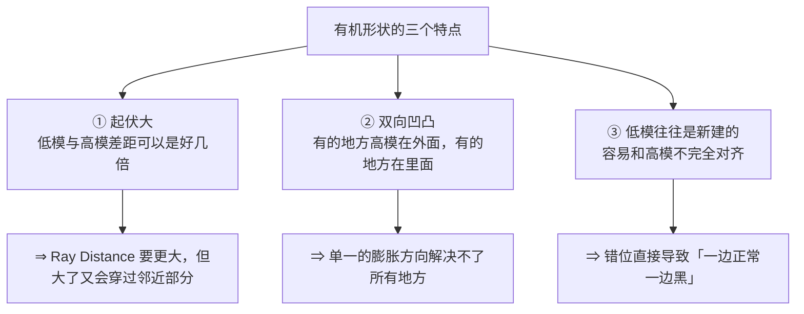
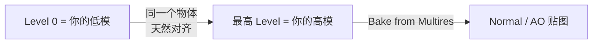
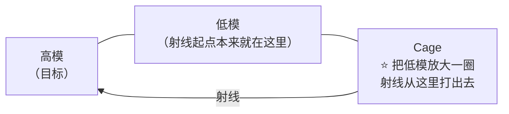
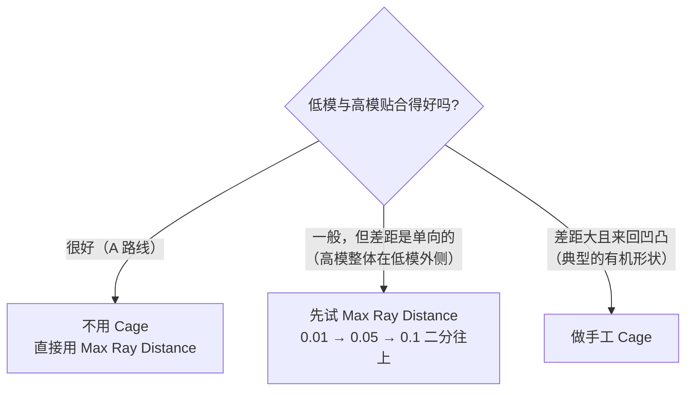
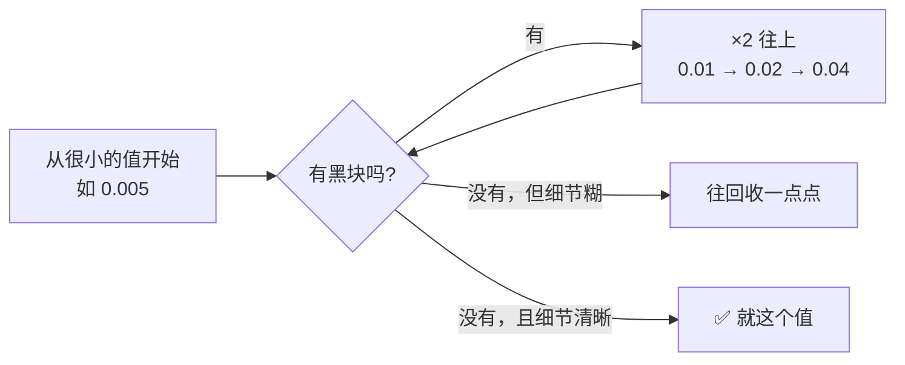

# 05 · 高模到低模烘焙：有机形状的三个难题

> 对应：[`笔记.md`](笔记.md) 模块 5　|　⏱ 约 2.5h
> ⚠️ **前置必读**：[`../05-材质PBR与烘焙/04-烘焙原理与Cycles烘焙设置.md`](../05-材质PBR与烘焙/04-烘焙原理与Cycles烘焙设置.md) 和 [`05-高模到低模烘焙实战与排错.md`](../05-材质PBR与烘焙/05-高模到低模烘焙实战与排错.md)。
> **本篇不讲烘焙基础，只讲「同一套设置在有机形状上为什么会翻车」。**

---

## 5.1 烘焙在有机形状上难在哪

回忆烘焙的本质：**从低模表面上的每个点，沿法线往高模方向打一条射线，打到的那一点的属性，写进这个点对应的 UV 像素。**

硬表面为什么好烤？因为**低模和高模几乎贴着走**，射线短而稳定，形状有落差的地方彼此独立。

有机形状不一样：



---

## 5.2 ⭐ 最大红利：A 路线可以直接绕开 Cage

如果你走的是「低模优先」的 A 路线（低模就是 Multires 的 Level 0），那你不需要 Cage，也不需要担心对齐：



### 怎么开

在 Cycles 的烘焙面板里勾 **`Bake from Multires`**（在 `Selected to Active` 那一区附近）。勾上之后：

- **不需要**再选两个物体
- **不需要**设 Cage
- **不需要**调 Max Ray Distance
- 5.0 起它还增强了对**矢量位移、n-gon** 的支持

```text
Bake 面板设置示例（A 路线）
Bake Type .............. Normal  /  Ambient Occlusion
Influence
   Selected to Active ... OFF（不需要）
   ⭐ Bake from Multires  ON
Output
   Target .............. Image Textures
   ⭐ 在 Shader Editor 里点一下目标 Image Texture 节点
      （5.0 起只烤到「选中且激活」的那张图）
```

> ⚠️ **限制**：`Bake from Multires` 只作用于**同一个物体自己的** base level ↔ 最高 level。
> 如果你的低模是重拓扑出来的**另一个物体**（B 路线），这条路走不通，必须走下面两节。

---

## 5.3 Cage 到底在解决什么问题

Cage 是一个**替代品**：当低模和高模差距大、且形状来回凹凸时，单纯「沿低模法线打射线」会打空或打错。

Cage = **一个被放大版本的低模**，射线从它上面出发，而不是从低模本体出发。



### 什么时候真的需要 Cage



### ⚠️ 一条诚实的提醒

**不要一上来就做 Cage。** 大量的「要 Cage」其实是「对齐没做好」或「Ray Distance 不对」的掩饰症状。

顺序永远是：

```text
① 先确认低模与高模对齐了（原点、位置）
② 关掉 Cage，用 Max Ray Distance 二分往上试
③ 还是有局部区域烤不出来 → 才做手工 Cage
```

---

## 5.4 手工 Cage 怎么做（三步）

```text
① 复制低模：选中低模 → Shift+D → 立刻右键（不移动）
② 把这份副本沿法线膨胀：
   Edit Mode → A 全选 → Alt+S（Shrink/Fatten）
   拖动鼠标向外一点点（这就是 Cage 相对低模的偏移量）
③ 在烘焙面板里：
   勾 Cage
   Cage Object → 选刚才那份副本
   Cage Extrusion → 给一个小的值（因为你已经手动膨胀过了）
```

> **判据**：我们要的效果是**「射线从这个笼子出发能打到高模」**。所以笼子要比高模大一圈，但也不能太大——太大就会打到邻近的其他部位，把别处的细节烤进来。

| 症状 | 说明 | 怎么调 |
| ---- | ---- | ------ |
| 局部黑块 | 射线没打中 | 笼子再大一点（`Alt+S` 再推一点） |
| 细节糊成一团 | 射线打到好几层 | 笼子缩小；或用 Cage Extrusion 微调 |
| 烤出了隔壁的结构 | 笼子太大，射线打到别的部位去了 | 缩小笼子；必要时拆成多个部位分别烘焙 |

---

## 5.5 Max Ray Distance / Cage Extrusion 怎么给值

> ❗ 不要背数字。Stage 4 的排错篇已经批判过照抄：`Extrusion 0.02–0.05` 只是「1 米级道具」的经验值，**取决于你的场景尺度**。

判据只有一条：**有没有射线打不中的黑块。**



| 名称 | 什么时候用这个名字 |
| ---- | ------------------ |
| **Max Ray Distance** | **不勾 Cage** 时（这种情况下它才是真正的「射线最大长度」） |
| **Cage Extrusion** | **勾了 Cage** 时（它是「在 cage 基础上再偏移一点」） |

> 两个名字，两个语义，别搞混。

---

## 5.6 五种症状排查表

烘焙出问题先看这张表。**每个症状从上面一行往下试。**

| 症状 | 可能原因（按可能性排序） | 排查动作 |
| ---- | ------------------------ | -------- |
| **全黑 / 大片黑块** | ① Max Ray Distance 太小<br/>② 低模 UV 有重叠<br/>③ 高低模没对齐（B 路线）<br/>④ 忘了 Apply Scale | 先把 Ray Distance 翻倍试；检查 UV 重叠；检查两者原点位置 |
| **局部花斑 / 麻点** | ① 射线打到好几层<br/>② 高模有自相交<br/>③ Cage 太大 | Ray Distance 减半；检查高模是否 Voxel Remesh 过（应该没有自相交了） |
| **细节完全没出来** | ① 高模被隐藏了<br/>② 选中 active 错了<br/>③ Target 没选中目标图像节点 | 检查渲染/视口可见性；**重新确认选择顺序：先高模，Shift 加选低模，低模是 active** |
| **接缝处黑边** | Margin 太小 | 1024 给 8–16 px |
| **细节错位 / 一半正常一半不对** | 低模与高模没真正对齐 | 检查原点、检查位置，或用 Cage |

> 💡 三条「必查项」，Stage 4 已经总结过，这里沿用：**① Apply Scale ② UV 无重叠 ③ 高模没被隐藏**。这三个解决了本 Stage 八成以上的烘焙故障。

---

## 5.7 有机烘焙的检查清单

```text
前置（不做这一步，后面全是白干）
[ ] 低模 Ctrl+A → Rotation & Scale
[ ] 低模 UV 已展开、无重叠、有 padding
[ ] 低模 UV 所用的送往 Target 已就绪（图片节点存在）
[ ] 高模在视口与渲染中都没被隐藏
[ ] 低模完全包住高模（B 路线）/ Level 0 就在手上（A 路线）
[ ] Ctrl+Alt+S 存了增量版本

设置
[ ] Render Engine = Cycles
[ ] Bake Type = Normal（或 AO）
[ ] A 路线：勾 Bake from Multires
[ ] B 路线：勾 Selected to Active + 选择顺序正确
[ ] Target = Image Textures

执行
[ ] ⭐ 在 Shader Editor 里点一下目标 Image Texture 节点（选中+激活）
[ ] Bake
[ ] ⭐ 立刻 Image Editor → Alt+S 存盘
```

---

## 5.8 常见坑

- ❌ **A 路线还去设 Cage** → 完全不需要，白白多做一个麻烦
- ❌ **B 路线想用 `Bake from Multires`** → 它不认另一个物体
- ❌ **一出问题就先做 Cage** → 顺序反过来。先查对齐、Ray Distance、Apply Scale
- ❌ **Ray Distance 抄 Stage 4 的 0.02–0.05** → 岩石的默认尺度可能与 Stage 4 的道具差好几倍。**二分法试**
- ❌ **5.x 起没点选目标 Image Texture 节点** → 静默失败，什么都不烤
- ❌ **选择顺序搞反**（先低后高）→ active 是高模，射线方向反了，全错但不报错
- ❌ **烘焙完不立刻存盘** → 重开就丢了，且没有任何提示
- ❌ **忘了检查「低模必须包住高模」** → 部分区域永远打不中，出黑块
- ❌ **烤完不进引擎看** → Stage 5 是最容易「Blender 里惊为天人、引擎里糊成一片」的阶段。**一定要导出 GLB 验证**
- ❌ **Normal 图混用 sRGB** → 老朋友了。**Non-Color**

---

> **下一篇**：[`06-练习项目-岩石组-树桩-破损木箱.md`](06-练习项目-岩石组-树桩-破损木箱.md)
> 理论到此为止。下一篇把整条链跑三遍：**第一遍走 A 路线（享受 `Bake from Multires` 的红利），第二遍走 B 路线（吃一遍 Cage 的苦），第三遍混合**。
