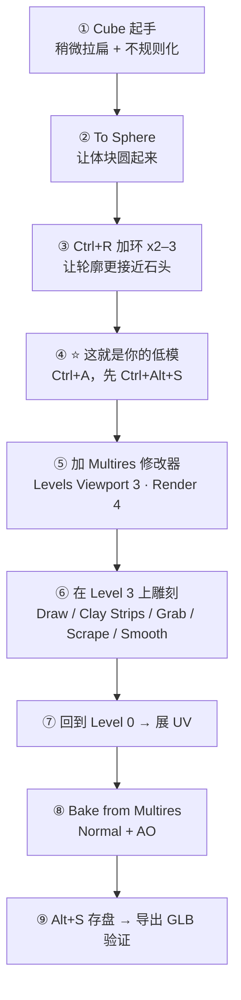
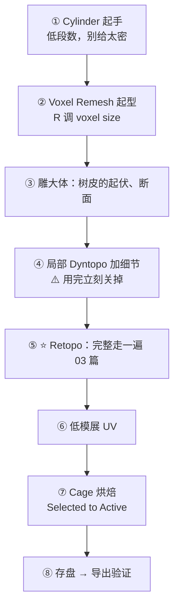
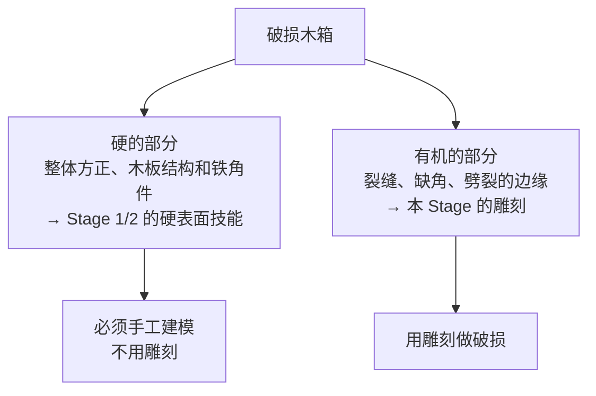

# 06 · 练习项目：岩石组 → 树桩 → 破损木箱

> 对应：[`笔记.md`](笔记.md) 模块 6　|　⏱ 约 5h
> 三个项目覆盖两条路线：**① 岩石走 A 路线（低模优先），② 树桩走 B 路线（高模优先），③ 木箱是验收。**
> 文件存到 `../资产/练习文件/06-有机资产雕刻与重拓扑/`。

---

## 通用准备（每次开工前）

```text
[ ] Scene → Units 设为 Metric，物体按真实尺寸做（一块景观石 0.6–1.2 m）
[ ] 动雕刻前：Ctrl+A → Rotation & Scale
[ ] 开工前 Ctrl+Alt+S 存一份增量版本
[ ] 开章节对应的内置插件：LoopTools / F2（5.2 的三件套已自带，插件照开无妨）
```

---

## 项目 1 · 岩石组（3 块）— 走 A 路线 ⭐

> **目标**：每块 300–800 tri。**这一遍的目的是建立完整闭环，顺便享受不用做 Cage 的红利。**

### 步骤



### 每步要点

| # | 要点 | 容易做错的地方 |
| - | ---- | -------------- |
| ① | Cube → `S` 缩放 + 手工拖动顶点，让形状不完全对称（稍微歪一点） | 太规则 → 一眼假 |
| ② | `Mesh → Transform → To Sphere`（`Alt+Shift+S` 也能调）给 0.6–0.8 左右，不要给到 1 | 给到 1 = 完美球体，最假 |
| ③ | `Ctrl+R` 加 2–3 环，`G G` 滑动让棱不均等 | 均匀 → 看不出是石头 |
| ④ | **这一步就是 A 路线的核心**：低模先成型。后面若发现低模不贴合了，用 Multires 的 `Conform Base` 追上去 | 忘了 Apply → 后面 Multires 出问题 |
| ⑤ | `Levels Viewport` 给 3 就够，`Render` 给 4。**视口不要给太高，否则手感受到影响** | 视口给 6 → 一笔等两秒 |
| ⑥ | 顺序：**大体积（Grab / Clay Strips）→ 中等起伏（Draw）→ 细节（小笔刷 Draw / Crease）**。岩石断面用 `Scrape` | 一上手就抠细节 → 一定返工 |
| ⑦ | **UV 在这里做**（Voxel Remesh / Dyntopo 会毁 UV；A 路线本就没用它们，所以是安全的）<br/>岩石推荐 `U → Cube Projection` | 在这之前跑过 Remesh → UV 白展 |
| ⑧ | 勾 `Bake from Multires`，**不需要 Cage，不需要 Ray Distance** | 去找 Cage → 白忙 |
| ⑨ | 存盘 + 导出 GLB | 不存盘 → 第二天打开全是黑的 |

### 验收

- [ ] 每块 300–800 tri
- [ ] 推远到只看剪影，与有 Multires 的版本对比，轮廓基本一致
- [ ] 贴 Normal 之后，在 3 m 距离看，细节还在
- [ ] 导出 GLB → 引擎里看一眼，法线方向没反
- [ ] 三块岩石形状彼此不同（不要做三块一样的，那样学不到东西）

### 做第 2、3 块时偷的懒

第 2、3 块可以复用同一个低模基底，改形状后套用现成的 Multires 细节——这就是资产复用。
但**至少有一块是从头做起**，别全抄。

---

## 项目 2 · 树桩 — 走 B 路线 ⭐⭐

> **目标**：≤1,200 tri。**这一遍的目的是吃一遍 Cage 的苦**——你会第一次真正理解为什么要先做低模。

### 步骤



### ⚠️ 这个项目真正练的东西

| 环节 | 难点 | 提示 |
| ---- | ---- | ---- |
| **③ 树皮与断面** | 断面要有年轮感、边缘要有撕裂感 | `Scrape` 做断面平整，`Crease` 拉出树皮的竖直纹路 |
| **④ Dyntopo** | 用完了记得关 | **并且注意：用了 Dyntopo 之后不要再去展 UV**，UV 已经没了 |
| **⑤ Retopo** ⭐ | 这是本 Stage 唯一的苦活 | 树桩的布线：树干一圈 12–16 段，断面一个面片+中心点。见 [03](03-重拓扑-从雕塑到低模.md) 3.7 的四条判据 |
| **⑦ Cage** ⭐ | 树根伸展处的落差很大 | 先看 5.5 的二分法，**试不出再去做手工 Cage** |

### 验收

- [ ] ≤1,200 tri
- [ ] **树皮与断面这两处落差最大的地方，Normal 贴图也算得正确**
- [ ] 低模布线：树干一圈走向清楚，断面是独立的圆盘
- [ ] 导出 GLB 进引擎看过

### 翻车预案

| 现象 | 先查什么 |
| ---- | -------- |
| 烤出来一片黑 | ① 低模 Apply Scale 了吗 ② 低模 UV 有重叠吗 ③ Ray Distance 是不是太小 |
| 只有一半正常 | 高低模没对齐 → 检查原点与位置 |
| 断面细节出不来 | Cage 太小或 Max Ray Distance 不够 → 按 5.5 的二分法往上试 |

---

## 项目 3 · 破损木箱 — 有机 + 硬表面混合（验收项目）

> **目标**：≤2,500 tri。**这是用什么路线由你决定——这才是最真实的考验。**

### 思路

一个破损木箱有两个部分：



### 建议顺序

```text
1. 先按 Stage 1/2 的方式做一个完好的木箱（别忘了真实尺寸 + Bevel）
2. Ctrl+Alt+S 存一份「完好版」
3. 复制一份，在这一份上做破损：
   - 缺角：Trim / Box Trim 直接剪掉一块
   - 裂缝：沿木板方向用 Crease 拉一道，再用 Grab 拉开
   - 破口边缘：只对破损的那一小块做 Voxel Remesh
4. ⭐ 关键决策：这个改动是做进低模，还是烤进 Normal？
   → 轮廓级（缺了一整角）＝ 做进低模
   → 表面级（一道细裂缝/毛刺）＝ 烤进 Normal
5. 按选定的路线重拓扑 / 展 UV / 烘焙
6. 导出 GLB → 引擎
```

### 验收

- [ ] ≤2,500 tri（按 Stage 6 PC/主机档）
- [ ] **完好的部分仍然是干净的硬表面拓扑**（不要被雕刻污染了）
- [ ] 破损部分的轮廓远看仍然成立
- [ ] 材质只有 1–2 个（沿用 Stage 4 的规矩）
- [ ] 原点在底面正中
- [ ] **导出 GLB → 引擎 → 截图，与 Blender 并排对比过**
- [ ] 命名：`Prop_Crate_Damaged_01`

---

## 三个项目之后该保管起来的东西

| 产出 | 路径 |
| ---- | ---- |
| 练习文件 | `../资产/练习文件/06-有机资产雕刻与重拓扑/` |
| 导出成品 GLB | `../资产/导出成品/` |
| 贴图 | 与 GLB 同目录或约定目录，命名 `Env_<名称>_<变体>_<通道>` |
| 引擎截图 | 放在和各项目对应的文件夹 |
| **笔记** | 回到 [`笔记.md`](笔记.md) 的「我的记录 / 阶段复盘」写 3 条以上，把通用的坑同步到 [`../速查/常见坑汇总.md`](../速查/常见坑汇总.md) |

---

> 走完这三个项目，Stage 5 就真的结束了。
> 你应当获得的两条长期能力：**① 拿到任何有机形状，知道该走 A 还是 B；② 做出来的东西一定能进引擎**（最后一个项目就是为此存在的）。下一站是 Stage 6 的资产规范与导出。
