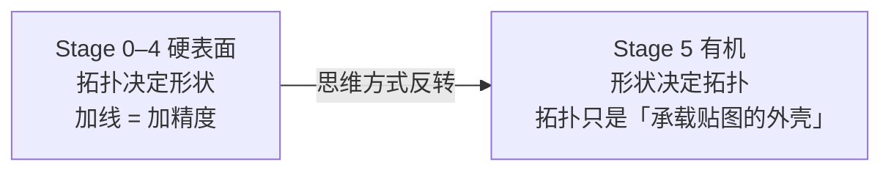
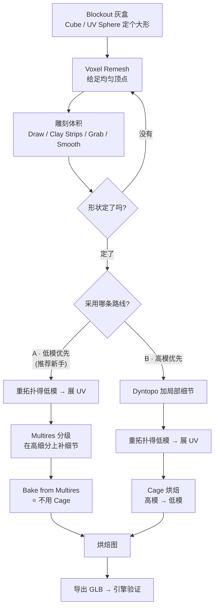
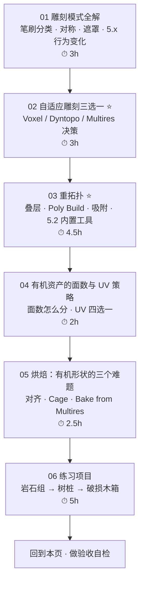
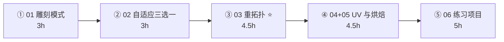

# Stage 5 · 有机资产：雕刻 → 重拓扑 → 烘焙（15–20h）

> **一句话目标**：能处理非机械形状（岩石、地形、生物、破损道具），并且低模进得了引擎。
> 状态：⬜ 未开始　|　开工：　　　|　完成：
> 环境：**Blender 5.2.2 LTS** · macOS　|　前置：`03-非破坏性流程与资产管理`、`04-UV与贴图坐标`、`05-材质PBR与烘焙` 必须先做完——**烘焙的前提是「低模已经有干净 UV」**，Stage 5 没有自己的贴图捷径，它是把 Stage 0–4 的本事换个方向用一遍。

---

## 0. ⚠️ 先订正：路线图 Stage 5 有 8 处说法需要按 5.x 改

雕刻是 4.x→5.x 改动被讲得最少的一块（大家的注意力都在 EEVEE、几何节点、色彩管理上）。**跟着 3.x/4.x 老教程学雕刻，第一周就会踩到下面至少 3 条。**

| # | 路线图的说法 | **5.x 的实际情况** | 依据 |
| - | ------------ | ------------------ | ---- |
| 1 | Voxel Remesh「5.2 的 voxel remesher 现在**保留顶点色等属性**」 | **半句对，容易被读成错的**。Voxel Remesh **一直**有 `Attributes` 三个重投影开关（Paint Mask / Face Sets / Color Attributes）。5.2 改的是**插值方式**：从「取原网格最近点的值」改成「对顶点与角标属性插值」，效果是**反复 remesh 之后颜色不再被啃碎**。但另外两条没说：Voxel Remesh 仍会**丢掉 UV 在内的所有 mesh data layers**（官方原文：*Performing this will lose all mesh object data layers*）；且它**在带 Multiresolution 修改器的物体上直接不可用** | [5.2 Release Notes · Sculpt](https://developer.blender.org/docs/release_notes/5.2/sculpt/)（c9ac62fd36）；官方手册 [Remeshing › Voxel](https://docs.blender.org/manual/en/latest/modeling/meshes/retopology.html) Attributes 段与 Note 段 |
| 2 | Dyntopo「好用但会毁拓扑，只在中途用」 | 方向对，**漏了最要命的一条**：Dyntopo 会**丢失或损坏自定义属性——颜色属性、UV 图、Face Sets**。所以「先 Dyntopo 再展 UV / 再画顶点色」必炸。另外：Dyntopo 与 Voxel Remesher **互斥**，两者共用 `R`（设 resolution）与 `Ctrl+R`（执行）；**5.2 起进入 Dyntopo 不再弹二次确认**（aae0f54d09），手滑误触比以前更容易丢数据 | 官方手册 [Adaptive › Dyntopo](https://docs.blender.org/manual/en/latest/sculpt_paint/sculpting/introduction/adaptive.html)；5.2 RN（aae0f54d09） |
| 3 | 「多分辨率（Multires）工作流的适用场景」 | 补三条硬约束：① Multires **强烈建议基础网格是干净 quad**（不要有非流形破面，不要有「只有两条边的极点」）；② **5.0 新增 `Conform Base`**（把基础网格顶点移到细分后的位置上，与 `Apply Base` 并列，fee064e524）；③ **Voxel Remesh 在带 Multires 的物体上不可用**（见第 1 条 Note） | 官方手册 Remeshing Note 段 / Adaptive › Multiresolution；[5.0 RN · Sculpt](https://developer.blender.org/docs/release_notes/5.0/sculpt/)（fee064e524） |
| 4 | 「重拓扑：手工 Retopo（吸附 + F2 + Poly Build）或 RetopoFlow（付费）」 | 官方的**三件套缺一不可**：`Overlays → Retopology` 叠层 + **Poly Build** 工具 + **Snapping**，少开任何一个，重拓扑耗时翻倍。另外 **5.2 起 LoopTools 的 Circle / Space / Flatten 已内置为原生算子**（`To Circle` / `Space Edge Loops Evenly` / `Flatten`，用 C++ 重写，比插件版更快且修掉了几个边角情况），这几件事不用再依赖插件（插件仍有其他功能，建议照开） | 官方手册 [Retopology](https://docs.blender.org/manual/en/latest/modeling/meshes/retopology.html)；[5.2 RN · Modeling](https://developer.blender.org/docs/release_notes/5.2/modeling/)（d2fabc952a / abf193c6f8 / b35c52b395） |
| 5 | （没提）**笔刷尺寸的单位变了** ⭐ | **5.0 起 Brush Size 表示「直径」，不再是「半径」**（8188dbd246）。照 4.x 老教程抄数值，笔刷观感上**大一倍**——这是跟着老教程学雕刻的第一道暗坎，而且没人会提醒你，你只会觉得「我手好抖」 | 5.0 RN · Sculpt（8188dbd246） |
| 6 | （没提）**笔刷与对称的作用域变了** | ① 统一笔刷设置（size / strength / color）**按模式独立**，不再整个场景共享（4434a30d40）；② **径向对称存为 mesh 属性而非 scene 属性**，变成 per-object（d73b8dd4f3）。老教程讲的「对称是场景级设置」已过期 | 5.0 RN · Sculpt（4434a30d40 / d73b8dd4f3） |
| 7 | （没提）5.2 的雕刻新能力 | 新增 **Scene Project** 笔刷（把顶点推向场景中其他物体表面，效果类似 Shrinkwrap 修改器，f08e061cb7）；Sculpt 模式内可直接 **Add Primitive**（Cube / Cone / Cylinder / UV Sphere / Icon Sphere，9c185de6bd）。⚠️ 另外 5.2 起 **Paint / Clay Strips 不再强制打开 Rake 旋转**（1320c2b539）——照老教程期待 Clay Strips 的「跟着笔画自动转向」会对不上 | 5.2 RN · Sculpt（f08e061cb7 / 9c185de6bd / 1320c2b539） |
| 8 | 「高模 → 低模烘焙流程（接 Stage 4）」 | 对，但要强调是**串行依赖不是并行**：低模必须先有干净 UV 才能烘焙。Stage 5 的烘焙章节假定你已经走过 `05-材质PBR与烘焙/04`、`05` 两篇 | `../05-材质PBR与烘焙/04-烘焙原理与Cycles烘焙设置.md`、`05-高模到低模烘焙实战与排错.md` |

> 📌 **待回写 `Blender学习路线图.md`**：第 1、2、4 条补强 Stage 5 必学清单原文；第 5 条建议加到「5.x 相对 4.x 的变化」总表（它和快捷键/菜单位移同类，会影响所有看老教程的人）；第 4 条同步订正 Stage 0 的 LoopTools 条目（*5.2 已内置 Circle / Space / Flatten*）。
>
> 📌 通用兜底：**快捷键按不出来或菜单对不上，一律按 `F3` 搜命令名**，不要死记位置。

---

## 1. 本阶段在解决什么问题

Stage 0–4 你做的是**硬表面**：以「线」为单位思考——加一条 Loop、加一段支撑线、加一圈倒角。形状是被拓扑**控制**出来的。

Stage 5 反过来：先有体积，后有拓扑。**你不再控制线，你控制一团橡皮泥的形状，然后在最后一刻把线抽出来。**

代价是：**雕塑出来的网格几乎永远不能直接进引擎**。它要么顶点太多（几十万），要么拓扑一塌糊涂（无走向的均匀网格，着色全糊），要么两者兼有。所以这个 Stage 真正的工程量集中在中间那一步：

> **A 和 B 不是二选一的关系，是先后顺序**：先用 A 把「低模 + Multires + bake」这条线整个跑通（岩石项目就够），再用 B 去啃真正需要自由雕塑的东西（树桩、生物）。
> A 的好处是**绕开了整个 Stage 最难的一步**——Cage 烘焙不需要做 Cage，因为低模本身就是 Multires 的 base level，天然对齐。

---

## 2. 学习路径（按顺序走完就是闭环）

| # | 文件 | 核心问题 | 预估 |
| - | ---- | -------- | ---- |
| 01 | [`01-雕刻模式全解-笔刷-对称-快捷键.md`](01-雕刻模式全解-笔刷-对称-快捷键.md) | 几十个笔刷到底按「作用」怎么分类、5.x 有哪些行为变了 | 3h |
| 02 | [`02-自适应雕刻三选一-VoxelRemesh-Dyntopo-Multires.md`](02-自适应雕刻三选一-VoxelRemesh-Dyntopo-Multires.md) | 什么时候该用哪个、各自会毁什么数据 | 3h |
| 03 | [`03-重拓扑-从雕塑到低模.md`](03-重拓扑-从雕塑到低模.md) | 怎么把一堆烂拓扑变成能进引擎的低模 | 4.5h |
| 04 | [`04-有机资产的面数与UV策略.md`](04-有机资产的面数与UV策略.md) | Tri 预算怎么分、要不要展常规 UV | 2h |
| 05 | [`05-高模到低模烘焙-有机形状的难题.md`](05-高模到低模烘焙-有机形状的难题.md) | 硬形状的 probe baking 在有机形状上怎么排错 | 2.5h |
| 06 | [`06-练习项目-岩石组-树桩-破损木箱.md`](06-练习项目-岩石组-树桩-破损木箱.md) | 把上面 5 篇用一遍，做出 3 个资产 | 5h |

> 合计约 **20h**，压在上界。（路线图给了 15–20h；雕刻是「动手就有进步」的活，很容易超时，所以**别同时开第二条路线**。）
> **02 和 03 不要压缩**（合计 7.5h）：02 决定了你会不会白干，03 是唯一没有捷径的苦活。
> **01 别跳**：很多人的雕刻卡在「笔刷不会用」而非「美术不够好」。

---

## 3. 必学清单

> 判断标准不是「我看过了」，而是「不看教程能当场做出来 / 说出来」。每条后面标了出处。

### 模块 1 · 雕刻模式（[01](01-雕刻模式全解-笔刷-对称-快捷键.md)）

- [ ] 说出 5 个核心笔刷的作用边界：**Draw / Clay Strips / Grab / Smooth / Crease**（+ 第 6 个 Scrape）
- [ ] 说出 **Crease 的真实行为**：它是**把顶点向内收紧**（形成一道沟或一道棱），不是「划一条线」——这是新手对 Crease 的最大误解
- [ ] 说出进雕刻模式前必须 `Ctrl+A → Rotation & Scale` 的原因
- [ ] 会设对称：`X / Y / Z` 三轴 + `Tile Offset`（平移式重复，入门不用，**别去碰**）+ **Radial Symmetry（5.0 起已改为 per-mesh 属性）**
- [ ] 会用 **Mask / Face Set / Hide** 保护不想被笔刷影响的部分
- [ ] 熟 `F`（笔刷大小）/ `Shift+F`（强度）/ `X`（正负方向）/ `[` `]`（微调）
- [ ] 知道 **5.0 起 Brush Size = 直径**（看老教程数值要自己折算）

### 模块 2 · 自适应雕刻三选一（[02](02-自适应雕刻三选一-VoxelRemesh-Dyntopo-Multires.md)）⭐

- [ ] 说出三者的**触发时机**：Voxel = 起型/重起型，Dyntopo = 中途加局部细节，Multires = 有干净低模后分级加细节
- [ ] 说出三者各自**会毁什么**：Voxel 丢 mesh data layers（含 UV）、Dyntopo 丢/损 UV+颜色属性+Face Sets、Multires 要求干净 quad 基础
- [ ] 说出 **Voxel Remesh 与 Multires 不能共存**，以及与 Dyntopo **互斥**
- [ ] 会用 `R`（交互式网格设 voxel size，Shift 提精度 / Ctrl 相对调整）+ `Ctrl+R`（执行）
- [ ] 说出 Adaptivity 的代价：**> 0 会引入三角面并禁用 Fix Poles**
- [ ] 会使用 5.0 新增的 **Multires `Conform Base`**
- [ ] 能画出「低模优先 A」与「高模优先 B」两条路线的流程图

### 模块 3 · 重拓扑（[03](03-重拓扑-从雕塑到低模.md)）⭐

- [ ] 打开 `Overlays → Retopology` 叠层并设好距离阈值
- [ ] 设好 Snapping：**Snap To = Face / Face Project，`Project Individual Elements` 必须开**
- [ ] 会用 **Poly Build** 从零铺面
- [ ] 会用 **F2** 补面、`Ctrl+R` 加环、`G G` 滑动
- [ ] 会用 5.2 内置的 **`To Circle` / `Space Edge Loops Evenly` / `Flatten`** 整理线圈
- [ ] 能说出「低模该保留几条线」的 4 条判据
- [ ] 知道 **Shrinkwrap 修改器**作为另一条自动路径的用法与代价

### 模块 4 · 面数与 UV（[04](04-有机资产的面数与UV策略.md)）

- [ ] 知道 Stage 6 预算表对本阶段的意义（环境道具：移动端 800 tri / PC 2500 tri）
- [ ] 说出**为什么轮廓不能靠 Normal 贴图**（Normal 只改面内明暗，不改剪影）
- [ ] 会给重拓扑后的低模展 UV（这是一切烘焙的前置）
- [ ] 说出有机资产 UV 四选一的适用关系
- [ ] 知道**用顶点色做体块概括**时的 GLB 导出限制（材质没引用属性就导出不去）

### 模块 5 · 烘焙（[05](05-高模到低模烘焙-有机形状的难题.md)）

- [ ] 能不看教程走完一遍烘焙，并立刻存盘
- [ ] 理解 **Cage 是什么**、什么时候必须做、**什么时候可以绕开**
- [ ] 会用 `Bake from Multires`（低模优先路线的最大红利）
- [ ] 见到 5 种症状（黑块 / 花斑 / 错位 / 接缝 / 没细节）各能说出 2 个以上排查方向

### 模块 6 · 练习（[06](06-练习项目-岩石组-树桩-破损木箱.md)）

- [ ] 岩石组 3 块走通 A 路线，每块 ≤800 tri
- [ ] 树桩走通 B 路线，完整做一次 retopo + cage bake
- [ ] 破损木箱（有机 + 硬表面混合）作为验收项目

---

## 4. 时间怎么切（15–20h 拆成 5 段）

| 段 | 内容 | 产出 |
| - | ---- | ---- |
| ① | 读 01，拿一个 Cube + `To Sphere` 随手雕，把 6 个核心笔刷摸一遍 | 一个「笔刷作用对照」动手记录 |
| ② | 读 02，同一个形状分别用 Voxel / Dyntopo / Multires 各重做一遍，互相比较 | 三份 .blend + 一张自己画的决策表 |
| ③ | 读 03，给一个用 Voxel 雕过的形状重拓扑到 ≤800 tri | 一个 retopo 成功 + 一个失败对比 |
| ④ | 读 04 + 05，展 UV → 烤一次 | 一套 Normal/AO 图 + 排错记录 |
| ⑤ | 做 06 的三个项目，**最后必须导出 GLB** | 3 个资产 + 引擎截图 |

> 单次动手不超过 **45 分钟**。雕刻尤其伤手腕和注意力，**累之后雕的东西第二天一定返工**——这个 Stage 比前面任何一个都更需要停。
> 一个实操建议：**动 Voxel Remesh / Dyntopo 之前先 `Ctrl+Alt+S` 存一个增量版本**。这两个都是对基础拓扑的不可逆操作；5.0 起 Blender 会让这类操作（Trim、Remesh）向撤销系统上报内存占用，**撤销步数是有限的**，别指望后悔。

---

## 5. 练习项目

| # | 项目 | 要点 | 目标 | 完成度 |
| --- | --- | --- | --- | --- |
| 1 | **岩石组（3 块）** | **A 路线**：低模优先 → Multires → `Bake from Multires`。练手 + 建立完整闭环 | 每块 300–800 tri | ⬜ |
| 2 | **树桩** | **B 路线**：雕塑优先 → retopo → Cage 烘焙。练有机曲线的重拓扑 | ≤1200 tri | ⬜ |
| 3 | **破损木箱**（验收项目） | 有机 + 硬表面混合：整体方正（硬），裂缝/缺角（有机） | ≤2500 tri，导出 GLB 进引擎 | ⬜ |

> 详细步骤、参数、「做崩了怎么救」见 [`06-练习项目-岩石组-树桩-破损木箱.md`](06-练习项目-岩石组-树桩-破损木箱.md)。
> 文件存到 `../资产/练习文件/06-有机资产雕刻与重拓扑/`，命名沿用 Stage 6 的 `Prop_<类型>_<名称>_<变体>` 规范（如 `Prop_Crate_Wood_01`）；岩石、树桩这类**环境资产**建议把前缀换成 `Env_`（如 `Env_Rock_Granite_01`），和手持道具区分开。

---

## 6. 验收标准（可判定，不是感觉）

- [ ] 低模面数在预算内，但**轮廓和主要体积特征保留**（远距离看不出差别）
- [ ] 烘焙的 Normal 图在引擎里能还原高模细节
- [ ] 低模是**以 quad 为主的干净拓扑**（至少经过一次有意识的重拓扑，不是 Decimate 出来的随机网格）
- [ ] 低模 UV 无重叠、无不明显拉伸（烘焙前必查）
- [ ] 贴图全部存盘（这一点从 Stage 4 继承过来，Stage 5 一样适用）
- [ ] 导出 GLB → 引擎 → 截图，与 Blender 视口并排对比过

### 6 条自检（全部通过才算 Stage 5 完成）

| # | 自检点 | 怎么判定 |
| - | ------ | -------- |
| ① | 会选路线 | 给一个「岩石 / 树桩 / 破损木箱」三选一，说出该走 A 还是 B 路线，并说出理由 |
| ② | 会保护数据 | 说出 Voxel / Dyntopo 各自会毁哪些属性，以及「什么必须在这两个操作之后做」 |
| ③ | retopo 会评估 | 拿一个低模，指出哪 3 处线是多余的、哪 1 处缺线导致轮廓不对 |
| ④ | 烘焙会收尾 | **实操**：给一个高/低模，不看教程烤出无黑块 Normal，并立刻存盘 |
| ⑤ | 排错 | 给一张「局部歪扭、带黑块的 Normal 图」，说出 ≥3 个可能原因及对应排查动作 |
| ⑥ | 闭环 | 岩石导出 GLB 进引擎，法线方向、贴图、面数全对 |

---

## 7. 常见坑

> 前 3 条是路线图原有的，后面是本阶段新增的。够通用的坑已同步到 [`速查/常见坑汇总.md`](../速查/常见坑汇总.md)。

- ❌ **雕刻前没 `Ctrl+A → Rotation & Scale`** → 笔刷变形：Scale≠1 会让「圆形笔刷」实际是椭圆
- ❌ **照 4.x 老教程的笔刷半径数值** → 5.0 起 Brush Size 是**直径**，观感大一倍
- ❌ **忽略 Dyntopo 会丢弃 UV / 顶点色 / Face Sets** → 用完了才发现前面的展开和绘制全报废
- ❌ **Voxel Remesh 之后去找 UV** → 官方明确：会丢掉所有 mesh data layers（含 UV）。**先 remesh，最后再展 UV**
- ❌ **Voxel Remesh 出不来结果** → 检查两件事：① 网格不是封闭体积（有洞，且洞 > voxel size，先用 `Fill Holes` 或 `Mask Slice and Fill Holes`）；② 物体上有 Multiresolution 修改器 → **直接不支持**
- ❌ **在 Mesh 上有 modifiers / shape keys 的情况下 remesh** → Remesh 只认原始 mesh data，忽视生成器
- ❌ **开了 Adaptivity 还期望干净的 quad** → Adaptivity > 0 会引入三角面并禁用 Fix Poles
- ❌ **Retopo 时没开 `Project Individual Elements`** → 顶点吸不到正对面上的参考面，而是被吸到别的东西上，位置全错
- ❌ **忘了开 Retopology 叠层** → 看不见参考形状，只能开 X-Ray（X-Ray 会连被正面遮挡的那一侧一起显示，很容易参考错面）
- ❌ **低模被烤出来「胖了一圈」** → Cage 膨胀过头，或 Ray Distance 太大。**先把 Cage 关掉，用 Max Ray Distance 从很小的值往上二分试**
- ❌ **以为 Bake from Multires 可以在 retopo 的新物体上用** → 它只认「同一个物体自己的 base level ↔ 自己最高细分」。找新物体做低模必须 Cage 烘焙
- ❌ **烘焙完不存盘 / 不 Save Incremental** → 雕刻 + retopo 白做一天
- ❌ **以为 Normal 图能改剪影** → 不能。Normal 只改面内明暗，**不改轮廓**。远看轮廓不对只能加面数，指望贴图是没用的

---

## 8. 资源

- **主资源 1**：官方手册 5.2 · [Retopology / Remeshing](https://docs.blender.org/manual/en/latest/modeling/meshes/retopology.html) —— 对应本目录 [`03-重拓扑-从雕塑到低模.md`](03-重拓扑-从雕塑到低模.md) 与 [`02-...`](02-自适应雕刻三选一-VoxelRemesh-Dyntopo-Multires.md) 的依据
- **主资源 2**：官方手册 5.2 · [Adaptive Resolution（Voxel / Dyntopo / Multires）](https://docs.blender.org/manual/en/latest/sculpt_paint/sculpting/introduction/adaptive.html) —— 「三者怎么选」的官方口径，第 2 篇就是把它讲透
- **主资源 3**：[Blender 5.2 Release Notes · Sculpt, Paint, Texture](https://developer.blender.org/docs/release_notes/5.2/sculpt/) —— 本页第 0 节订正表第 1、2、7 条的依据
- [Blender 5.0 Release Notes · Sculpt](https://developer.blender.org/docs/release_notes/5.0/sculpt/) —— 第 3、5、6 条依据
- YouTube · **Grant Abbitt**「Sculpting In Blender: A Complete Beginner's Guide」（免费）
- YouTube · **Ryan King Art**「Sculpting for Complete Beginners」（免费）
- YouTube · **Grant Abbitt**「Realistic Low Poly Game Assets – Rocks」（免费，**最贴这条主线**）
- 付费：CG Boost · *Master 3D Sculpting in Blender*

> 本阶段**只允许 1–2 个主资源**（路线图第 7 节防弃坑规则）。建议：官方手册 + Grant Abbitt 那条 Rock 视频。

---

## 我的记录

### ____-__-__ · 第 __ 次练习

- **练了什么**：
- **卡点**：
- **怎么解决的**：
- **下次要注意**：

---

## 阶段复盘

1. 学会了什么（3 条以内，用自己的话）：
2. 踩过的坑（≥3 条；够通用的同步到 `速查/常见坑汇总.md`）：
3. 还差什么（Stage 6 要补的）：
4. 产出物清单（文件路径 + 面数 + 贴图清单 + 引擎截图）：

---

> **下一步**：Stage 6 资产规范与引擎导出（[`../07-资产规范与引擎导出/笔记.md`](../07-资产规范与引擎导出/笔记.md)）。
> 本阶段留下的最重要一条肌肉记忆是：**拓扑和贴图的位置关系变了**——硬表面里「拓扑决定形状」，有机资产里「拓扑只是承载贴图的外壳」。这个反转会让你在 Stage 7 做场景组装时第一次真正理解「为什么低模要得这么少」。另外请真的把三个资产导出 GLB 看一眼：Stage 5 是所有 Stage 里最容易「Blender 里惊为天人，进引擎糊成一片」的一个。
