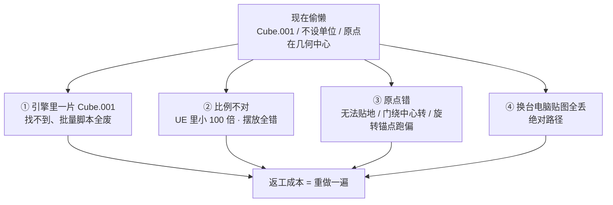
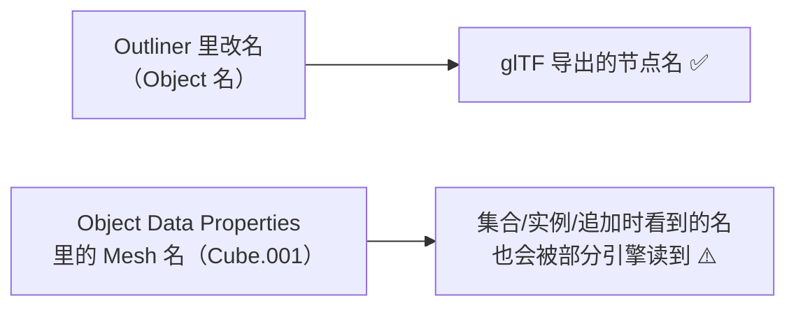
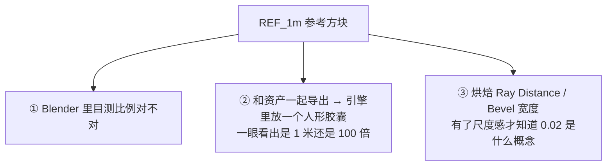
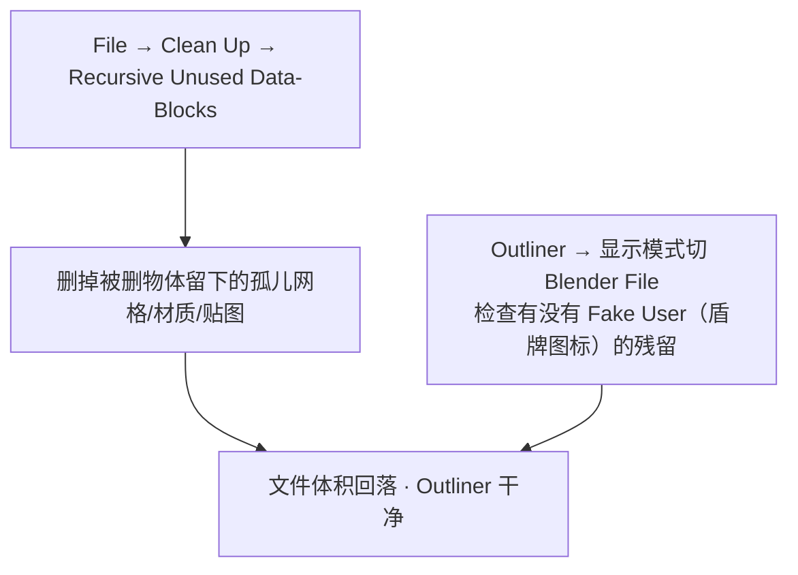

# 01 · 资产规范：命名 / 目录 / 单位 / 原点

> 一句话：**规范不是形式主义，是让「6 个月后的你」和「别人」还能直接拿起你的资产用。**
> 本阶段最先要定死的东西——因为改名、改单位、改原点，越往后改代价越大（UV、烘焙、贴图全跟名字和路径绑定）。

---

## 一、不规范会付出什么代价



> 这四件事的共同点：**在 Blender 里完全看不出问题，一进引擎就全爆**。所以规范要在「导出前检查」之前就定好，而不是导出时补救。

---

## 二、命名规范

### 2.1 命名公式（本项目统一用这套）

```text
<类型前缀>_<名称>_<变体>_<序号>
例：Prop_Crate_Wood_01
    Prop_Barrel_Rust_02
    Prop_Locker_SciFi_01_Door    ← 分离件：功能点写在最后
```

| 位置 | 规则 | 反例 |
| ---- | ---- | ---- |
| 类型前缀 | `Prop_`（道具）/ `Env_`（环境）/ `Char_`（角色）/ `Veh_`（载具） | 不写前缀 |
| 名称 | 首字母大写的英文名词，**单数** | `Crates`、`箱子` |
| 变体 | 材质/风格（Wood / Rust / SciFi），无则省略 | `new`、`final2`、`v3` |
| 序号 | 两位数字 `_01`，**永远保留**，方便以后出变体 | 只用 `_1` |
| 分离件 | 功能点后缀：`_Door` / `_Lid` / `_Handle` | `_part2` |

### 2.2 引擎侧前缀（导出/导入后再改，或一开始就对齐）

| 引擎 | 静态网格 | 骨骼网格 | 贴图 | 材质 |
| ---- | -------- | -------- | ---- | ---- |
| **Unreal** | `SM_` | `SK_` | `T_` | `M_` |
| **Unity / Godot / Bevy** | 无强制，沿用 `Prop_` 即可 | 同左 | `T_` 常见 | `M_` 常见 |

> 建议：**Blender 里用 `Prop_`，进 UE 时批量改名成 `SM_`**（UE 的资产浏览器靠前缀区分类型）。不要为了迁就某个引擎把 Blender 里的名字改得四不像——**源文件的命名只服务「人能读懂」**。

### 2.3 ⚠️ 对象名 ≠ 数据块名（90% 的人只改了前者）



- 改名要改**两处**：`F2` 改对象名 + `Properties → Object Data（绿色三角形图标）`里改 Mesh 数据名
- 复制出来的 `.001 / .002` 后缀就是数据块名残留的痕迹
- 想批量：`F3` 搜 `Batch Rename`（`Ctrl+F2`）

### 2.4 贴图命名（与 Stage 4 对齐）

```text
T_Prop_Crate_Wood_01_BaseColor.png     ← sRGB
T_Prop_Crate_Wood_01_Normal.png        ← Non-Color
T_Prop_Crate_Wood_01_ORM.png           ← Non-Color（R=AO G=Rough B=Metal）
```

> 后缀用 `BaseColor / Normal / ORM`，是为了让 Node Wrangler 的 `Ctrl+Shift+T`（一键 PBR 贴图组）**靠文件名自动识别类型并自动设 Color Space**。命名对了，导入贴图这一步从 5 分钟变 3 秒。

---

## 三、目录与文件组织

```text
资产/
├─ 练习文件/07-资产规范与引擎导出/
│   ├─ Prop_Crate_Wood_01_source.blend      ← 源文件：保留修改器，永不 Apply
│   └─ Prop_Crate_Wood_01_export.blend      ← 导出用副本（可选）
├─ 导出成品/07-资产规范与引擎导出/
│   ├─ Prop_Crate_Wood_01.glb
│   ├─ T_Prop_Crate_Wood_01_BaseColor.png
│   ├─ T_Prop_Crate_Wood_01_Normal.png
│   ├─ T_Prop_Crate_Wood_01_ORM.png
│   └─ shot_godot.png                       ← 引擎截图，验收凭证
└─ 参考图/
```

| 规则 | 为什么 |
| ---- | ------ |
| **源文件与导出副本分开**（`_source` / 复制一份再 Apply） | 在源文件里 Apply 修改器 = 迭代能力全丢（Stage 2 已踩过） |
| 导出目录名带 **Stage 前缀** | 三个月后回查时能立刻定位是哪一阶段的产物 |
| **每个资产一个 Collection** | 导出选物体容易漏；选 Collection 更稳，也便于 Append |
| 贴图用**相对路径**：`File → External Data → Make Paths Relative` | 绝对路径换电脑必丢；也可 `File → External Data → Pack Resources` 打进 .blend |
| **Save Incremental**（`Ctrl+Alt+S`） | 在 Apply / 展开 UV / 导出前存一版，做坏了能退回 |

---

## 四、单位与真实尺寸

### 4.1 场景单位设置

```text
Properties → Scene Properties（场景图标）→ Units
  Unit System:  Metric
  Length:       Meters
  Unit Scale:   1.000
```

> **Blender 内部永远是"米"**，这个设置只影响界面显示的数字。真正决定导出尺寸的是 `Unit Scale`——**除非你知道自己在干什么，否则保持 1.0**，比例问题交给引擎侧处理（见 03 篇）。

### 4.2 真实尺寸表（按这个做，进引擎不用再调）

| 资产 | 参考尺寸 |
| ---- | -------- |
| 木箱 | 0.6 × 0.6 × 0.6 m |
| 油桶（标准 55 加仑） | 直径 0.6 m · 高 0.88 m |
| 工具箱 | 0.5 × 0.25 × 0.3 m |
| 门 | 高 2.0–2.1 m |
| 台阶 / 一级 | 0.15–0.18 m |
| 桌面 | 高 0.75 m |

### 4.3 ⭐ 1 米参考方块（本阶段最实用的一招）

做第一个资产时就建一个 **1×1×1 m 的立方体**（`Cube` 默认就是 1m），命名 `REF_1m`，放进一个单独 Collection，导出时**不勾它**。

用途：



> 很多人「模型做得挺好，进引擎全废」，一半原因是**从来没有尺度参照**，全靠感觉缩放。

---

## 五、原点规则（决定能不能正确摆放）

### 5.1 三条铁律

| 资产类型 | 原点位置 | 理由 |
| -------- | -------- | ---- |
| **道具（箱 / 桶 / 柜）** | **底面正中** | 引擎里放在地面上时 `Y=0` 直接贴地，不用手动抬 |
| **角色** | **脚下**（两脚之间地面） | 同理，且旋转/寻路锚点正确 |
| **分离件（门 / 盖 / 把手）** | **功能枢轴**：门=铰链侧、盖=后侧边、把手=安装面 | 做动画时绕正确的轴转 |

### 5.2 怎么设

```text
① 选中物体 → Shift+Ctrl+Alt+C（Set Origin）→ Origin to Geometry 先归到几何中心
② 再手动：把 3D 光标放到目标位置（选中目标顶点 → Shift+S → Cursor to Selected）
③ Shift+Ctrl+Alt+C → Origin to 3D Cursor
④ 或者更省事：物体底面贴 Z=0 → Set Origin → Origin to 3D Cursor（光标在世界原点）
```

> macOS 上 `Shift+Ctrl+Alt+C` 可能与输入法/系统快捷键冲突。**按不出来就 `F3` 搜 `Set Origin`**。
> 顺序铁律：**先 Set Origin，再 `Ctrl+A → Scale / Rotation`**（反了原点和缩放会互相影响，见 Stage 2 的坑）。

---

## 六、数据块卫生（导出前的最后一步）



| 操作 | 作用 |
| ---- | ---- |
| `File → Clean Up → Purge`（可连点几次） | 清掉无用户的数据块 |
| `File → Clean Up → Recursive Unused Data-Blocks` | 一次清干净（含嵌套） |
| 材质上的**盾牌图标（Fake User）** | 勾上 = 即使没被使用也保留。导出前检查有没有误勾的废材质 |
| `Object → Relations → Make Single User` | 把 `Alt+D` 的共享数据块拆开（想做变体时必须） |

> 孤儿数据不清理的后果：文件越滚越大、Append 时选到一堆鬼东西、导出时偶尔带上多余材质槽 → draw call 莫名变多。

---

## 七、坑

- ❌ **只改对象名不改 Mesh 数据名** → 引擎里/Append 时看到 `Cube.001`
- ❌ **命名里写中文或空格** → 部分引擎/脚本处理异常，用英文 + 下划线
- ❌ **`final_final_v3.blend`** → 用 `Save Incremental` 的 `_001` 后缀，别手打版本名
- ❌ **场景文件里 `Ctrl+A → All Transforms`** → 所有物体塌到世界原点（**只有单资产文件才 Apply Location**）
- ❌ **不做真实尺寸，全靠缩放** → 进引擎后每个资产都要手动调比例，且纹素密度全不一样
- ❌ **先 Apply Scale 再 Set Origin** → 顺序反了
- ❌ **贴图用绝对路径** → 换电脑全丢 → `Make Paths Relative`
- ❌ **删了物体不 Purge** → 孤儿数据堆积
- ❌ **不建参考方块** → 比例全靠猜，UE 里 100 倍的坑迟早踩

---

## 八、自检

| # | 自检点 | 通过标准 |
| - | ------ | -------- |
| ① | 命名 | 拿到一个资产，能立刻说出它叫什么、什么材质、第几号；对象名与数据名一致 |
| ② | 目录 | 源文件 / 导出成品 / 贴图 / 截图各就各位，路径是相对路径 |
| ③ | 单位 | `Scene Units` 设成 Metric/Meters，且资产是真实尺寸 |
| ④ | 原点 | **实操**：给木箱、门、角色各设一次原点，说出各自的规则 |
| ⑤ | 参考 | 场景里有 `REF_1m`，且不参与导出 |
| ⑥ | 卫生 | Purge 之后 Outliner 里没有 `.001` 和孤儿材质 |

---

## 九、速查

```text
【命名】
Prop_<名称>_<变体>_<序号>     例：Prop_Crate_Wood_01
分离件加功能后缀：_Door / _Lid / _Handle
UE 侧前缀：SM_ 静态 / SK_ 骨骼 / T_ 贴图 / M_ 材质
贴图：<资产名>_BaseColor / _Normal / _ORM   ← 让 Ctrl+Shift+T 自动识别
⚠️ 改两处：对象名（F2）+ Mesh 数据名（Object Data Properties）
批量改名：Ctrl+F2 / F3 搜 Batch Rename

【目录】
_source.blend（保留修改器，永不 Apply）→ 复制 → 导出
资产/练习文件/07-…/ · 资产/导出成品/07-…/ · 资产/参考图/
每个资产一个 Collection ｜ 贴图相对路径 Make Paths Relative
Apply / 展 UV / 导出前 → Ctrl+Alt+S (Save Incremental)

【单位】
Scene Properties → Units → Metric / Meters / Unit Scale 1.000
⭐ 建一个 1×1×1m 的 REF_1m 参考方块，放进独立 Collection 且不导出

【原点】
道具 → 底面正中    角色 → 脚下    门 → 铰链侧    盖 → 后侧边
Shift+Ctrl+Alt+C = Set Origin（按不出来 → F3）
顺序：Set Origin → Ctrl+A Scale → Ctrl+A Rotation

【卫生】
File → Clean Up → Recursive Unused Data-Blocks（可 Purge 几次）
检查 Fake User（盾牌）残留 ｜ Alt+D 共享数据块 → Make Single User
```

---

> **下一步**：[`02-面数预算-LOD与draw-call.md`](02-面数预算-LOD与draw-call.md) —— 名字起好了，接下来要知道「这个箱子允许用多少面」。
