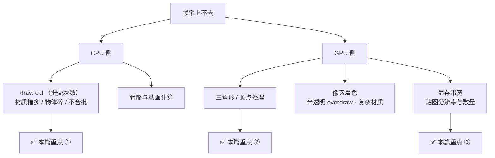
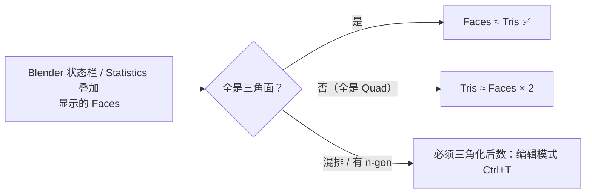
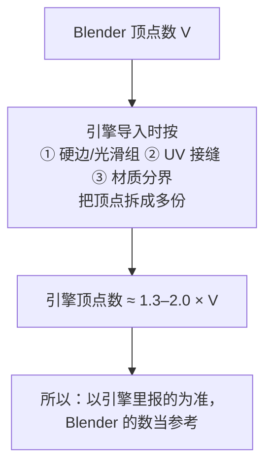
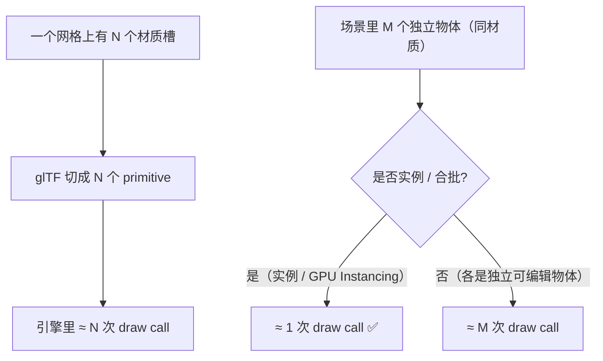
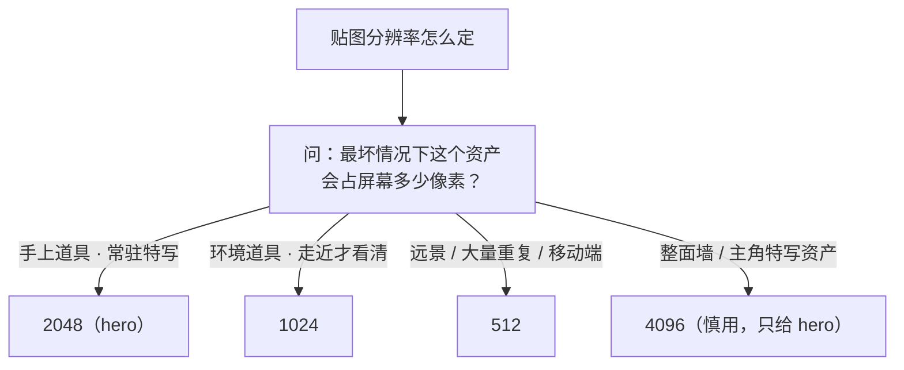

# 02 · 面数预算 · LOD · draw call

> 一句话：**预算不是"越少越好"，是"在目标平台上用最少的面骗过眼睛"。**
> 本篇回答三个问题：这个箱子能用多少面？面是怎么被吃掉的？除了面还有什么会拖垮帧率？

---

## 一、先搞清楚：帧率是被什么吃掉的



> **新手最容易搞反的一件事**：现代硬件下，**往往先卡在 draw call 而不是三角形数**。
> 一个 3000 面的箱子用一个材质，比 8 个 100 面的螺丝（8 个材质）跑得快得多。

---

## 二、面数预算表（三角形数）

| 资产类型 | 移动端 | PC / 主机 | UE5 Nanite |
| -------- | ------ | --------- | ---------- |
| 手持道具（枪、刀） | 1,500 | 4,000 | 不适用（骨骼） |
| 环境道具（桶、箱、工具箱） | 800 | 2,500 | 不限（仍需 LOD0 兜底） |
| 中小型道具（椅子、路灯） | 1,200 | 4,000 | 不限 |
| 载具车身 | 8,000 | 25,000 | 不限 |
| 主角角色 | 3,000 | 10,000 | 不适用（骨骼） |
| NPC / 次要角色 | 1,500 | 5,000 | 不适用（骨骼） |
| 建筑模块（墙 / 地板） | 200 | 800 | 不限 |

> ⚠️ 这些是**业界常见参考区间**，不是标准。真实项目的预算来自「同屏有多少个同类资产 × 目标帧率」，做自己的项目时要按性能分析倒推。
> 练习阶段的价值在于：**给自己一个上限，逼自己学会做取舍**。

---

## 三、⚠️ Blender 里怎么看三角形数（很多人看错了）



| 方法 | 操作 |
| ---- | ---- |
| ⭐**最准**：临时三角化 | 编辑模式 `A` 全选 → `Ctrl+T` → 看状态栏 Tris 数 → `Ctrl+Z` 撤销 |
| 状态栏 / `Viewport Overlays → Statistics` | 勾上后视口左上角显示 Faces / Tris / Verts（Tris 项在编辑模式下更可靠） |
| 引擎导入后看 | 引擎给的才是最终值（见下） |

> **引擎里的数字永远比 Blender 里大**，这不是出错：



---

## 四、面是怎么被吃掉的（按杀伤力排序）


| 项 | 默认 | 游戏资产建议 | 说明 |
| -- | ---- | ------------ | ---- |
| **Cylinder 段数** | 32 | **12–16**（桶）/ 8–10（小圆柱） | 加 `Shade Smooth by Angle` 后 12 段看着就很圆 |
| **UV Sphere** | 32×16 | **16×8** 或直接用 Ico Sphere 2 级 | 球体在道具上很少，多用半球/胶囊 |
| **Bevel Segments** | 1–3 | **1–2**（靠 Shade Smooth by Angle 补视觉） | 3 段以上只有在 hero 特写上才值 |
| **SubD 级别**（视口/渲染） | 2 | **2 足够**，导出前确认真实 tri | 3 级只在需要极平滑时用 |
| **螺丝 / 铆钉** | 建模 | ❌ 不做实体 → **烤进 Normal 贴图** | 一个螺丝 ≈ 100+ tri，做 20 个就是 2000 tri |

> **Bevel 的真实代价举例**：一个 800 tri 的箱子，所有边加 3 段倒角 → 轻松破 4000 tri。
> 换成 `1 段 + Shade Smooth by Angle + Normal 贴图` → 1000 tri 出头，肉眼看几乎一样。

### 必删的三类面

```text
① 永远贴地/贴墙看不到的底面、背面
② 物体内部的面（布尔残留、闭合内腔）
③ 被完全遮挡的细节（盖子下面的结构、螺丝孔内壁）
```

---

## 五、LOD（Level of Detail）

### 5.1 为什么需要 & glTF 的尴尬

- 核心 glTF 规范**没有 LOD**；各家靠扩展（`MSFT_lod`）或引擎自己的系统
- 所以最稳的做法：**导出多个 mesh，用命名让引擎/你自己识别**

```text
Prop_Crate_Wood_01_LOD0      ← 最精细，近景
Prop_Crate_Wood_01_LOD1      ← 约 50% tri
Prop_Crate_Wood_01_LOD2      ← 约 25% tri
Prop_Crate_Wood_01_LOD3      ← 远景剪影（可只有几十 tri）
```

### 5.2 各引擎怎么做

| 引擎 | LOD 机制 |
| ---- | -------- |
| **Unity** | `LOD Group` 组件，把多个 mesh 拖进各级；或 `Mesh Simplifier` 自动减面 |
| **Unreal** | 静态网格编辑器里 `LODs → Auto Compute LODs`，或手动导入各级 |
| **Godot 4** | `GeometryInstance3D → Visibility Range`（按距离切），或用 `Mesh LOD` / `Auto LOD` 生成 |
| **Bevy** | 无内置，靠 `bevy_asset_lod` 之类社区方案或手动切换 |
| **UE5 Nanite** | 理论上免做 LOD，但**骨骼网格不支持**，且**仍需一个像样的 LOD0**（Nanite 的 fallback mesh / 世界位置偏移场景） |

> **练习阶段的建议**：给**一个大件**做一次 LOD0–LOD2（比如科幻储物柜），体会「砍到 25% 还能不能认出来」。小道具（箱/桶）不做 LOD。

### 5.3 减面手段

```text
手工：删支撑线 → 删看不见的面 → 合并共面 → 降圆柱段数
自动：Decimate 修改器（Ratio / Collapse 模式，⚠️ 会毁拓扑与 UV，只用于 LOD 级）
     ⚠️ Decimate 之后 UV 基本废掉，LOD 级通常沿用 LOD0 的贴图即可
```

---

## 六、draw call：比面数更先爆的那个指标



| 预算 | 移动端 | PC / 主机 |
| ---- | ------ | --------- |
| draw call / 帧 | **100–300** | 1,000–3,000（视引擎与 API） |

**三条降 draw call 的手段**

1. **合并材质**：一个道具 1–2 个材质槽。木 + 铁不要做两个材质球 → 一张 BaseColor 贴图分区画（材质 ID 思路）
2. **合并网格**：静态、同材质、永远一起出现的物体 → `Ctrl+J` 合并（但**分离件别合**：门、盖要能单独动）
3. **用实例**：重复的桶、箱 → `Alt+D` 链接复制 / 引擎侧 GPU Instancing（glTF 的 `EXT_mesh_gpu_instancing`，导出面板里若有对应选项可开）

> ⚠️ **别为了省 draw call 把所有东西合成一个巨大的 mesh**：会破坏视锥剔除（相机看到一角也要提交整个网格）。
> 正确做法：**按空间区域合并**（Stage 7 会展开）。

---

## 七、贴图与显存预算

| 分辨率 | 单张 RGBA 体积 | 含 mipmap（×1.33） |
| ------ | -------------- | ------------------ |
| 512 | 1 MB | ~1.3 MB |
| 1024 | 4 MB | ~5.3 MB |
| 2048 | 16 MB | ~21 MB |
| 4096 | 64 MB | ~85 MB |



- 一个道具通常 **3 张图**：BaseColor + Normal + ORM（见 Stage 4）
- 移动端整场景纹理预算：~100–200 MB；PC：1–2 GB
- 能用 **共用贴图集（atlas / trim sheet）** 就别每个资产一套图 —— 省内存也省 draw call

---

## 八、坑

- ❌ **把 Blender 的 Faces 当 tri 交给别人** → Quad 模型实际 tri 是 2 倍 → 超预算一倍还不知道
- ❌ **不看引擎报的数** → 引擎已经按硬边/UV 接缝拆过顶点了
- ❌ **Bevel 给 3–4 段** → 面数爆炸；游戏资产用 1–2 段 + `Shade Smooth by Angle`
- ❌ **SubD 视口 2 级就以为导出也是这个数** → 导出勾 `Apply Modifiers` 才是最终面数
- ❌ **把螺丝做成实体** → 20 个螺丝 = 2000 tri = 一个主角角色
- ❌ **为了 draw call 把整个场景 `Ctrl+J` 合成一个** → 视锥剔除失效，帧率反而更差
- ❌ **LOD 级用 `Decimate` 减完还指望 UV 能用** → UV 已废；LOD 沿用 LOD0 的贴图
- ❌ **移动端给 2048** → 一个道具吃掉 21MB
- ❌ **做 Nanite 就完全不做 LOD0** → fallback / 骨骼场景仍然需要一个合理的最低模

---

## 九、自检

| # | 自检点 | 通过标准 |
| - | ------ | -------- |
| ① | 会数面 | **实操**：`Ctrl+T` 三角化看 Tris，说出 Blender 数与引擎数的差异原因 |
| ② | 预算 | 报出「环境道具 / 手持道具 / 主角」在移动端的 tri 上限 |
| ③ | 找杀手 | 给一个超预算的模型，3 分钟内指出面数主要被哪一项吃掉（Bevel / SubD / 分段 / 布尔 / 内部面） |
| ④ | 降面 | **实操**：把一个 4000 tri 的箱子砍到 1500 以内且肉眼可辨 |
| ⑤ | draw call | 说出「材质槽 → primitive → draw call」的链路，以及三条降 draw call 手段 |
| ⑥ | 贴图 | 说出 1024 / 2048 的含 mipmap 体积，并给一个道具选对分辨率 |

---

## 十、速查

```text
【预算 tri】移动端｜PC
手持道具   1500｜4000     环境道具   800｜2500
载具车身   8000｜25000    主角角色   3000｜10000
建筑模块    200｜800

【数面】
⚠️ Blender 状态栏的 Faces ≠ Tris（Quad 模型 ×2）
最准：编辑模式 A → Ctrl+T 三角化 → 看 Tris → Ctrl+Z
引擎里的顶点数 ≈ 1.3–2.0 × Blender 顶点数（硬边/UV/材质分界会拆点）

【面数杀手】① Bevel Segments ② SubD 级别 ③ 圆柱默认 32 段 ④ 布尔碎边 ⑤ 看不见的面 ⑥ 实体螺丝
Cylinder 32→12-16 ｜ Sphere 32×16→16×8 ｜ Bevel 1-2 段 ｜ SubD 2 级
必删：贴地底面 · 贴墙背面 · 内部面 · 完全被遮挡的结构

【LOD】
glTF 核心规范没有 LOD → 用命名 ..._LOD0 / _LOD1 / _LOD2（约 50% / 25%）
Unity LOD Group ｜ UE Auto Compute LODs ｜ Godot Visibility Range ｜ Nanite 免 LOD（但骨骼不支持）
减面：手工删线 → Decimate（会毁 UV，只用于 LOD 级）

【draw call】
材质槽 → glTF primitive → 引擎 draw call
移动端 100-300 / 帧 ｜ PC 1000-3000 / 帧
降：① 合并材质（道具 1-2 个）② 合并网格（同材质且一起出现；分离件别合）③ 用实例
⚠️ 别把整个场景合成一个 mesh → 视锥剔除失效；按空间区域合并

【贴图】512=1.3MB ｜ 1024=5.3MB ｜ 2048=21MB ｜ 4096=85MB（均含 mipmap）
分辨率按「最坏情况下占多少屏幕像素」定；能用 atlas/trim sheet 就别每资产一套
```

---

> **下一步**：[`03-单位与轴向-跨引擎坐标系.md`](03-单位与轴向-跨引擎坐标系.md) —— 比例和朝向，是导出时最容易翻车的两件事。
