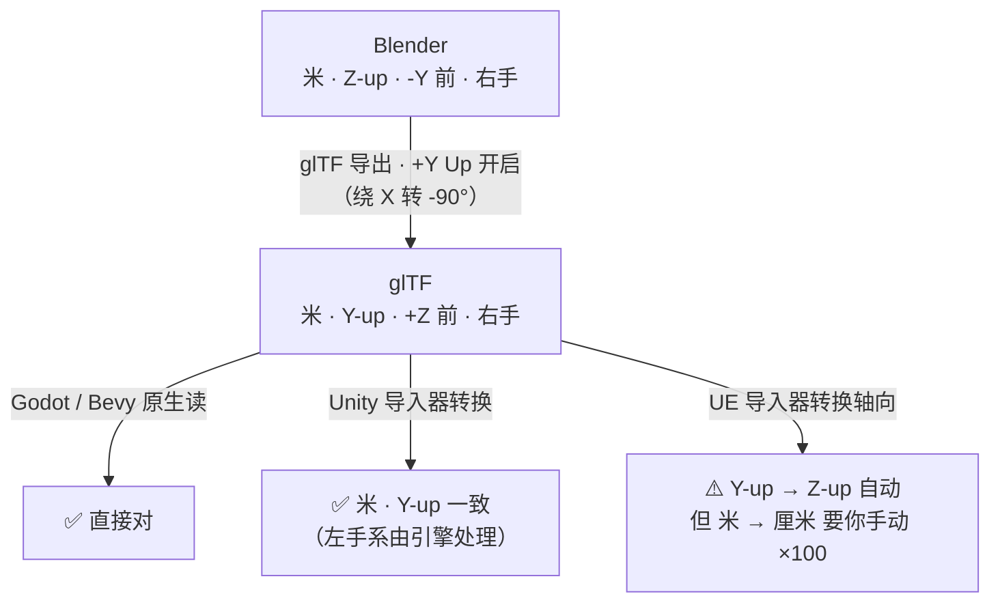
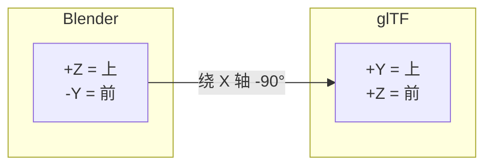
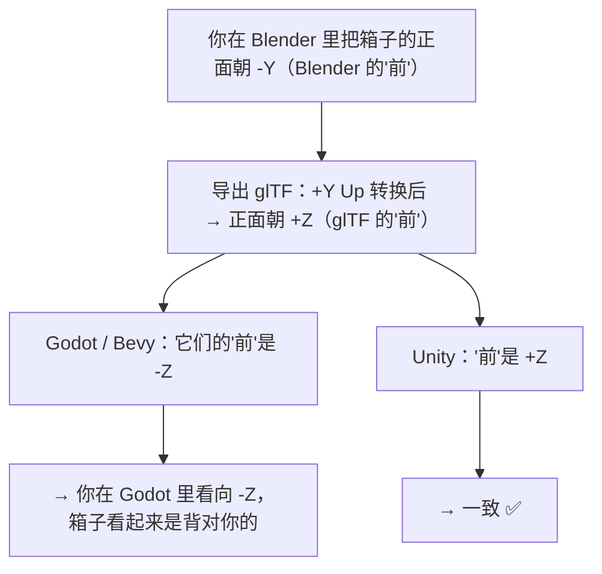
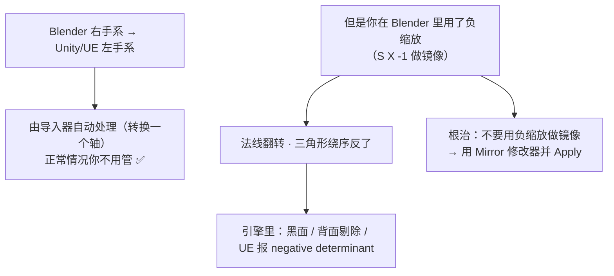

# 03 · 单位与轴向：跨引擎坐标系

> 一句话：**单位错一次（×100），轴向错一次（躺倒），合起来就是"我明明做对了怎么进引擎全乱"。**
> 本篇是 Stage 6 所有"导入后比例/朝向不对"问题的根因说明。

---

## 一、三套坐标系（先背这张表）

| 软件 / 引擎 / 格式 | 单位 | Up 轴 | Forward（正面朝向） | 手性 |
| ------------------ | ---- | ----- | ------------------- | ---- |
| **Blender** | 米（m） | **+Z** | **−Y** | 右手 |
| **glTF 2.0（规范）** | 米（m） | **+Y** | **+Z** | 右手 |
| **Unity** | 米（m） | +Y | +Z | **左手** |
| **Unreal Engine 5** | **厘米（cm）** | **+Z** | **+X** | **左手** |
| **Godot 4** | 1 unit ≈ 米 | +Y | **−Z** | 右手 |
| **Bevy** | 米（m） | +Y | **−Z** | 右手 |



> **关键认知**：轴向（Up/Forward）**导入器基本都会自动转换**，你只要勾对 `+Y Up`；
> **单位（米 vs 厘米）几乎不会自动转换**——因为格式里根本没有可靠的"这是米"的声明。这就是 100 倍坑的由来。

---

## 二、`+Y Up` 到底做了什么



- glTF 规范规定 **Y-up**，所以 Blender 导出时默认勾选 `Transform → +Y Up`，把模型整体转过去
- **静态资产永远保持 ON**（Unity / Godot / UE / Bevy 都吃这一套）
- 关掉它 = 导出 Z-up 的 glTF，属于**违反规范**，绝大多数引擎会把你的模型放倒

---

## 三、UE5 的 100 倍（本阶段最著名的坑）

### 3.1 为什么会是 100 倍

```text
Blender 里：木箱边长 0.6（米）
glTF 文件里：0.6（规范规定单位是米，数值原样写入）
UE 里读到：0.6，但 UE 的单位是厘米 → 0.6 cm = 6 毫米的箱子
正确答案：60（cm）
```

### 3.2 两种解法（推荐第一种）

| 解法 | 做法 | 评价 |
| ---- | ---- | ---- |
| ⭐ **引擎侧缩放** | UE 导入时 `Import Uniform Scale = 100`（或 `Transform → Import Uniform Scale`） | **推荐**。源文件保持真实米制，一处设置、全局生效，不影响纹素密度与烘焙 |
| 场景单位法 | 在 Blender 里把 `Scene → Units → Unit Scale` 改为 0.01 再导出 | ⚠️ **不同版本的导出器对 Unit Scale 的处理不一致**（FBX 有 `Apply Unit` 选项、glTF 行为也可能变）。**必须先用一个 1m 方块实测确认**，别直接用在量产上 |

> **还有一个更隐蔽的中间态**：模型**大小对了但纹素密度/烘焙参数全错**（比如 Bevel 宽度、烘焙 Ray Distance 是按米调的却按厘米生效）。
> 这就是为什么推荐"源文件始终是米、只在引擎入口处缩放"——**Blender 侧的一切经验数值（0.02 的 Ray Distance、0.005 的 Bevel）都基于米制**。

### 3.3 一套永久的验证物

```text
REF_1m          1×1×1 m 立方体
REF_Human       1.8 m 高的胶囊体（代表玩家身高）
REF_Forward     一个小箭头，指向模型"正面"
```
三个一起导出（放独立 Collection，验证完再排除），进引擎一眼看出：
**大小对不对 · 朝向对不对 · 比例对不对**。

---

## 四、朝向（Forward）差异：为什么模型"背对着你"



| 现象 | 根因 | 处理 |
| ---- | ---- | ---- |
| 模型在 Godot / Bevy 里转了 180° | Blender 的"前"(−Y) 与 Godot/Bevy 的"前"(−Z) 在 `+Y Up` 转换后差 180° | **在 Blender 里建模时就朝 +Y 建正面**（这样转换后是 +Z…仍与 −Z 相反）→ 最省事的是**进引擎后整体旋转 180°**，或建模时就把正面朝 **+Y** 并在引擎侧确认一次 |
| 模型在 UE 里侧着 | UE 的前是 +X | UE 导入器的轴向转换通常已处理；仍有偏差就在蓝图/场景里转一次 |

> ⚠️ 这一段各引擎/各导入器版本行为有差异，**不要背结论，只背方法**：
> **建模时给资产定一个明确的正面 → 导出时带上 `REF_Forward` 箭头 → 进引擎看一眼 → 差多少度就在引擎/源文件里补多少度，然后锁死这个约定写进你自己的笔记。**

---

## 五、手性（左手/右手）与"镜像"问题



| 症状 | 排查 |
| ---- | ---- |
| 导入后一片黑 / 只看到内壁 | `Overlays → Face Orientation` 检查（红色=朝内）→ `Shift+N` 重算外法线 |
| 引擎报 negative scale / determinant | 找到负缩放的物体 → `Ctrl+A → Scale` 把 −1 烘进网格 → 再 `Shift+N` |
| 镜像侧的贴图是反的 | UV 手性问题（见 Stage 3 `Winding` 检查），不是坐标系问题 |

---

## 六、FBX 的单位是个"约定俗成"，不是标准

- FBX 格式里**有**单位字段，但**各家写入与读取的解释不一致**（Autodesk 系默认厘米，Blender 系导出米或按 `Apply Unit` 处理）
- Blender 的 FBX 导出面板有 `Transform → Apply Unit` 之类的开关：**它会把场景单位（Unit Scale）应用到导出数据上**
- 5.x 对骨骼轴向做过重做（见 06 篇），但**单位这块的历史包袱没变**

> **对策（通用）**：
> **FBX 的单位永远按"不信任"处理** —— 每次用新引擎/新链路，先导出 `REF_1m` 走一遍，确认倍率后写进你的导出预设说明里。
> 不要相信"上次是对的，这次肯定也对"（换引擎、换版本、换插件都会变）。

---

## 七、坑

- ❌ **导出时关掉 `+Y Up`** → 模型躺倒（glTF 规范是 Y-up，别自创）
- ❌ **UE 导入忘了 ×100** → 箱子只有 6 mm
- ❌ **靠在 Blender 里缩放模型来适配引擎** → 纹素密度、Bevel 宽度、烘焙 Ray Distance 全跟着变，一次调完下次又乱
- ❌ **用负缩放（S X -1）做镜像** → 法线翻转、引擎报 negative determinant → 用 Mirror 修改器并 Apply
- ❌ **没有参照物就判断"大小对不对"** → 一定要有 `REF_1m` / `REF_Human`
- ❌ **为不同引擎维护不同尺度的源文件** → 一个资产一个真相；缩放只在引擎入口做
- ❌ **以为 FBX 会像 glTF 一样稳定地传递米制** → FBX 的单位要实测

---

## 八、自检

| # | 自检点 | 通过标准 |
| - | ------ | -------- |
| ① | 表格 | 不看资料说出 Blender / glTF / Unity / UE5 / Godot 的单位、Up、Forward、手性 |
| ② | +Y Up | 说出它做了什么变换，以及静态资产为什么必须开 |
| ③ | 100 倍 | 说出 UE5 导入 GLB 的推荐解法，并说出为什么"在 Blender 里改缩放"是下策 |
| ④ | 参照物 | **实操**：建 `REF_1m` + `REF_Human` + `REF_Forward`，随资产导出并在引擎里验证 |
| ⑤ | 负缩放 | 说出负缩放的两个后果与根治办法 |
| ⑥ | FBX | 说出为什么 FBX 的单位必须实测，以及"每次换链路先跑 REF_1m"的原则 |

---

## 九、速查

```text
【坐标系】
Blender  米 · +Z up · -Y 前 · 右手
glTF     米 · +Y up · +Z 前 · 右手   ← 规范强制
Unity    米 · +Y up · +Z 前 · 左手
UE5      厘米 · +Z up · +X 前 · 左手
Godot4   米 · +Y up · -Z 前 · 右手
Bevy     米 · +Y up · -Z 前 · 右手

【+Y Up】静态资产永远 ON（绕 X -90°，把 Blender 的 Z-up 转成 glTF 的 Y-up）

【UE5 100 倍】
⭐ 引擎侧：Import Uniform Scale = 100
   下策：Blender 里改 Unit Scale / 缩放模型（会带歪纹素密度与烘焙参数）
   源文件永远保持米制；缩放只在引擎入口做一次

【参照物三件套】REF_1m（1 米方块）· REF_Human（1.8m 胶囊）· REF_Forward（正面箭头）
  放在独立 Collection，验证完排除出导出

【朝向】别背结论背方法：定正面 → 带箭头导出 → 引擎看一眼 → 补角度 → 写进自己的约定

【负缩放】S X -1 → 法线翻 · 绕序反 · UE 报 negative determinant
  根治：用 Mirror 修改器并 Apply；已发生的 → Ctrl+A Scale 烘进去 → Shift+N
  检查：Overlays → Face Orientation（红色 = 朝内）

【FBX 单位】格式有单位字段但各家解释不一 → 不信任原则：换引擎/版本先跑 REF_1m
```

---

> **下一步**：[`04-导出前检查与清理-Apply决策树.md`](04-导出前检查与清理-Apply决策树.md) —— 坐标系搞明白了，接下来是动手把资产收拾干净。
