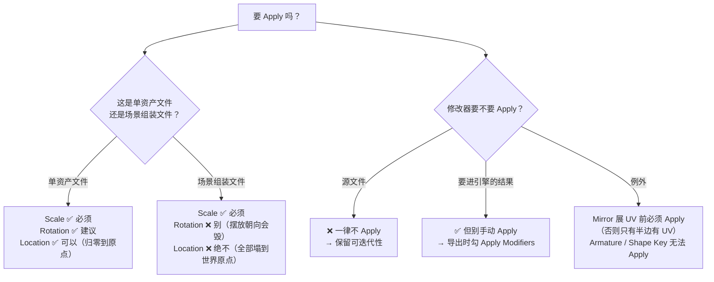
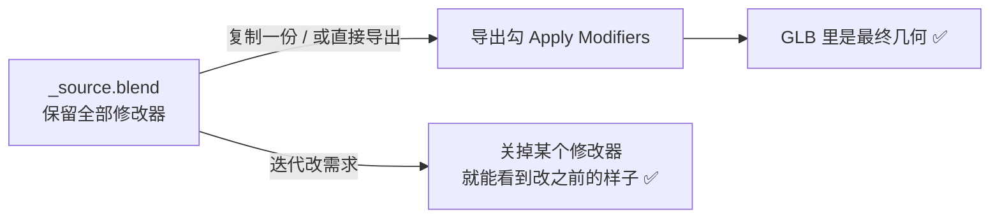
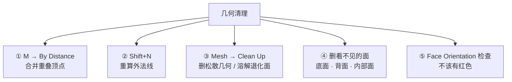

# 04 · 导出前检查与清理（含 Apply 决策树）

> 一句话：**Apply 不是"全都 Apply"，是"知道每个操作会毁掉什么，再决定 Apply 什么"。**
> 本篇把 [`../速查/导出检查清单.md`](../速查/导出检查清单.md) 那份可打印清单背后的**理由和取舍**讲清楚——清单告诉你做什么，本篇告诉你为什么。

---

## 一、⭐ Apply 决策树（本阶段最该记住的一张图）



### 1.1 变换三兄弟

| 操作 | 静态道具（单资产文件） | 场景组装文件 | 为什么 |
| ---- | ------------------- | ----------- | ------ |
| `Ctrl+A → Scale` | ✅ **必须** | ✅ **必须** | Scale ≠ 1 会让 Bevel 宽度不均、烘焙错位、引擎里莫名缩放 |
| `Ctrl+A → Rotation` | ✅ 建议 | ❌ 别 | 会毁掉你在场景里摆好的朝向 |
| `Ctrl+A → Location` | ✅ 可以（把物体挪到世界原点） | ❌ **绝不** | 场景文件里做这个 = 所有道具塌到世界原点（Stage 2 已踩） |
| `Ctrl+A → All Transforms` | 单资产文件可以 | ❌ 灾难 | 同上 |

> **顺序铁律**：`Set Origin` → `Ctrl+A → Scale` → `Ctrl+A → Rotation`（Stage 2 的坑：反了原点和缩放会互相影响）。

### 1.2 修改器：Apply 还是不 Apply

| 修改器 | 处理 | 说明 |
| ------ | ---- | ---- |
| **Mirror** | 展 UV / 布尔前**必须** Apply（或者干脆导出时勾 Apply Modifiers） | 不 Apply 就展 UV → 只有半边有 UV（Stage 3 坑） |
| **Bevel / Subdivision / Solidify** | **靠导出时的 `Apply Modifiers`** | 在源文件里 Apply = 迭代能力全丢 |
| **Array / Scatter on Surface**（5.0 几何节点版） | 要合并/布尔/导出成单一网格 → **开 `Realize Instances`** | 默认输出实例，不开就"完全没反应"（Stage 2 坑） |
| **Armature** | ❌ 永远不 Apply | 它是变形器，不是建模修改器 |
| 有 **Shape Keys** 时 | ❌ 无法 Apply 其他修改器 | Shape Key 存在会阻止 Apply，需要先删/烘焙 |



> **一句话**：**源文件不 Apply，导出时 Apply。** 这样你既能在 GLB 里拿到最终几何，又保住了 `.blend` 的可迭代性。

---

## 二、几何清理（五件事）



| 操作 | 位置 | 注意 |
| ---- | ---- | ---- |
| **Merge by Distance** | 编辑模式 `A` → `M` → `By Distance` | 默认阈值极小，不够就在左下角 `Adjust Last Operation` 里调大；**别一次调太大**会把合法细节合并掉 |
| **重算法线** | 编辑模式 `A` → `Shift+N`（Recalculate Outside） | 局部翻了的边用 `Alt+N → Flip` |
| **Delete Loose Geometry** | `Mesh → Clean Up → Delete Loose Geometry` | 清孤立顶点/边 |
| **Degenerate Dissolve** | `Mesh → Clean Up → Degenerate Dissolve` | 清面积为零的面（布尔后常见） |
| **Fill Holes** | `Alt+F` | 补洞；复杂洞用 `F2` 或 `Grid Fill` |
| **面朝向检查** | `Overlays → Face Orientation` | **红色 = 法线朝内**，引擎里会看不见或全黑 |

> ⚠️ **顺序**：先 `Merge by Distance`（合并顶点）→ 再 `Shift+N`（重算法线）。反过来会因为重复顶点导致法线算不对。

---

## 三、UV 与材质的最后检查（指向前两个阶段）

| 检查 | 怎么做 | 详细 |
| ---- | ------ | ---- |
| UV 已展开且已排布 | UV 编辑器看岛是否都在 0–1 内 | [Stage 3](../04-UV与贴图坐标/笔记.md) |
| 需要烘焙的话：无重叠 | `UV → Select → All by Trait → Overlap` | 不烘焙时**故意重叠是正确优化** |
| 棋盘格无拉伸 | 用 `UV Grid` 检查图，且**检查图分辨率 = 最终贴图分辨率** | 同上 |
| 第二套 UV（光照贴图） | 有就确认存在且已排布 | `U → Lightmap Pack` 勾 `New UV Map` |
| 材质只用 Principled + 贴图 | 无 Mix RGB / 程序化纹理 | [Stage 4](../05-材质PBR与烘焙/笔记.md) |
| 色彩空间审计 | BaseColor = sRGB，其余 = Non-Color | 同上 |
| **贴图已存盘** | `Image → Save` / `Alt+S` | 烘焙完不存 = 导出后全丢，**且不报错** |
| 材质槽 ≤ 2 | 一个材质 ≈ 一次 draw call | 见 02 篇 |

---

## 四、场景清理（容易被忘的五项）

```text
[ ] 删掉所有 Empty（空物体）—— 会被导出成多余节点
[ ] 删掉参考图（Image Mesh Plane）与 REF_1m / REF_Human / REF_Forward
[ ] 相机 / 灯光：不需要就在导出面板关掉 Cameras / Punctual Lights
[ ] 每个资产一个 Collection，导出选 Collection 而不是挨个选物体
[ ] ⚠️ 别靠"隐藏"来排除物体（各版本行为不一致）→ 用 Limit to: Selected Objects 或移出集合
```

> **隐藏物体的坑**：不同版本的导出器对"视口隐藏 / 渲染隐藏"的物体处理方式不一致（有的照导、有的跳过）。
> **永远用 `Limit to: Selected Objects` 明确指定**，不要用隐藏当开关。

### 附加：你可能想带上导出的东西

| 项 | 用途 |
| -- | ---- |
| **Custom Properties → extras** | 导出面板勾 `Custom Properties`，可把碰撞类型、交互标记等元数据带进 glTF（部分引擎能读） |
| **Vertex Colors** | 勾 `Geometry → Vertex Colors`，移动端常用它做染色 / 廉价 AO |
| **第二套 UV** | 自动导出为 `TEXCOORD_1`，引擎的光照贴图通道会用到 |

---

## 五、完整检查清单（复制用）

```text
【几何】
[ ] Ctrl+A → Scale（必须 1,1,1）；单资产文件可再 Apply Rotation
[ ] 原点正确（道具底面正中 / 角色脚下 / 门铰链）
[ ] M → By Distance 合并重叠顶点
[ ] Shift+N 重算外法线；Face Orientation 无红色
[ ] Mesh → Clean Up：删松散几何 + 溶解退化面
[ ] 删掉看不见的面（底面 / 背面 / 内部面）
[ ] tri 数在预算内（Ctrl+T 三角化后数）

【UV / 材质】
[ ] UV 已展开 + 已 Pack；烘焙的话无重叠
[ ] 棋盘格无拉伸（检查图分辨率 = 最终贴图分辨率）
[ ] 只用 Principled BSDF + 贴图
[ ] BaseColor = sRGB；Normal / ORM / AO / Roughness / Metallic = Non-Color
[ ] 材质槽 ≤ 2（道具）
[ ] 贴图已存盘到磁盘（PNG / JPEG）

【场景】
[ ] 删除 Empty / 参考图 / REF_ 参照物 / 多余相机灯光
[ ] 一个资产一个 Collection
[ ] 命名规范：Prop_Crate_Wood_01（对象名 + 数据名）
[ ] Purge 孤儿数据块
[ ] Save Incremental 存一版

【导出】
[ ] Format: glTF Binary (.glb)
[ ] Limit to: Selected Objects
[ ] Apply Modifiers: ON
[ ] +Y Up: ON
[ ] UVs / Normals: ON；Tangents: OFF
[ ] Draco: 按需（先确认引擎支持解码）
[ ] Animation: OFF（静态道具）
[ ] 保存为导出预设，下次一键复用

【导入后】
[ ] 比例正确（UE5 需 Import Uniform Scale = 100）
[ ] 朝向正确（用 REF_Forward 验证过一次）
[ ] 材质视觉与 Blender 基本一致
[ ] 面数 / draw call 符合预算
[ ] 控制台无导入报错
[ ] 截图存档到 资产/导出成品/07-…/
```

---

## 六、坑

- ❌ **场景文件里 `Ctrl+A → All Transforms`** → 所有道具塌到世界原点
- ❌ **先 Apply Scale 再 Set Origin** → 顺序反了
- ❌ **在源文件里 Apply 修改器** → 迭代能力全丢 → 用导出时的 `Apply Modifiers`
- ❌ **Mirror 没 Apply 就展 UV** → 只有半边有 UV
- ❌ **新 Array / Scatter 没开 `Realize Instances`** → 合并/布尔/导出成单网格全没反应
- ❌ **先 `Shift+N` 再 Merge by Distance** → 顺序反了，重复顶点导致法线算错
- ❌ **靠隐藏物体来"不导出"** → 各版本行为不一致 → 用 `Limit to: Selected Objects`
- ❌ **忘了删 Empty** → 引擎里多一堆空节点
- ❌ **贴图没存盘就导出** → GLB 里没图，**且不报错**
- ❌ **导出前不 Save Incremental** → Apply 之后回不去了
- ❌ **把 SubD 视口级别当成最终面数** → 导出 Apply Modifiers 之后才是真数（可能 ×16）

---

## 七、自检

| # | 自检点 | 通过标准 |
| - | ------ | -------- |
| ① | 决策树 | 拿到一个资产，能说出 Scale/Rotation/Location 各自 Apply 不 Apply 及理由 |
| ② | 修改器 | 说出"源文件不 Apply、导出时 Apply"的原则，以及 Mirror 的例外 |
| ③ | 清理顺序 | 说出 Merge by Distance 与 Shift+N 的正确顺序及原因 |
| ④ | 实操 | **不看清单**，把一个道具从脏状态收拾到可导出（5 分钟内过完一遍） |
| ⑤ | 材质收尾 | 说出导出前材质侧必查的 4 项（色彩空间 / 存盘 / 材质槽 / 无专有节点） |
| ⑥ | 排除法 | 说出为什么不能用"隐藏"排除物体，正确做法是什么 |

---

## 八、速查

```text
【Apply 决策】
Scale       ✅ 永远必须（1,1,1）
Rotation    单资产文件 ✅ ｜ 场景文件 ❌
Location    单资产文件 ✅ ｜ 场景文件 ❌（会塌到世界原点）
All Transforms：只有单资产文件能用
顺序：Set Origin → Ctrl+A Scale → Ctrl+A Rotation

【修改器】
源文件一律不 Apply → 导出时勾 Apply Modifiers
例外：Mirror 展 UV 前必须 Apply ｜ Armature 永不 Apply ｜ Shape Key 会阻止 Apply
新 Array / Scatter：要合并或导出单网格 → 开 Realize Instances

【清理顺序】M → By Distance（先）→ Shift+N（后）
Mesh → Clean Up：Delete Loose Geometry · Degenerate Dissolve
补洞 Alt+F ｜ 面朝向检查 Overlays → Face Orientation（红=朝内）

【场景清理】删 Empty · 参考图 · REF_* · 多余相机灯光
每个资产一个 Collection
⚠️ 别用隐藏排除物体（版本行为不一）→ 用 Limit to: Selected Objects

【可选带上导出】Custom Properties(extras) · Vertex Colors · 第二套 UV(TEXCOORD_1)

【必查】贴图已存盘 ｜ 色彩空间审计 ｜ 材质槽 ≤2 ｜ tri 在预算内
```

---

> **下一步**：[`05-GLB-glTF导出全解.md`](05-GLB-glTF导出全解.md) —— 收拾干净了，打开导出面板逐项过一遍。
