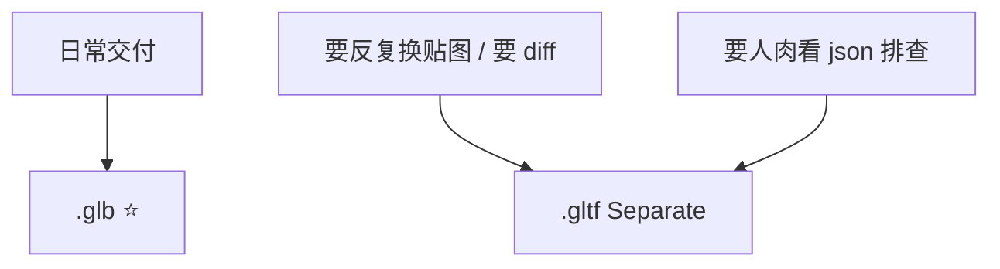
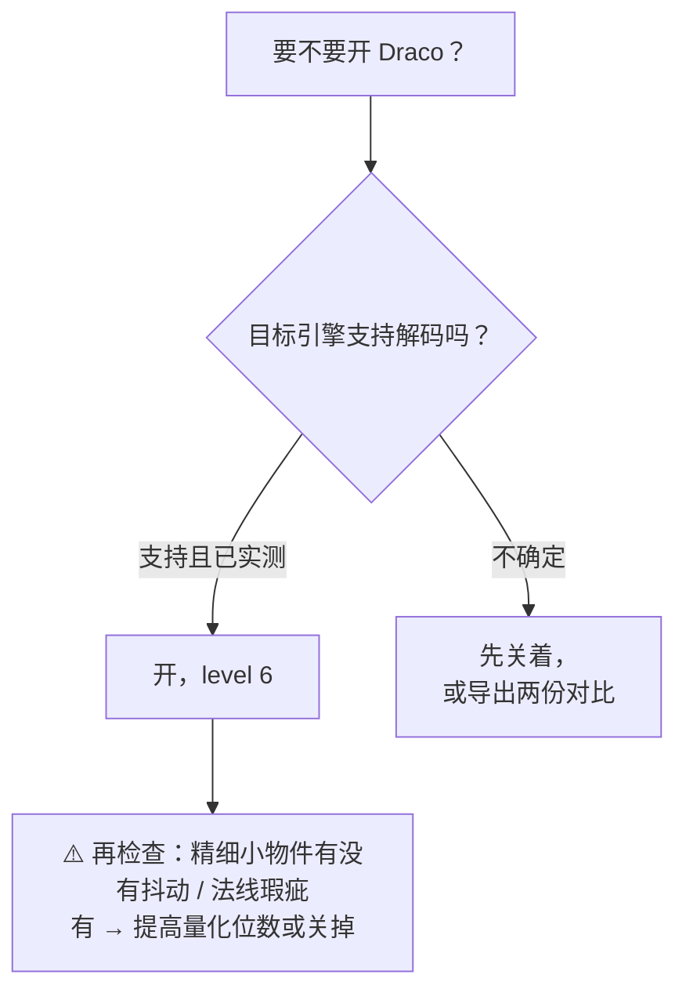
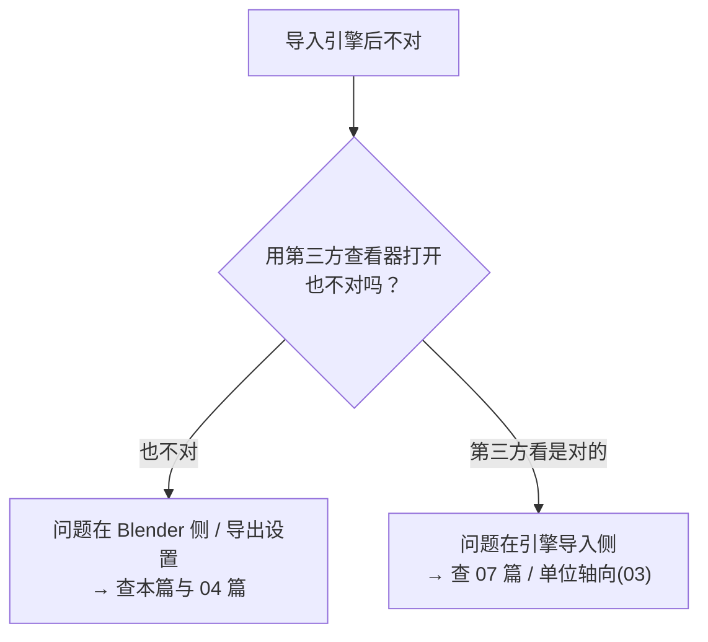

# 05 · GLB / glTF 导出全解

> 一句话：**导出面板上每一个开关，都对应"引擎里会发生什么"——没有一个是中性的。**
> 依据：官方手册 · [glTF 2.0 导出](https://docs.blender.org/manual/en/latest/addons/import_export/scene_gltf2.html)。
> ⚠️ 面板项的名称和位置在不同版本会有变动，**按不出来就 `F3` 搜命令名，或按名字在面板里找**；下文标注 ⚠️ 的项请以你的 5.2 界面为准。

---

## 一、先选格式：.glb / .gltf / .gltf embedded

| 格式 | 内容 | 什么时候用 |
| ---- | ---- | ---------- |
| ⭐ **glTF Binary (.glb)** | 单文件，贴图内嵌 | **默认选择**。交付、导入引擎、分享 |
| **glTF Separate (.gltf + .bin + 贴图)** | 一个 json + 一个二进制 + 一堆贴图文件 | 需要**改贴图/改 json** 迭代时（贴图可单独替换不用重导） |
| **glTF Embedded (.gltf)** | 单文件，贴图 base64 内嵌 | 少见；文本可读但体积最大 |



---

## 二、导出面板逐项（静态资产视角）

路径：`File → Export → glTF 2.0 (.glb/.gltf)`

### 2.1 Include（包含什么）

| 项 | 静态资产设置 | 说明 |
| -- | ----------- | ---- |
| **Limit to: Selected Objects** | **ON** ⭐ | 只导出你选中的（或选中 Collection 里的）。别用"隐藏"排除，见 04 篇 |
| Custom Properties (extras) | 按需 | 把自定义属性写进 glTF 的 `extras`，可带碰撞类型等元数据 |
| Cameras | **OFF** | 除非你想把 Blender 相机带进引擎 |
| Punctual Lights | **OFF** | 灯光交给引擎；带上会有 `KHR_lights_punctual` 兼容问题 |

### 2.2 Transform

| 项 | 设置 | 说明 |
| -- | ---- | ---- |
| **+Y Up** | **ON** ⭐ | glTF 规范是 Y-up；关掉 = 模型躺倒（见 03 篇） |

### 2.3 Geometry（几何）⭐ 这一段最容易翻车

| 项 | 设置 | 说明 |
| -- | ---- | ---- |
| **Apply Modifiers** | **ON** ⭐ | 不开 → SubD / Bevel / Mirror 全丢（Stage 6 头号坑） |
| **UVs** | **ON** | 没有 UV = 贴图全废 |
| **Normals** | **ON** | 顶点法线；不开引擎会重算，你的硬边全变软 |
| **Tangents** | **OFF** ⭐ | 引擎导入时会按标准重算；导出来反而容易与引擎算法冲突出接缝 |
| **Vertex Colors** | 按需 | 移动端常用它做染色 / 廉价 AO（glTF 里是 `COLOR_0`） |
| **Materials** | **Export**（不是 None / Placeholder） | 设成 None → 引擎里一片白；Placeholder → 只有材质名没有贴图 |
| **Loose Edges / Points** | OFF | 除非你要导出线框/点云 |
| **GPU Instances** ⚠️ | 按需 | 若有此选项：把重复实例写成 `EXT_mesh_gpu_instancing`，省 draw call（引擎支持度需实测） |

> **关于 Tangents 的补充**：法线贴图需要切线空间。引擎（Unity / UE / Godot）在导入时会按 **MikkTSpace** 重算切线，这与 Blender 内部一致——所以导出 Tangents 属于"多此一举且可能冲突"。**保持 OFF**。

### 2.4 Material / Images ⚠️

| 项 | 建议 | 说明 |
| -- | ---- | ---- |
| Materials 模式 | `Export` | 见上 |
| 图像格式 ⚠️ | `Automatic` 起步 | 部分版本提供 `Automatic / JPEG / WebP / None` 与质量滑杆。glTF 规范只认 **PNG / JPEG** 与 WebP（扩展），其他格式 Blender 会自动转换（变慢） |
| 贴图压缩 | **不在这一步做** | 贴图压缩交给引擎（UE 的 BC/ASTC、Unity 平台压缩、Godot VRAM Compressed）。**glTF 阶段导 PNG/JPEG 就行** |

### 2.5 Animation（静态资产全关）

| 项 | 静态道具 | 说明 |
| -- | -------- | ---- |
| Animations | **OFF** | 有动画才开 |
| Shape Keys / Shape Key Normals | **OFF** | 变形目标（表情 / 破损状态）才用 |
| Skinning | **OFF** | 骨骼蒙皮才用 |
| Force Keep Channels / Optimize Animation Size | — | 动画相关，见 06 篇 |

### 2.6 Compression（压缩）

| 项 | 建议 | 说明 |
| -- | ---- | ---- |
| **Draco** | 按需，**先验证引擎支持** | 几何压缩，体积降 40–70%，一次性的 CPU 解码开销 |
| Compression Level | **6**（常用折中） | 0–10，越高越慢越小；6 之后再往上收益递减 |
| Quantization（量化位数） | 默认起步 | 位置/法线/UV 的量化精度。**位数不够会让精细小物件出现抖动和法线瑕疵** |
| Meshopt ⚠️ | 若你的版本有 | 与 Draco 二选一。解码更快、压缩率略低 |



> **引擎支持度（需你自行实测确认）**：Godot 4 内置支持 ✅；Three.js 需 `DRACOLoader` ✅；Unity 常用 glTFast 支持 ✅；**UE5 与 Bevy 的支持情况请用一个测试资产先跑一遍再决定**。
> 不确定时：**不开 Draco 也能交付**，体积大一点而已，别拿"导入失败"换"文件小"。

---

## 三、静态资产推荐预设（抄这个）

```text
Format:            glTF Binary (.glb)
Include → Limit to: Selected Objects
Include → Custom Properties: 按需（一般 OFF）
Include → Cameras / Punctual Lights: OFF
Transform → +Y Up: ON                 ⭐
Geometry → Apply Modifiers: ON        ⭐
Geometry → UVs: ON
Geometry → Normals: ON
Geometry → Tangents: OFF              ⭐
Geometry → Vertex Colors: 按需
Geometry → Materials: Export
Animation → Animations / Shape Keys / Skinning: OFF
Compression → Draco: 按需（先验证引擎支持），level 6
```

> 存成预设（见第五节）后，以后就是 **选物体 → 导出 → 选预设 → 回车**，10 秒。

---

## 四、⭐ 三分法排错：先证明"文件本身是对的"



**验证工具（中立第三方，不依赖你的目标引擎）**

| 工具 | 用途 |
| ---- | ---- |
| **Khronos glTF Validator** | 校验文件是否符合规范，会直接报出错误与警告 |
| **Babylon.js Sandbox / glTF Viewer**（在线或本地） | 拖进去看一眼：几何、材质、贴图、动画是否正常 |
| **VS Code glTF 插件** | 直接看 json 结构，查 `materials` / `images` / `meshes` |

> **这一步省不得**：没有它，你会一直在"到底是 Blender 导出错了还是 UE 导入错了"之间反复横跳，浪费的时间远超拖一次文件进去的 30 秒。

---

## 五、保存导出预设（一劳永逸）

```text
① File → Export → glTF 2.0
② 在导出面板里把所有选项调成你的预设值
③ 文件浏览器右侧边栏（按 N 打开）→ Operator Presets → "+" → Add Preset
④ 命名：GLB_Static_Prop（或按引擎分：GLB_Static_Godot / GLB_Static_UE）
⑤ 下次：导出 → 右上角 Presets 下拉选它 → 一键复用
```

预设文件存在 Blender 配置目录的 `scripts/presets/operator/export_scene.gltf/` 下，**可以拷出来备份 / 换电脑时带过去**。

| 建议保存的预设 | 用途 |
| -------------- | ---- |
| `GLB_Static_Prop` | 静态道具（默认 90% 的场景） |
| `GLB_Static_Prop_Draco` | 需要压体积时 |
| `GLTF_Separate_Debug` | 出问题时导成 separate 看 json |
| `GLB_Animated` | 带动画/骨骼（见 06 篇） |

---

## 六、坑

- ❌ **没勾 `Apply Modifiers`** → SubD / Bevel / Mirror 全丢，模型变成一堆方块
- ❌ **开了 `Tangents`** → 引擎重算后反而出接缝
- ❌ **`Materials` 设成 None / Placeholder** → 引擎里一片白
- ❌ **`Limit to: Selected Objects` 忘了选物体** → 导出整个场景（含参考图、Empty、灯光）
- ❌ **靠隐藏物体排除** → 各版本行为不一致
- ❌ **贴图没存盘** → GLB 里没图且不报错
- ❌ **贴图用了 TGA / EXR / TIFF** → 会被自动转换，导出变慢，偶尔出错 → 用 PNG / JPEG
- ❌ **盲目开 Draco** → 引擎不支持 = 导入失败；或量化太低 = 精细物件抖动
- ❌ **在 Blender 里压贴图** → 交给引擎的平台压缩去做
- ❌ **开着 `Cameras` / `Punctual Lights`** → 引擎里多出一堆没用的对象
- ❌ **导出前不看一眼第三方查看器** → 排错时在 Blender 和引擎之间反复横跳

---

## 七、自检

| # | 自检点 | 通过标准 |
| - | ------ | -------- |
| ① | 格式 | 说出 .glb / .gltf separate / embedded 三种的适用场景 |
| ② | 面板 | **实操**：不看笔记把静态道具预设调一遍，并说出 `Tangents OFF` 的理由 |
| ③ | 压缩 | 说出 Draco 的取舍、level 取值、以及"先验证引擎支持"的原则 |
| ④ | 预设 | **实操**：保存一个 `GLB_Static_Prop` 预设并能一键复用 |
| ⑤ | 三分法 | 说出"Blender 侧 / glTF 文件 / 引擎侧"的排错分界与用到的中立工具 |
| ⑥ | 材质 | 说出 `Materials` 三种模式的区别，以及导出前贴图侧必查的两件事（存盘 + PNG/JPEG） |

---

## 八、速查

```text
【格式】.glb 单文件贴图内嵌（默认）｜ .gltf Separate 要改贴图时 ｜ .gltf Embedded 少见

【静态道具预设】
Format: glTF Binary (.glb)
Limit to: Selected Objects ｜ Cameras/Lights: OFF
+Y Up: ON   ⭐
Apply Modifiers: ON   ⭐
UVs/Normals: ON ｜ Tangents: OFF   ⭐
Materials: Export（不是 None/Placeholder）
Animation / Shape Keys / Skinning: OFF
Draco: 按需（先验证引擎），level 6

【Draco】几何压缩 40-70% ｜ 一次性 CPU 解码开销
level 6 常用 ｜ 量化位数不够 → 小物件抖动 / 法线瑕疵
支持度需实测：Godot 4 ✅ · Three.js(DRACOLoader) ✅ · Unity(glTFast) ✅ · UE5/Bevy 先试
Meshopt（若有）：解码更快、压缩率略低，与 Draco 二选一

【贴图】glTF 只认 PNG / JPEG（+WebP 扩展）
⚠️ 不在 Blender 阶段压贴图 → 交给引擎的平台压缩
贴图必须已存盘（不存 = GLB 里没图且不报错）

【三分法排错】
第三方查看器也不对 → 问题在 Blender/导出（本篇+04）
第三方看是对的     → 问题在引擎导入侧（07+03）
工具：Khronos glTF Validator · Babylon Sandbox / glTF Viewer · VS Code glTF 插件

【保存预设】导出窗口 → 右侧边栏(N) → Operator Presets → "+" → Add Preset
建议：GLB_Static_Prop ｜ GLB_Static_Prop_Draco ｜ GLTF_Separate_Debug ｜ GLB_Animated
预设文件在 scripts/presets/operator/export_scene.gltf/ 可备份带走
```

---

> **下一步**：[`06-FBX与骨骼动画资产导出.md`](06-FBX与骨骼动画资产导出.md) —— 主线走 GLB，但角色和动画资产还是要过一遍 FBX。
