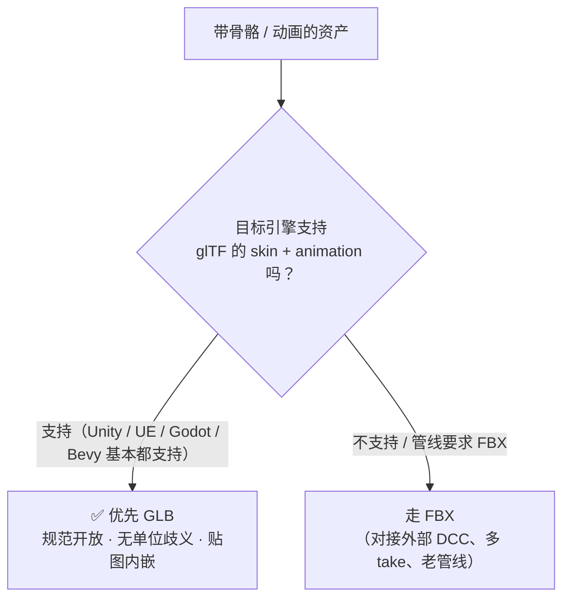
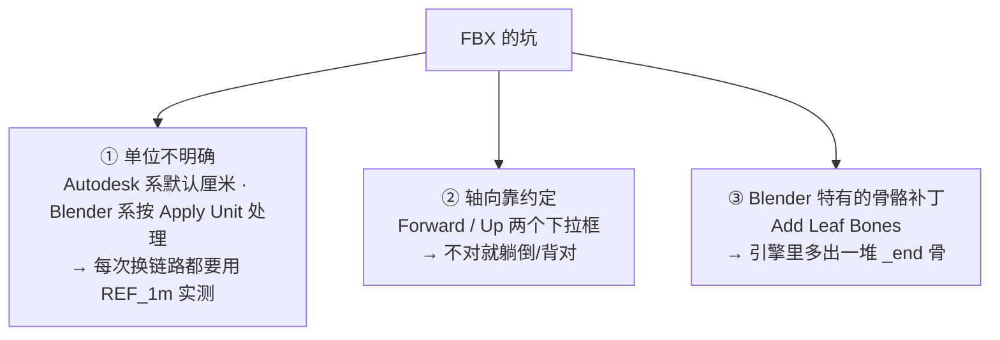
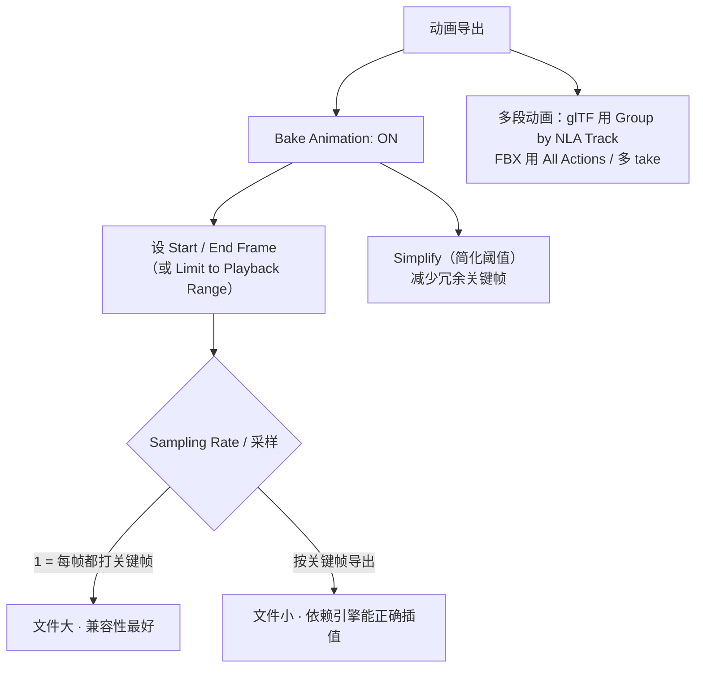

# 06 · FBX 与骨骼动画资产导出

> 一句话：**静态道具走 GLB；"角色 / 骨骼 / 动画"没有那么必须用 FBX —— 先试 GLB，FBX 只在管线明确要求时用。**
> 本篇是支线性质：如果 Stage 6 你只做静态道具，`06` 可以只花 30 分钟扫一遍，把 `GLB_Animated` 预设留着以后用。

---

## 一、先破一个迷信："角色必须用 FBX"



| 维度 | **GLB（glTF 2.0）** | **FBX** |
| ---- | ------------------- | ------- |
| 规范 | 开放标准，Khronos 维护 | Autodesk 私有格式（SDK 授权） |
| 单位 | **规范规定米** ✅ | ⚠️ 有单位字段但各家解释不一（见 03 篇） |
| 轴向 | **规范规定 Y-up** ✅ | ⚠️ 靠 Forward/Up 选项约定 |
| 贴图 | 可内嵌 | 可选内嵌，但常被拆出来丢在外面 |
| 骨骼 / 动画 | ✅ skin + animation | ✅ |
| Blend Shape | ✅ morph targets | ✅ blendshapes |
| 多段动画 | ⚠️ 靠 NLA track 分组 | ✅ 多 take（老管线习惯） |

> **结论**：现代引擎里 GLB 已经能吃下骨骼动画。**FBX 的价值主要在"与外部工具/老管线对接"**。
> 路线图里那句"带骨骼层级的角色 / 动画资产用 FBX 更稳"——在 5.x 时代要打折扣看：**先拿一个简单骨骼资产试 GLB，能通就别上 FBX**。

---

## 二、FBX 的三个历史包袱



| 项 | FBX 导出建议 | 说明 |
| -- | ----------- | ---- |
| **Apply Unit** ⚠️ | 与 `Scene → Units → Unit Scale` 联动 | 把场景单位应用到导出数据上。**开着时改 Unit Scale 会直接改变导出尺寸** —— 这就是"FBX 忽大忽小"的根源 |
| **Forward / Up** | 通常保持默认（Blender 系：Forward −Z / Up Y）；引擎侧不对再调 | ⚠️ 默认值以你的版本为准，**先跑 REF_1m + REF_Forward 验证** |
| **Apply Modifiers** | **ON** | 同 glTF；不开修改器全丢 |
| **Add Leaf Bones** | **OFF**（进 UE 等） | 默认 ON 会在每条骨骼链末端补一根小尾巴骨（`_end`），多数引擎不需要且会污染骨骼数 |
| **Only Deform Bones** | 按需（一般 ON） | 只导出带形变的骨，把 IK/控制器骨排除掉 |
| **Bake Animation** | 有动画才开 | 见下节 |
| **Triangulate** ⚠️ | 若面板有此项 | 引擎最终都会三角化，开着能让 Blender 侧的面数=引擎面数，便于对预算 |

---

## 三、骨骼轴向（Primary / Secondary Bone Axis）

Blender 的骨骼是"有长度的一段"，FBX 里的骨骼是"一个变换节点"，两者映射需要指定轴向：

| 选项 | 作用 | 建议 |
| ---- | ---- | ---- |
| **Primary Bone Axis** | 骨骼的"长度方向"映射到哪个轴 | **默认值先用**（通常是 Y） |
| **Secondary Bone Axis** | 骨骼的"侧向/滚转"参考轴 | **默认值先用**（通常是 X） |
| Armature FBXNode Type ⚠️ | Armature 导出成 Null 还是 Root | 保持默认；引擎里层级不对再试 |

> ⚠️ 路线图提到 **5.0 重做了骨骼轴向处理**，行为可能与 4.x 教程描述不同。
> **排错方法（别背结论）**：默认值导出一次 → 引擎里看骨骼有没有歪 → 歪了就**每次只改一个轴**、改完再导一次，直到对。**把最终组合写进你的导出预设说明**。

---

## 四、动画导出



| 检查项 | 说明 |
| ------ | ---- |
| **Rest Pose vs Current Pose** | ⚠️ 确认导出的是你想要的那一个（有的引擎会强制以 rest pose 导入） |
| **Armature 与 Mesh 都要 Apply Scale** | 骨骼缩放 ≠ 1 会让动画在引擎里整体变形 |
| **每个顶点最多 4 根骨骼影响** | glTF 规范上限 4；Blender 允许更多 → 超出会被处理/报错。在 Weight Paint 里用 `Limit Total` 收敛 |
| **骨骼命名** | 无中文、无空格；引擎侧常按名字映射（UE 的骨骼重定向） |
| **NLA / 多动作** | 想把多个动作塞进一个文件：glTF 勾 `Group by NLA Track`；FBX 勾 `All Actions` |

---

## 五、骨骼资产导出前检查清单

```text
【变换】
[ ] Armature 与 Mesh 都 Ctrl+A → Scale（1,1,1）
[ ] 原点：角色在脚下；Armature 与 Mesh 原点一致
[ ] 面数在预算内（角色：移动 3000 / PC 10000 tri）

【骨骼】
[ ] Only Deform Bones：ON（排除 IK / 控制器骨）
[ ] Add Leaf Bones：OFF（避免 _end 尾巴骨）
[ ] 骨骼命名：英文、无空格、无中文
[ ] 每个顶点 ≤ 4 根骨骼影响（Weight Paint → Limit Total）
[ ] 无零长度骨（会让部分引擎的正向运动学出错）

【动画】
[ ] Bake Animation: ON，Start/End 正确
[ ] 确认 Rest Pose / Current Pose 是你想要的
[ ] Simplify 阈值合适（动画不抖）
[ ] 多段动画：glTF → Group by NLA Track ｜ FBX → All Actions

【通用】
[ ] Apply Modifiers: ON
[ ] 贴图已存盘
[ ] REF_1m 验证过比例（FBX 尤其重要）
[ ] 保存为 GLB_Animated / FBX_Char 预设
```

---

## 六、坑

- ❌ **默认迷信"角色必须 FBX"** → 先试 GLB，能通就别上 FBX
- ❌ **`Add Leaf Bones` 保持默认 ON** → 引擎里多出几十根 `_end` 骨
- ❌ **Armature 没 Apply Scale** → 动画在引擎里整体缩放变形
- ❌ **FBX 不看单位就量产** → 换引擎/版本就错；用 `REF_1m` 每次实测
- ❌ **改了 `Unit Scale` 但 `Apply Unit` 还开着** → 导出尺寸直接变
- ❌ **顶点权重超过 4 根骨骼** → glTF 超规范，会被处理或报错
- ❌ **导出成 Current Pose 却以为会保留 Rest Pose**（或反之）→ 引擎里 T-pose 不对
- ❌ **把 IK / 控制器骨一起导出** → 骨骼数暴涨、重定向困难 → `Only Deform Bones`
- ❌ **骨骼用中文命名** → 引擎侧映射/重定向失败
- ❌ **调 Primary/Secondary Bone Axis 时一次改两个** → 分不清是哪个起的作用

---

## 七、自检

| # | 自检点 | 通过标准 |
| - | ------ | -------- |
| ① | 选型 | 说出"角色不一定用 FBX"的理由，以及 FBX 真正不可替代的两个场景 |
| ② | 单位 | 说出 FBX 单位的不可信原则与 `REF_1m` 验证法 |
| ③ | 骨骼 | 说出 `Add Leaf Bones` / `Only Deform Bones` 各自的作用与建议值 |
| ④ | 权重 | 说出 glTF 的每顶点骨骼上限，以及超了会怎样 |
| ⑤ | 轴向 | 说出调 Primary/Secondary Bone Axis 的正确排错流程（一次只改一个） |
| ⑥ | 清单 | **实操**（做角色时）：按清单走完一遍并成功导入引擎 |

---

## 八、速查

```text
【选型】静态道具 → GLB ｜ 角色/动画 → 先试 GLB，不通再 FBX
FBX 真正不可替代：对接外部 DCC / 多 take 老管线 / 引擎明确要求

【FBX 关键项】
Apply Unit ⚠️ 与 Scene Unit Scale 联动，开着时改 Unit Scale 会改导出尺寸
Forward / Up：默认先用，不对再调（先跑 REF_1m + REF_Forward）
Apply Modifiers: ON
Add Leaf Bones: OFF（避免 _end 尾巴骨）
Only Deform Bones: ON（排除 IK/控制器骨）
Triangulate: 有就开（Blender 面数 = 引擎面数）

【骨骼轴向】Primary / Secondary Bone Axis 默认先用
⚠️ 5.0 重做过骨骼轴向处理，行为以实测为准
排错：默认导一次 → 引擎看歪不歪 → 每次只改一个轴 → 对了写进预设说明

【动画】Bake Animation ON + Start/End 正确
Sampling Rate 1 = 每帧关键帧（大·稳）｜ 按关键帧 = 小·依赖插值
Simplify 减冗余关键帧 ｜ 多段：glTF Group by NLA Track ｜ FBX All Actions
⚠️ 确认导出的是 Rest Pose 还是 Current Pose

【权重】glTF 每顶点最多 4 根骨骼 → Weight Paint → Limit Total
骨骼命名英文无空格 ｜ 无零长度骨 ｜ Armature 与 Mesh 都要 Apply Scale
```

---

> **下一步**：[`07-各引擎导入验证与排错.md`](07-各引擎导入验证与排错.md) —— 文件出来了，进引擎这一关怎么过、出问题怎么定位。
