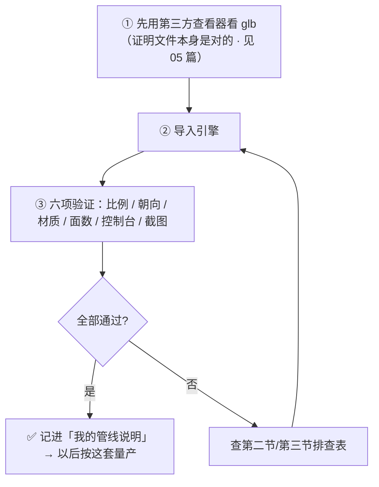
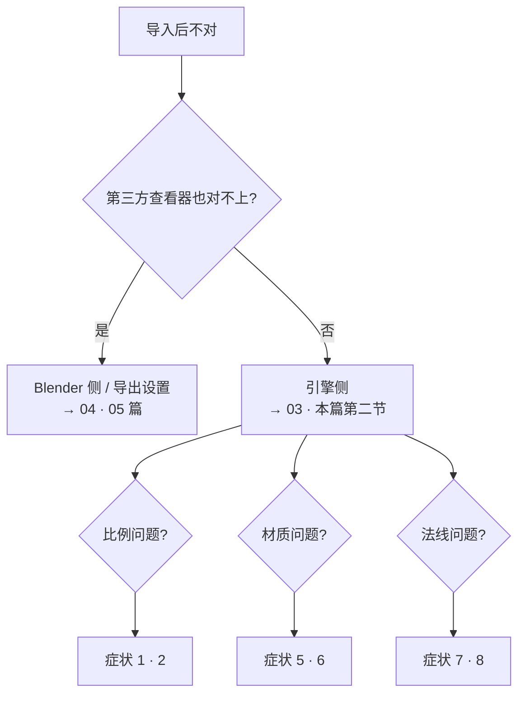

# 07 · 各引擎导入验证与排错

> 一句话：**导入成功 ≠ 完成。"导入后验证通过"才算完成。**
> 本篇给两张表：各引擎的必做设置、以及"症状 → 根因 → 排查动作"的对照表。出问题先查第二张。

---

## 一、通用导入流程（任何引擎都这么走）



> ⚠️ **铁律**：第 ① 步不能省。跳过它，你会一直在"是 Blender 错了还是引擎错了"之间反复横跳。

---

## 二、各引擎要点与必做设置

### 2.1 Godot 4 ⭐（推荐作为第一个验证目标）

| 项 | 值 / 设置 |
| -- | --------- |
| 单位 / 轴向 | 1 unit ≈ 米 · **Y-up** · 前 **−Z** · 右手 |
| 导入方式 | `.glb` 拖进 FileSystem → 自动导入 |
| ⭐ import mode | 含多个物体/层级时选 **Scene**（而不是 Mesh），才能还原节点层级 |
| 材质映射 | pbrMetallicRoughness → `StandardMaterial3D`；金属/粗糙度不对时检查该材质里 metallic / roughness 贴图的通道设置 |
| Draco | ✅ 内置支持 |
| Reimport | 选中文件 → Import 面板 → `Reimport`（改了源文件后必须做） |

### 2.2 Unity (URP / Unity 6)

| 项 | 值 / 设置 |
| -- | --------- |
| 单位 / 轴向 | 米 · **Y-up** · 前 **+Z** · 左手 |
| 导入方式 | `.glb` 放 Assets 下；Unity 6 内置 glTF 导入，**若你的版本没有就装官方 `glTFast` 包** |
| ⭐ 颜色发灰 | `Project Settings → Player → Color Space → Linear`（不是 Gamma） |
| 材质映射 | pbrMetallicRoughness → **URP/Lit** 自动映射 |
| 缩放 | Model Import Settings 里的 `Scale Factor`（FBX 常是 0.01，glTF 通常是 1） |
| 法线 | Unity 与 glTF 同为 OpenGL 约定 → 默认即正确 |

### 2.3 Unreal Engine 5

| 项 | 值 / 设置 |
| -- | --------- |
| 单位 / 轴向 | **厘米** · **Z-up** · 前 **+X** · 左手 |
| ⭐ 比例 | GLB 是米 → 导入时 **`Import Uniform Scale = 100`**（03 篇详解） |
| Nanite | 静态网格可开 → 免做 LOD；**骨骼网格不支持 Nanite** |
| ⭐ 法线 | UE 用 DirectX 约定 → 法线凹凸反了就勾贴图的 **Flip Green Channel** |
| LOD | 静态网格编辑器 → `LODs → Auto Compute LODs` |
| 材质 | 导入会生成材质与实例；AO / ORM 有时需要手动接一次，导入后逐个检查 |

### 2.4 Bevy

| 项 | 值 / 设置 |
| -- | --------- |
| 单位 / 轴向 | 米 · **Y-up** · 前 **−Z** · 右手 |
| 格式 | glTF 2.0 是官方推荐格式（`.glb` 单文件最省事） |
| ⭐ 材质 | 复杂节点会丢 → **保持 Principled 纯净**（只 Base Color / Metallic / Roughness / Normal / Emission） |
| 加载 | 用 `GltfAssetLabel::Scene(0)` 之类的标签取场景 / 网格 / 动画 |
| Draco / Meshopt | 支持度随版本变化，**先用一个资产实测** |

### 2.5 Cocos Creator

| 项 | 值 / 设置 |
| -- | --------- |
| 支持 | glTF / FBX，轴向与单位**建议先拿 1 个测试资产验证**再批量做 |
| 注意 | 把验证结果记进「我的管线说明」，别每次重新试 |

---

## 三、⭐ 症状 → 根因 → 排查动作（出问题查这张表）

| # | 症状 | 最可能的根因 | 排查动作 |
| - | ---- | ------------ | -------- |
| 1 | **模型特别小（几毫米）** | UE 的米/厘米差 | `Import Uniform Scale = 100`（03 篇） |
| 2 | **模型特别大 / 缩放乱** | Scale 没 Apply（≠1,1,1）／FBX 的 `Apply Unit` + `Unit Scale` | `Ctrl+A → Scale` 后重导；FBX 用 `REF_1m` 实测倍率 |
| 3 | **模型躺倒 / 旋转了 90°** | 导出没勾 `+Y Up`／FBX 的 Up 轴不对 | glTF：`+Y Up` ON；FBX：调 Up/Forward |
| 4 | **模型背对着你 / 差 180°** | 各引擎的 Forward 定义不同（−Z vs +Z vs +X） | 用 `REF_Forward` 验证一次，差多少补多少，写进自己的约定 |
| 5 | **一片白 / 没有材质** | 导出 `Materials = None/Placeholder`／贴图没存盘 | 改回 `Export`；`Image → Save` 存盘后重导 |
| 6 | **发灰 / 发暗 / 太油** | 色彩空间错（Normal/Rough 被当 sRGB）／引擎 Color Space 是 Gamma | 色彩空间审计（Stage 4）；Unity 改 `Linear` |
| 7 | **凹凸反了 / 光照方向错** | Normal 贴图通道约定不同（UE 是 DirectX）／Swizzle 被改过 | UE 勾 `Flip Green Channel`；Blender 侧保持 `+X/+Y/+Z` 不动 |
| 8 | **一片黑 / 只看到内壁** | 法线朝内（负缩放 / Mirror 后没重算） | `Overlays → Face Orientation` 检查 → `Shift+N` |
| 9 | **面数比 Blender 里多** | Quad 算成 tri（×2）／`Apply Modifiers` 把 SubD 烘了（×4ⁿ）／引擎按硬边拆顶点 | 用 `Ctrl+T` 数 tri；确认 SubD 级别 |
| 10 | **贴图模糊 / 远处花** | 纹素密度太低／margin 太小导致 mipmap 漏黑边／分辨率选低了 | Stage 3 的密度检查；烘焙 margin 8–16px（1024） |
| 11 | **Draco 导入失败 / 空模型** | 引擎不支持 Draco 解码 | 关掉 Draco 重导；确认后再开（05 篇） |
| 12 | **动画没了** | 导出 `Animation: OFF`／没 Bake／NLA 没分组 | 06 篇清单走一遍 |
| 13 | **分离件全挤在原点** | 场景文件里 Apply 了 Location／原点没设 | 单资产文件才 Apply Location；重设原点 |
| 14 | **多出一堆空节点 / 参考图也进来了** | 没用 `Limit to: Selected Objects`／没删 Empty 和参考图 | 04 篇场景清理 |
| 15 | **控制台报 negative scale** | 用了负缩放做镜像 | 用 Mirror 修改器并 Apply；已发生的 → `Ctrl+A Scale` + `Shift+N` |
| 16 | **顶点权重报错 / 变形诡异** | 单顶点超过 4 根骨骼影响／Armature 没 Apply Scale | `Limit Total`；Armature + Mesh 都 Apply Scale |
| 17 | **精细小物件抖动 / 法线有瑕疵** | Draco 量化位数太低 | 提高量化位数或关 Draco |
| 18 | **导入报错但看不懂** | — | 先跑 Khronos **glTF Validator**，它报的通常是根因 |



---

## 四、导入后六项验证（每次都做，做成肌肉记忆）

```text
[ ] ① 比例：和 REF_1m / REF_Human 对比，数字对得上
[ ] ② 朝向：正面朝哪、Up 是哪根轴（用 REF_Forward 验过一次后固化）
[ ] ③ 材质：颜色 / 高光 / 法线 / AO 与 Blender 的 Material Preview 基本一致
[ ] ④ 面数 / draw call：引擎报的数在预算内
[ ] ⑤ 控制台：无导入报错、无材质/贴图缺失警告
[ ] ⑥ 截图存档：存到 资产/导出成品/07-…/ 与 Blender 截图并排
```

> **③ 的比较基准是 Material Preview，不是 Rendered**。最终渲染走 View Transform（ACES / AgX），和引擎看到的不是一回事（Stage 4 已强调）。

---

## 五、把结果沉淀成「我的管线说明」

验证通过后，**把这一套写进 [`笔记.md` 的「我的记录 → 目标引擎」](笔记.md)**，内容至少包含：

```text
- 引擎 / 版本：
- 单位与轴向（含 Forward 约定）：
- 导入设置（截图 + 关键数值）：
- 导出预设名（GLB_Static_XXX）：
- 已验证过的坑（比如：法线要 Flip Green Channel / Draco 不支持）：
- 六项验证的基准截图路径：
```

> 这一步的价值：**三个月后你再做第 20 个资产时，不用重新试一遍**。管线说明是 Stage 6 真正的产出物——比模型本身更值钱。

---

## 六、坑

- ❌ **跳过第三方查看器直接怪引擎** → 排错方向从一开始就错了
- ❌ **只验证一次就认为"管线通了"** → 换资产类型（静态→骨骼）、换贴图类型（PNG→ORM）、开 Draco 都可能翻车 → **每新增一种组合都验证一次**
- ❌ **验证通过后不记录** → 下次重新试，踩同一个坑
- ❌ **用 Rendered 视图当对比基准** → 视图变换会骗你
- ❌ **改了源文件忘记 Reimport**（Godot）→ 看到的还是旧的
- ❌ **UE 里法线反了就去 Blender 改 Swizzle** → 应该在 UE 侧 `Flip Green Channel`，Blender 侧保持默认约定
- ❌ **只在 Blender 里看"感觉差不多"** → 必须有数字（tri 数、draw call、贴图尺寸）

---

## 七、自检

| # | 自检点 | 通过标准 |
| - | ------ | -------- |
| ① | 流程 | 说出"第三方查看器 → 导入 → 六项验证"的顺序与理由 |
| ② | 引擎设置 | 说出你的目标引擎的单位、Up、Forward，以及它的 1–2 个必做设置 |
| ③ | 排错 | 给一个症状（比如"UE 里箱子只有 6mm"），能立刻说出根因与动作 |
| ④ | 实操 | **实操**：一个资产完整跑通并在引擎里截到六项验证的图 |
| ⑤ | 沉淀 | 把引擎设置、预设名、已验证的坑写进「我的管线说明」 |
| ⑥ | 基准 | 说出为什么对比基准是 Material Preview 而不是 Rendered |

---

## 八、速查

```text
【流程】第三方查看器 → 导入引擎 → 六项验证（比例/朝向/材质/面数/控制台/截图）

【引擎速记】
Godot4  米 · Y-up · -Z前 · 右手 ｜ 拖入自动导入 ｜ 多物体选 import mode = Scene ｜ Draco ✅ ｜ 改源要 Reimport
Unity   米 · Y-up · +Z前 · 左手 ｜ Unity6 内置 glTF（没有就装 glTFast）｜ 发灰 → Player → Color Space = Linear
UE5     厘米 · Z-up · +X前 · 左手 ｜ ⭐ Import Uniform Scale = 100 ｜ Nanite（骨骼不行）｜ 法线反 → Flip Green Channel
Bevy    米 · Y-up · -Z前 · 右手 ｜ glTF 官方推荐 ｜ 保持 Principled 纯净 ｜ Draco 需实测
Cocos   先拿 1 个资产实测再批量

【症状速查】
小到几毫米 → UE ×100            大/乱 → Scale≠1 或 FBX Apply Unit
躺倒 → +Y Up 没开 / FBX Up 错    差 180° → Forward 约定（用 REF_Forward 定一次）
一片白 → Materials=None 或贴图没存盘   发灰/油 → 色彩空间 / Unity Color Space
凹凸反 → UE Flip Green Channel（别在 Blender 改 Swizzle）
全黑/内壁 → 法线朝内 → Shift+N
面数变多 → Quad×2 · SubD Apply（×4ⁿ）· 引擎拆顶点
贴图模糊 → 纹素密度 / margin 太小 / 分辨率低
Draco 失败 → 关掉或确认支持   动画丢 → Animation OFF / 没 Bake
分离件挤原点 → 场景文件别 Apply Location   多空节点 → 没 Limit to Selected / 没删 Empty
negative scale → 别用负缩放，用 Mirror 修改器
报错看不懂 → 跑 Khronos glTF Validator

【六项验证】比例 ｜ 朝向 ｜ 材质 ｜ 面数/draw call ｜ 控制台 ｜ 截图存档
基准用 Material Preview，不是 Rendered
```

---

> **下一步**：[`08-练习项目-三个资产进引擎.md`](08-练习项目-三个资产进引擎.md) —— 用 3 个资产把整条链路跑通，并把预设与管线说明沉淀下来。
