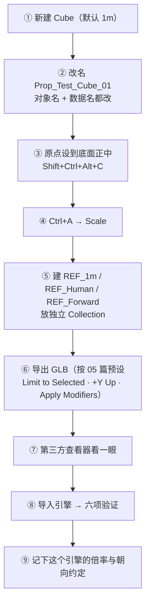
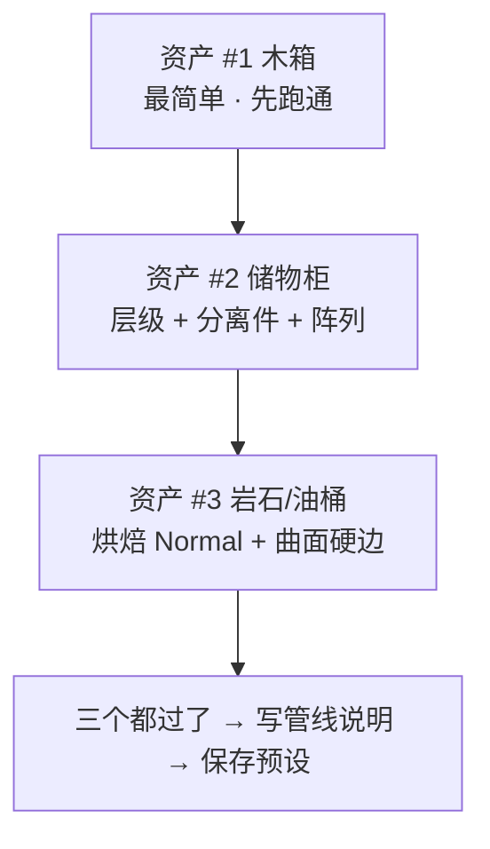

# 08 · 练习项目：三个资产进引擎（含导出预设与归档）

> 一句话：**本阶段的验收不是"我学会了导出"，是"3 个资产躺在引擎里，且每一项都对"。**
> 本篇把 01–07 串成一条可执行的流水线，并产出两份会长期复用的东西：**导出预设** 和 **管线说明**。

---

## 一、⭐ 先做这个：20 分钟极简闭环（在正式项目之前）

**目的**：第一次跑通链路时，不要拿你花了 6 小时做的工具箱。用一个 Cube，20 分钟把全流程走一遍，把坑踩完。



> 走完这 9 步，你就有了**属于你自己的那套管线**。之后所有资产都只是在复用它。
> **如果这 20 分钟不通，后面做 3 个资产只会错 3 次。**

---

## 二、正式项目：三个资产（覆盖三种典型情况）

| # | 资产 | 为什么要选它（覆盖什么） | 目标 tri | 贴图 |
| - | ---- | ----------------------- | -------- | ---- |
| 1 | **木箱**（来自 Stage 1） | 最基础的静态道具：单一网格、单一材质 | ≤ 800（移动端） | 1024 · 1 个材质 |
| 2 | **科幻储物柜**（来自 Stage 2） | **带分离件 / 层级**：门板要能单独动；有阵列与对称 | ≤ 2500（PC） | 1024 · 1–2 个材质 |
| 3 | **岩石 或 油桶**（Stage 5 / Stage 1） | 有机烘焙资产 或 圆柱类曲面：验证 Normal 与硬边 | ≤ 800 | 1024 · 1 个材质 |



> **顺序不能换**：#1 不通过就不要开始 #2（Stage 6 的铁律：管线没验证就量产，是游戏美术最常见的翻车方式）。

---

## 三、每个资产的执行步骤（照抄）

### 阶段 A · Blender 侧（每个约 10 分钟）

```text
[ ] 打开 _source.blend，Ctrl+Alt+S 存一版增量
[ ] 命名：对象名 + 数据名 → Prop_Crate_Wood_01（01 篇）
[ ] 原点：Set Origin → 道具底面正中（01 篇）
[ ] Ctrl+A → Scale（+ 单资产文件可 Apply Rotation）
[ ] 修改器：确认该 Apply 的（Mirror）已 Apply；其余交给导出时的 Apply Modifiers（04 篇）
[ ] 清理：M → By Distance → Shift+N → Clean Up → 删看不见的面（04 篇）
[ ] 数面：编辑模式 Ctrl+T → 看 Tris → Ctrl+Z（02 篇）
[ ] UV / 材质：按 Stage 3 / Stage 4 的清单过一遍（贴图已存盘！）
[ ] 场景：删 Empty / 参考图 / REF_* 之外的杂物；Purge
[ ] 每个资产一个 Collection
```

### 阶段 B · 导出（每个约 1 分钟）

```text
[ ] 选中资产 Collection（或物体）
[ ] File → Export → glTF 2.0 → 选预设 GLB_Static_Prop（05 篇）
[ ] 存到 资产/导出成品/07-资产规范与引擎导出/
[ ] 贴图一并放过去（.glb 已内嵌，但保留源文件便于替换）
```

### 阶段 C · 引擎侧（每个约 5 分钟）

```text
[ ] 第三方查看器先验证（glTF Validator / Babylon Sandbox）
[ ] 导入引擎
[ ] 六项验证：比例 / 朝向 / 材质 / 面数 / 控制台 / 截图（07 篇）
[ ] 有问题 → 查 07 篇症状表 → 回 Blender 改 → 重导 → Godot 记得 Reimport
```

---

## 四、产出物与归档结构

```text
资产/练习文件/07-资产规范与引擎导出/
├─ Prop_Crate_Wood_01_source.blend
├─ Prop_Locker_SciFi_01_source.blend
└─ Prop_Rock_01_source.blend

资产/导出成品/07-资产规范与引擎导出/
├─ Prop_Crate_Wood_01/
│   ├─ Prop_Crate_Wood_01.glb
│   ├─ T_Prop_Crate_Wood_01_BaseColor.png
│   ├─ T_Prop_Crate_Wood_01_Normal.png
│   ├─ T_Prop_Crate_Wood_01_ORM.png
│   └─ verify_blender.png / verify_engine.png   ← 对比截图
├─ Prop_Locker_SciFi_01/ …
└─ Prop_Rock_01/ …
```

| 产物 | 说明 |
| ---- | ---- |
| `_source.blend` | **保留修改器**，永不 Apply |
| `.glb` | 交付物 |
| 贴图 PNG | 与 GLB 并存，便于单独替换 |
| `verify_*.png` | **Blender 与引擎并排对比图**——验收凭证，也是给三个月后的自己看的 |

---

## 五、两份长期资产（本阶段真正值钱的东西）

### 5.1 导出预设

```text
GLB_Static_Prop          静态道具默认（05 篇第三节）
GLB_Static_Prop_Draco    需要压体积且引擎已验证支持
GLTF_Separate_Debug      出问题时导成 separate 看 json
GLB_Animated             带动画/骨骼（06 篇）
```

保存方式：导出窗口 → 右侧边栏（`N`）→ `Operator Presets` → `+` → `Add Preset`。
预设文件在 `scripts/presets/operator/export_scene.gltf/`，**可备份带走**。

### 5.2 管线说明（写进 [`笔记.md` → 我的记录](笔记.md)）

```text
引擎 / 版本：
单位与轴向（含 Forward 约定）：
导入必做设置（+ 关键数值）：
导出预设名：
已验证过的坑（法线要不要 Flip / Draco 支不支持 / 倍率多少）：
验证基准截图路径：
```

---

## 六、验收六项（三个资产全部通过才算 Stage 6 完成）

| # | 自检点 | 通过标准 |
| - | ------ | -------- |
| ① | 闭环 | 3 个资产都跑通「Blender → 导出 → 导入 → 六项验证」，且有对比截图 |
| ② | 规范 | 命名、单位、原点、Collection 组织全部符合 01 篇 |
| ③ | 预算 | 每个资产的 tri 与 draw call 都在 02 篇的预算内 |
| ④ | 排错 | 给一个"导入后不对"的场景，能立刻说出根因与动作（07 篇症状表） |
| ⑤ | 预设 | 导出预设已保存并能一键复用 |
| ⑥ | 沉淀 | 管线说明已写进笔记；目标引擎已确定并记录 |

---

## 七、坑

- ❌ **拿最复杂、最花时间的资产做第一次验证** → 出错后分不清是资产问题还是管线问题 → 先用 Cube
- ❌ **#1 没过就开始 #2** → 同样的错犯三次
- ❌ **不存 `_source.blend`** → Apply 之后回不去
- ❌ **验证通过但不记录** → 下次重新试一遍
- ❌ **不存对比截图** → 三个月后无法证明"当时是对的"，也无法复现
- ❌ **只导 GLB 不留贴图** → 以后想改贴图要整个重导
- ❌ **把练习项目当成"做模型"** → 本阶段的重点是**链路**，模型应该来自 Stage 1/2/5 已有产物

---

## 八、速查

```text
【20 分钟极简闭环】Cube → 改名 → 原点到底面 → Ctrl+A Scale → 建 REF_ 三件套
→ 导出 GLB → 第三方查看器 → 导入引擎 → 六项验证 → 记下倍率与朝向约定

【三个资产】木箱（基础静态）→ 储物柜（层级 + 分离件 + 阵列）→ 岩石/油桶（烘焙 Normal + 曲面）
⚠️ 顺序不能换：#1 不过就不要开始 #2

【每资产三步】
A Blender：命名 · 原点 · Ctrl+A Scale · 修改器 · 清理(M→By Distance → Shift+N) · 数面 · 贴图存盘 · Purge
B 导出：选预设 GLB_Static_Prop → 存到 资产/导出成品/07-…/
C 引擎：第三方查看器 → 导入 → 六项验证 → 有问题查症状表（Godot 记得 Reimport）

【归档】
资产/练习文件/07-…/ *_source.blend（保留修改器）
资产/导出成品/07-…/<资产名>/ glb + 贴图 + verify_blender.png + verify_engine.png

【长期资产】导出预设（4 个）＋ 管线说明（写进 笔记.md 我的记录）
```

---

> **下一步**：回到 [`笔记.md`](笔记.md) 做验收自检、填「我的记录」与「阶段复盘」，然后进入 Stage 7 · 场景组装与作品集（[`../08-场景组装与作品集/笔记.md`](../08-场景组装与作品集/笔记.md)）。
