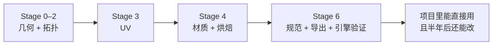
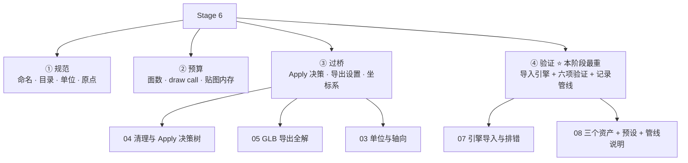
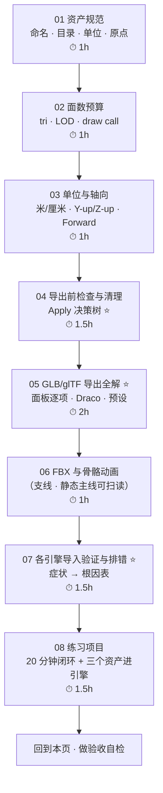
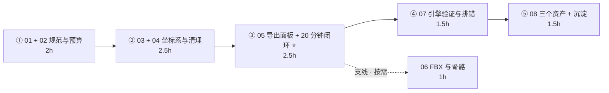

# Stage 6 · 资产规范与引擎导出（8–10h）⭐ 关键阶段

> **一句话目标**：把「做得出来」变成「能进项目」。很多人卡在这一步，前面的功夫全白费。
> ⚠️ **不要排到最后**：第 1 个道具做完就跑一次完整闭环。
> 状态：⬜ 未开始　|　开工：　　　|　完成：
> 环境：**Blender 5.2 LTS** · macOS　|　前置：`02-硬表面建模工作流`（木箱/油桶/工具箱）、`03-非破坏性流程与资产管理`（储物柜）、`04-UV与贴图坐标`、`05-材质PBR与烘焙`（贴图与烘焙产物）

---

## 0. ⚠️ 先订正：路线图 Stage 6 有 9 处说法要按 5.x 改 / 实测

照路线图学之前先看这张表。这个阶段是「Blender 里做完了」和「项目里能用」分家的地方，错一条就要重导一整轮。

| # | 路线图的说法 | **5.x 的实际情况** | 依据 |
| - | ------------ | ------------------ | ---- |
| 1 | 检查清单「UV 无重叠（若烘焙光照）」 | 方向对，说法不全。**不烘焙时，重复结构（螺丝 / 散热孔 / 对称件）的故意重叠是正确的优化**；另外若引擎侧要光照贴图，还得有**第二套 UV**（`U → Lightmap Pack` 勾 `New UV Map`） | `04-UV与贴图坐标` · Stage 3 坑 |
| 2 | 「FBX 更稳（5.0 重做了骨骼轴向处理）」 | **要打折看**。现代引擎（Unity / UE / Godot / Bevy）对 glTF 的 skin + animation 支持已成熟 → **角色/动画先试 GLB，不通再上 FBX**。FBX 真正不可替代的是：对接外部 DCC、多 take 老管线、引擎明确要求。5.0 骨骼轴向的改动**以实测为准，别照抄 4.x 教程的轴组合** | `06-FBX与骨骼动画资产导出.md` |
| 3 | UE5 「或 Blender 场景单位设 0.01」 | ⚠️ **不同版本导出器对 `Unit Scale` 的处理不一致**（FBX 有 `Apply Unit`、glTF 行为也会变）。推荐**只在引擎入口缩放**：`Import Uniform Scale = 100`，**源文件永远保持米制**——否则纹素密度、Bevel 宽度、烘焙 Ray Distance 这些基于米制的经验值全被带歪 | `03-单位与轴向-跨引擎坐标系.md` |
| 4 | 「Draco: ON, level 6（先确认引擎支持解码）」 | 补充一条：**还要看量化位数**。量化不够会让精细小物件抖动、法线出瑕疵。支持度大致为 Godot 4 ✅ / Three.js（DRACOLoader）✅ / Unity（glTFast）✅，**UE5 与 Bevy 请先用一个测试资产实测** | `05-GLB-glTF导出全解.md` |
| 5 | 「Bevy：复杂节点会丢，保持 Principled 纯净」 | 这不只 Bevy——**所有引擎都只认 Principled 的那几个输入**（Base Color / Metallic / Roughness / Normal / Emission / Alpha）。`Mix RGB`、`ColorRamp`、程序化纹理在哪个引擎都丢 | `05-材质PBR与烘焙/03-节点搭建与glTF兼容性.md` |
| 6 | 「Cocos Creator 需实测」 | 保持，但补一条通用原则：**每新增一种组合都要重新验证一次**——换引擎、开 Draco、带骨骼、带动画、换贴图类型，任何一项变了都算新管线 | `07-各引擎导入验证与排错.md` |
| 7 | 面数预算表（只给 4 类） | 补充两类（建筑模块、中小道具），并补最关键的一条：**Blender 报的 Faces ≠ Tris**——Quad 模型实际 tri 约 ×2，这是"明明没超预算却超了"的头号原因。数面用编辑模式 `Ctrl+T` 三角化后看 | `02-面数预算-LOD与draw-call.md` |
| 8 | 检查清单「删空物体 / 参考图」 | 补充反例：**别靠"隐藏"排除物体**——各版本导出器对视口/渲染隐藏的处理不一致（有的照导有的跳过）。**永远用 `Limit to: Selected Objects`** | `04-导出前检查与清理-Apply决策树.md` |
| 9 | 检查清单「需烘焙进网格的修改器已 Apply」 | 更准确的原则是：**源文件一律不 Apply，导出时勾 `Apply Modifiers`**（保住可迭代性）。例外只有：Mirror 展 UV 前必须 Apply；Armature 永不 Apply；有 Shape Key 时无法 Apply | `04-导出前检查与清理-Apply决策树.md` |

> 📌 第 2、3、7 条建议同步回 `Blender学习路线图.md`（Stage 6）；第 1、4、8、9 条同步回 [`速查/常见坑汇总.md`](../速查/常见坑汇总.md)。
> 📌 通用兜底：**快捷键按不出来或菜单对不上，一律按 `F3` 搜命令名**。

### 0.1 需要你亲自实测确认的三件事（别信任何教程的版本描述）

| # | 事项 | 怎么测 |
| - | ---- | ------ |
| ① | 目标引擎对 **Draco** 的支持 | 同一个资产导两份（开 / 关 Draco）各导一次 |
| ② | 目标引擎的 **Forward 朝向** | 用 `REF_Forward` 箭头导出验证一次，差多少度补多少度，写进你的约定 |
| ③ | **FBX 的单位倍率**（如果你要走 FBX） | 导 `REF_1m` 进引擎量一下，把倍率写进导出预设说明 |

---

## 1. 本阶段在解决什么问题

Stage 0–5 你做出的是「几何正确、拓扑干净、UV 不重叠、有 PBR 贴图」的**资产候选**。它离「项目里能用的资产」还差最后一公里：

本阶段其实是**四件事叠在一起**，很多人只做了第四件（点导出按钮）：

> **④ 是绝大多数人的失分点**：导出成功 ≠ 完成。**「导入后六项验证通过」才算完成**。
> 而且验证通过后**必须写下来**——管线说明是 Stage 6 比模型本身更值钱的产出物。

---

## 2. 学习路径（按顺序走完就是闭环）

| # | 文件 | 核心问题 | 预估 |
| - | ---- | -------- | ---- |
| 01 | [`01-资产规范-命名-目录-单位-原点.md`](01-资产规范-命名-目录-单位-原点.md) | 名字、目录、单位、原点怎么定才不会返工 | 1h |
| 02 | [`02-面数预算-LOD与draw-call.md`](02-面数预算-LOD与draw-call.md) | 这个箱子能用多少面？面是怎么被吃掉的？ | 1h |
| 03 | [`03-单位与轴向-跨引擎坐标系.md`](03-单位与轴向-跨引擎坐标系.md) | 为什么 UE 里小 100 倍、为什么模型躺倒 | 1h |
| 04 | [`04-导出前检查与清理-Apply决策树.md`](04-导出前检查与清理-Apply决策树.md) ⭐ | 该 Apply 什么、不该 Apply 什么 | 1.5h |
| 05 | [`05-GLB-glTF导出全解.md`](05-GLB-glTF导出全解.md) ⭐ | 导出面板每一项对应引擎里发生什么 | 2h |
| 06 | [`06-FBX与骨骼动画资产导出.md`](06-FBX与骨骼动画资产导出.md) | 角色/动画什么时候才需要用 FBX | 1h |
| 07 | [`07-各引擎导入验证与排错.md`](07-各引擎导入验证与排错.md) ⭐ | 导入后不对，怎么定位是谁的锅 | 1.5h |
| 08 | [`08-练习项目-三个资产进引擎.md`](08-练习项目-三个资产进引擎.md) | 跑通链路 + 沉淀预设与管线说明 | 1.5h |

> 合计约 **10.5h**，略高于路线图的 8–10h（多出的是把导出面板和排错表写细了）。
> **只做静态道具主线时，06 篇扫读 30 分钟即可 → 约 9.5h。**
> **08 篇的「20 分钟极简闭环」建议最先做**（在读完 05 之后立刻做），不要等 08 篇轮到自己。
> **04 + 05 不要压缩**：这两篇决定了你以后每个资产省 10 分钟还是多踩 3 个坑。

---

## 3. 必学清单

> 判断标准不是「我看过了」，而是「不看教程能当场做出来 / 说出来」。每条后面标了出处。

### 模块 1 · 资产规范（[01](01-资产规范-命名-目录-单位-原点.md)）

- [ ] 说出命名公式 `类型_名称_变体_序号` 并给三个资产正确命名
- [ ] 说出 **对象名 ≠ 数据块名**，两处都要改
- [ ] 说出引擎侧前缀约定（UE：`SM_` / `SK_` / `T_` / `M_`）
- [ ] 目录分得清 `_source.blend`（保留修改器）与导出成品，且贴图是相对路径
- [ ] `Scene → Units` 设成 Metric / Meters，资产是真实尺寸
- [ ] 原点三规则：道具底面正中 / 角色脚下 / 门铰链
- [ ] 建了 `REF_1m` 参考方块并知道它参与哪些判断
- [ ] 会 `Purge` 清理孤儿数据块

### 模块 2 · 面数与性能预算（[02](02-面数预算-LOD与draw-call.md)）

- [ ] 报出「环境道具 / 手持道具 / 主角」在移动端的 tri 上限
- [ ] **会用 `Ctrl+T` 三角化数真实 tri**，并说出 Blender 数与引擎数的差异原因
- [ ] 说出面数六大杀手（Bevel Segments / SubD 级别 / 圆柱分段 / 布尔碎边 / 看不见的面 / 实体螺丝）
- [ ] 说出 LOD 的命名约定与各引擎的实现方式（含 Nanite 的边界）
- [ ] 说出「材质槽 → primitive → draw call」链路与三条降 draw call 手段
- [ ] 说出 1024 / 2048 贴图含 mipmap 的体积，并会给一个道具选分辨率

### 模块 3 · 单位与轴向（[03](03-单位与轴向-跨引擎坐标系.md)）

- [ ] 背出 Blender / glTF / Unity / UE5 / Godot / Bevy 的单位、Up、Forward、手性
- [ ] 说出 `+Y Up` 做了什么变换，以及静态资产为什么必须开
- [ ] 说出 UE5 导入 GLB 的推荐解法，以及「在 Blender 里改缩放」为什么是下策
- [ ] 会用 `REF_1m` + `REF_Human` + `REF_Forward` 三件套做验证
- [ ] 说出负缩放的两个后果与根治办法
- [ ] 说出为什么 **FBX 的单位必须实测**

### 模块 4 · 导出前检查与清理（[04](04-导出前检查与清理-Apply决策树.md)）⭐

- [ ] 说出 Scale / Rotation / Location 各自 Apply 不 Apply 及理由（分单资产文件与场景文件）
- [ ] 说出「源文件不 Apply、导出时勾 Apply Modifiers」的原则与 Mirror 的例外
- [ ] 说出 `M → By Distance` 与 `Shift+N` 的正确顺序及原因
- [ ] 会做几何清理五件套（合并顶点 / 重算法线 / 删松散几何 / 删看不见的面 / 面朝向检查）
- [ ] 说出为什么不能用「隐藏」排除物体，正确做法是什么
- [ ] 知道清空 Empty / 参考图 / 多余相机灯光，以及可选带上导出的三项（extras / 顶点色 / 第二套 UV）

### 模块 5 · GLB 导出（[05](05-GLB-glTF导出全解.md)）⭐

- [ ] 说出 `.glb` / `.gltf separate` / `.gltf embedded` 的适用场景
- [ ] **实操**：不看笔记调出静态道具预设，并说出 `Tangents OFF` 的理由
- [ ] 说出 `Materials` 三种模式（Export / Placeholder / None）的区别
- [ ] 说出 Draco 的取舍、level 取值与「先验证引擎支持」原则
- [ ] **实操**：保存一个 `GLB_Static_Prop` 预设并能一键复用
- [ ] 会三分法排错：Blender 侧 / glTF 文件 / 引擎侧，且知道用哪个中立工具

### 模块 6 · FBX 与骨骼动画（[06](06-FBX与骨骼动画资产导出.md)）

- [ ] 说出「角色不一定用 FBX」的理由与 FBX 真正不可替代的场景
- [ ] 说出 FBX 单位的不可信原则与 `REF_1m` 验证法
- [ ] 说出 `Add Leaf Bones` / `Only Deform Bones` 的作用与建议值
- [ ] 说出 glTF 每顶点骨骼上限（4）与超出后果
- [ ] 说出调 Primary/Secondary Bone Axis 的正确流程（一次只改一个）
- [ ] 知道动画导出的检查项（Bake / Rest Pose / 权重 / NLA）

### 模块 7 · 引擎导入验证与排错（[07](07-各引擎导入验证与排错.md)）⭐

- [ ] 说出你的目标引擎的单位、Up、Forward 与 1–2 个必做设置
- [ ] 拿到一个「导入后不对」的症状，能立刻说出根因与排查动作（18 条症状表）
- [ ] 会做六项验证，且知道对比基准是 **Material Preview 而不是 Rendered**
- [ ] 会用 Khronos glTF Validator / Babylon Sandbox 做中立验证
- [ ] 会把验证结果写成「我的管线说明」

### 模块 8 · 练习（[08](08-练习项目-三个资产进引擎.md)）

- [ ] **做完 20 分钟极简闭环**（Cube 走完九步）
- [ ] 三个资产（木箱 / 储物柜 / 岩石或油桶）都成功进引擎
- [ ] 每个资产都有 `verify_blender.png` + `verify_engine.png` 对比截图
- [ ] 导出预设已保存，管线说明已写进本页「我的记录」

---

## 4. 时间怎么切（8–10h 拆成 5 段）

| 段 | 内容 | 产出 |
| - | ---- | ---- |
| ① | 读 01 + 02：把 Stage 1/2 的道具改名、建 `REF_1m`、数一遍真实 tri | 一份命名与预算自查表 |
| ② | 读 03 + 04：定下你的坐标系约定 + 把道具清理一遍 | 清理后的 `_source.blend` |
| ③ | 读 05 + 立刻做 08 的 20 分钟闭环 ⭐ | **第一个成功进引擎的资产** + 导出预设 |
| ④ | 读 07：按六项验证过一遍，踩坑就查症状表 | 六项验证截图 + 排错记录 |
| ⑤ | 做 08：剩下两个资产 + 归档 + 管线说明 | 三个资产 + 预设 + 管线说明 |

> ⚠️ **第 ③ 段的顺序最重要**：读完 05 就去做 20 分钟闭环，别把验证拖到最后。
> 单次动手不超过 **45 分钟**；导出和导入是"等待型"工作，等待时适合补笔记，**但不要趁等待开别的窗口**——参数调错时的典型死循环就是回头忘了自己改过哪个值。

---

## 5. 练习项目

| # | 项目 | 覆盖什么 | 目标 | 完成度 |
| - | ---- | -------- | ---- | ------ |
| 0 | **20 分钟极简闭环**（Cube） | 整条链路跑通、把坑踩完 | 1 个 Cube 成功进引擎 | ⬜ |
| 1 | **木箱** | 基础静态道具：单网格 + 单材质 | ≤800 tri · 1024 · 1 材质 | ⬜ |
| 2 | **科幻储物柜** | 层级 + 分离件 + 阵列 | ≤2500 tri · 1024 · 1–2 材质 | ⬜ |
| 3 | **岩石 或 油桶** | 烘焙 Normal + 曲面硬边 | ≤800 tri · 1024 · 1 材质 | ⬜ |

> 详细步骤、归档结构、预设与管线说明见 [`08-练习项目-三个资产进引擎.md`](08-练习项目-三个资产进引擎.md)。
> 文件存到 `../资产/练习文件/07-资产规范与引擎导出/`（源）与 `../资产/导出成品/07-资产规范与引擎导出/<资产名>/`（成品 + 对比截图）。
> ⚠️ **#0 不通过就不要开始 #1**；**#1 不通过就不要开始 #2**。

---

## 6. 验收标准（可判定，不是感觉）

- [ ] 至少 3 个资产跑通「Blender → 导出 → 导入引擎 → 六项验证」，且有并排对比截图
- [ ] 目标引擎已确定，并记录在本页「我的记录 → 目标引擎」里
- [ ] 导出预设已保存，后续一键复用
- [ ] 命名 / 单位 / 原点 / Collection 组织符合 01 篇
- [ ] 每个资产的 tri 与 draw call 在 02 篇预算内
- [ ] 贴图已全部存盘，且随 GLB 一并归档

### 6 条自检（全部通过才算 Stage 6 完成）

| # | 自检点 | 怎么判定 |
| - | ------ | -------- |
| ① | 会数面 | **实操**：`Ctrl+T` 三角化报出 tri，并说出 Blender 数与引擎数的差异原因 |
| ② | Apply 决策 | 拿到一个资产，说出 Scale/Rotation/Location 各自 Apply 与否及理由 |
| ③ | 坐标系 | 背出 6 个软件/引擎的单位、Up、Forward、手性；说出 UE 的 100 倍怎么解 |
| ④ | 导出面板 | **实操**：不看笔记调出静态道具预设，说出 `Apply Modifiers ON` 与 `Tangents OFF` 的理由 |
| ⑤ | 排错 | 给一个症状（如「UE 里箱子只有 6mm」「法线凹凸反了」），立刻说出根因与动作 |
| ⑥ | 闭环 + 沉淀 | 三个资产都有对比截图；导出预设已存；管线说明已写进「我的记录」 |

---

## 7. 常见坑

> 前四条是路线图原有的（部分按 5.x 补充），后面是本阶段新增的。够通用的坑同步到 [`速查/常见坑汇总.md`](../速查/常见坑汇总.md)。

- ❌ **导出没勾 `Apply Modifiers`** → SubD / Bevel / Mirror 全丢
- ❌ **开了 `Tangents`** → 引擎重算后反而出接缝
- ❌ **UE5 忘了 `Import Uniform Scale = 100`**（GLB 是米，UE 是厘米）→ 箱子只有 6mm
- ❌ **管线没验证就量产** → 游戏美术最常见的翻车方式
- ❌ **把 Blender 的 Faces 当 tri** → Quad 模型实际 ×2 → 超预算一倍还不知道
- ❌ **在场景文件里 `Ctrl+A → All Transforms`** → 所有道具塌到世界原点
- ❌ **先 Apply Scale 再 Set Origin** → 顺序反了
- ❌ **在源文件里 Apply 修改器** → 迭代能力全丢 → 用导出时的 `Apply Modifiers`
- ❌ **Mirror 没 Apply 就展 UV** → 只有半边有 UV
- ❌ **新 Array / Scatter 没开 `Realize Instances`** → 合并/布尔/导出成单网格全没反应
- ❌ **先 `Shift+N` 再 Merge by Distance** → 顺序反了
- ❌ **靠隐藏物体来"不导出"** → 各版本行为不一致 → 用 `Limit to: Selected Objects`
- ❌ **没删 Empty / 参考图** → 引擎里多一堆空节点
- ❌ **贴图没存盘就导出** → GLB 里没图，**且不报错**
- ❌ **盲目开 Draco** → 引擎不支持 = 导入失败；量化太低 = 小物件抖动
- ❌ **导出前不 `Save Incremental`** → Apply 之后回不去
- ❌ **盲目相信"角色必须 FBX"** → 先试 GLB
- ❌ **FBX 不看单位就量产** → 换引擎/版本就错
- ❌ **用负缩放做镜像** → 法线翻转、引擎报 negative determinant
- ❌ **只验证一次就认为管线通了** → 换引擎/开 Draco/带骨骼都要重验一次
- ❌ **验证通过但不记录** → 下次重新试一遍同一个坑
- ❌ **用 Rendered 视图当对比基准** → 视图变换（ACES/AgX）会骗你，用 Material Preview

---

## 8. 资源

- **主资源 1**：官方手册 · [glTF 2.0 导入导出](https://docs.blender.org/manual/en/latest/addons/import_export/scene_gltf2.html) —— 第 05 篇基本是它的翻译与取舍说明
- **主资源 2**：官方手册 · [FBX 导入导出](https://docs.blender.org/manual/en/latest/addons/import_export/scene_fbx.html) —— 第 06 篇的依据
- **中立验证工具**：[Khronos glTF Validator](https://github.com/KhronosGroup/glTF-Validator) ／ [Babylon.js Sandbox](https://sandbox.babylonjs.com/) —— 三分法排错的关键一环
- **规范原文**：[glTF 2.0 规范](https://registry.khronos.org/glTF/specs/2.0/glTF-2.0.html)（单位 = 米、Y-up、+Z 前、右手）
- **引擎侧文档**：Godot 4 导入 ／ Unity glTFast ／ UE5 静态网格导入 ／ Bevy glTF（按你的目标引擎选一个读）
- 免费素材（做验证用）：Poly Haven、ambientCG

> 本阶段**只允许 1–2 个主资源**（路线图第 7 节防弃坑规则）。建议：官方手册 glTF 页 + 你目标引擎的导入文档。

---

## 我的记录

### 目标引擎（= 管线说明，验证完立刻填）

- **引擎 / 版本**：
- **单位与轴向**（含 Forward 约定）：
- **导入必做设置**（关键数值）：
- **已保存的导出预设名**：
- **已验证过的坑**（法线要不要 Flip / Draco 支不支持 / 倍率多少 / 朝向差几度）：
- **验证基准截图路径**：

### 20 分钟极简闭环（第 1 个必须做的练习）

- **日期**：
- **走的九步是否都通**：
- **卡在哪一步**：
- **这个引擎的倍率 / 朝向结论**：

### ____-__-__ · 导出验证 __

- **资产**：
- **导出设置**（预设名 + 与默认不同的项）：
- **导入后问题**（症状 → 根因）：
- **修复方式**：
- **六项验证结果**（比例 / 朝向 / 材质 / 面数 / 控制台 / 截图）：

---

## 阶段复盘

1. 学会了什么（3 条以内，用自己的话）：
2. 踩过的坑（≥3 条；够通用的同步到 `速查/常见坑汇总.md`）：
3. 还差什么（Stage 7 要补的）：
4. 产出物清单（文件路径 + tri 数 + 引擎截图）：

---

> **下一步**：Stage 7 · 场景组装与作品集（[`../08-场景组装与作品集/笔记.md`](../08-场景组装与作品集/笔记.md)）。
> 本阶段留下的最重要的一条肌肉记忆是：**导出完立刻验证，验证完立刻记录**——管线说明是你做完第 20 个资产时唯一能救你的东西。
> 另外别忘了一句：**第 1 个道具做完就跑一次完整闭环**，这条如果真做到了，Stage 0–5 的所有成果才算保住。
