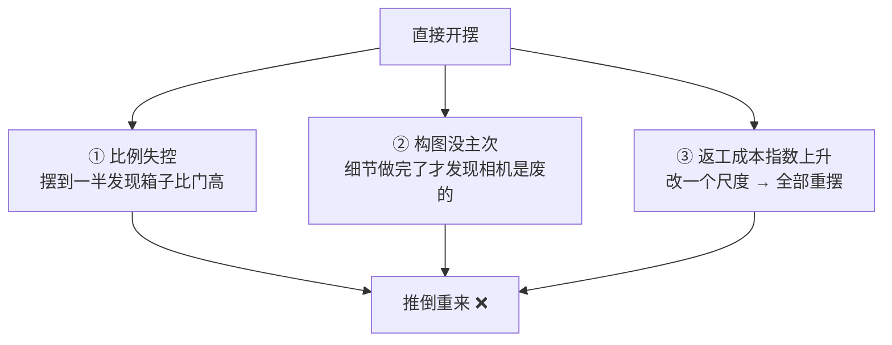
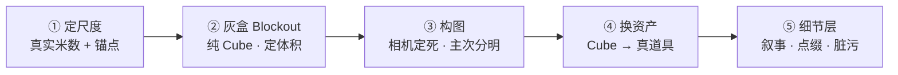
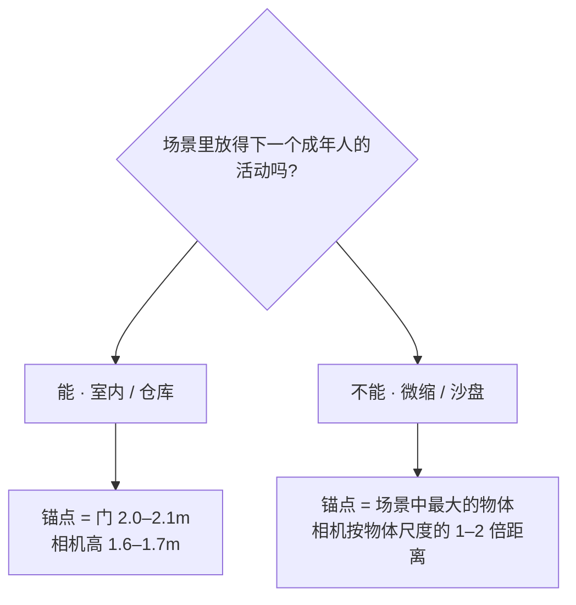
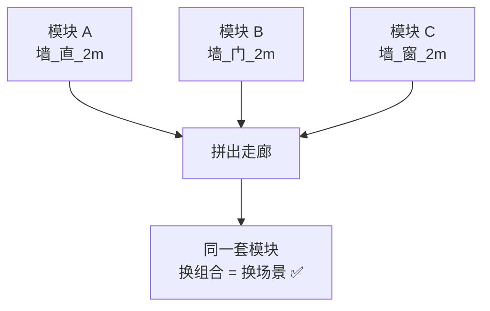

# 01 · 场景组装工作流：从资产到场景

> 一句话：**场景组装不是「把资产摆出来」，是「先定骨架、再填肉、最后才谈好不好看」——顺序反一次，代价是全部重摆。**
> 依据：官方手册 5.2 · Scene & Object / Collections；游戏行业通用的 blockout（灰盒）流程

---

## 一、为什么不能直接开摆

「我已经做了 6 个道具，把它们摆到一起就是场景了」——这是本阶段最常见的起手式，也是返工率最高的起手式。



| 失败模式 | 表现 | 为什么会发生 |
| ---- | ---- | ------------ |
| **比例失控** | 摆到一半发现「箱子比门高」「人进不去」 | 每个道具单看都对，但**没人给过它们共同的尺度基准** |
| **构图没主次** | 细节做完，相机一支，画面里全是杂物没有焦点 | 相机是最后才想到的东西，而**构图决定了哪些细节该做、哪些不该做** |
| **返工成本指数上升** | 改一个尺度要重摆 40 个物体 | 直接开摆 = 没有中间层，任何改动都直接传导到全部物体 |

> 🎯 **灰盒的本质不是「画草图」，是给场景买一份保险**：花 1 小时用 Cube 定死体积与相机，能省掉后面 10 小时的返工。

---

## 二、五步流程



| 步 | 做什么 | 产出 | 关键约束 |
| - | ------ | ---- | -------- |
| ① | 定场景单位（米）、放一个 1.7m 的「人」参照、列尺度锚点 | 一张尺度表 | **所有后续物体必须真实尺寸** |
| ② | 用 Cube 把墙、地、大件家具的体积搭出来 | 一个全是 Cube 的灰盒 | **不要加任何细节** |
| ③ | 支相机、定焦距、试 3–5 个机位，选一个定死 | 一个锁定相机 | **相机从此不再动** |
| ④ | 逐个把 Cube 替换成真道具（资产库拖 / Append） | 有资产的灰盒 | 比例对不上 = 回去改① |
| ⑤ | 加叙事细节：倒下的椅子、地上的碎屑、墙上的痕迹 | 成片 | 只加**相机看得到的地方** |

> ⚠️ **第 ③ 步「相机定死」是整个流程的枢纽**。
> 相机定死之后，你才知道：哪些地方要高精度（画面中心）、哪些地方可以糊（画面边缘）、哪些地方根本不用做（画面外）。
> **「画面外的细节」是业余场景最大的浪费。**

---

## 三、尺度锚点表（背下来，比任何参考图都管用）

| 参照物 | 真实尺寸 | 用途 |
| ------ | -------- | ---- |
| **人眼高（站）** | 1.6–1.7 m | ⭐ 相机默认高度，判断一切的第一基准 |
| **人眼高（坐）** | 1.15–1.25 m | 桌椅场景的相机高度 |
| 门（室内） | 2.0–2.1 m 高 × 0.8–0.9 m 宽 | 室内场景的绝对参照 |
| 门（仓库 / 工业） | 2.5–3.5 m 高 | 大空间场景 |
| 桌面 | 0.72–0.76 m | 桌、台、操作面 |
| 椅面 | 0.42–0.48 m | 与桌面配对的第二锚点 |
| 台阶（踢面） | 0.15–0.18 m | 楼梯、坡道、地形高差 |
| 栏杆 / 扶手 | 1.0–1.1 m | 平台、楼梯 |
| 标准托盘 | 1.2 × 0.8 m | 仓库场景的量感参照 |
| 200L 油桶 | 直径 0.6 m × 高 0.88 m | 工业场景的万能参照 |
| 集装箱（20ft） | 6.06 × 2.44 × 2.59 m | 大尺度户外 |
| 轿车 | 4.5–4.8 m 长 | 户外街道 |



> 💡 **实践做法**：建一个 `Ref_Human` 集合，里头放一个 1.7m 高的简单人形（两个 Box 就够），全程开着但**不渲染**（关掉相机图标 / 放 Holdout 集合）。摆每个道具前先跟它比一下。

---

## 四、构图：出图的成败在这里就定了

### 4.1 焦距怎么选

| 用途 | 焦距（等效 35mm） | 观感 |
| ---- | --------- | ---- |
| 场景 / 环境全景 | 24–35 mm | 空间感强，边缘有透视拉伸 |
| **资产展示（最常用）** | 35–50 mm | ⭐ 接近人眼，最不容易出错 |
| 单个道具特写 | 85–135 mm | 压缩感，适合产品图 |
| 微距细节 | 150 mm+ | 几乎无透视，慎用 |

> ⚠️ 焦距在 `Camera` 属性面板的 `Lens` 里，**单位是 mm 不是「视野角度」**。用 `Focal Length` 而不是调 `Field of View`。

### 4.2 构图四件事

| 项 | 怎么做 | 入口 |
| -- | ------ | ---- |
| **构图辅助线** | 三分法 / 黄金分割 / 中心对称 | `Camera` 属性 → `Viewport Display → Composition Guides` |
| **视线高度** | 相机放到人眼高度，不是俯视 | `G` `Z` 或直接在 Transform 里输 1.65 |
| **前景 / 中景 / 背景** | 画面里必须有这三个层次，不然画面「平」 | 手动摆：近处放一个虚化的遮挡物 |
| **留白** | 主体不要顶满画框 | 三分法交点放主体 |


> 🎯 **新手最有效的构图技巧：在镜头前 0.5–1m 放一个物体（管道、柱子、树叶）让它虚化**。
> 这一个动作能让「贴图练习」立刻变成「摄影作品」。

---

## 五、模块化 Kit：场景能「量产」的前提

**Kit = 一套尺寸互相对得上的模块**，靠不同组合拼出无穷场景。



| 规则 | 说明 | 违反后果 |
| ---- | ---- | -------- |
| ⭐ **尺寸落在同一套网格上** | 模块长度必须是某个基数的整数倍（0.5 / 1 / 2 m） | 接缝永远对不齐，拼不出来 |
| **接缝处 UV 连续** | 相邻模块的贴图要能接上 | 拼起来有明显断层 |
| **共享同一套材质** | 一堵墙一个材质，不要每个模块一个 | draw call 爆炸 |
| **原点在可拼接的位置** | 墙模块原点放底边中点或角点 | 拼装时要手动对位，累死 |

### 打破重复感的三个手法

Kit 的代价是「看得出是重复的」。三个低成本解法：

| 手法 | 做法 | 成本 |
| ---- | ---- | ---- |
| **旋转 / 缩放微差** | 同一模块 `R Z` 90°/180°/270° 轮换；缩放 ±3% | 零 |
| **贴图变体** | 同一个几何给 2–3 套贴图（脏 / 新 / 锈） | 一套贴图 |
| **点缀道具** | 在重复节奏里插一个不重复的东西（倒下的桶、一滩水） | 一个道具 |

> 💡 **重复本身不是问题，「有节奏的重复被打断一次」才是可信的**。自然和人造环境都有节奏，你要做的是**在节奏里放一个意外**。

---

## 六、场景文件的 Collection 组织

```text
Scene_Root
├── Sets_Architecture      ← 建筑模块（墙/地/顶）
├── Sets_Props_Large       ← 大件（货架/机器/集装箱）
├── Props_Small            ← 小道具（箱/桶/工具）
├── Props_Scatter          ← 散布出来的（几何节点驱动，别手动改）
├── Lights_                ← 灯光
├── Cam_                   ← 相机
├── Ref_                   ← 参考物 / 参照人（关掉渲染）
└── FX_                    ← 粒子 / 体积 / 特效
```

| 约定 | 值 |
| ---- | -- |
| 前缀 | `Sets_` 建筑 / `Props_` 道具 / `Lights_` / `Cam_` / `Ref_` / `FX_` |
| 散布结果单独一个集合 | ⭐ **不要手动往里加东西**，改参数会覆盖 |
| 参考物 | 关掉相机图标（不渲染）或整个集合 `Disable in Renders` |
| 区域切分 | 见 [05 篇](05-场景性能与空间分组.md)：大场景按 `Zone_A_ / Zone_B_` 再切一层 |

> ⚠️ **别用 Outliner 的默认命名**。40 个物体全是 `Cube.001` 的时候，你会连自己做了什么都不知道。

---

## 七、坑

- ❌ **不搭灰盒直接摆道具** → 比例错了全部重摆
- ❌ **相机最后才定** → 细节做完了发现构图是废的
- ❌ **道具尺度凭感觉** → 进引擎后人比门矮 → 用真实米数
- ❌ **不放参照人** → 尺度没有任何基准，全靠想象
- ❌ **焦距用默认的 50mm 不调整** → 场景要么太挤要么太平 → 场景用 24–35mm
- ❌ **画面外的东西也做高精度** → 最大的浪费，相机定死后立刻删掉画面外的细节
- ❌ **Kit 模块尺寸不成网格** → 接缝永远对不齐
- ❌ **Kit 每个模块一个材质** → draw call 爆炸 → 共享一套图集
- ❌ **把散布结果的集合手动改了** → 下次改参数全被覆盖 → 参数在节点组里改
- ❌ **场景文件里 `Ctrl+A → All Transforms`** → 所有道具塌到世界原点（**只有单资产文件才 Apply Location**）

---

## 八、自检

| # | 自检点 | 通过标准 |
| - | ------ | -------- |
| ① | 五步 | 说出「定尺度 → 灰盒 → 构图 → 换资产 → 加细节」五步及每步产出 |
| ② | 尺度 | 报出 5 个尺度锚点的真实米数 |
| ③ | 构图 | 说出焦距三段（场景 / 资产 / 特写）及各自用途 |
| ④ | Kit | 说出模块化 Kit 的第一条硬规则，以及违反的后果 |
| ⑤ | 打破重复 | 说出三个手法中至少两个 |
| ⑥ | 组织 | 说出 Collection 前缀约定，以及散布结果为什么要单独放 |

---

## 九、速查

```text
【五步流程】
① 定尺度   真实米数 + 参照人 1.7m
② 灰盒     纯 Cube，不加任何细节
③ 构图     ⭐ 相机定死（从此不再动）
④ 换资产   Cube → 真道具
⑤ 细节层   只加相机看得到的地方

【尺度锚点（米）】
人眼(站) 1.6–1.7  人眼(坐) 1.15–1.25
门(室内) 2.0–2.1  门(仓库) 2.5–3.5
桌面 0.72–0.76    椅面 0.42–0.48
台阶 0.15–0.18    栏杆 1.0–1.1
托盘 1.2×0.8      油桶 Ø0.6×0.88
集装箱 6.06×2.44×2.59   轿车 4.5–4.8

【焦距】
场景全景   24–35mm
资产展示   35–50mm  ⭐ 最常用
道具特写   85–135mm

【构图】
Composition Guides   Camera 属性 → Viewport Display
视线高度             相机 Y=1.65
三层                 前景(虚化遮挡) / 中景(主体) / 背景(环境)

【Kit 硬规则】
⭐ 模块尺寸必须落在同一套网格上（0.5 / 1 / 2m）
接缝 UV 连续 · 共享一套材质 · 原点在拼接点
打破重复：旋转轮换 / 缩放±3% / 贴图变体 / 插一个意外道具

【Collection 前缀】
Sets_ 建筑   Props_ 道具   Lights_   Cam_   Ref_(不渲染)   FX_
⭐ 散布结果单独集合，不要手动改
```

---

> **下一步**：[`02-资产库与场景级Kitbash.md`](02-资产库与场景级Kitbash.md) —— 灰盒定好了，接下来把 Cube 换成真道具。复用方式分三层，别只会 Append。
