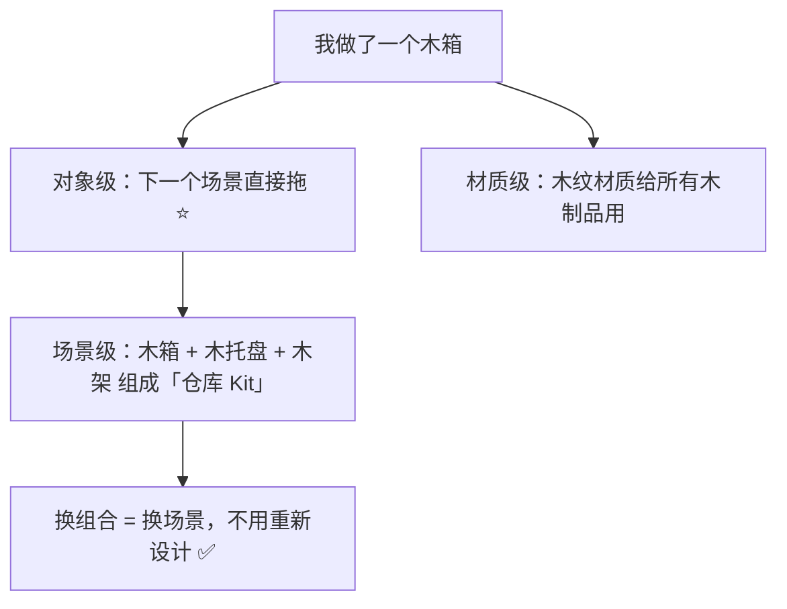
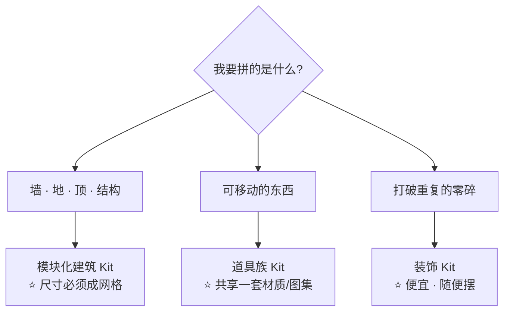
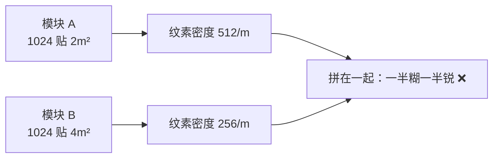
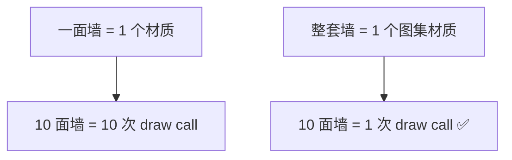
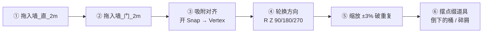

# 02 · 资产库与场景级 Kitbash

> 一句话：**对象级复用让你省「重做的时间」，材质级复用让你省「draw call」，场景级 Kit 让你省「重新设计的时间」——三层复用，省的不是同一种东西。**
> 依据：官方手册 5.2 · Asset Browser；[`../03-非破坏性流程与资产管理/07-文件与资产库-Append-Link-Asset-Browser.md`](../03-非破坏性流程与资产管理/07-文件与资产库-Append-Link-Asset-Browser.md)

---

## 一、复用的三个层次

| 层次 | 复用的是什么 | 省下什么 | 在哪一篇 |
| ---- | -------- | -------- | -------- |
| **对象级** | 整个道具（Object / Collection） | 建模时间 | ⭐ `03/07-文件与资产库` 已讲 |
| **材质级** | 一套 PBR 材质 / 图集 | **draw call** + 调材质时间 | `05-材质PBR与烘焙` |
| **场景级（本阶段）** | 一套**尺寸互相对得上**的模块 = Kit | 场景设计与拼装时间 | 本篇 |



> 🎯 **本阶段的目标不是「用上资产库」，是「做出一套 Kit」。**
> 资产库只是存放 Kit 的地方——Stage 2（03 目录）你已经学会怎么用了，现在要学的是**该往里放什么组合**。

---

## 二、Kit 的三种类型

| 类型 | 组成 | 适用 | 例子 |
| ---- | ---- | ---- | ---- |
| **模块化建筑 Kit** | 墙 / 地 / 门 / 窗 / 转角，尺寸成网格 | 室内、走廊、基地 | `Kit_Warehouse_Wall_Straight_2m` |
| **道具族 Kit** | 同一主题的一组道具，共享材质 | 快速填充 | `Kit_Industrial_Props`（桶/箱/罐/托盘） |
| **装饰 Kit** | 小件点缀，用于打破重复 | 场景最后一层 | `Kit_Decal_Trash`（碎屑/水渍/贴纸） |



---

## 三、Asset Browser 在场景组装里的用法（复习 + 场景级补充）

> 完整的基础用法（建目录 → 注册 → Mark → 拖入）见 [`../03-非破坏性流程与资产管理/07-文件与资产库-Append-Link-Asset-Browser.md`](../03-非破坏性流程与资产管理/07-文件与资产库-Append-Link-Asset-Browser.md) 第四节。这里只补「场景组装」特有的三点。

### 3.1 拖进来的不只是 Object

| 可 Mark 的类型 | 场景组装里的用法 |
| ---- | ---- |
| **Object** | 单个道具（桶、箱） |
| **Collection** | ⭐ **整组模块**（一面墙 + 门框 + 五金件一起进来，层级保留） |
| **Material** | 场景里统一换材质，改一处全部跟着变 |
| **Node Group** | ⭐ 散布节点组（做完 04 篇之后必存） |
| **World** | HDRI 灯光预设，出图时直接套 |

> 💡 **Mark 集合而不是单个物体**。一面墙通常是「墙体 + 门框 + 门 + 把手」四个物体，Mark 集合能一次拖全，而且层级干净。

### 3.2 场景级该 Mark 什么

| 类型 | 该不该 Mark | 说明 |
| ---- | ----------- | ---- |
| 完成的单个道具 | ✅ | 主力 |
| **整套 Kit（集合）** | ✅⭐ | 本阶段核心产出 |
| 材质 / 图集 | ✅ | draw call 的关键 |
| 散布节点组 | ✅ | 04 篇做完必存 |
| HDRI / 灯光预设 | 🟡 可选 | 出图用 |
| 半成品 / 练习件 | ❌ | 会污染资产库，后来自己都不敢用 |

### 3.3 目录结构怎么排

```text
~/BlenderAssets/
├── Props/
│   ├── Industrial/     Prop_Barrel_Oil_01.blend ...
│   └── Furniture/
├── Kits/
│   ├── Kit_Warehouse/   ⭐ 模块化建筑
│   └── Kit_Rock_Field/  散布用石头组（配几何节点）
├── Materials/
├── NodeGroups/          ⭐ 散布 / 程序化
└── HDRI/
```

> 🎯 **用文件夹分类就够了**（Catalog 等资产过百再说，见 03/07 第 4.2 节）。

---

## 四、Kit 的两条技术硬规则

### 4.1 纹素密度必须统一



| 问题 | 后果 | 解法 |
| ---- | ---- | ---- |
| 不同模块贴图分辨率不同但覆盖面积相同 | 有的糊有的锐 | 按覆盖面积定分辨率，或统一纹素密度 |
| 同一模块不同面密度差太多 | 转动相机时纹理「游动」 | 用 `Average Island Scale` 拉平（Stage 3 第 05 篇） |

> ⚠️ **Kit 的纹素密度必须在一个数上。** 这是「Kit 看起来像一套」和「看起来像拼凑的」的分界线。

### 4.2 共享材质 / 图集



| 做法 | draw call | 说明 |
| ---- | --------- | ---- |
| 每个模块一个材质 | N | ❌ 模块一多就崩 |
| 一套 Kit 一张图集 + 一个材质 | 1 | ⭐ 首选 |
| 按材质类型分（金属 / 木 / 混凝土） | 3–5 | 🟡 可接受，看预算 |

> 💡 **图集（Atlas）= 把所有模块的 UV 排进同一张贴图**。做法：模块全部 `Ctrl+J` 合并 → 统一 Pack UV → 展好后再分开（或者直接不分开，反正引擎里按材质批次渲染）。

---

## 五、Kitbash 实操：拼一面仓库墙



| 步 | 操作 | 要点 |
| - | ---- | ---- |
| ①–② | Asset Browser 拖入 | 拖**集合**，层级完整 |
| ③ | `Shift+Tab` 开吸附，模式选 `Vertex` 或 `Edge` | ⭐ 手对位永远对不齐 |
| ④ | `R` `Z` `90` | 轮换是最便宜的破重复手法 |
| ⑤ | `S` `1.03` | ±3% 肉眼几乎看不出，但打破了「一模一样」 |
| ⑥ | 摆点缀 | 节奏里的意外，可信度的来源 |

> 🎯 **吸附（Snap）是 Kitbash 的生产力核心**：`Shift+Tab` 开关，右键面板里选模式。用它之后拼 20 个模块只要 2 分钟。

---

## 六、坑

- ❌ **只复用单个道具，不做 Kit** → 每个场景都从零设计 → 本阶段白做
- ❌ **Mark 单个物体而不是集合** → 一面墙拖进来缺门框缺把手 → 拖集合
- ❌ **Kit 模块纹素密度不统一** → 拼出来一半糊一半锐
- ❌ **每个模块一个材质** → draw call 爆炸 → 一套图集一个材质
- ❌ **手对位不开吸附** → 永远有缝 → `Shift+Tab`
- ❌ **所有模块一模一样地摆** → 一眼假 → 轮换 + 微缩放 + 点缀
- ❌ **Mark as Asset 但文件没放在资产库目录里** → 别的项目的 Asset Browser 扫不到（见 03/07）
- ❌ **把半成品也 Mark 成资产** → 资产库被垃圾塞满，后来自己都不敢用
- ❌ **贴图用绝对路径** → 换电脑全丢 → `Make Paths Relative` / `Pack`
- ❌ **改了 Kit 的源文件却没重新 Mark** → 拖进来还是旧版

---

## 七、自检

| # | 自检点 | 通过标准 |
| - | ------ | -------- |
| ① | 三层复用 | 说出对象级 / 材质级 / 场景级分别在省什么 |
| ② | Kit 类型 | 说出三种 Kit 各自的用途 |
| ③ | Mark 粒度 | 说出为什么「Mark 集合而不是单个物体」 |
| ④ | 纹素密度 | 说出 Kit 纹素密度必须统一的原因与后果 |
| ⑤ | draw call | 说出「一套 Kit 一张图集」能把 draw call 从 N 降到 1 |
| ⑥ | 实操 | 拖 5 个模块拼出一段墙，开吸附、有轮换、有微缩放差 |

---

## 八、速查

```text
【复用三层】
对象级   省建模时间        Asset Browser 拖 Object/Collection
材质级   省 draw call     共享 PBR 材质 / 图集
场景级   省重新设计时间   ⭐ Kit（尺寸互相对得上的一组模块）

【Kit 三种】
模块化建筑 Kit   墙/地/门/窗 · ⭐ 尺寸必须成网格
道具族 Kit       同主题道具 · ⭐ 共享一套材质
装饰 Kit         碎屑/水渍 · 打破重复用

【该 Mark 什么】
✅ Object · Collection(⭐优先) · Material · Node Group · World
❌ 半成品 · 练习件

【目录】
~/BlenderAssets/
├── Props/  Kits/  Materials/  NodeGroups/  HDRI/

【两条硬规则】
① 纹素密度必须统一 → 否则一半糊一半锐
② 一套 Kit 一张图集一个材质 → draw call 从 N 降到 1

【Kitbash 六步】
① 拖入(拖集合) → ② 拖入第二个 → ③ 开吸附(Shift+Tab · Vertex)
→ ④ 轮换 R Z 90/180/270 → ⑤ 缩放 ±3% → ⑥ 摆点缀道具

【吸附】
Shift+Tab   开关吸附
模式        Vertex / Edge / Face（右键面板选）
```

---

> **下一步**：[`03-实例-复制-集合实例-性能视角.md`](03-实例-复制-集合实例-性能视角.md) —— Kit 拼完了，但「1000 块碎石」不能靠拖 1000 次。四种重复方式，省的不是同一种资源。
