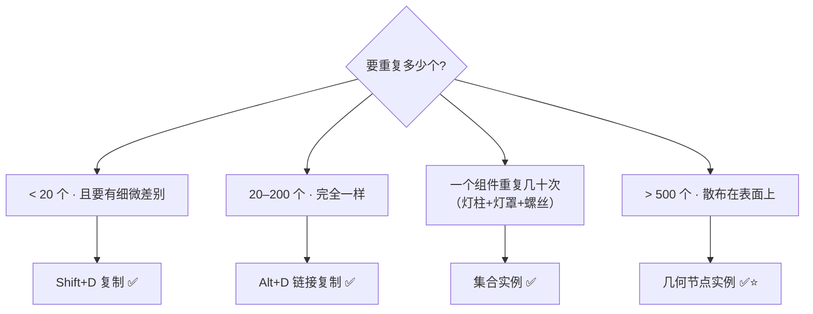
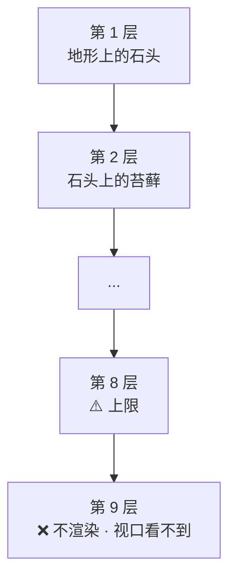
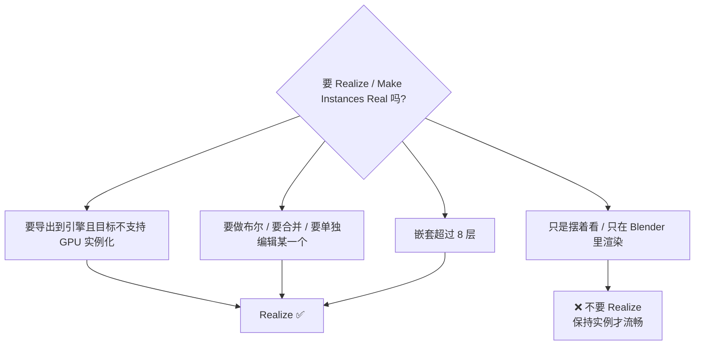

# 03 · 实例、复制、集合实例：性能视角

> 一句话：**`Shift+D` 省的是你的操作时间，`Alt+D` 省的是内存，集合实例省的是管理成本，几何节点实例省的是「几千份几何的视口」——四者不是一回事，选错一个视口就卡。**
> 依据：官方手册 5.2 · Geometry Nodes › Instances；官方手册 · Object Properties › Instancing；Blender 5.0 Release Notes · Cycles

---

## 一、四种「重复」到底在省什么

| 方式 | 入口 | 几何数据 | 内存 | draw call | 改一个会全变吗 | 适合 |
| ---- | ---- | -------- | ---- | --------- | ------------ | ---- |
| **复制** `Shift+D` | `Shift+D` | 每份一份完整拷贝 | ❌ 最费 | N | ❌ 独立 | 要有**不同几何**的变体 |
| **链接复制** `Alt+D` | `Alt+D` | **共享 Mesh 数据块** | ✅ 省 | N | ✅ 改 Mesh 全变 | 几十个一样的物体 |
| **集合实例** | `Shift+A → Collection Instance` 或 `Object Properties → Instancing` | 引用整个集合 | ✅✅ 最省 | N（视引擎） | ✅ 改集合全变 | 一个「组件」重复几十次 |
| **几何节点实例** | 几何节点 `Instance on Points` | 引用，且不落盘到物体 | ✅✅✅ | 视导出方式 | ✅ 改参数全变 | ⭐ **上千个**重复（散布） |



> 🎯 **关键区分**：
> **内存**（几何存几份）和 **draw call**（GPU 提交几次）是两件事。
> `Alt+D` 省内存但**不省 draw call**——1000 个 `Alt+D` 的箱子，内存很省，但 GPU 照样要提交 1000 次。
> **真正能省 draw call 的是引擎侧的 GPU 实例化**，见 [05 篇](05-场景性能与空间分组.md)。

---

## 二、四种方式的实操要点

### 2.1 `Shift+D` 复制

| 项 | 说明 |
| -- | ---- |
| 数据 | Mesh 完全独立拷贝 |
| 改一个 | 其他不变 |
| 代价 | 内存 × N，文件变大 |
| 何时用 | 需要真的做出不同形状（撞歪的桶、缺角的箱） |

> ⚠️ `Shift+D` 出来的物体**材质仍然是共享的**。想让材质也独立，要手动给材质槽点数字（`.001`）或者 `Make Single User`。

### 2.2 `Alt+D` 链接复制 ⭐

| 项 | 说明 |
| -- | ---- |
| 数据 | **共享 Mesh 数据块**，只有变换是独立的 |
| 改一个 | 进 Edit Mode 改形状 → **全部跟着变**（这是特性，不是 bug） |
| 想单独改 | `Object → Relations → Make Single User → Object & Data` |
| 何时用 | 几十个完全一样的东西 |

### 2.3 集合实例


| 项 | 说明 |
| -- | ---- |
| 建法 | `Shift+A → Collection Instance` → 选集合；或选中物体 → `Object Properties → Instancing → Collection` |
| 优点 | ⭐ 一个「组件」作为一个单元重复，层级干净、改一处全变 |
| 代价 | 实例整体只能整体变换，**不能单独挪内部某个物体** |
| 变真几何 | 选中 → `Object → Apply → Make Instances Real`（`F3` 搜 "Make Instances Real"） |

> 💡 **面板 Instancing（Vertices / Faces）是另一种东西**：它把子物体/面当作实例源，常用于「粒子式的重复」。⚠️ **它和几何节点实例互斥，见第三节。**

### 2.4 几何节点实例 ⭐⭐


| 项 | 说明 |
| -- | ---- |
| 本质 | 物体里存的是「引用 + 变换」，不是真几何 |
| 内存 | ⭐ 最优——1000 个实例只存一份网格 |
| 视口 | 流畅（只有在 Realize 之后才会卡） |
| 副作用 | 所有实例共享同一份几何 → **对实例内部的操作对所有实例生效** |
| 变真几何 | `Realize Instances` 节点，或 `Object → Apply → Make Instances Real` |

> 🎯 **散布类需求（上千个）一律用几何节点实例**，这是它存在的理由。详见 [04 篇](04-几何节点散布入门.md)。

---

## 三、⚠️ 5.2 手册的两条硬约束（务必记住）

### 3.1 GN 实例不能与面板 Instancing 混用

> 官方手册 5.2 · Geometry Nodes › Instances 原文警告：**"Currently instancing from geometry nodes cannot be mixed with instancing from the Instancing panel in the property editor."**

| 混用表现 | 后果 |
| -------- | ---- |
| 物体开了 `Object Properties → Instancing`，同时又加了几何节点修改器 | 行为不可预期，通常其中一个失效 |
| 想「用面板 Instancing 做一层重复，再用 GN 在上面再来一层」 | ❌ 不支持 |

> ✅ **正确做法**：选一种。要 GN 散布，就把面板 Instancing 关掉（设成 `None`）。

### 3.2 嵌套实例最多 8 层

> 官方手册原文：**"Only eight levels of nested instancing are supported for rendering and viewing in the viewport. Though deeper trees of instances can be made inside geometry nodes, they must be realized at the end of the node tree."**



| 项 | 说明 |
| -- | ---- |
| 什么是嵌套 | 实例里还有实例（`Instance on Points` 串起来就是） |
| 上限 | **8 层** |
| 超了怎么办 | 在节点树末尾加 `Realize Instances` |

> 💡 **实际做场景很少会碰到 8 层**。真碰到了，说明你的节点树该拆了。

### 3.3 附：Cycles 5.0 的实例化优化

Blender 5.0 起，**Adaptive Subdivision 不再是实验功能**，且新增 **Object Space** 选项：

| 项 | 说明 |
| -- | ---- |
| 用途 | 用「物体空间的边长」而不是「像素大小」控制细分密度 |
| 对实例的意义 | ⭐ **物体被实例化时只细分一次**，与相机距离无关 → 内存最小 |
| 入口 | Subdivision Surface 修改器 / Cycles 的 Adaptive Subdivision |

> 🎯 这条直接推翻了老经验「散布大量植被必须用 EEVEE」。**5.0 之后 Cycles 也能扛住大量实例化几何**，前提是开了 Adaptive Subdivision + Object Space。

---

## 四、什么时候必须转成真几何



| 场景 | 建议 |
| ---- | ---- |
| 只在 Blender 里出图 | **不 Realize**，视口和渲染都更快 |
| 导出 GLB 到 Godot / UE（不支持 GPU 实例化） | Realize（或让导出器处理，见 05 篇） |
| 导出且目标支持 `EXT_mesh_gpu_instancing` | 不 Realize，勾 `GPU Instances`（见 05 篇） |
| 想单独挪其中一个石头 | Realize，或者改成手动摆那一个 |

> ⚠️ **Realize 是不可逆的性能悬崖**。几千个实例一 Realize，视口当场卡死。
> **做之前先 `Save Incremental`**。

---

## 五、坑

- ❌ **1000 个碎石用 `Shift+D`** → 内存爆炸、文件几百 MB → 用几何节点实例
- ❌ **以为 `Alt+D` 能省 draw call** → 它只省内存，draw call 一个不少（见 05 篇）
- ❌ **`Alt+D` 之后进编辑模式改了一个，发现全变了** → 这是特性。想单独改先 `Make Single User → Object + Data`
- ❌ **改材质颜色，所有副本都跟着变** → Material 也是共享数据块
- ❌ **把几何节点实例和面板 `Instancing` 一起用** → 手册明确不支持
- ❌ **嵌套实例超过 8 层** → 渲染不出来也不报错 → 末尾 `Realize Instances`
- ❌ **一上来就 Realize** → 视口当场卡死 → 能不 Realize 就别 Realize
- ❌ **集合实例里想单独挪一个内部物体** → 只能整体变换 → 要么改集合，要么 Make Instances Real
- ❌ **Realize 之前不 Save Incremental** → 卡死了回不去
- ❌ **散布的源物体没 `Ctrl+A → Scale`** → 出来的大小乱七八糟

---

## 六、自检

| # | 自检点 | 通过标准 |
| - | ------ | -------- |
| ① | 四种重复 | 说出 `Shift+D` / `Alt+D` / 集合实例 / GN 实例分别省什么 |
| ② | 内存 vs draw call | 说出「`Alt+D` 省内存但不省 draw call」 |
| ③ | 两条硬约束 | 说出 GN 实例与面板 Instancing 不能混用、嵌套上限 8 层 |
| ④ | 决策 | 给「1000 块碎石 / 20 个箱子 / 3 个门」分别说出该用哪种 |
| ⑤ | Realize 时机 | 说出三种必须 Realize 的情况，以及「能不 Realize 就别 Realize」 |
| ⑥ | 5.0 变化 | 说出 Cycles Adaptive Subdivision + Object Space 对实例化的意义 |

---

## 七、速查

```text
【四种重复】
Shift+D       复制        几何独立拷贝 · 最费内存 · 可做不同变体
Alt+D         链接复制    共享 Mesh · 省内存 · ⚠️不省 draw call
集合实例      Collection  引用整个集合 · 一个组件重复 N 次
GN 实例       几何节点    ⭐ 上千个散布用这个 · 内存最优

【选择】
<20 个要差别  → Shift+D
20–200 一样   → Alt+D
组件重复 N 次 → 集合实例
>500 散布     → GN 实例 ⭐

【⚠️ 5.2 两条硬约束】
① GN 实例 ✗ 面板 Instancing 混用（手册明确警告）
② 嵌套实例上限 8 层 → 超了末尾 Realize Instances

【转真几何】
Realize Instances 节点          节点树内
Object → Apply → Make Instances Real   (F3 搜)
⭐ 做之前先 Save Incremental

【该不该 Realize】
只在 Blender 出图        → ❌ 不 Realize
导出到不支持 GPU 实例化的引擎 → ✅ Realize
导出 + 支持 EXT_mesh_gpu_instancing → ❌ 不 Realize，勾 GPU Instances
要布尔 / 要单独编辑      → ✅ Realize

【Cycles 5.0】
Adaptive Subdivision 不再是实验功能
Object Space 选项 → 实例只细分一次 · 内存最小
→ 「散布必须用 EEVEE」这条老经验已失效
```

---

> **下一步**：[`04-几何节点散布入门.md`](04-几何节点散布入门.md) —— 上千个东西怎么放上去，节点怎么连，5.x 哪些节点名变了。
