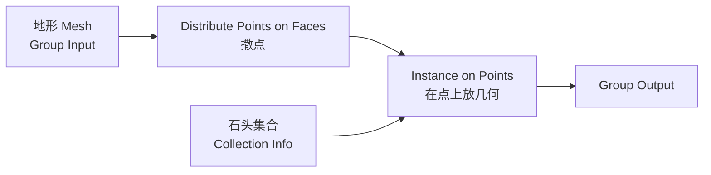
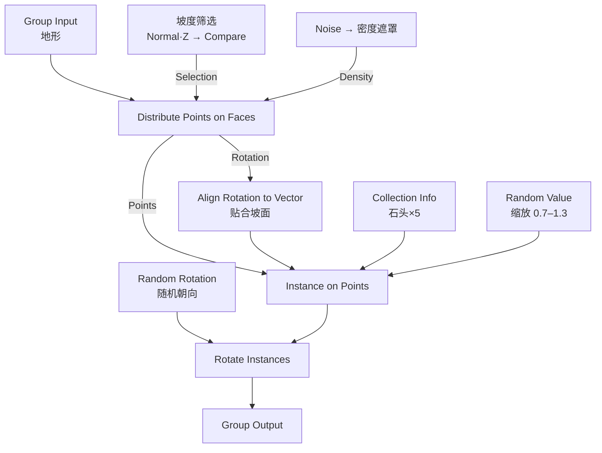
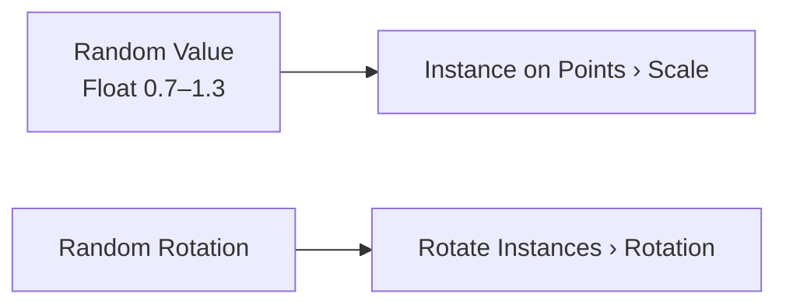
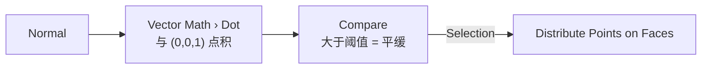
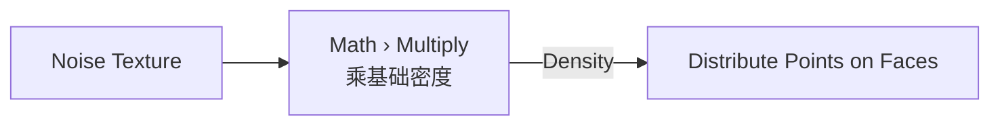
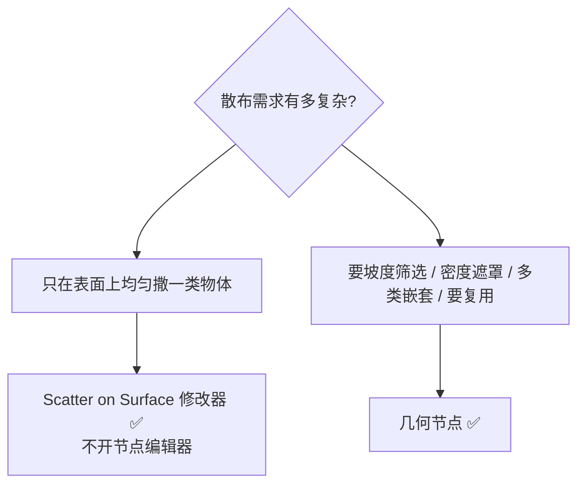

# 04 · 几何节点散布入门 ⭐

> 一句话：**散布就是一条固定的链路：地形 → 撒点 → 在点上放实例 → 让它们看起来不一样。** 剩下所有复杂度都是往这条链路上加「筛选」和「随机」。
> 依据：官方手册 5.2 · Geometry Nodes（Distribute Points on Faces / Instance on Points / Instances / Utilities）

---

## 0. ⚠️ 先说 5.x 变了什么（照老教程会卡在这里）

| # | 老教程的说法 | **5.x 的实际情况** |
| - | ------------ | ------------------ |
| 1 | `Align Euler to Vector` | 已换成 **`Align Rotation to Vector`**（Utilities › Rotation）。找不到就是因为这个 |
| 2 | 手动拆 XYZ 做随机旋转 | 5.x 有专用 **`Random Rotation`** 节点，直接给随机朝向 |
| 3 | 只有几何节点能做散布 | 5.0 新增 **6 个基于几何节点的修改器**，其中 **`Scatter on Surface`** 就能做简单散布，**不用开节点编辑器**（见第七节） |
| 4 | 随机值只有 `Random Value` | `Random Value` 仍在（Utilities），可出 Float / Integer / Vector / Boolean / Rotation |
| 5 | （没提）`id` 属性 | 5.0 起 `id` 是**通用属性**（不再是内建特殊属性），仍被 `Random Value` 与 `Instance on Points` 用作稳定标识 |

> 📌 通用兜底：**找不到节点就在 `Add` 菜单的搜索框里打名字**，别在分类里翻。

---

## 一、散布的主链路



完整版（加上随机与筛选）：



---

## 二、逐个节点讲

### 2.1 `Distribute Points on Faces`（分布点于面上）

| 输入 / 输出 | 说明 | 要点 |
| ----------- | ---- | ---- |
| **Density** | 每**平方米**分布的点数 | ⚠️ 不是总数！地形面积越大点越多 |
| **Density Max** | 密度上限（仅 Poisson Disk） | 配合 Density 用 |
| **Distance Min** | 点之间最小距离（仅 Poisson Disk） | ⭐ 防重叠的关键 |
| **Seed** | 随机种子 | ⚠️ **定下就锁死**，改一次排布全变 |
| **Selection** | 只在选中的面上撒点 | 做坡度筛选 / 区域遮罩用 |
| **Distribution Method** | `Random`（最快）/ `Poisson Disk`（有最小间距，更自然） | 大面积植被用 Poisson Disk |
| 输出 **Normal** | 每个点所在面的法线 | 贴合坡面用 |
| 输出 **Rotation** | 由法线生成的 XYZ 欧拉旋转 | ⚠️ Z 轴朝向是任意的 |

> 💡 **Density 的单位是「每平方米点数」**——这是新手最常踩的坑。
> 一个 10m × 10m 的地形，Density = 1 → 100 个点。**先估算面积再定 Density。**

### 2.2 `Instance on Points`（实例化于点上）

| 输入 | 说明 |
| ---- | ---- |
| **Points** | 点（来自 Distribute / Curve to Points 等） |
| **Instance** | 要实例化的几何（单个物体 / `Object Info` / `Collection Info`） |
| **Selection** | 哪些点上放 |
| **Rotation** | 每个实例的欧拉旋转 |
| **Scale** | 每个实例的缩放 |
| **Pick Instances** | ⭐ 开了之后从实例列表里**挑一个**，而不是每个点都放整个几何 |
| **Instance Index** | 挑第几个（默认用点的 `id`，无 `id` 用编号） |

> ⚠️ **用 `Collection Info` 时必须开 `Pick Instances`**。
> 不开的话，每个点都会放**整个集合**（5 块石头全放一遍）→ 面数 × 5。

### 2.3 `Collection Info`（集合信息）

| 项 | 说明 |
| -- | ---- |
| 用途 | 把整个集合拿进节点树，配 `Pick Instances` 实现「从一堆石头里随机挑一个」 |
| **Separate Children** | 把集合里的物体作为**独立实例**列出（挑选用） |
| **Reset Children** | 重置子物体的变换 |
| 常用组合 | `Collection Info → Instance on Points（开 Pick Instances）` |

### 2.4 随机化三件套

| 节点 | 分类 | 用途 |
| ---- | ---- | ---- |
| **`Random Value`** | Utilities | 出随机 Float / Integer / Vector / Boolean / Rotation。控 **缩放**、挑实例编号 |
| **`Random Rotation`** | Utilities | ⭐ 5.x 专用，直接出随机朝向 |
| **`Rotate Instances`** | Instances | 对已有实例再施加旋转（可指定轴心、可局部/全局空间） |
| **`Scale Instances`** | Instances | 对已有实例再缩放 |



> 💡 **Instance on Points 的 `Scale` 输入接 `Random Value`（Vector 或 Float 都行）是最省事的做法**，不必再挂 `Scale Instances`。
> 但 `Rotate Instances` 有个独有能力：**可以指定轴心（Pivot）**，做「绕物体底部旋转」这种需求时非它不可。

### 2.5 `Align Rotation to Vector`（对齐旋转到矢量）⭐

| 项 | 说明 |
| -- | ---- |
| 用途 | 把一个方向矢量（通常是法线）转成旋转，让实例贴合表面 |
| 取代 | 老教程的 `Align Euler to Vector` |
| 典型接法 | `Distribute Points on Faces → Normal → Align Rotation to Vector → Instance on Points → Rotation` |
| 注意 | 只有法线**不足以确定第三个轴**（绕法线的朝向不确定）→ 所以还要再叠一个随机 Z 旋转 |


### 2.6 `Realize Instances`（实例独立化）

| 项 | 说明 |
| -- | ---- |
| 作用 | 把实例转成真几何 |
| 何时用 | 需要单独编辑某一个实例 / 要布尔 / 要合并 / 嵌套超 8 层 / 导出到不支持 GPU 实例化的引擎 |
| 代价 | ⚠️ 内存与视口性能的悬崖 |

> 🎯 **原则：能不 Realize 就别 Realize。** 见 [03 篇](03-实例-复制-集合实例-性能视角.md) 第四节。

---

## 三、两个让散布「不假」的关键技巧

### 3.1 坡度筛选（陡崖上不长草）



| 步骤 | 节点 |
| ---- | ---- |
| ① 取法线 | `Distribute Points on Faces` 自己有，或用 `Input › Normal` |
| ② 与 Z 轴点积 | `Vector Math › Dot Product`，第二个矢量填 `(0, 0, 1)` |
| ③ 比较 | `Compare`（Float，Greater Than），阈值约 **0.7–0.9**（越大越只留平地） |
| ④ 接到 Selection | 完成 |

> 💡 点积 = cos(坡度角)。**阈值 0.7 ≈ 45°**，0.9 ≈ 26°。想要「只有平地长草」就给 0.9。

### 3.2 密度遮罩（有疏有密）



| 步骤 | 节点 |
| ---- | ---- |
| ① 造噪声 | `Texture › Noise Texture`（调 `Scale` 控制疏密区块大小） |
| ② 乘进密度 | `Math › Multiply`，把 Noise 接到 `Distribute` 的 `Density` |
| ③ 可选加对比 | 中间插一个 `ColorRamp` 或 `Map Range`，让疏密更分明 |

> 🎯 **自然界没有均匀分布。** 均匀 = 一眼假。这一步是「程序化」和「可信」的分界线。

---

## 四、完整搭建顺序（照着做一遍）

| 步 | 操作 |
| - | ---- |
| ① | 选中地形 → `Modifiers → Add Modifier → Geometry Nodes → New` |
| ② | 加 `Distribute Points on Faces`（Group Input 的 Geometry → Mesh） |
| ③ | 加 `Instance on Points`，Points 接 Distribute 的 Points |
| ④ | 加 `Object Info`（或 `Collection Info`），选你的石头 → 接 Instance 输入 |
| ⑤ | 若用集合：**开 `Pick Instances`** |
| ⑥ | `Random Value`（Float）→ 接 `Scale`，范围 0.7–1.3 |
| ⑦ | `Distribute` 的 `Normal` → `Align Rotation to Vector` → `Instance` 的 `Rotation` |
| ⑧ | 加 `Rotate Instances` + `Random Rotation` → 随机 Z 朝向 |
| ⑨ | 调 `Density`（按面积估）、锁 `Seed` |
| ⑩ | 加坡度筛选 + Noise 密度遮罩 |
| ⑪ | 节点组右键 → **Mark as Asset**（下次直接拖） |

> ⚠️ **第 ⑨ 步锁 Seed 的时机**：在你已经调好疏密和筛选**之后**。
> 之后再改任何东西都不要动 Seed，否则排布全变，前面基于这个排布做的调整全部作废。

---

## 五、参数速查表

| 参数 | 典型值 | 说明 |
| ---- | ------ | ---- |
| **Density**（草） | 5–50 / m² | 草密度高，但要用 LOD 或只做近景 |
| **Density**（碎石） | 0.5–3 / m² | |
| **Density**（岩石） | 0.05–0.3 / m² | 大件密度很低 |
| **Distance Min** | 物体直径的 1.2–1.5 倍 | 防重叠 |
| **缩放随机** | 0.7–1.3 | 超过 0.5–2.0 就看出是同一个东西放大缩小 |
| **坡度阈值** | 0.7（≈45°）/ 0.9（≈26°） | |
| **Noise Scale** | 2–10 | 越大区块越碎 |
| **Seed** | 任意，**定后不改** | |

---

## 六、5.0 的 `Scatter on Surface` 修改器：什么时候用它替代 GN



| 项 | `Scatter on Surface` 修改器 | 几何节点 |
| -- | --------------------------- | -------- |
| 上手成本 | ⭐ 极低，面板里勾一勾 | 要搭节点树 |
| 密度控制 | Density（每单位面积）/ **Amount（总个数）** | Density（每平方米） |
| 分布控制 | **支持用属性和贴图控制分布** | 任意（Noise / 属性 / 数学） |
| 多个物体 | ⭐ **可以串联多个修改器**，每个散不同物体、不同分布 | 一个节点树里做 |
| 复杂筛选 | ❌ 有限 | ✅ 任意 |
| 可复用 | 存成资产 | ⭐ Mark as Asset 后拖进来即用 |

> 💡 **入门阶段先用 `Scatter on Surface`**。它覆盖 80% 的「撒碎石」需求，而且**不用写节点**。
> 需要「陡坡不长草」「有疏有密」这类条件时，再上几何节点。
> ⚠️ 它和 `Array` 是两个独立的修改器（不是 Array 的子功能）——5.0 一共新增 6 个基于几何节点的修改器：`Array` / `Scatter on Surface` / `Instance on Elements` / `Randomize Instances` / `Curve to Tube` / `Geometry Input`。

### 配套：`Randomize Instances` 修改器

5.0 新增，专门给别的修改器产生的实例**再加一层随机化**（旋转、缩放）。用法：在 `Scatter on Surface` **之后**再叠一个 `Randomize Instances`。

---

## 七、坑

- ❌ **照老教程找 `Align Euler to Vector`** → 5.x 是 `Align Rotation to Vector`
- ❌ **`Distribute` 的 Density 抄教程固定值** → 它是每平方米点数，地形面积一变全错
- ❌ **用 `Collection Info` 不开 `Pick Instances`** → 每个点放整个集合，面数 × N
- ❌ **改 Seed 上瘾** → 排布一直在变 → **调好之后锁死 Seed**
- ❌ **源物体没 `Ctrl+A → Scale`** → 散布出来大小乱七八糟
- ❌ **一上来就 `Realize Instances`** → 视口当场卡死 → 能不 Realize 就别 Realize
- ❌ **忘了 `Keep Surface`（Scatter 修改器）** → 地面消失只剩一堆实例飘着
- ❌ **不做坡度筛选** → 90° 崖壁上长满草，一眼假
- ❌ **密度均匀** → 像个网格 → 用 Noise 遮罩
- ❌ **缩放随机范围给太大（0.2–3）** → 一眼看出是同一个东西缩放 → 0.7–1.3
- ❌ **嵌套超过 8 层** → 渲染不出来也不报错 → 末尾 Realize
- ❌ **GN 实例与面板 Instancing 混用** → 手册明确不支持
- ❌ **散布结果放进了被手动改的集合** → 改参数全被覆盖
- ❌ **做完节点组不 Mark as Asset** → 下个场景再搭一遍

---

## 八、自检

| # | 自检点 | 通过标准 |
| - | ------ | -------- |
| ① | 主链路 | 不看教程说出「地形 → Distribute → Instance on Points」并搭出来 |
| ② | Density | 说出 Density 的单位是每平方米点数，并按面积估算一个值 |
| ③ | Pick Instances | 说出用 `Collection Info` 时必须开它的原因 |
| ④ | 5.x 节点名 | 说出 `Align Rotation to Vector` 取代了哪个节点 |
| ⑤ | 坡度筛选 | 说出「法线 · Z → Compare → Selection」这条链，并报出一个阈值 |
| ⑥ | 密度遮罩 | 说出用 Noise 做遮罩的原因（自然界无均匀分布） |
| ⑦ | Seed | 说出什么时候锁 Seed，以及改了会怎样 |
| ⑧ | Realize | 说出三种必须 Realize 的情况 |

---

## 九、速查

```text
【主链路】
Group Input(地形) → Distribute Points on Faces → Instance on Points → Group Output
                                    ↑                    ↑
                          Collection Info(石头×5)   Random Value(缩放)
                          ⚠️ 开 Pick Instances

【5.x 改名 / 新增】
Align Euler to Vector  →  Align Rotation to Vector ⭐
Random Rotation        随机朝向（Utilities）
Random Value           Float/Int/Vector/Bool/Rotation
Scatter on Surface     5.0 新增修改器（独立，不是 Array 子功能）
Randomize Instances    给已有实例再加一层随机
6 个新 GN 修改器：Array / Scatter on Surface / Instance on Elements
                 / Randomize Instances / Curve to Tube / Geometry Input

【关键参数】
Density        每平方米点数（不是总数！）
Distance Min   物体直径 ×1.2–1.5（Poisson Disk 防重叠）
Seed           ⭐ 调好之后锁死，再也别动
缩放随机        0.7–1.3（别超 0.5–2.0）
坡度阈值        0.7≈45°  0.9≈26°（法线·Z 的 Compare）
Noise Scale    2–10

【坡度筛选】
Normal → Vector Math › Dot (0,0,1) → Compare > 0.7 → Selection

【密度遮罩】
Noise Texture → Math › Multiply → Density
（中间可插 ColorRamp / Map Range 加大对比）

【Scatter on Surface vs 几何节点】
简单均匀散布           → Scatter on Surface（不开节点编辑器）
要筛选/遮罩/嵌套/复用  → 几何节点

【做完记得】
节点组右键 → Mark as Asset（下个场景直接拖）
```

---

> **下一步**：[`05-场景性能与空间分组.md`](05-场景性能与空间分组.md) —— 散完了，视口开始卡了。三种卡法对应三条不同的杠杆，别瞎猜。
