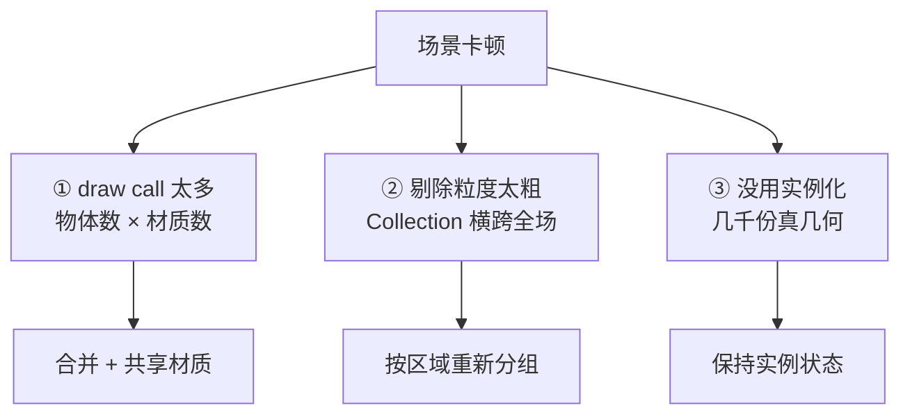
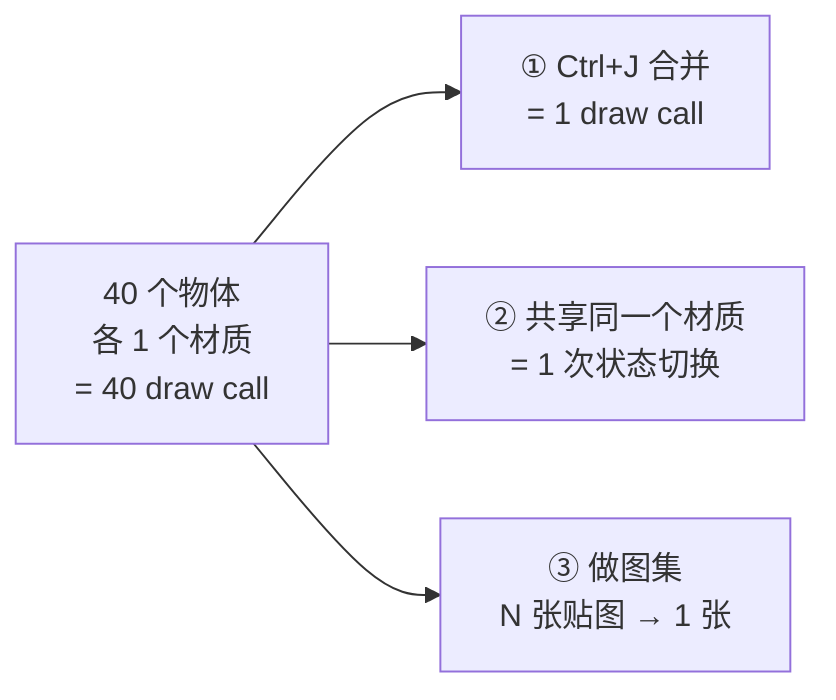
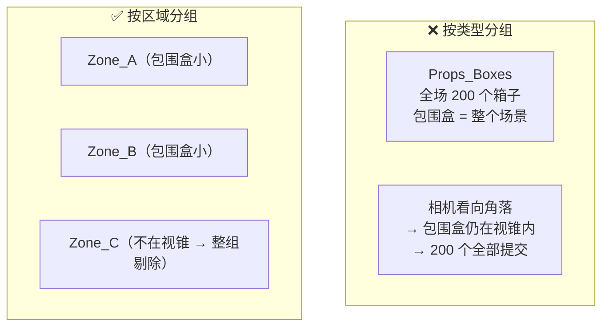
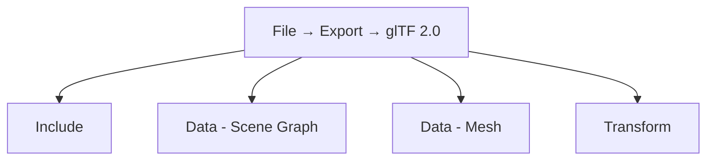
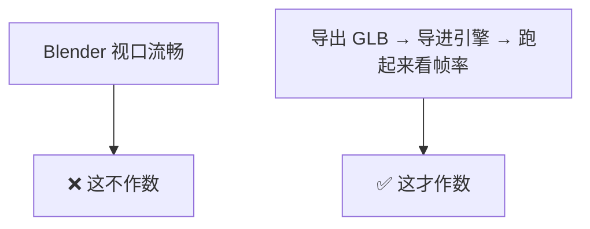

# 05 · 场景性能与空间分组

> 一句话：**场景卡只有三种卡法——draw call 太多、剔除粒度太粗、实例没用上。三条杠杆，各治一种。**
> 依据：官方手册 5.2 · glTF 2.0（Data - Scene Graph）；官方手册 · Collections

---

## 一、三条杠杆



| 杠杆 | 治什么 | 症状 | 手段 |
| ---- | ------ | ---- | ---- |
| **① draw call** | GPU 提交次数 | 物体多但每个都很简单，照样卡 | 合并几何 `Ctrl+J`、共享材质、图集 |
| **② 剔除粒度** | 视锥剔除效率 | 转个视角帧率暴跌 | **按区域分组** |
| **③ 实例化** | 内存与几何量 | 文件几百 MB、打开就要等 | 保持实例、不 Realize |

> ⚠️ **先判断是哪一种再动手**。很多人一卡就疯狂合并几何，结果 draw call 降了但剔除也失效了，反而更卡。

---

## 二、杠杆①：draw call

### 2.1 什么是 draw call

**一次 draw call ≈ 一个物体 × 一组材质状态。** GPU 每次提交都有固定开销，几千次提交的开销能超过渲染本身。

| 公式（粗略） | 说明 |
| ---- | ---- |
| `draw call ≈ Σ(每个物体的材质槽数)` | 一个物体 3 个材质 = 3 次 |

### 2.2 三条降法



| 手段 | 做法 | 代价 |
| ---- | ---- | ---- |
| ⭐ **合并几何** `Ctrl+J` | 同区域同材质、不需要单独动的静物合并 | 失去单独编辑能力 |
| ⭐ **共享材质** | 一套 Kit 一个材质（见 [02 篇](02-资产库与场景级Kitbash.md)） | 无 |
| **图集 Atlas** | 多张贴图排进一张 | UV 要重排 |
| **材质数量控制** | 一个道具 1–2 个材质（Stage 4 已定） | — |

> ⚠️ **可以合并的**：同一区域、同一材质、**永远不会单独动**的静物（地面碎石、墙面装饰）。
> ❌ **不要合并的**：门、抽屉、可交互物、有动画的、需要单独剔除的大件。

---

## 三、杠杆②：剔除粒度（为什么「按类型分组」是错的）

### 3.1 原理



| 分组方式 | 包围盒 | 剔除效果 |
| -------- | ------ | -------- |
| **按类型**（所有箱子一组） | 横跨整个场景 | ❌ **永不被剔除** |
| **按区域**（A 区所有东西一组） | 只覆盖 A 区 | ✅ 看不到 A 区就整组剔掉 |

> 🎯 **这就是路线图那句「按区域分组而不是按类型分组（利于视锥剔除）」的完整解释**。
> 引擎按「组的包围盒」做粗剔除，包围盒越大越没用。**按类型分组 = 主动让剔除失效。**

### 3.2 区域怎么切

| 场景类型 | 切分依据 | 粒度 |
| -------- | -------- | ---- |
| 室内 | 按房间 | 一房间一组 |
| 走廊 / 基地 | 按段落 | 每 10–20m 一组 |
| 户外 | 按地块网格 | 20–50m 一格 |
| 开放世界 | 按区块（chunk） | 引擎决定 |

```text
Scene_Root
├── Zone_A_Room1        ← 一个房间全部东西（建筑+道具+灯）
├── Zone_B_Room2
├── Zone_C_Corridor
├── Lights_Global       ← 只有全局光（太阳/HDRI）放这
└── Cam_
```

| 约定 | 值 |
| ---- | -- |
| 命名 | `Zone_<标识>_<描述>` |
| 内容 | **该区域的所有东西**，不分建筑还是道具 |
| 例外 | 全局光 / 相机 / 参考物单独放 |

> 💡 **区域内部再按类型分一层是可以的**（`Zone_A / Props`、`Zone_A / Sets`），只要**外层是按区域切的**。

---

## 四、杠杆③：实例化

见 [03 篇](03-实例-复制-集合实例-性能视角.md)。要点回顾：

| 项 | 结论 |
| -- | ---- |
| 上千个重复 | 用几何节点实例，**不要 Realize** |
| 几十个重复 | `Alt+D` 或集合实例 |
| `Alt+D` 省的是 | **内存**，不是 draw call |

---

## 五、LOD（细节层次）

> LOD 是「距离远了换低模」。它是第三条之外的补充手段，优先级低于前三条。

| 项 | 说明 |
| -- | ---- |
| 做法 | 复制模型 → `Decimate` 修改器（或手工减面）→ 命名 `_LOD0 / _LOD1 / _LOD2` |
| 减面比例 | LOD1 ≈ 50%，LOD2 ≈ 20–25% |
| Blender 里 | 手工做（Blender 没有内建 LOD 系统），导出后由引擎按距离切换 |
| UE5 | 静态网格可开 **Nanite** 免做 LOD（Stage 6 已提） |


> 🎯 **小场景不做 LOD**。它是「前三条都做完了还是卡」才动的手。

---

## 六、导出场景到引擎：4 个关键开关

> 来源：官方手册 5.2 · glTF 2.0 › Export



### 6.1 `Data - Scene Graph`（场景图）—— 本阶段新增关注点

| 开关 | 作用 | 何时开 |
| ---- | ---- | ------ |
| ⭐ **`Apply Modifiers`**（在 Data - Mesh） | 导出修改器计算后的结果 | **必须开**，否则几何节点散布**整个消失** |
| **`Geometry Nodes Instances`** | 导出几何节点生成的实例 | 🟡 **实验特性**。想保住实例结构时开 |
| **`GPU Instances`** | 用 `EXT_mesh_gpu_instancing` 扩展导出 | 目标引擎支持该扩展时开 |
| **`Flatten Object Hierarchy`** | 压平层级（非可分解 TRS 矩阵时有用） | 引擎层级乱了才开 |
| **`Full Collection Hierarchy`** | 把集合导出为 Empty，保留完整层级 | ⭐ **想保留你的 Zone 分组时开** |
| **`Cameras` / `Punctual Lights`** | 导出相机与灯光 | 要在引擎里复现机位时开 |

### 6.2 ⚠️ `GPU Instances` 的四条硬限制（官方手册原文整理）

| # | 限制 | 后果 |
| - | ---- | ---- |
| 1 | **实例必须是网格**，且自身不能有子物体 | 集合实例不行 |
| 2 | **所有实例必须是同一个物体的子级** | 跨父物体的实例不会被识别 |
| 3 | **扩展不管理材质变体** | 所有实例共用同一材质，想要材质差异就不行 |
| 4 | 识别依据是「共享同一份 Mesh 数据的物体」 | `Shift+D` 复制的**不算**（数据不共享），只有 `Alt+D` / 实例才算 |

> ⚠️ **违反这些限制不会报错，只会静默回退成「展开的普通几何」。**
> 验证方法：导出后用 `gltf-transform` 之类工具检查 `extensionsUsed` 里有没有 `EXT_mesh_gpu_instancing`。

### 6.3 各引擎对 `EXT_mesh_gpu_instancing` 的支持

| 引擎 | 导入支持 | 建议 |
| ---- | -------- | ---- |
| **Unity**（glTFast / UnityGLTF） | ✅ 支持 | 开 `GPU Instances` |
| **Godot 4.x** | ❌ 不支持（长期未解决） | ⭐ **Realize 后再导出**，或在 Godot 里手动建 MultiMesh |
| **Unreal Engine 5** | 🟡 不确定 | 先拿 1 个测试资产验证 |
| **Blender 互相导入** | ✅ 支持 | 可开 |

> 🎯 **不确定的时候，选 Realize + Draco 压缩这条路**。它笨，但一定不会出错。
> **只在你确认目标引擎支持、且实例数大到 draw call 真的成问题时**，才走 GPU Instances。

### 6.4 场景导出预设（在 Stage 6 单资产预设基础上改）

```
Format:            glTF Binary (.glb)
Include:
  Limit to:        Selected Objects / Visible Objects
Data - Mesh:
  ⭐ Apply Modifiers:  ON          ← 不开的话几何节点散布全丢
Data - Scene Graph:
  Full Collection Hierarchy: ON    ← 保住 Zone 分组
  Geometry Nodes Instances:  视目标引擎（实验）
  GPU Instances:            视目标引擎（见 6.2 的四条限制）
  Cameras / Punctual Lights: 按需
Transform:
  +Y Up:           ON
Geometry:
  UVs: ON  Normals: ON  Tangents: OFF
Compression (Draco): ON, level 6   ← 需确认目标引擎支持解码
```

---

## 七、怎么验证（不要只看 Blender 视口）



| 检查项 | 方法 |
| ------ | ---- |
| 面数 | Blender `Statistics` 叠加层看总数 |
| draw call | 引擎的渲染统计面板（Godot / Unity / UE 都有） |
| 帧率 | 引擎里实际跑，看 Profiler |
| 丢没丢东西 | 引擎里逐一比对：几何节点散布还在吗？材质对吗？分组还在吗？ |

> ⚠️ **Blender 视口流畅 ≠ 引擎流畅**。Blender 的视口和引擎的渲染管线完全是两套东西。
> 路线图的铁律在这里同样适用：**先拿 1 个测试场景跑通「导出 → 导入 → 检查」，再量产。**

---

## 八、坑

- ❌ **一卡就疯狂合并几何** → draw call 降了但剔除失效，反而更卡 → 先判断是三种里的哪一种
- ❌ **按类型分组** → 包围盒横跨全场 → 永不被剔除
- ❌ **几千个物体各自一个材质** → draw call 爆炸
- ❌ **以为 `Alt+D` 能降 draw call** → 它只省内存
- ❌ **导出忘了 `Apply Modifiers`** → 几何节点散布**整个消失**（散了个寂寞）
- ❌ **开了 `GPU Instances` 但实例跨多个父物体 / 带子物体** → 静默回退，白高兴
- ❌ **给 Godot 开 `GPU Instances`** → 它不支持 → Realize + Draco
- ❌ **不看引擎只看 Blender 视口** → 自欺欺人
- ❌ **小场景也做 LOD** → 浪费时间 → 前三条做完还卡才做
- ❌ **把门 / 抽屉 / 可交互物也合并了** → 后面要做动画整个重来
- ❌ **场景文件里 `Ctrl+A → All Transforms`** → 所有道具塌到世界原点

---

## 九、自检

| # | 自检点 | 通过标准 |
| - | ------ | -------- |
| ① | 三条杠杆 | 说出 draw call / 剔除粒度 / 实例化分别治什么 |
| ② | 剔除 | 解释「为什么按类型分组会让剔除失效」 |
| ③ | 区域切分 | 给一个室内场景，说出按什么切、切多细 |
| ④ | 合并 | 说出哪些能合并、哪些绝对不能合并 |
| ⑤ | GPU Instances | 说出 `EXT_mesh_gpu_instancing` 的 4 条限制中至少 3 条 |
| ⑥ | 引擎差异 | 说出 Godot 对 GPU instancing 的态度，以及该怎么做 |
| ⑦ | 闭环 | 导出 → 导入 → 跑起来看帧率，并说出与 Blender 视口的差别 |

---

## 十、速查

```text
【三条杠杆】
① draw call 太多   → 合并 Ctrl+J · 共享材质 · 图集
② 剔除粒度太粗     → 按区域分组（❌按类型）
③ 没用实例化       → 保持实例 · 不 Realize

【draw call】
≈ Σ(每个物体的材质槽数)
降法：Ctrl+J 合并 / 一套 Kit 一个材质 / 图集
❌ 别合并：门 · 抽屉 · 可交互物 · 有动画的

【剔除】
引擎按「组的包围盒」粗剔除
按类型分组 → 包围盒横跨全场 → ❌ 永不被剔除
按区域分组 → 看不到就整组剔掉 → ✅
粒度：室内=房间 · 走廊=每 10–20m · 户外=20–50m 网格
命名：Zone_<标识>_<描述>

【LOD】
Decimate → _LOD0/1/2（100% / 50% / 25%）
优先级最低：前三条做完还卡才做
UE5 静态网格可开 Nanite 免做

【导出场景关键开关】
⭐ Apply Modifiers        ON（不开 → 几何节点散布全丢）
Full Collection Hierarchy ON（保住 Zone 分组）
Geometry Nodes Instances  实验 · 视引擎
GPU Instances             视引擎（见下）
Cameras / Punctual Lights 按需

【GPU Instances 四条限制】
① 实例必须是网格 · 自身不能有子物体
② 所有实例必须同属一个父物体
③ 不支持材质变体（所有实例同一材质）
④ 识别依据 = 共享同一份 Mesh 数据（Shift+D 不算）
⚠️ 违反不报错，静默回退成展开几何

【引擎支持】
Unity (glTFast/UnityGLTF)  ✅ 支持
Godot 4.x                  ❌ 不支持 → Realize + Draco
UE5                        🟡 先拿 1 个资产验证
Blender 互导               ✅ 支持

【验证】
❌ Blender 视口流畅不作数
✅ 导出 → 导入 → 跑起来看帧率 + 渲染统计
```

---

> **下一步**：[`06-灯光与出图-HDRI-三点光-EEVEE-Cycles.md`](06-灯光与出图-HDRI-三点光-EEVEE-Cycles.md) —— 场景跑起来了，接下来让它好看。
