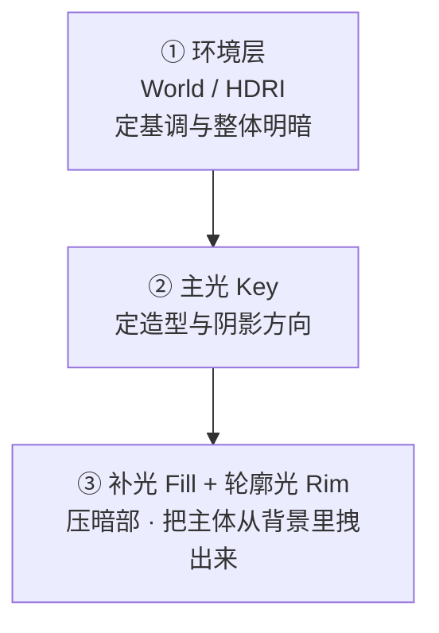
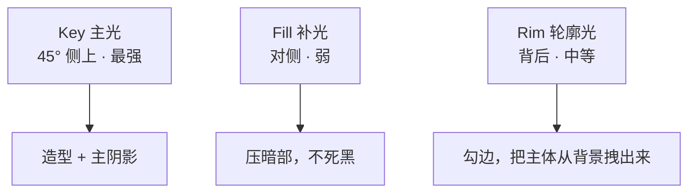
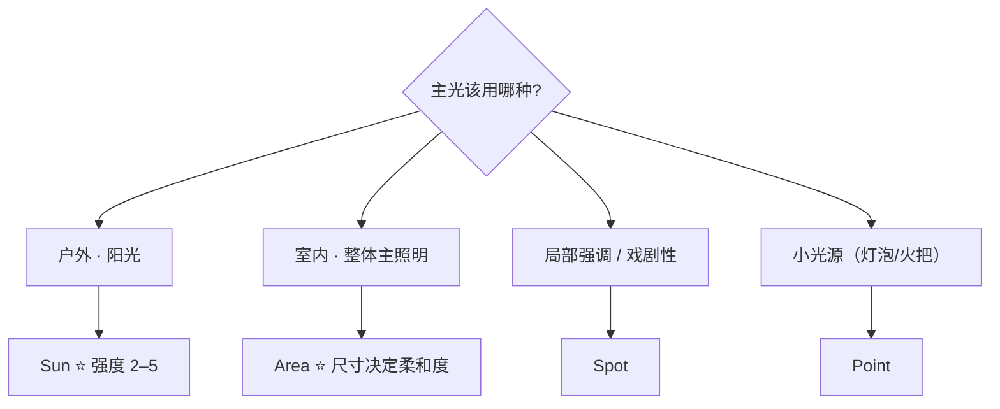
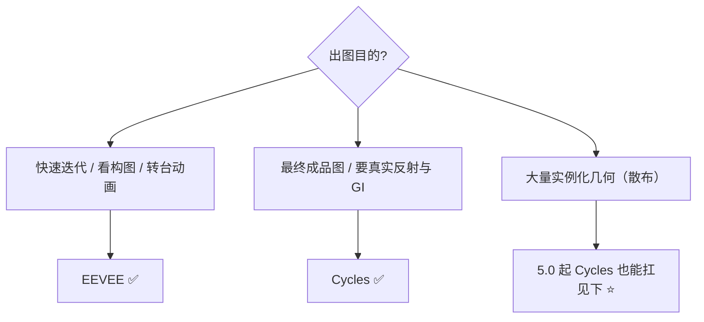
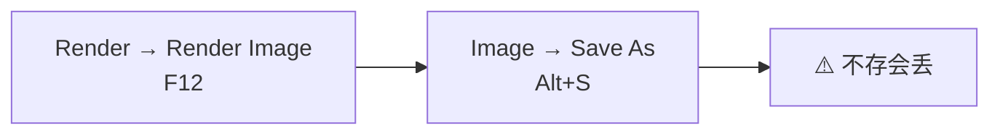

# 06 · 灯光与出图：HDRI、三点光、EEVEE vs Cycles

> 一句话：**灯光只有三层——环境打底、主光造型、补光/轮廓光分离。出图发灰 90% 不是渲染器的问题，是这三层里缺了一层。**
> 依据：官方手册 5.2 · Lights / Render / Color Management；Blender 5.0 Release Notes · Cycles & EEVEE

---

## 一、灯光的三层结构



| 层 | 用什么 | 作用 | 缺失后果 |
| -- | ------ | ---- | -------- |
| **① 环境** | World → Environment Texture（HDRI）或纯色 | 定整体基调、提供大面积柔和照明 | 场景发灰、死板、塑料感 |
| **② 主光** | `Sun`（户外）/ `Area` 或 `Spot`（室内） | 定造型、投影方向、明暗对比 | 没有立体感，像贴纸 |
| **③ 补光 / 轮廓** | `Area` / `Point`，低强度 | 提亮暗部、勾轮廓 | 暗部死黑、主体糊在背景里 |

> 🎯 **最常见的错误是「只有环境层」**：挂一张 HDRI 就出图，然后抱怨「为什么这么灰」。
> HDRI 提供的是**均匀的**环境光，它没有方向性、不产生造型。**主光才是造型的来源。**

---

## 二、环境层：HDRI

### 2.1 接法


| 步骤 | 操作 |
| ---- | ---- |
| ① | `World Properties → Surface → Use Nodes`（默认已开） |
| ② | Shader Editor 切到 `World`，加 `Texture → Environment Texture` |
| ③ | 打开 HDRI 文件 |
| ④ | `Color` → `Background` 节点的 `Color`（或直接接 `World Output` 的 Surface…⚠️ **正确做法是 Background 的 Color**） |

### 2.2 参数

| 参数 | 说明 | 典型值 |
| ---- | ---- | ------ |
| **Strength**（Background 节点） | 环境光强度 | 0.5–1.5，看 HDRI 本身的曝光 |
| **HDRI Rotation** | 旋转环境，改变光的方向 | 加一个 `Mapping` + `Vector Rotate` 节点控 Z 旋转 |
| **色彩空间** | HDRI 文件设 **Non-Color**（或 `Linear`） | ⚠️ 设成 sRGB 会整体发灰/过曝 |

> 💡 **HDRI 不是「背景图」**：它同时提供照明和反射。**关掉 `Camera` 射线可见性（`Object Properties → Visibility → Camera`）可以只留照明不要背景**，出图时再单独配背景。

### 2.3 HDRI 来源

| 来源 | 说明 |
| ---- | ---- |
| **Poly Haven** | ⭐ CC0，免费商用，2K/4K/8K 都有 |
| Blender 内置 Essentials | 5.2 有在线 HDR（需开 `Allow Internet Access`） |
| ambientCG | CC0 PBR 为主 |

---

## 三、主光：三点光



| 灯 | 位置 | 强度比 | 作用 |
| -- | ---- | ------ | ---- |
| **Key 主光** | 主体侧上方 30–45° | **1.0** | ⭐ 造型、投影、明暗对比 |
| **Fill 补光** | 主光对侧，稍低 | **0.3–0.5** | 提亮暗部，控制对比度 |
| **Rim 轮廓光** | 主体后方，偏侧 | **0.5–1.0** | 边缘高光，分离主体与背景 |

### 灯型选择

| 灯型 | 特点 | 适用 |
| ---- | ---- | ---- |
| **Sun** | 平行光、无限远、只管方向不管距离 | ⭐ 户外日光、月光的 Key |
| **Area** | 面光源，阴影柔和、有真实衰减 | ⭐ 室内主光、柔光箱、窗光 |
| **Spot** | 锥形，可控范围 | 射灯、车灯、局部强调 |
| **Point** | 点光源，全向 | 灯泡、火把、小范围补光 |
| **世界 HDRI** | 均匀环境光 | 环境层 |



> ⚠️ **`Sun` 的强度单位是 W/m²，典型值 2–5（不是 1）**。`Point` / `Area` 用 W，室内通常几十到几百。
> **Area 灯的柔和度由尺寸决定**，不是由强度决定——尺寸越大阴影越软。

---

## 四、相机

| 项 | 说明 | 入口 |
| -- | ---- | ---- |
| **焦距** | 场景 24–35mm / 资产 35–50mm / 特写 85–135mm | `Camera` 属性 → `Lens` |
| **景深** | 开 `Depth of Field`，对焦到主体 | ⭐ 让前景虚化，立刻变「摄影」 |
| **构图辅助线** | 三分法 / 黄金分割 | `Viewport Display → Composition Guides` |
| **锁定相机** | `Ctrl+Num0` 设为活动相机；`N` 面板 → View → `Lock Camera to View` 关掉 | 防误操作 |

> 💡 **景深（DoF）是性价比最高的一项**：主体清晰 + 前景背景虚化，一张图立刻有层次。
> 开 `Depth of Field` → `Focus on Object` 选主体 → 调 `F-Stop`（越小越虚，2.8 左右明显）。

---

## 五、EEVEE vs Cycles（5.x 之后要重新排）



| 维度 | EEVEE | Cycles |
| ---- | ----- | ------ |
| 原理 | 光栅化 + 屏幕空间近似 | ⭐ 路径追踪，物理正确 |
| 速度 | 实时 / 秒级 | 分钟–小时级 |
| 反射 / GI | 需要探针（Light Probe），近似 | ⭐ 天然正确 |
| 透明 / 折射 | 需要设置 | 天然正确 |
| 噪点 | 无（或有 TAA 残影） | ⭐ 有噪点，需 Denoise |
| 5.0 变化 | **材质编译大幅加速**（NVIDIA / Vulkan 后端最多快 4 倍） | **Adaptive Subdivision 不再是实验功能**，新增 **Object Space** 选项 |

### ⭐ 5.0 之后被推翻的一条老经验

| 老经验 | 5.x 实情 |
| ------ | -------- |
| 「散布 1 万棵草必须用 EEVEE，Cycles 会爆内存」 | **Cycles 5.0 的 Adaptive Subdivision + Object Space 让实例只细分一次**，与相机距离无关 → 内存最小。**Cycles 也能扛大量实例化几何** |

> 🎯 **实操建议：EEVEE 调构图和灯光，Cycles 出终图。**
> 先在 EEVEE 里把三层灯光调到位（实时反馈），确认构图，再切 Cycles 渲最终图。

---

## 六、渲染设置与输出

| 项 | 建议 | 说明 |
| -- | ---- | ---- |
| **分辨率** | 1920×1080（16:9）/ 1080×1350（竖版作品集） | 作品集不要超过 4K |
| **采样**（Cycles） | 预览 64–128 / 成品 256–512 | 开 Denoise 可以更低 |
| **Denoise** | ✅ 开（Cycles：OptiX / OIDN） | 5.0 的 OptiX denoiser 质量更好 |
| **色彩管理** | `View Transform`：**AgX 或 Filmic**，别用 Standard | ⚠️ 用 Standard 会过曝死白。5.x 支持 ACES（见路线图第 44 行） |
| **输出格式** | PNG（8/16bit）用于展示；**EXR** 用于后期 | ⚠️ 用 JPEG 会压掉暗部细节 |
| **输出路径** | `Output Properties → Output` | ⭐ 别用默认的 `/tmp` |



> ⚠️ **渲染完不存盘会丢**，和 Stage 4 的烘焙一个道理。养成 `F12` 之后立刻 `Alt+S` 的肌肉记忆。

---

## 七、出图流程（照着走）

| 步 | 操作 |
| - | ---- |
| ① | 挂 HDRI（环境层），调 `Strength`、旋 `Rotation` |
| ② | 加 Key（Sun 或 Area），定方向 |
| ③ | 加 Fill（弱），看暗部是不是还死黑 |
| ④ | 加 Rim（背后），看主体有没有从背景里出来 |
| ⑤ | 用 **EEVEE** 切几个机位试构图，定死相机 |
| ⑥ | 开景深、对焦主体 |
| ⑦ | 切 **Cycles**，设采样 + Denoise |
| ⑧ | `F12` 渲染 → `Alt+S` 存盘 |
| ⑨ | 检查：暗部死黑吗？高光死白吗？主体够突出吗？ |
| ⑩ | 不对就回②，别只调采样 |

> 🎯 **第 ⑨ 步的判断标准**：
> - 暗部死黑 → Fill 不够
> - 高光死白 → Key 太强或 View Transform 用错了
> - 主体不突出 → 缺 Rim，或景深不够

---

## 八、坑

- ❌ **只挂 HDRI 就出图** → 发灰、没立体感 → 缺主光
- ❌ **HDRI 色彩空间设成 sRGB** → 整体发灰/过曝 → **Non-Color**
- ❌ **`Sun` 强度给 1** → 几乎没光 → 典型值 2–5
- ❌ **Area 灯只调强度不调尺寸** → 阴影还是硬的 → **柔和度由尺寸决定**
- ❌ **View Transform 用 Standard** → 高光死白 → 用 AgX / Filmic / ACES
- ❌ **用 JPEG 出终图** → 暗部细节被压掉 → PNG 或 EXR
- ❌ **输出路径用默认 /tmp** → 找不着图
- ❌ **渲染完不存盘** → 关掉就没了（和烘焙一个道理）
- ❌ **在 EEVEE 里调完直接出终图** → 反射和 GI 是近似的，进 Cycles 观感会变
- ❌ **开景深但没设对焦物体** → 整个画面糊 → `Focus on Object` 选主体
- ❌ **灯光忘了放进 `Lights_` 集合** → 导出时混在道具里
- ❌ **Punctual Lights 导出后引擎里没有** → 导出要勾 `Punctual Lights`（见 [05 篇](05-场景性能与空间分组.md)）

---

## 九、自检

| # | 自检点 | 通过标准 |
| - | ------ | -------- |
| ① | 三层 | 说出环境 / 主光 / 补光轮廓三层各自的作用与缺失后果 |
| ② | HDRI | 会接一张 HDRI 并调 Strength 与 Rotation；说出色彩空间该设什么 |
| ③ | 三点光 | 报出 Key : Fill : Rim 的强度比，及各自位置 |
| ④ | 灯型 | 给「户外阳光 / 室内主照明 / 灯泡」各选出一种灯型 |
| ⑤ | 相机 | 说出焦距三段、会开景深并对焦 |
| ⑥ | 引擎选型 | 说出 EEVEE / Cycles 的选型依据，及 5.0 改变了哪条老经验 |
| ⑦ | 输出 | 说出 View Transform 该用什么、为什么不能用 JPEG |

---

## 十、速查

```text
【灯光三层】
① 环境  World / HDRI      定基调 · ⚠️ 无造型能力
② 主光  Key (Sun / Area)  定造型与阴影 ⭐ 发灰的根源是缺这层
③ 补光  Fill 0.3–0.5      压暗部
   轮廓  Rim  0.5–1.0      把主体从背景拽出来

【HDRI】
World → Use Nodes → Environment Texture → Background › Color
Strength 0.5–1.5
Rotation 加 Mapping + Vector Rotate 控 Z
⚠️ 色彩空间 = Non-Color（设 sRGB 会发灰/过曝）
来源：Poly Haven（CC0）
只留照明不要背景 → 关 Object Properties → Visibility → Camera

【灯型】
Sun    户外阳光 ⭐ 强度 2–5（不是 1）
Area   室内主照明 ⭐ 柔和度由尺寸决定
Spot   局部强调 / 射灯
Point  灯泡 / 火把

【相机】
焦距  场景 24–35 / 资产 35–50 / 特写 85–135
景深  ⭐ Depth of Field → Focus on Object → F-Stop 2.8
构图  Viewport Display → Composition Guides

【EEVEE vs Cycles】
EEVEE  实时 · 需 Light Probe 近似反射 · 5.0 材质编译快 4×
Cycles 物理正确 · 有噪点需 Denoise · 慢
⭐ 5.0：Adaptive Subdivision 转正 + Object Space
    → 实例只细分一次 → Cycles 也能扛大量散布
流程：EEVEE 调灯光构图 → Cycles 出终图

【输出】
分辨率  1920×1080 / 竖版 1080×1350
采样    Cycles 预览 64–128 · 成品 256–512
Denoise ✅ 开（OptiX / OIDN）
View Transform  ⭐ AgX / Filmic / ACES（❌ 别用 Standard）
格式    PNG（展示） / EXR（后期）· ❌ 不要 JPEG
路径    别用默认 /tmp
渲染    F12 → ⭐ Alt+S 立刻存盘

【自检三问】
暗部死黑 → Fill 不够
高光死白 → Key 太强 / View Transform 错了
主体不突出 → 缺 Rim / 景深不够
```

---

> **下一步**：[`07-作品集呈现-转台-线框-面数标注.md`](07-作品集呈现-转台-面数标注.md) —— 图出好了，接下来把它们变成别人愿意看完的展示。
