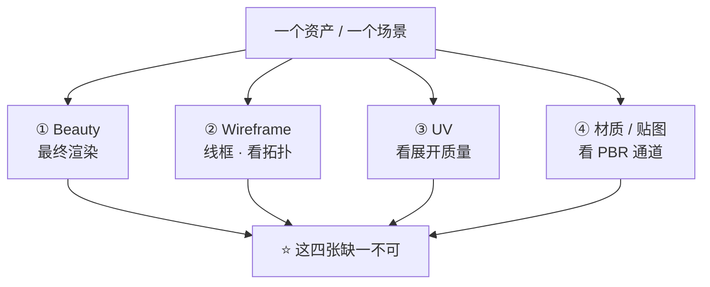
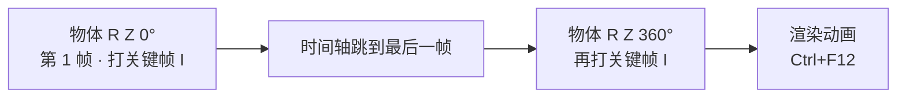
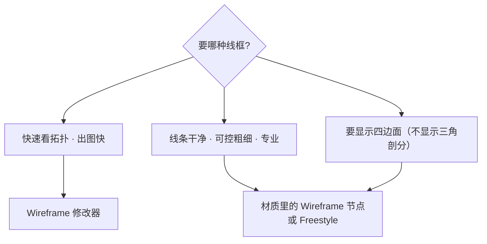
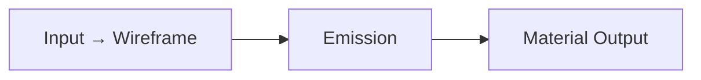
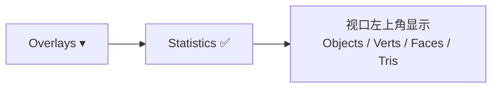

# 07 · 作品集呈现：转台、线框、UV、面数标注

> 一句话：**一个作品 = 4 张图（Beauty / Wireframe / UV / 材质），少了任何一张，看的人都无法判断你的真实水平。**
> 依据：官方手册 5.2 · Wireframe 修改器 / Statistics 叠加层 / Freestyle；官方手册 · UV Grid（内置）

---

## 一、作品集的四张图



| # | 图 | 展示什么 | 用什么做 |
| - | -- | -------- | -------- |
| ① | **Beauty** | 最终观感、灯光、构图 | [06 篇](06-灯光与出图-HDRI-三点光-EEVEE-Cycles.md) |
| ② | **Wireframe** | ⭐ **拓扑质量**（四边面？均匀？极点？） | 三种做法，见第三节 |
| ③ | **UV** | UV 排布、有无拉伸、有无重叠 | **内置 UV Grid** |
| ④ | **材质 / 贴图** | BaseColor / Normal / ORM 通道 | 贴图平铺图或材质球 |

> ⚠️ **只出 Beauty 图是业余的表现。** 做游戏资产的人看作品集，第一眼看 Beauty，第二眼立刻找 Wireframe 和面数——**没有这两项，等于没展示**。

### 加分项

| 项 | 说明 |
| -- | ---- |
| **转台动画** | 360° 旋转视频，最能看出体积与轮廓 |
| **面数标注** | 直接写在图上或在说明里，别让人猜 |
| **引擎截图** | ⭐ 证明「能进引擎」，这是游戏资产最硬的一条 |
| **Clay（素模）渲染** | 无贴图只看形体与光影 |

---

## 二、转台渲染

### 2.1 最简单的做法：让物体转



| 步 | 操作 |
| - | ---- |
| ① | 选中物体（或建一个 Empty 把物体父给它） |
| ② | 时间轴第 1 帧，`R` `Z` `0` → `I` → `Rotation` |
| ③ | 时间轴跳到第 **120** 帧（5 秒 @24fps 或 4 秒 @30fps） |
| ④ | `R` `Z` `360` → `I` → `Rotation` |
| ⑤ | `Output Properties` 设输出为 `FFmpeg Video` 或图片序列 |
| ⑥ | `Ctrl+F12` 渲染动画 |

### 2.2 更稳的做法：让相机绕

| 项 | 说明 |
| -- | ---- |
| 做法 | 建一个 Empty 放在物体中心 → 相机父给 Empty（或加 `Track To` 约束指向物体）→ 旋转 Empty |
| 优点 | ⭐ **物体本身不动**，材质上的反射/折射变化更自然；且物体如果有动画也不冲突 |
| 适用 | 出最终作品集的转台 |

### 2.3 参数建议

| 项 | 建议 |
| -- | ---- |
| 帧数 | 120 帧（24fps = 5 秒）/ 240 帧更顺滑 |
| 输出 | 图片序列（PNG）比直接出视频稳，方便后期 |
| 渲染器 | ⭐ **EEVEE**（转台要渲上百帧，Cycles 太慢） |
| 采样 | EEVEE 开 TAA，Cycles 用 64–128 + Denoise |
| 灯光 | 转台通常用「一套固定的三点光」，不随物体转 |

> 💡 **转台时灯光不转**：物体转、灯不动，才能看出各个角度的高光变化。这也是为什么用 Empty 旋转相机的方式更灵活。

---

## 三、线框图的三种做法



| 做法 | 入口 | 优点 | 缺点 |
| ---- | ---- | ---- | ---- |
| **① Wireframe 修改器** | `Modifiers → Wireframe` | ⭐ 最快，实时预览，可调 `Thickness` | 会显示三角剖分；渲染出来是实心的线 |
| **② 材质 Wireframe 节点** | Shader Editor → `Input → Wireframe` → 接 Emission | ⭐ **只显示四边面**（不显示三角剖分），线条干净 | 要另建一个材质；线宽由 `Wireframe` 的 `Size` 控 |
| **③ Freestyle** | `Render Properties → Freestyle` | ⭐ 最可控（线宽、颜色、边缘类型），专业插画感 | 设置最复杂 |

### 3.1 做法①：Wireframe 修改器（最常用）

| 参数 | 说明 |
| ---- | ---- |
| `Thickness` | 线的粗细 |
| `Offset` | 沿法线外扩，避免线与面 z-fighting |
| `Crease Weight` | 要不要按折痕权重控制粗细 |
| `Boundary` | ⭐ 勾选后保留边界线 |
| `Replace Original` | 勾了就只显示线，不显示实体 |

> 💡 **做法**：复制一份物体（`Alt+D`），加 Wireframe 修改器 → 勾 `Replace Original` → 给一个纯色 Emission 材质 → 渲染。
> 或者：勾 `Replace Original` 关掉，让线叠在实体上（能同时看到形体和拓扑）。

### 3.2 做法②：材质 Wireframe 节点



| 项 | 说明 |
| -- | ---- |
| 节点 | Shader Editor → `Add → Input → Wireframe` |
| 输出 `Fac` | 线的遮罩 |
| ⭐ 特点 | **只显示四边面的边**，不显示三角剖分 → 这才是你想展示的拓扑 |
| 用法 | `Wireframe.Fac` → `Emission` 的 Strength（或 `ColorRamp` 控对比），底色给深色 |

### 3.3 千万别做的事

> ❌ **用视口截图当线框图**。
> 视口截图会带上网格地面、叠加层、坐标轴、选中高亮——**一看就是截图，不是作品**。
> 一定要**单独渲染**（`F12`）。

---

## 四、UV 检查图

| 步 | 操作 |
| - | ---- |
| ① | UV 编辑器里 `Image → New` → **`Generated Type: UV Grid`** |
| ② | 尺寸 = **目标贴图分辨率**（1024 / 2048 保持一致，见 Stage 3） |
| ③ | 材质里把这张 UV Grid 接进 Base Color |
| ④ | 渲染一张正视图 / 或直接在 UV 编辑器里截 UV 布局图 |
| ⑤ | 可选：同时截一张 3D 视图的棋盘格效果 |

> ⚠️ **不要去网上下载棋盘格**，Blender 自带 UV Grid（Stage 3 第 05 篇已强调）。
> ⚠️ **检查图分辨率必须等于最终贴图分辨率**，否则 padding 和纹素密度判断全错。

---

## 五、面数标注

| 方法 | 入口 | 说明 |
| ---- | ---- | ---- |
| ⭐ **Statistics 叠加层** | 3D 视口右上角 `Overlays → Statistics` | 显示 Objects / Verts / Faces / **Tris** |
| **状态栏** | 视口底部状态条 | 显示当前场景总量 |
| **引擎统计** | 引擎的渲染统计面板 | 最终以引擎为准 |



> ⚠️ **面数要用 Statistics 读出来的真实数字，不要自己估**。
> 作品集上写「约 2000 面」而实际 5000，是最容易被拆穿的失误。
> ⚠️ **单位是三角形（Tris）**，不是四边形。Blender 里的 `Faces` 对四边面模型会比引擎里的 tris 少很多——**用 Tris 那一栏**。

---

## 六、排版与命名规范

### 6.1 文件命名

```text
<资产名>_<图类型>_<分辨率>.png

Prop_Crate_Wood_01_Beauty_1920.png
Prop_Crate_Wood_01_Wireframe_1920.png
Prop_Crate_Wood_01_UV_1024.png
Prop_Crate_Wood_01_Material_1920.png
Prop_Crate_Wood_01_Turntable.mp4
```

| 约定 | 值 |
| ---- | -- |
| 图类型 | `Beauty` / `Wireframe` / `UV` / `Material` / `Turntable` / `Clay` |
| 分辨率 | 写在文件名里，便于管理 |
| 格式 | PNG（展示）/ MP4（转台）/ **不要用 JPEG** |

### 6.2 一个作品的展示结构

```text
作品名
├── 一句话说明（这是什么、给什么项目做的）
├── ⭐ 面数（Tris）+ 贴图分辨率 + 材质数
├── ① Beauty（主图）
├── ② Wireframe
├── ③ UV + 棋盘格
├── ④ 材质 / 贴图通道
├── ⑤ 转台（可选，加分）
└── ⑥ 引擎截图（⭐ 游戏资产必备）
```

| 必写信息 | 为什么 |
| -------- | ------ |
| **面数（Tris）** | 不做这行的人第一眼找这个 |
| **贴图分辨率** | 说明你懂预算 |
| **材质数** | 说明你懂 draw call |
| **引擎截图** | ⭐ 证明「能进引擎」——这是游戏资产和「好看的渲染图」的分界线 |

---

## 七、坑

- ❌ **只出一张 Beauty 图** → 看的人无法判断水平 → 4 张齐
- ❌ **线框图用视口截图** → 有网格地面和叠加层，一看就是截图 → 单独 `F12` 渲染
- ❌ **面数自己估** → 写「约 2000」实际 5000 → 开 Statistics 读真实值
- ❌ **面数写 Faces 不写 Tris** → 四边面模型的数字对不上引擎 → **用 Tris**
- ❌ **转台用 Cycles 渲 240 帧** → 渲一夜 → 用 EEVEE
- ❌ **转台时灯光跟着转** → 看不出高光变化 → 灯不动
- ❌ **去网上下载棋盘格** → Blender 自带 UV Grid
- ❌ **UV 检查图分辨率 ≠ 最终贴图分辨率** → padding 判断全错
- ❌ **作品集用 JPEG** → 暗部细节被压掉 → PNG
- ❌ **不标面数** → 等于让人猜，而猜的人一律往高了猜
- ❌ **不放引擎截图** → 游戏资产最大的说服力来源被浪费了
- ❌ **渲染完不存盘** → `Alt+S`

---

## 八、自检

| # | 自检点 | 通过标准 |
| - | ------ | -------- |
| ① | 四张图 | 说出 Beauty / Wireframe / UV / 材质四张分别展示什么 |
| ② | 转台 | 会做（物体转或相机绕），说出帧数与渲染器选择 |
| ③ | 线框 | 说出三种做法及各自适用面，说出「只显示四边面」该用哪种 |
| ④ | UV 图 | 会生成内置 UV Grid，说出分辨率该怎么设 |
| ⑤ | 面数 | 会用 Statistics 读 Tris，说出为什么不能用 Faces |
| ⑥ | 排版 | 说出一个作品必须标注的三项信息 |
| ⑦ | 避坑 | 说出「线框图不能是视口截图」的原因 |

---

## 九、速查

```text
【四张图】
① Beauty     最终渲染
② Wireframe  拓扑（⭐ 缺了等于没展示）
③ UV         UV Grid 检查图
④ Material   贴图通道 / 材质球
加分：转台动画 · 面数标注 · ⭐ 引擎截图 · Clay 素模

【转台】
简单  物体 R Z 0°→I · 第120帧 R Z 360°→I · Ctrl+F12
推荐  建 Empty 在中心 → 相机父给 Empty → 转 Empty
        ⭐ 物体不动 · 灯光不转
帧数  120（5秒@24fps）/ 240
渲染器 ⭐ EEVEE（Cycles 渲上百帧太慢）
输出  图片序列 PNG 比直接出视频稳

【线框三种】
① Wireframe 修改器      最快 · Thickness/Offset/Boundary
                         勾 Replace Original = 只显示线
② 材质 Wireframe 节点    ⭐ 只显示四边面（不显示三角剖分）
                         Input → Wireframe → Emission
③ Freestyle             最可控 · 最复杂
❌ 绝对不要视口截图（有网格地面和叠加层）

【UV 检查图】
UV 编辑器 → Image → New → Generated Type: UV Grid
⚠️ 尺寸 = 最终贴图分辨率（否则 padding 判断全错）
⚠️ 不要去网上下载棋盘格

【面数】
⭐ Overlays → Statistics → 读 Tris
⚠️ 用 Tris 不用 Faces（四边面模型差很多）
⚠️ 不要自己估

【命名】
<资产名>_<图类型>_<分辨率>.png
Beauty / Wireframe / UV / Material / Turntable / Clay
格式 PNG · MP4 · ❌ 不要 JPEG

【必标注】
⭐ 面数(Tris) · 贴图分辨率 · 材质数 · 引擎截图
```

---

> **下一步**：[`08-练习项目-仓库角落与岩石地形.md`](08-练习项目-仓库角落与岩石地形.md) —— 把 01–07 全部用一遍，做出两个完整场景。
