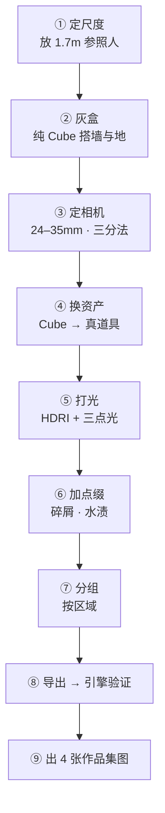
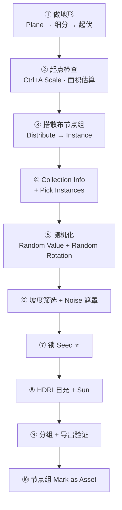
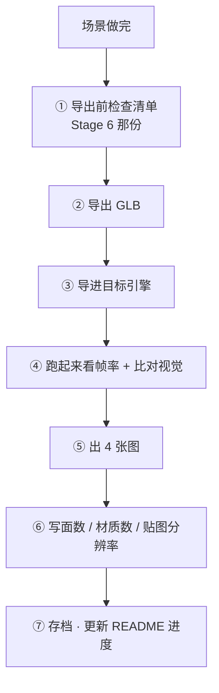

# 08 · 练习项目：废弃仓库角落 + 户外岩石地形

> 一句话：**两个场景分别练两种能力——仓库练「组装 + 灯光」，地形练「散布 + 有机资产」。两个都必须进引擎，不然不算完。**
> 依据：[`../Blender学习路线图.md`](../../Blender学习路线图.md) Stage 7；本篇是 01–07 的综合验收

---

## 〇、开始之前：前置检查

```text
[ ] Stage 6（07-资产规范与引擎导出）的导出闭环已跑通过至少 1 次
[ ] 至少有 4–6 个做完 PBR 贴图的道具（Stage 1/2/4 的产出）
[ ] 至少有 3 块岩石类有机资产（Stage 5/6 的产出）
[ ] 知道自己的目标引擎是什么（决定导出开关）
[ ] 已 Save Incremental 习惯养成
```

> ⚠️ **如果前置没过，回去补。** Stage 7 是收尾阶段，前面的坑会在这里一起爆。

---

## 一、场景 #1：废弃仓库角落

### 1.1 目标与约束

| 项 | 目标 |
| -- | ---- |
| 内容 | 4–6 个**自己做**的道具 + 灯光 + 一个相机视角出图 |
| 面数 | 整场 **≤ 25 万 tri** |
| 材质 | 整场 **≤ 8 个**材质 |
| 帧率 | 目标引擎里 **≥ 60fps** |
| 产出 | 4 张作品集图 + 引擎截图 |

### 1.2 资产清单（自己做的为主）

| # | 资产 | 尺寸（米） | 面数预算 | 来源 | 状态 |
| - | ---- | ---------- | -------- | ---- | ---- |
| 1 | 墙 + 地面（Kit 模块 2m） | 4 × 3 × 2.5 | ≤ 2,000 | 自己做（Cube 起） | ⬜ |
| 2 | 油桶 × 3 | Ø0.6 × 0.88 | ≤ 2,500 ea | Stage 1 已有 | ⬜ |
| 3 | 木箱 × 4 | 0.8 / 0.6 / 0.5 | ≤ 800 ea | Stage 1 已有 | ⬜ |
| 4 | 工具箱 / 弹药箱 × 1 | 0.5 × 0.3 × 0.3 | ≤ 2,500 | Stage 1 验收项目 | ⬜ |
| 5 | 货架（可选） | 2 × 0.6 × 2 | ≤ 3,000 | 自己做 | ⬜ |
| 6 | 点缀（碎屑 / 水渍 / 废纸） | — | ≤ 500 | 自己做或免费素材改造 | ⬜ |

> 🎯 **80% 必须自己做**。允许用 1–2 个免费素材，但**必须改造过**（换贴图 / 加脏污 / 改形状）——原样拖进来不算。

### 1.3 分步做法



| 步 | 要点 | 对应篇 |
| -- | ---- | ------ |
| ① | 场景单位设米；放一个 1.7m 参照人（不渲染） | [01](01-场景组装工作流-从资产到场景.md) |
| ② | 墙 2.5m 高（仓库尺度），只用 Cube，**不加细节** | [01] |
| ③ | 焦距 24–35mm，相机高 1.65m，**定死**；开 Composition Guides | [01][06](06-灯光与出图-HDRI-三点光-EEVEE-Cycles.md) |
| ④ | 从资产库拖；**吸附对齐**（`Shift+Tab`）；轮换 + ±3% 缩放破重复 | [02](02-资产库与场景级Kitbash.md) |
| ⑤ | HDRI（Poly Haven）打底 → `Sun` 或 `Area` 做 Key → Fill → Rim | [06] |
| ⑥ | 只加**相机看得到的地方**；画面外的细节删掉 | [01] |
| ⑦ | 按区域切 Collection（`Zone_Corner`），**不按类型** | [05](05-场景性能与空间分组.md) |
| ⑧ | `Apply Modifiers` **必须开**；进引擎看帧率 | [05] |
| ⑨ | Beauty / Wireframe / UV / 材质 + 面数标注 + 引擎截图 | [07](07-作品集呈现-转台-线框-面数标注.md) |

### 1.4 「废弃感」怎么来（这一条决定成败）

| 手法 | 做法 |
| ---- | ---- |
| ⭐ **不对称** | 所有东西都别摆正，桶歪一点、箱子叠歪一点 |
| ⭐ **三层脏** | 边缘磨损（Curvature 蒙版）+ 积尘（AO 蒙版）+ 局部锈迹（手绘） |
| **光比** | 一边亮一边暗，阴影要深——「均匀明亮」= 新，不是废弃 |
| **一个焦点** | 画面里必须有一个东西是「主角」（比如一束光打在工具箱上） |
| **叙事细节** | 倒下的桶、地上的水渍、墙上的旧标记 |

> 🎯 **「废弃」不是「脏」，是「有人用过然后走了」。** 摆一个倒下的桶比加十层脏污管用。

### 1.5 验收

```text
[ ] 80% 道具是自己做的
[ ] 整场 ≤ 25 万 tri（Statistics 读 Tris）
[ ] 材质 ≤ 8 个
[ ] 分组是按区域
[ ] 相机在灰盒阶段就定死了
[ ] 导出进引擎，≥ 60fps，视觉与 Blender 一致
[ ] 4 张作品集图 + 面数标注 + 引擎截图
```

---

## 二、场景 #2：户外岩石地形

### 2.1 目标与约束

| 项 | 目标 |
| -- | ---- |
| 内容 | 几何节点散布 + 有机资产 + HDRI 日光 |
| 面积 | 20 × 20 m 地形 |
| 面数 | 整场 **≤ 40 万 tri** |
| 帧率 | 目标引擎里 **≥ 60fps** |
| 产出 | 4 张作品集图 + 散布节点组（**存成资产**）+ 引擎截图 |

### 2.2 资产清单

| # | 资产 | 数量 | 面数预算 | 来源 | 状态 |
| - | ---- | ---- | -------- | ---- | ---- |
| 1 | 地形 | 1 | ≤ 5,000 | 自己做（Plane + 雕刻 / Displace） | ⬜ |
| 2 | 岩石 × 3–5 变体 | 散布 | 300–800 ea | Stage 5/6 已有 | ⬜ |
| 3 | 碎石 | 散布（密度高） | 50–150 ea | 自己做 | ⬜ |
| 4 | 草 / 低矮植被（可选） | 散布 | 20–50 ea | 自己做或简化面片 | ⬜ |
| 5 | 树桩 / 倒木（可选） | 2–3 | ≤ 1,500 ea | Stage 5 已有 | ⬜ |

### 2.3 分步做法



| 步 | 要点 | 对应篇 |
| -- | ---- | ------ |
| ① | Plane 20×20m → 细分 → 雕刻或 `Displace` 做起伏；**坡度要有变化**（有平地有陡坡） | Stage 5 |
| ② | ⭐ 地形 `Ctrl+A → Scale`；**估算面积**（20×20 = 400 m²，但斜面更多，按 500 估） | [04](04-几何节点散布入门.md) |
| ③ | `Distribute Points on Faces`；**Density 按面积算**（岩石 0.1/㎡ → 约 50 个） | [04] |
| ④ | 岩石放集合 → `Collection Info` → **必须开 `Pick Instances`** | [04] |
| ⑤ | `Random Value` 控缩放 0.7–1.3；`Random Rotation` 或 `Rotate Instances` 控朝向；`Align Rotation to Vector` 贴合坡面 | [04] |
| ⑥ | `Normal · (0,0,1)` → `Compare > 0.7` → Selection（陡坡不长草）；Noise → Multiply → Density（有疏有密） | [04] |
| ⑦ | ⭐ **Seed 锁死**，之后不再动 | [04] |
| ⑧ | Poly Haven 户外 HDRI + `Sun`（强度 2–5） | [06] |
| ⑨ | 按区域分组；`Apply Modifiers` 必开；导出验证 | [05] |
| ⑩ | 节点组右键 → **Mark as Asset**，下个场景直接拖 | [02][04] |

### 2.4 密度速算

| 资产 | 建议密度 | 500 m² 估算数量 | 面数小计 |
| ---- | -------- | -------------- | -------- |
| 岩石 | 0.05–0.1 / m² | 25–50 | 25 × 600 = 1.5 万 |
| 碎石 | 0.5–2 / m² | 250–1000 | 500 × 100 = 5 万 |
| 草 | 5–20 / m²（只做近景） | 视情况 | 谨慎，容易爆 |

> ⚠️ **草是最容易爆面数的**。要么只做相机附近，要么用面片（cross-plane），要么先不做。
> **先跑通「岩石 + 碎石」，草留到最后加。**

### 2.5 验收

```text
[ ] 地形有坡度变化（有平地有陡坡）
[ ] 散布用几何节点实例（不是复制）
[ ] Collection Info 开了 Pick Instances
[ ] 有坡度筛选（陡坡没长东西）
[ ] 有密度遮罩（有疏有密，不像网格）
[ ] Seed 已锁死
[ ] 整场 ≤ 40 万 tri
[ ] 导出进引擎，≥ 60fps，散布没丢
[ ] 散布节点组已 Mark as Asset
[ ] 4 张作品集图 + 面数标注 + 引擎截图
```

---

## 三、两个场景共用的收尾流程



| 步 | 检查点 |
| -- | ------ |
| ① | `Apply Rotation & Scale`、原点、UV、材质无 Blender 专有节点、`M → By Distance`、`Shift+N`、命名规范 |
| ② | ⭐ **`Apply Modifiers` 必须 ON**（不开几何节点散布全丢） |
| ③ | 引擎单位（UE5 要 ×100） |
| ④ | 帧率 + 有没有丢东西（散布还在吗？材质对吗？AO 在吗？） |
| ⑤ | Beauty / Wireframe / UV / 材质 |
| ⑥ | Statistics 读 **Tris**，不估 |

### 导出开关（场景级）

| 开关 | 值 | 说明 |
| ---- | -- | ---- |
| `Apply Modifiers` | **ON** ⭐ | 不开 = 散布全丢 |
| `Full Collection Hierarchy` | ON | 保住 Zone 分组 |
| `Geometry Nodes Instances` | 实验 · 视引擎 | 见 [05](05-场景性能与空间分组.md) |
| `GPU Instances` | 视引擎 | ⚠️ 4 条限制；**Godot 不支持** |
| `Cameras` / `Punctual Lights` | 按需 | |
| `+Y Up` | ON | |
| `Tangents` | OFF | |
| `Draco` | ON level 6（确认引擎支持） | |

---

## 四、坑

- ❌ **不搭灰盒直接摆** → 比例错了全部重摆
- ❌ **相机最后才定** → 细节做完了发现构图废了
- ❌ **仓库墙按 2.0m 做** → 那是室内门高，仓库要 2.5–3.5m
- ❌ **所有东西摆得整整齐齐** → 没有废弃感 → 歪一点、倒一个
- ❌ **地形忘了 `Ctrl+A → Scale`** → 散布出来大小乱七八糟
- ❌ **Density 抄教程固定值** → 它是每平方米点数，面积一变全错
- ❌ **`Collection Info` 不开 `Pick Instances`** → 面数 × 5
- ❌ **调完还在改 Seed** → 排布一直变
- ❌ **不做坡度筛选** → 陡崖上长满东西，一眼假
- ❌ **一上来就加草** → 面数爆炸 → 先岩石后碎石最后草
- ❌ **导出忘了 `Apply Modifiers`** → 散布整个消失
- ❌ **只看 Blender 视口不看引擎** → 自欺欺人
- ❌ **做完节点组不 Mark as Asset** → 下个场景再搭一遍

---

## 五、自检

| # | 自检点 | 通过标准 |
| - | ------ | -------- |
| ① | 尺度 | 报出仓库墙高、油桶尺寸、参照人身高 |
| ② | 灰盒 | 说出为什么相机必须在灰盒阶段定死 |
| ③ | 散布 | 不看教程搭出完整散布链路（含 Pick Instances / 随机化 / 坡度筛选） |
| ④ | 密度 | 按地形面积估算出岩石数量，不是抄数 |
| ⑤ | 分组 | 说出两个场景分别按什么切区域 |
| ⑥ | 导出 | 说出场景导出与单资产导出的两个关键差别 |
| ⑦ | 闭环 | 两个场景都进了引擎，帧率达标，视觉一致 |
| ⑧ | 作品集 | 每个场景 4 张图齐，面数用 Tris 且来自 Statistics |

---

## 六、速查

```text
【场景 #1 废弃仓库角落】
墙高 2.5m（仓库，不是室内 2.0m）
整场 ≤ 25 万 tri · ≤ 8 材质 · ≥ 60fps
废弃感 = 不对称 + 三层脏 + 大光比 + 一个焦点 + 叙事细节
⭐ 摆一个倒下的桶 > 加十层脏污

【场景 #2 户外岩石地形】
20×20m · 整场 ≤ 40 万 tri · ≥ 60fps
密度   岩石 0.05–0.1/㎡  碎石 0.5–2/㎡  草 5–20/㎡（最后加）
顺序   ⭐ 岩石 → 碎石 → 草（草最容易爆面数）
做完   ⭐ 节点组 Mark as Asset

【收尾七步】
① 导出前检查（Stage 6 清单）
② 导出 GLB（⭐ Apply Modifiers ON）
③ 导进引擎（UE5 ×100）
④ 跑起来看帧率 + 比对视觉
⑤ 出 4 张图
⑥ 写 Tris / 材质数 / 贴图分辨率（Statistics 读，不估）
⑦ 存档 + 更新 README 进度

【场景导出开关】
Apply Modifiers          ⭐ ON（不开 = 散布全丢）
Full Collection Hierarchy ON
Geometry Nodes Instances  实验 · 视引擎
GPU Instances            视引擎（Godot ❌ 不支持）
Cameras / Punctual Lights 按需
+Y Up ON · Tangents OFF · Draco ON(6)
```

---

> **下一步**：两个场景都完成后，回 [`笔记.md`](笔记.md) 做「6 条自检」并写阶段复盘。8 个 Stage 全部走完 → 回 [`../README.md`](../README.md) 勾满进度看板，按需开支线（[`../支线/几何节点深入.md`](../支线/几何节点深入.md) / [`../支线/程序化材质.md`](../支线/程序化材质.md) / [`../支线/绑定与动画.md`](../支线/绑定与动画.md)）。
