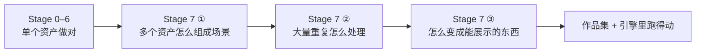
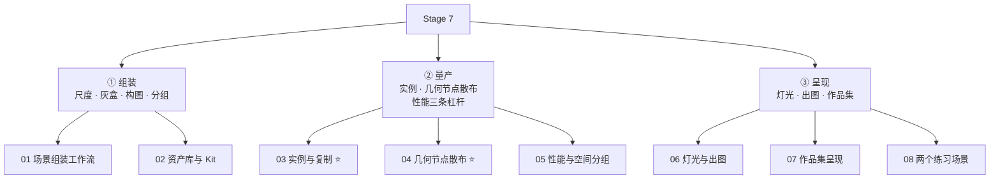
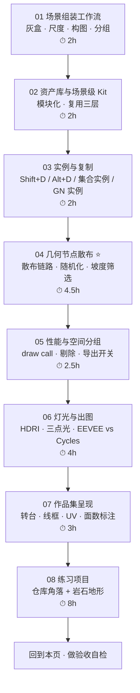
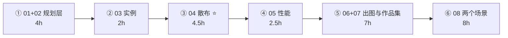

# Stage 7 · 场景组装 + 几何节点 + 作品集（20–30h）

> **一句话目标**：多个资产组合成一个可信的场景，并把它变成能展示的东西。
> 状态：⬜ 未开始　|　开工：　　　|　完成：
> 环境：**Blender 5.2 LTS** · macOS　|　前置：`03-非破坏性流程与资产管理`（资产库 / Alt+D / 集合）必须先做完、`05-材质PBR与烘焙` 的道具、`06-有机资产` 的岩石、`07-资产规范与引擎导出` 的导出闭环**必须已跑通**

> ⚠️ **Stage 7 是「收尾阶段」，不是「放松阶段」**。
> 它几乎不引入新操作——但它是一个「前面 6 个阶段的所有错误会同时暴露」的阶段：比例错、UV 密度不一、材质色彩空间错、导出没 Apply Modifiers、面数超预算……每一个都会在「把东西摆到一起」的那一刻同时跳出来。
> **如果你的道具还没进过引擎，先回去做 Stage 6，不要从这里开始。**

---

## 0. ⚠️ 先订正：路线图 Stage 7 有 6 处说法需要按 5.x 补全 / 修正

照着路线图学之前先看这张表。这个阶段大量内容来自 3.x/4.x 教程，节点名与开关名在 5.x 变过，抄错了会卡很久。

| # | 路线图的说法 | **5.x 的实际情况** | 依据 |
| - | ------------ | ------------------ | ---- |
| 1 | 「几何节点散布植被（**Array 的** Scatter on Surface 也能干一部分）」 | **说法错了**。`Scatter on Surface` 不是 Array 的子功能，它是 5.0 新增的**独立修改器**。5.0 一共新增 6 个基于几何节点的修改器：**Array** / **Scatter on Surface** / **Instance on Elements** / **Randomize Instances** / **Curve to Tube** / **Geometry Input**。旧版 Array 保留为 `Array (Legacy)` | 官方手册 / Blender 5.0 Release Notes · Modeling |
| 2 | （没提）对齐法线的节点名变了 | 老教程里满地的 **`Align Euler to Vector` 在 5.x 已被 `Align Rotation to Vector` 取代**（归到 Utilities › Rotation）。另外 5.x 多了专用的 **`Random Rotation` 节点**，散布时随机朝向不必再手动拆 XYZ | 官方手册 5.2 · Utilities Nodes（Rotation 分类下无 Align Euler to Vector） |
| 3 | 「实例化 vs 复制：大量重复道具用实例」 | 方向对，缺了两条硬约束：① **几何节点生成的实例，不能和属性面板 `Object Properties → Instancing`（Vertices / Faces）混用**（手册明确警告）；② **渲染与视口只支持 8 层嵌套实例**，更深的树必须在节点树末尾 `Realize Instances` | 官方手册 5.2 · Geometry Nodes › Instances |
| 4 | 「空间分组：按区域分组而不是按类型分组（利于视锥剔除）」 | 对，但只说了三条杠杆里的一条。真正决定场景帧率的是：**draw call（物体数 × 材质数）**、**剔除粒度（包围盒大小）**、**GPU 实例化**。而且 glTF 导出侧还有两个独立开关：**`Geometry Nodes Instances`（实验）** 与 **`GPU Instances`（EXT_mesh_gpu_instancing）**——后者有硬限制（实例必须是网格、不能有子级、必须同属一个父物体、**不支持材质变体**） | 官方手册 5.2 · glTF 2.0 › Data - Scene Graph |
| 5 | 「EEVEE 快速出图、Cycles 出精图」 | 5.0 起这条要重排：**Cycles 的 Adaptive Subdivision 不再是实验功能**，且新增 **Object Space** 选项——物体被实例化时只细分一次、内存占用最小；**EEVEE 5.0 的材质编译大幅加速**（NVIDIA / Vulkan 后端最多快 4 倍）。也就是说「散布 1 万棵草必须用 EEVEE」这个老经验已经不成立了 | Blender 5.0 Release Notes · Cycles / EEVEE |
| 6 | 「作品集呈现：转台渲染 + 线框 + UV 检查图 + 面数标注」 | 没说清工具来源，容易到处找插件。实际上：线框有 **三种做法**（Wireframe 修改器 / 材质里的 `Wireframe` 节点 / Freestyle），面数用 **Statistics 叠加层**（不是手数、不是猜），UV 检查图用 **内置 UV Grid**（和 Stage 3 同一个东西） | 官方手册 · Wireframe 修改器 / Statistics 叠加层 |

> 📌 第 1、2、3、4 条建议同步回 `Blender学习路线图.md`（Stage 7 必学清单，第 384–391 行附近）；第 1、2、3、4、5 条同步回 [`速查/常见坑汇总.md`](../速查/常见坑汇总.md) 的「场景 / 几何节点」段。
>
> 📌 通用兜底：**快捷键按不出来或菜单位置对不上，一律按 `F3` 搜命令名**，不要死记位置。

---

## 1. 本阶段在解决什么问题

Stage 0–6 你练的是「**单个资产**怎么做对」。Stage 7 要解决的是另外三件完全不同的事：

> **② 是本阶段真正的重头戏**，也是唯一「做错了当场就卡死视口」的部分。
> **③ 最容易被低估**：同样的资产，灯光和构图差一档，作品集观感能差一个级别。很多人资产做得很好，最后死在一张灰扑扑的出图上。

---

## 2. 学习路径（按顺序走完就是闭环）

| # | 文件 | 核心问题 | 预估 |
| - | ---- | -------- | ---- |
| 01 | [`01-场景组装工作流-从资产到场景.md`](01-场景组装工作流-从资产到场景.md) | 从「有一堆道具」到「有一个场景」，中间差哪些步骤 | 2h |
| 02 | [`02-资产库与场景级Kitbash.md`](02-资产库与场景级Kitbash.md) | 怎么把道具变成可无限复用的 Kit | 2h |
| 03 | [`03-实例-复制-集合实例-性能视角.md`](03-实例-复制-集合实例-性能视角.md) | 四种「重复」分别在省什么、什么时候该用哪个 | 2h |
| 04 | [`04-几何节点散布入门.md`](04-几何节点散布入门.md) ⭐ | 散布链路怎么搭、5.x 节点名对不上怎么办 | 4.5h |
| 05 | [`05-场景性能与空间分组.md`](05-场景性能与空间分组.md) | 为什么摆完了会卡、怎么分组、导出时该勾什么 | 2.5h |
| 06 | [`06-灯光与出图-HDRI-三点光-EEVEE-Cycles.md`](06-灯光与出图-HDRI-三点光-EEVEE-Cycles.md) | 凭什么别人的图好看、我的图发灰 | 4h |
| 07 | [`07-作品集呈现-转台-线框-面数标注.md`](07-作品集呈现-转台-线框-面数标注.md) | 怎么把作品变成别人愿意看完的展示 | 3h |
| 08 | [`08-练习项目-仓库角落与岩石地形.md`](08-练习项目-仓库角落与岩石地形.md) | 把 01–07 全部用一遍 | 8h |

> 合计约 **28h**，落在路线图 20–30h 区间内。
> **04 + 05 不要压缩**（合计 7h）：这是本阶段唯一「做错了要整个重来」的环节——散布参数一旦定了 Seed 又反复改，UV 和烘焙全白做。
> **01 + 02 可以合并一个晚上**：它们都是「规划层」的东西，读一遍 + 在纸上画个布局就够。
> **06 别跳也别压**：资产做得再好，出图发灰就是白做。这是投入产出比最高的一环。

---

## 3. 必学清单

> 判断标准不是「我看过了」，而是「不看教程能当场做出来 / 说出来」。每条后面标了出处。

### 模块 1 · 场景组装工作流（[01](01-场景组装工作流-从资产到场景.md)）

- [ ] 说出从「一堆道具」到「一个场景」的五步：**定尺度 → 灰盒 → 构图 → 换资产 → 加细节**
- [ ] 说出为什么不能直接开摆（三个失败模式：比例失控 / 构图没主次 / 返工成本指数上升）
- [ ] 报出 5 个尺度锚点的真实尺寸（门 2.0–2.1m、桌面 0.75m、台阶 0.15–0.18m、栏杆 1.0–1.1m、人眼高 1.6–1.7m）
- [ ] 会搭一个只用 Cube 的灰盒，并且**相机在灰盒阶段就定死**
- [ ] 说出「模块化 Kit」唯一的硬规则：**模块尺寸必须落在同一套网格上**（0.5 / 1 / 2m）
- [ ] 会按 `Sets_ / Props_ / Lights_ / Cam_ / GN_` 组织 Collection 树

### 模块 2 · 资产库与场景级复用（[02](02-资产库与场景级Kitbash.md)）

- [ ] 说出复用的三个层次：**对象级（03/07 篇）→ 材质级 → 场景级 Kit**
- [ ] 会把一个道具 **Mark as Asset** 并从 Asset Browser 拖进场景（回顾 `../03-非破坏性流程与资产管理/07-文件与资产库-Append-Link-Asset-Browser.md`）
- [ ] 说出 Kit 的纹素密度**必须统一**的原因（不统一 = 有的糊有的锐）
- [ ] 会用一个共享材质 / 图集把 Kit 的 draw call 压下去
- [ ] 说出「打破重复感」的三个手法（旋转/缩放微差、贴图变体、点缀道具）

### 模块 3 · 实例与复制（[03](03-实例-复制-集合实例-性能视角.md)）⭐

- [ ] 说出四种「重复」的区别与代价：`Shift+D` / `Alt+D` / 集合实例 / 几何节点实例
- [ ] 说出每种方式分别在省什么（**内存 / draw call / 编辑成本**——三者不是一回事）
- [ ] 说出 5.2 手册的两条硬约束：**GN 实例不能与面板 Instancing 混用**；**嵌套实例最多 8 层**
- [ ] 会用 `Object → Apply → Make Instances Real`（`F3` 搜 "Make Instances Real"）把实例转成真几何
- [ ] 知道 Cycles 5.0 的 **Adaptive Subdivision + Object Space** 让实例只细分一次

### 模块 4 · 几何节点散布（[04](04-几何节点散布入门.md)）⭐

- [ ] 不看教程搭出完整散布链路：`地形 → Distribute Points on Faces → Instance on Points`
- [ ] 说出 `Distribute Points on Faces` 的 **Density 单位是「每平方米点数」**（不是「总个数」）
- [ ] 说出 `Random` 与 `Poisson Disk` 两种分布方法的取舍（后者有 `Distance Min`，防重叠）
- [ ] 会用 `Collection Info` + `Pick Instances` 从一堆石头里随机挑
- [ ] 会用 **`Align Rotation to Vector`**（不是老的 Align Euler to Vector）让实例贴合坡面
- [ ] 会用 **`Random Value`** 控缩放、用 **`Random Rotation`** 或 `Rotate Instances` 控朝向
- [ ] 会做坡度筛选（`Normal` 与 Z 轴点积 → `Compare` → `Selection`）
- [ ] 会用 Noise 做密度遮罩（有疏有密，才不像网格）
- [ ] 说出 `Realize Instances` 的时机：**能不 Realize 就别 Realize**
- [ ] 知道 5.0 的 **`Scatter on Surface` 修改器**能替代哪一类简单散布

### 模块 5 · 性能与空间分组（[05](05-场景性能与空间分组.md)）

- [ ] 说出场景性能的**三条杠杆**：draw call / 剔除粒度 / GPU 实例化
- [ ] 说出为什么「按类型分组」会让剔除失效（一个 Collection 横跨全场 → 包围盒巨大 → 永不被剔除）
- [ ] 会按区域把场景切成若干 Collection，并说出切分的粒度依据
- [ ] 说出「同一区域 + 同一材质」的静物可以 `Join` 合并、`Ctrl+J` 后 draw call 的变化
- [ ] 说出 LOD 的命名与做法（Decimate 修改器 → `_LOD0/1/2` 后缀）
- [ ] 说出 glTF 导出场景时 **`Geometry Nodes Instances`（实验）** 与 **`GPU Instances`（EXT_mesh_gpu_instancing）** 的区别与后者的 4 条限制
- [ ] 会在引擎里跑一次并看帧率，而不是只看 Blender 里的视口

### 模块 6 · 灯光与出图（[06](06-灯光与出图-HDRI-三点光-EEVEE-Cycles.md)）

- [ ] 说出灯光的三层结构：**环境（HDRI / World）→ 主光（Key）→ 补光 + 轮廓光**
- [ ] 会接一张 Poly Haven HDRI（World → Environment Texture），会调 `Strength` 与 `Rotation`
- [ ] 说出三点光各自的作用与大致强度比（Key : Fill : Rim ≈ 1 : 0.3–0.5 : 0.5–1）
- [ ] 会在 `Sun` / `Point` / `Spot` / `Area` 之间按场景选
- [ ] 会设相机：焦距（场景 24–35mm / 资产展示 35–50mm / 特写 85mm+）、`Composition Guides`
- [ ] 说出 EEVEE 与 Cycles 的选型依据，以及 **5.0 之后这条老经验已经改变**
- [ ] 会设输出：分辨率、采样、Denoise、PNG 16bit / EXR、色彩管理 View Transform

### 模块 7 · 作品集呈现（[07](07-作品集呈现-转台-线框-面数标注.md)）

- [ ] 说出作品集**四张图**标准配置：Beauty / Wireframe / UV / 贴图或材质球
- [ ] 会做转台：空物体 + 父子 + 360° 关键帧 → 序列帧 → 视频
- [ ] 会三种线框做法并说出各自适用面（Wireframe 修改器 / 材质 Wireframe 节点 / Freestyle）
- [ ] 会用**内置 UV Grid** 出 UV 检查图（不下载任何东西）
- [ ] 会用 **Statistics 叠加层** 标面数（不是猜、不是手数）
- [ ] 文件命名与排版有固定规范，能直接复用

### 模块 8 · 练习（[08](08-练习项目-仓库角落与岩石地形.md)）

- [ ] 场景 #1（废弃仓库角落）完成：4–6 个自做道具 + 灯光 + 一个相机视角
- [ ] 场景 #2（户外岩石地形）完成：几何节点散布 + Stage 5/6 的有机资产
- [ ] 两个场景都导出进引擎，帧率正常
- [ ] 每个场景出齐 4 张图

---

## 4. 时间怎么切（20–30h 拆成 6 段）

| 段 | 内容 | 产出 |
| - | ---- | ---- |
| ① | 读 01 + 02：定尺度、画灰盒、定构图 | 一个纯 Cube 灰盒 + 一张定死的相机 + 一套 Kit 规划 |
| ② | 读 03：四种重复各做一遍，感受视口差别 | 一份「什么时候用哪种重复」的决策表 |
| ③ | 读 04 + 实战：地形上散布岩石与草 ⭐ | 一个可复用的散布节点组（**存成资产**） |
| ④ | 读 05：按区域重分组 + 导出到引擎测帧率 | 分组前后的对比数据 + 引擎帧率截图 |
| ⑤ | 读 06 + 07：打光出图 + 做转台与线框图 | 一个场景的 4 张标准作品集图 |
| ⑥ | 做 08：两个完整场景 + 导出验证 + 作品集 | 两个场景 + 8 张图 + 引擎截图 |

> 单次动手不超过 **45 分钟**。Stage 7 是「**大文件 + 多物体**」阶段，最容易出现的死循环是：视口开始卡 → 不查原因继续加东西 → 更卡 → 最后整个文件不敢打开。**一旦开始卡，立刻停下做 05 的分组与导出验证**，不要硬撑。

---

## 5. 练习项目

| # | 项目 | 要点 | 目标 | 完成度 |
| --- | --- | --- | --- | --- |
| 1 | **灰盒 + 构图**（热身） | 纯 Cube 搭出仓库角落的体积关系，相机定死 | 只用 Cube，1 个相机 | ⬜ |
| 2 | **散布节点组**（核心练习） | 地形上散布岩石 + 碎石 + 草，含坡度筛选与密度遮罩 | 存成资产，可复用 | ⬜ |
| 3 | **场景 #1：废弃仓库角落**（验收项目） | 4–6 个自做道具 + 灯光 + 一个相机视角出图 | ≤ 25 万 tri 整场，60fps | ⬜ |
| 4 | **场景 #2：户外岩石地形**（验收项目） | 几何节点散布 + Stage 5/6 的有机资产 + HDRI 日光 | ≤ 40 万 tri 整场，60fps | ⬜ |
| 5 | **作品集页** | 每个场景 4 张图（Beauty / Wireframe / UV / 材质），含面数标注 | 可直接发出去的排版 | ⬜ |

> 详细资产清单、尺寸、面数预算、分步做法见 [`08-练习项目-仓库角落与岩石地形.md`](08-练习项目-仓库角落与岩石地形.md)。
> 文件存到 `../资产/练习文件/08-场景组装与作品集/`，成品导出到 `../资产/导出成品/`。

---

## 6. 验收标准（可判定，不是感觉）

- [ ] 场景里 **80% 的道具是自己做的**（少量免费素材补，且必须改造过）
- [ ] 场景**能在引擎里跑起来且帧率正常**（不是只看 Blender 视口）
- [ ] 每个场景输出 **4 张图**：最终渲染 + 线框 + UV 检查 + 面数标注
- [ ] 场景里的重复道具**用的是实例**（不是几千份复制的几何）
- [ ] 面数在预算内，**Statistics 叠加层有据可查**
- [ ] 分组是按区域而不是按类型

### 6 条自检（全部通过才算 Stage 7 完成）

| # | 自检点 | 怎么判定 |
| - | ------ | -------- |
| ① | 尺度可信 | 报出 5 个尺度锚点的真实米数，并说出你的场景里至少 3 个物体的实际尺寸 |
| ② | 重复策略 | 给「1000 块碎石 / 20 个箱子 / 3 个门」三种情况，分别说出该用哪种重复方式及理由 |
| ③ | 散布会收尾 | **实操**：给一块地形，不看教程散布出有疏有密、贴合坡面、不重叠的岩石群，并说出 Seed 什么时候锁死 |
| ④ | 性能 | 说出三条杠杆；给一个卡顿的场景，说出 ≥3 个排查方向 |
| ⑤ | 出图 | 同一场景分别用「只有 HDRI」和「HDRI + 三点光」出图，说出差别在哪、什么时候三点光是必须的 |
| ⑥ | 闭环 | 两个场景都导出进引擎，帧率正常，视觉与 Blender 一致，无丢贴图无丢材质 |

---

## 7. 常见坑

> 前三条来自路线图（已按 5.x 补全），后面是本阶段新增的。够通用的同步到 [`速查/常见坑汇总.md`](../速查/常见坑汇总.md)。

- ❌ **不搭灰盒直接摆道具** → 比例错了要全部重摆。**先用 Cube 定体积和相机**
- ❌ **相机最后才定** → 所有细节都做完了发现构图是废的 → **灰盒阶段就定死**
- ❌ **道具尺度凭感觉** → 进引擎后人比门矮 → 用真实米数，用尺度锚点校准
- ❌ **照 3.x/4.x 教程找 `Align Euler to Vector`** → 5.x 是 **`Align Rotation to Vector`**（Utilities › Rotation）
- ❌ **以为 `Scatter on Surface` 是 Array 的子功能** → 它是 5.0 新增的**独立修改器**；5.2 里 `Array` 和 `Array (Legacy)` 是两个东西
- ❌ **把几何节点实例和属性面板 `Instancing` 混用** → 手册明确不支持，行为不可预期
- ❌ **嵌套实例超过 8 层** → 视口和渲染都不支持，必须在节点树末尾 `Realize Instances`
- ❌ **`Distribute Points on Faces` 的 Density 抄教程的固定值** → 它是**每平方米点数**，地形面积一变就全错；小物件改用 `Amount` 思维或调 `Distance Min`
- ❌ **不改 Seed 就反复调密度** / **定了 Seed 又反复改** → 排布一直在变，UV 和烘焙白做 → **定下就锁死**
- ❌ **散布源物体没 `Ctrl+A → Scale`** → 出来的石头大小乱七八糟
- ❌ **用完 `Collection Info` 不开 `Pick Instances`** → 每个点都放了整个集合，面数 × N
- ❌ **一上来就 `Realize Instances`** → 几千个实例变成真几何，视口当场卡死 → **能不 Realize 就别 Realize**
- ❌ **散布前没设坡度筛选** → 90° 崖壁上长满草，一眼假
- ❌ **密度是均匀的** → 像个网格，不像自然 → 用 Noise 做遮罩
- ❌ **按类型分组（所有箱子一个 Collection）** → 包围盒横跨全场 → 永不被剔除 → 帧率崩
- ❌ **几千个物体各自一个材质** → draw call 爆炸 → 同区域同材质 `Ctrl+J` 合并
- ❌ **以为 Blender 视口流畅就等于引擎流畅** → 必须真的导进去跑一次
- ❌ **导出场景忘了 `Apply Modifiers`** → 几何节点散布**整个消失**（散了个寂寞）
- ❌ **开了 `GPU Instances` 但实例带子物体 / 跨多个父物体** → 扩展不生效，静默回退到展开几何
- ❌ **只出一张 Beauty 图就当作品集** → 面试官看不到拓扑、UV、面数，等于没展示
- ❌ **线框图用视口截图** → 有叠加层和网格线，不干净 → 用 Wireframe 修改器或 Freestyle 单独渲染
- ❌ **面数自己估** → 开 Statistics 叠加层，写真实数字
- ❌ **场景文件里 `Ctrl+A → All Transforms`** → 所有道具塌到世界原点（**只有单资产文件才 Apply Location**）

---

## 8. 资源

- **主资源 1**：官方手册 5.2 · [Geometry Nodes › Instances](https://docs.blender.org/manual/en/latest/modeling/geometry_nodes/instances.html) —— 实例、嵌套限制、Realize 的权威说明
- **主资源 2**：官方手册 5.2 · [glTF 2.0 导出](https://docs.blender.org/manual/en/latest/addons/import_export/scene_gltf2.html) —— `Geometry Nodes Instances` / `GPU Instances` / `Flatten Object Hierarchy` 等场景级导出开关
- **主资源 3**：Blender 5.0 Release Notes · [Modeling](https://developer.blender.org/docs/release_notes/5.0/modeling/) —— 6 个新几何节点修改器的完整说明
- YouTube · **Erindale / Harry Blends / CG Matter / Ducky 3D**（几何节点四家，免费）
- YouTube · **Kaizen**「The Power of LIGHTING in Blender」（免费，本阶段灯光部分的主资源）
- 免费素材：**Poly Haven**（CC0 HDRI / 贴图）、**ambientCG**（CC0 PBR）
- 付费：GameDev.tv · *Blender Environment Artist*（Grant Abbitt / Rick Davidson，14.5h，适配 5.1，4.7 分）
- 付费：GameDev.tv + Rob Tuytel（Poly Haven 作者）· *Blender Environment Artist* 32h 版

> 本阶段**只允许 1–2 个主资源**（路线图第 7 节防弃坑规则）。建议：官方手册 + 一门课。
> ⚠️ 几何节点教程版本差异最大：**4.x 之前的教程节点名约有一半对不上**，遇到找不到就按名字在 `Add` 菜单里搜，或者退回用 `Scatter on Surface` 修改器。

---

## 我的记录

### ____-__-__ · 第 __ 次练习

- **练了什么**：
- **卡点**：
- **怎么解决的**：
- **下次要注意**：

---

## 阶段复盘

1. 学会了什么（3 条以内，用自己的话）：
2. 踩过的坑（≥3 条；够通用的同步到 `速查/常见坑汇总.md`）：
3. 还差什么（支线要补的：几何节点深入 / 程序化材质 / 绑定与动画）：
4. 产出物清单（场景文件 + 导出 GLB + 作品集图 + 引擎截图）：

---

> **下一步**：8 个 Stage 全部走完 → 回 [`../README.md`](../README.md) 把进度看板全部勾上，然后按需要开支线（[`../支线/几何节点深入.md`](../支线/几何节点深入.md) 15–25h / [`../支线/程序化材质.md`](../支线/程序化材质.md) 10–15h / [`../支线/绑定与动画.md`](../支线/绑定与动画.md) 8–12h）。
>
> 本阶段留下的最重要的一条肌肉记忆是：**先灰盒后资产，先定相机后做细节，先分组后加量**。这三句顺序反一次，代价都是「全部重来」——而 Stage 7 的返工成本是全路线最高的，因为你要重摆的不是 1 个模型，是几十个。
