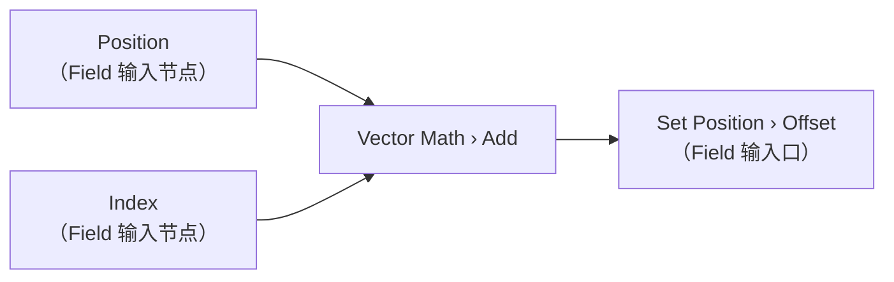
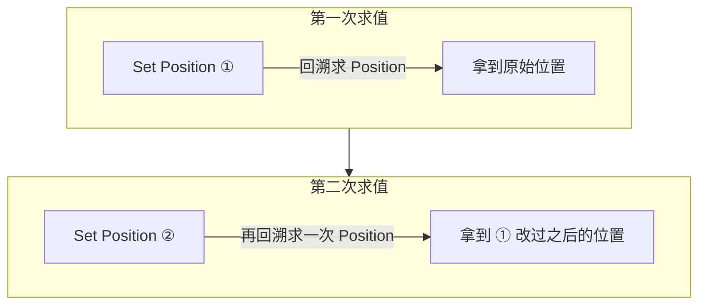
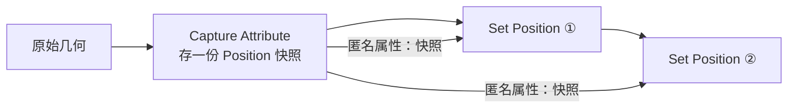
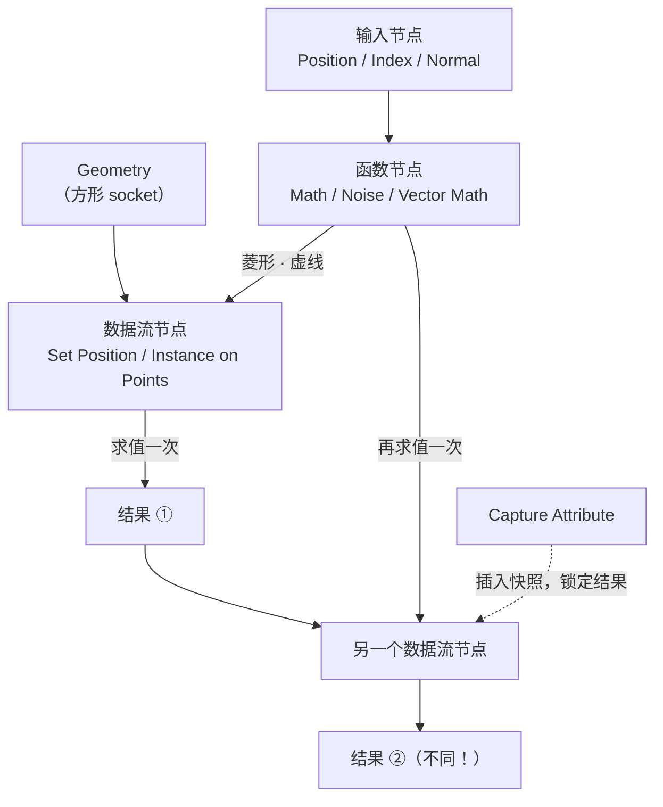

# 01 · Field 与 Attribute：几何节点的语言 ⭐

> 一句话：**Field 不是「一个值」，是「一段指令」；Attribute 不是「一列数据」，是「绑在某个域上的一列数据」。** 这两句话没吃透，后面所有节点都只能抄参数。
> 依据：官方手册 5.2 · [Fields](https://docs.blender.org/manual/en/latest/modeling/geometry_nodes/fields.html) / [Attributes](https://docs.blender.org/manual/en/latest/modeling/geometry_nodes/attributes_reference.html)

---

## 一、为什么这篇是整个几何节点的地基

Stage 7 的 [04 篇](../../08-场景组装与作品集/04-几何节点散布入门.md) 给你的是一条**能用的链路**。但你自己往下走一定会撞上这三类问题：

| 症状 | 真正的根因 |
| ---- | ---------- |
| 「我连了一个 Noise 当缩放，怎么有的石头特别大有的没变」 | 不知道 Field 在**哪个域**上求值 |
| 「我先算了个位置，再取 Position，怎么拿到的是变形后的」 | 不知道 Field 是**惰性求值、每次都重算** |
| 「我把属性连到另一个几何上，怎么全丢了」 | 不知道**匿名属性不能跨几何传递** |

这三个问题的答案全在这篇。

---

## 二、Field：一段会被反复求值的指令

手册原话：*Fundamentally, a field is a function: a set of instructions that can transform an arbitrary number of inputs into a single output.*



### 2.1 关键性质：求值发生在「数据流节点」上，而且会求值多次

手册给了三张图说明这件事，我把它翻成一张流程图：



> ⚠️ **同一个 Field 子树挂在两个数据流节点上，会被求值两次，而且第二次的结果不同**——因为第二个节点的输入几何已经被第一个节点改过了。
> 手册原话：*One common misunderstanding is that the same field node tree used in multiple places will output the same data. This is not necessarily true.*

### 2.2 想「锁住」某次求值的结果 → `Capture Attribute`



> 🎯 **`Capture Attribute` 的语义是「现在、就在这里、按当前几何算一遍并存下来」**，之后再用就是读快照，不再重算。
> 典型用途：做「位移量 = 当前位置 − 原始位置」这类需要**原始位置**的运算。

### 2.3 Socket 形状：一眼看出这是值还是 Field

| 形状 | 含义 | 连线样式 |
| ---- | ---- | -------- |
| **圆形** | 单值（Single Value） | 实线 |
| **菱形** | Field | **虚线** |
| **方形** | Geometry | 实线 |
| 接错（非 Field 接 Field 口） | 报错 | **红实线** |

> 💡 **看连线是不是虚线，是最快的调试手段。** 你以为自己在传一个场、结果连出来是实线，说明接的是单值——结果当然「所有元素都一样」。
> 手册原话：*If a node connection is coming from a field socket, it will be drawn as a dashed line.*

### 2.4 三类节点

| 类型 | 判定 | 例子 |
| ---- | ---- | ---- |
| **数据流节点**（Data Flow） | 有 Geometry 进、Geometry 出 | `Set Position`、`Transform Geometry`、`Instance on Points` |
| **函数节点**（Function） | 输入输出都是**菱形** | `Math`、`Vector Math`、`Geometry Proximity`、`Noise Texture` |
| **输入节点**（Input） | 提供数据，自身无意义，必须在数据流节点上下文里求值 | `Position`、`Index`、`ID`、`Normal`、`Endpoint Selection` |

> 输入节点**单独放着什么都不输出**。它们的意义只在于「被某个数据流节点求值时提供数据」。

---

## 三、Attribute：绑在域上的数据

### 3.1 七个域（Domain）

| 域 | 绑在什么上 |
| -- | ---------- |
| **Point** | 网格顶点 / 点云的点 / 曲线控制点 |
| **Edge** | 网格的边 |
| **Face** | 网格的面 |
| **Face Corner** | 网格面的「角」（**UV 贴图属性就在这一层**） |
| **Spline** | 一整条样条 |
| **Instance** | 实例（**只在几何节点里支持**） |
| **Layer** | Grease Pencil 图层 |

> 🎯 **Face Corner 是新手最容易困惑的一层**：同一个顶点在四个不同的面上有四个不同的 UV 坐标，所以 UV 不能存在 Point 上，只能存在 Face Corner 上。这就是为什么「硬边 / UV 接缝会让引擎顶点数翻倍」。

### 3.2 命名属性 vs 匿名属性

| | **命名属性**（Named） | **匿名属性**（Anonymous） |
| - | --------------------- | ------------------------- |
| 有没有名字 | 有，界面可搜 | 没有 |
| 怎么产生 | `Store Named Attribute` / 顶点组 / UV 贴图 / 颜色属性 | 节点 socket 直接传出（如 `Distribute Points on Faces` 的 `Normal` / `Rotation`） |
| 生命周期 | 长期存在 | **只要连线还在就能用** |
| 跨独立几何 | 按名字引用，可以 | ❌ **不能**，必须用采样节点 |
| 典型用途 | 与着色器、UV、绘制系统交互 | 节点树内部的中间数据 |

> ⚠️ 手册原话：*Anonymous attributes cannot be connected to a completely separate geometry that was created from a different source.*
> 解决办法见 [04 篇](04-采样与跨几何传值-Sample-Transfer.md)。

### 3.3 内置属性（不可删、类型域不可改）

| 名字 | 类型 | 域 | 说明 |
| ---- | ---- | -- | ---- |
| `position` | Vector | Point | 顶点位置（局部空间） |
| `radius` | Float | Point | 点云显示大小 / 曲线控制点半径 |
| `id` | Integer | Point | 提供变形时的稳定性；**与其它内置属性不同，它不是必需的、可以删** |
| `material_index` | Integer | Face | 面的材质槽 |
| `sharp_edge` / `sharp_face` | Boolean | Edge / Face | 平直着色 |
| `resolution` | Integer | Spline | 每段评估点数（仅 NURBS / Bézier） |
| `cyclic` | Boolean | Spline | 是否闭合 |
| `handle_left` / `handle_right` | Vector | Point | Bézier 手柄位置 |

### 3.4 隐式命名约定（默认不存在，但 Blender 认这个名字）

| 名字 | 类型 | 域 | 用途 |
| ---- | ---- | -- | ---- |
| `crease_edge` / `crease_vert` | Float | Edge / Point | **SubD 折痕**（0–1） |
| `bevel_weight_edge` / `bevel_weight_vert` | Float | Edge / Point | **Bevel 修改器的权重**（主线 Stage 0 学过，这里能在 GN 里程序化写它） |
| `uv_seam` | Boolean | Edge | UV 展开时视为岛边界 |
| `freestyle_edge` / `freestyle_face` | Boolean | Edge | Freestyle 标记 |
| `sculpt_mask` / `sculpt_face_set` | Float / Integer | Point / Face | 雕刻遮罩与面集 |
| `rest_position` | Vector | Point | 程序化变形前的位置（可用 `Add Rest Position` 自动创建） |
| `velocity` | Vector | Point | 运动模糊 |
| `custom_normal` | 2D 16-Bit Int Array | Face Corner | 自定义拆分法线 |

> 💡 **`crease_edge` 和 `bevel_weight_edge` 是几何节点反向作用于主线的两个入口**：你可以在 GN 里按规则批量给边打折痕/倒角权重，再交给修改器处理。

---

## 四、域转换：隐式发生，但规则不是「平均」

### 4.1 数值类型：简单平均

`Position`（Point 域）接到 `Set Material` 的 `Selection`（Face 域）→ 值从 Point 插值到 Face，**取简单平均**。

### 4.2 Boolean：有一套专用规则（⭐ 高频踩坑）

| 从 | 到 | 规则 |
| -- | -- | ---- |
| Point | Edge | **两个顶点都被选中**，边才选中 |
| Point | Face | **所有顶点都被选中**，面才选中 |
| Point | Corner | 直接拷贝顶点值 |
| Point | Spline | **所有控制点都被选中**，样条才选中 |
| Edge | Point | **任一相连边**被选中，点就选中 |
| Edge | Face | **所有边都被选中**，面才选中 |
| Face | Point / Edge | **任一相连面**被选中，就选中 |
| Face | Corner | 直接拷贝面值 |
| Corner | Point | **所有相连角都被选中**，且不是松散顶点 |
| Corner | Face | **所有角都被选中**，面才选中 |
| Spline | Point | 直接拷贝样条值 |

> ⚠️ **`Point → Face` 是「全选」，不是「平均」。** 你选中了 3/4 个顶点，得到的面是**未选中**。这和直觉相反，是「我明明选了大部分，怎么一点反应都没有」的直接原因。

### 4.3 数据类型也隐式转换

| 转换 | 规则 |
| ---- | ---- |
| Color ↔ Vector | 通道 ↔ 分量 |
| Color ↔ Float | 取灰度 |
| Float ↔ Integer | 整数→浮点直接转；浮点→整数**截断** |
| Float ↔ Vector | 标→矢：每个分量都填这个值；矢→标：**取平均** |
| Float ↔ Boolean | > 0 为 true；true → 1，false → 0 |

### 4.4 手动控制域的三个节点

| 节点 | 作用 |
| ---- | ---- |
| **`Capture Attribute`** | 在当前数据流节点上求值并存成匿名属性（**快照**） |
| **`Evaluate on Domain`** | 强制在某个域上求值（不做插值，取该域的值） |
| **`Evaluate at Index`** | 取指定 index 上的值（不做插值） |
| **`Interpolate Domain`** | 老节点，5.x 的等价做法是上面两个 |

> 找不到 `Interpolate Domain` 时用搜索框搜 `Evaluate`。

---

## 五、`Store Named Attribute` 与 `Named Attribute`

| 节点 | 用途 | 要点 |
| ---- | ---- | ---- |
| **`Named Attribute`** | 按名字把已有属性读成 Field | 顶点组 / UV 贴图 / 颜色属性都按名字读。**同名会冲突，只能访问其中一个** |
| **`Store Named Attribute`** | 写一个带名字的属性 | ⭐ **存 2D Vector（UV）与 Byte Color 只能用它**——因为节点没有这两种类型的 socket |
| **`Remove Named Attribute`** | 删掉 | |
| **`Rename Attribute`** | 改名 | |
| **`Transfer Attributes`** | 从另一套几何搬属性 | 见 [04 篇](04-采样与跨几何传值-Sample-Transfer.md) |
| **`Attribute Statistic`** | 统计（Min / Max / Mean / Median / Sum / Range / Std） | ⭐ 把一个 Field **压成单值**的两种手段之一 |
| **`Domain Size`** | 各域元素数 | 调试常用 |
| **`Get Attribute Names`** | 列出几何上有哪些属性 | 调试常用 |

> 💡 **把一个 Field 变成单值，只有两条路**：`Sample Index`（取第 N 个）或 `Attribute Statistic`（做统计）。手册明确说了「把 Field 变成单值本身在概念上不成立」——所以别去找什么「Field to Value」节点。

---

## 六、一张图串起来



---

## 七、坑

- ❌ **以为同一个 Field 到处结果一样** → 每个数据流节点各求值一次，几何变了结果就变
- ❌ **改完几何才去取 Position，以为拿到的是原始位置** → 插一个 `Capture Attribute` 在变形之前
- ❌ **连出来是实线还在纳闷「怎么所有元素都一样」** → 你接的是单值不是 Field，看 socket 形状
- ❌ **把匿名属性连到另一套几何** → 属性静默丢失 → 必须用 `Sample Index` / `Sample Nearest Surface`
- ❌ **按「平均」理解 Boolean 的域插值** → Point→Face 是**全选**规则，选 3/4 个顶点 = 面未选中
- ❌ **想存 UV 却用普通 socket** → 存不了 → 只能 `Store Named Attribute`
- ❌ **找一个「Field to Value」节点** → 概念上不存在 → 用 `Sample Index` 或 `Attribute Statistic`
- ❌ **顶点组和 UV 贴图同名** → 访问冲突，只能拿到其中一个 → 改名
- ❌ **用了 `Join Geometry` 后顶点组丢了** → GN 不总是生成顶点组 → 需要顶点组时检查这一步
- ❌ **把顶点组属性的类型从 Float 改了** → 它就不再是顶点组了

---

## 八、自检

| # | 自检点 | 通过标准 |
| - | ------ | -------- |
| ① | Field 定义 | 说出「Field 是一段指令」并解释为什么同一子树两处结果不同 |
| ② | socket 形状 | 说出圆/菱形/方分别代表什么，以及连错时是什么颜色 |
| ③ | 七域 | 报出 7 个域，并说出 UV 为什么存在 Face Corner 而不是 Point |
| ④ | 命名 vs 匿名 | 说出匿名属性不能跨独立几何传递，以及补救手段 |
| ⑤ | 布尔插值 | 说出 Point → Face 的规则是「所有顶点都选中」还是「任一」 |
| ⑥ | Capture Attribute | 说出它解决什么问题（锁定求值快照） |
| ⑦ | Store Named Attribute | 说出它唯一不可替代的用途（存 UV / Byte Color） |
| ⑧ | Field → 单值 | 说出两条路（`Sample Index` / `Attribute Statistic`） |
| ⑨ | 实操 | 搭一个「用 Noise 位移顶点，并用原始位置算出位移量」的树 |

---

## 九、速查

```text
【Field 的本质】
一段指令，不是值。惰性求值，每个数据流节点各求值一次。
→ 同一子树两处结果可能不同（几何已被前一个节点改过）
→ 想锁定 → Capture Attribute 存匿名属性快照

【Socket 形状】
圆形   = 单值        实线
菱形   = Field       虚线 ⭐
方形   = Geometry    实线
接错   = 红实线（非 Field 接 Field 口）

【三类节点】
数据流  有 Geometry 进/出（Set Position / Instance on Points）
函数    输入输出都是菱形（Math / Noise / Geometry Proximity）
输入    单独无意义，须在数据流节点上下文求值（Position / Index / Normal）

【七个域】
Point / Edge / Face / Face Corner / Spline / Instance / Layer
⭐ UV 在 Face Corner（同一顶点在不同面有不同 UV）

【命名 vs 匿名】
命名：有名字、可搜索、跨系统（着色器/UV/绘制）用、可跨几何按名引用
匿名：无名字、靠连线存在、❌ 不能跨独立几何 → 用采样节点

【内置属性（不可删）】
position(V,P)  radius(F,P)  id(I,P，可删)  material_index(I,F)
sharp_edge(B,E)  sharp_face(B,F)  resolution(I,Spline)
cyclic(B,Spline)  handle_left/right(V,P，仅 Bézier)

【隐式命名（可程序化写）】
crease_edge/crease_vert    SubD 折痕 0–1
bevel_weight_edge/vert     Bevel 权重 ⭐
uv_seam(B,Edge)            UV 岛边界
rest_position(V,P)         变形前位置
sculpt_mask / sculpt_face_set

【Boolean 域插值（不是平均！）】
Point→Face   所有顶点都选中 ⭐
Point→Edge   两个顶点都选中
Edge→Point   任一相连边
Face→Point   任一相连面
Face/Point→Corner  直接拷贝

【类型隐式转换】
Float→Vector  每个分量填同值   |  Vector→Float  取平均
Float→Int     截断             |  Float→Bool    >0 为 true

【域控制】
Capture Attribute   当前求值并存快照
Evaluate on Domain  强制在某域求值（不插值）
Evaluate at Index   取指定 index（不插值）

【Field → 单值（只有两条路）】
Sample Index         取第 N 个
Attribute Statistic  统计 Min/Max/Mean/Median/Sum

【坑】
改完几何再取 Position = 拿到变形后的 → 先 Capture
存 UV / Byte Color 只能 Store Named Attribute
顶点组与 UV 同名 = 访问冲突
```

---

## 资源

- 官方手册 5.2 · [Fields](https://docs.blender.org/manual/en/latest/modeling/geometry_nodes/fields.html)
- 官方手册 5.2 · [Attributes](https://docs.blender.org/manual/en/latest/modeling/geometry_nodes/attributes_reference.html)
- 官方手册 5.2 · [Capture Attribute](https://docs.blender.org/manual/en/latest/modeling/geometry_nodes/attribute/capture_attribute.html) / [Store Named Attribute](https://docs.blender.org/manual/en/latest/modeling/geometry_nodes/attribute/store_named_attribute.html)

---

> **下一步**：[`02-节点组-接口-复用与资产化.md`](02-节点组-接口-复用与资产化.md) —— 知道怎么算之后，下一步是知道怎么把一堆节点收成一个能复用的东西。
