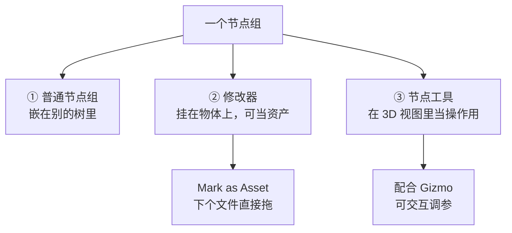
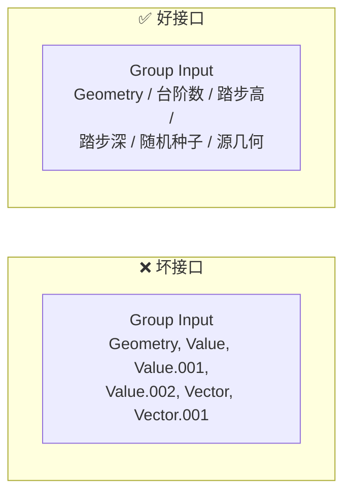
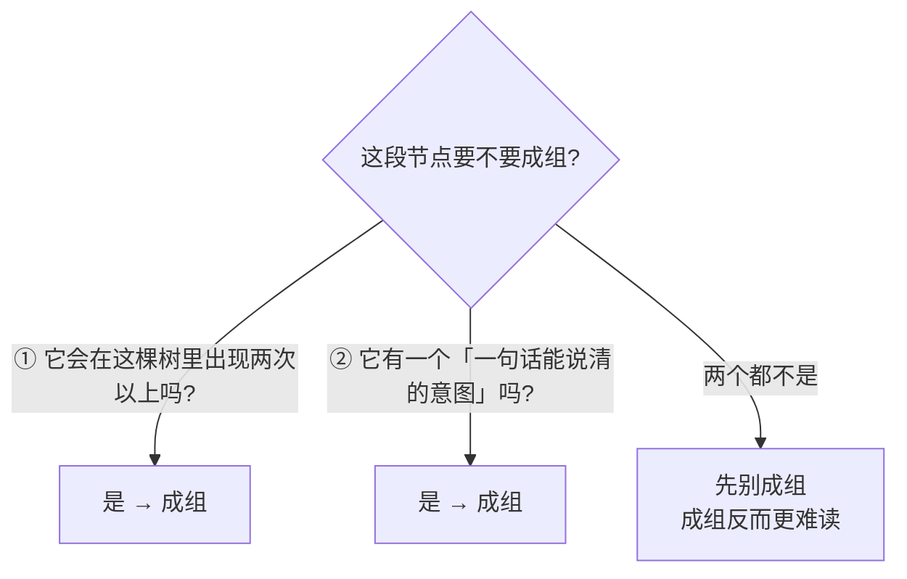
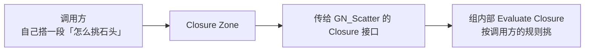

# 02 · 节点组：接口、复用与资产化

> 一句话：**节点组不是「把节点收起来」，是「定义一个有名字、有参数、能被别人用的东西」。** 判断一个组做得好不好，看的是接口，不是里面的节点有多复杂。
> 依据：官方手册 5.2 · [Groups](https://docs.blender.org/manual/en/latest/modeling/geometry_nodes/) / [Node-Based Tools](https://docs.blender.org/manual/en/latest/modeling/geometry_nodes/tools.html) / [Baking](https://docs.blender.org/manual/en/latest/modeling/geometry_nodes/baking.html)

---

## 一、节点组的三层形态

同一个节点组在 Blender 里可以扮演三种角色，用途完全不同：



| 形态 | 怎么用 | 什么时候用 |
| ---- | ------ | ---------- |
| **① 普通节点组** | 选中节点 `Ctrl+G` | 树上看不下去了，先收拾一下 |
| **② 修改器** | 挂到物体上；`Mark as Asset` 后进 Add Modifier 菜单 | ⭐ 想跨场景 / 跨文件复用 |
| **③ 节点工具** | 节点组标记为工具，在 3D 视图菜单里当算子用 | 想做「一键生成楼梯」这类交互操作 |

> 💡 主线 Stage 2 / 7 已经在用的 `Mark as Asset` 就是第 ② 种。这一篇补的是「什么样的组才值得 Mark」。

---

## 二、接口设计：一个好组的判据

### 2.1 判据一：外面只看得到「应该被调的参数」



| 做法 | 说明 |
| ---- | ---- |
| **改名** | 侧栏 `N → Group → Group Sockets`，双击改名。`Value.001` 是万恶之源 |
| **删掉没用到的口** | 侧栏里点 `-` |
| **设默认值与范围** | 侧栏里设 Default / Min / Max，拖滑块时不会飞出去 |
| **拼 Geometry 输出** | 需要多个几何输出时用 `Join Geometry` 合成一个，别留三个出口 |

### 2.2 判据二：接口的类型是对的

| 接口类型 | 什么时候用 |
| -------- | ---------- |
| **Geometry** | 输入输出几何 |
| **单值（圆）** | 参数（台阶数、密度、阈值） |
| **Field（菱形）** | 想让**调用方**传一段计算进来（比如传一个自己的遮罩） |
| **Bundle** | 5.0 新增：想一口气传多个值 |
| **Closure** | 5.0 新增：想让调用方**注入一段节点逻辑** |

> ⚠️ 接口默认是单值。想让它接受 Field，需要在侧栏把 socket 的 shape 从圆改成菱形。

### 2.3 命名规范

```
节点组：GN_<功能>_<版本>      例：GN_Stairs_01 / GN_Scatter_Rocks_02
接口：  小驼峰或下划线，见名知义
```

> 与主线资产命名保持一致：`Prop_` / `Char_` 给物体，`GN_` 给节点组。

---

## 三、什么时候该打包成组（两条判据）



| 判据 | 说明 |
| ---- | ---- |
| **① 复用** | 同一段逻辑出现两次 → 一定成组 |
| **② 有意图** | 「算坡度」「挑石头」「做一根栏杆」——能说出名字的，就值得成组 |
| ❌ 反例 | 「这 8 个节点我连不上所以先收起来」 → 成组只会让你更难找到问题 |

> 🎯 **节奏建议：每搭完一段能说出名字的逻辑，立刻 `Ctrl+G` 并命名。** 不要在树上留 40 个散装节点再去收拾。

---

## 四、5.0 新增：Bundle（把多个值打包成一根线）

### 4.1 它解决什么

老做法里，想在两个组之间传 5 个参数就要拉 5 根线，改动一次要改两处。Bundle 相当于编程语言里的 **struct**。

| 节点 | 作用 |
| ---- | ---- |
| **`Combine Bundle`** | 把若干值打包成一个 Bundle |
| **`Separate Bundle`** | 从 Bundle 里取出单个值 |
| **`Join Bundle`** | 合并多个 Bundle，也允许覆盖已有字段（5.0 后期加入） |
| **`Get Bundle Item`** / **`Store Bundle Item`** | 按名字取 / 存字段 |
| **`Get Nested Bundle Paths`** | 列出嵌套 Bundle 的路径 |
| **`Typed Bundle`** | 给 Bundle 定类型 |
| **`Get / Set Geometry Bundle`** | 几何专用的 Bundle 存取 |

> 5.0 还新增了 **`Bundle` socket 类型**，被 Switch 一类节点直接支持。
> 手册还提到新的 **syncing** 功能：根据连线自动更新节点，改 Bundle 结构时不用手动改一堆节点。

### 4.2 什么时候用

- ✅ 一个组有 6 个以上输入，而且这些输入**总是一起出现**（比如「散布参数」：密度 / 最小间距 / 种子 / 遮罩）
- ❌ 只有两三个输入时不要为了用而用，反而多一层间接

---

## 五、5.0 新增：Closure（把一段逻辑注入到组里）

### 5.1 它解决什么

老问题：想改节点组**内部的某个行为**，必须进组去改。Closure 让你可以把一段节点**传进去**执行。

| 节点 | 作用 |
| ---- | ---- |
| **`Closure`**（Closure Zone） | 定义一段可传递的逻辑，有输入输出；从外部传入的值会被「捕获」进闭包 |
| **`Evaluate Closure`** | 执行一个 Closure |
| **`Closure to List`** | 把多个 Closure 变成列表 |



### 5.2 什么时候用

- ✅ 你在写**通用工具组**（比如「一个通用散布器，具体怎么挑由调用方决定」）
- ❌ 自己用的场景组不需要，直接改组更快

> 🎯 **Bundle 传的是「数据」，Closure 传的是「行为」。** 记住这句就不会混。

---

## 六、其它 5.x 相关变化

| 变化 | 说明 | 依据 |
| ---- | ---- | ---- |
| **节点组可当修改器资产** | `Mark as Asset` + 勾 `Is Modifier` → 出现在 Add Modifier 菜单；资产目录路径会动态生成菜单 | 4.0 GN Release Notes（5.x 沿用） |
| **Manage 面板可隐藏** | 5.0 起每个修改器可单独关掉 Manage 面板显示，默认由节点组决定 | 5.0 GN Release Notes |
| **输入可强制为单值** | 去掉属性切换按钮，界面更干净 | 4.0 GN Release Notes |
| **菜单输入 socket** | 5.0 起部分内建节点有菜单型输入口（配 `Menu Switch` 用） | 5.0 GN Release Notes |
| **颜色标签继承** | 5.0 起给单个节点上色后成组，颜色会被继承 | 5.0 GN Release Notes |
| **节点工具不再清 Shape Keys** | 5.0 起在网格上跑节点工具不会删掉形态键数据 | 5.0 GN Release Notes |

---

## 七、Baking：把算好的结果缓存下来

| 项 | 说明 |
| -- | ---- |
| 用途 | 缓存昂贵计算，提升性能 |
| 两种方式 | **`Bake` 节点**（烘焙任意一段树）/ **Simulation Zone 烘焙**（烘焙逐帧动画） |
| ⚠️ 前提 | **必须先把 .blend 存盘**，否则不能 bake |
| ⚠️ 兼容性 | **不保证**一个 Blender 版本写的数据能被另一个版本读 |
| 存储格式 | 几何用 Blender 内部格式（**不是**导入导出格式）；**Volume 用 OpenVDB**，可互操作 |
| 数据块引用 | 侧栏 `Node → Data-Block References`，bake 后可改材质引用（**目前只支持材质**） |

> 💡 手册原话：*Baking trades flexibility for performance, so it is most useful once a setup is finalized.*
> 也就是说：**调参阶段别 bake**，定型之后再 bake。

---

## 八、坑

- ❌ **接口留着 `Value.001` / `Vector.002`** → 两个月后完全不知道哪个是哪个 → 当场改名
- ❌ **不设 Min / Max** → 拖滑块一下飞到 10000，视口卡死 → 给范围
- ❌ **多个 Geometry 输出口** → 调用方不知道该接哪个 → `Join Geometry` 合成一个
- ❌ **想传 Field 却留了圆形 socket** → 外面接一段计算进来会报错 → 侧栏把 shape 改成菱形
- ❌ **为了「整洁」把 6 个节点收成组** → 反而更难调试 → 只在有复用或有意图时成组
- ❌ **bake 之前没存盘** → 手册明确要求先存 .blend
- ❌ **调参阶段就 bake** → 每次改参数都要重 bake → 定型后再做
- ❌ **为了炫技用 Bundle** → 两三个输入用 Bundle 纯属自找麻烦
- ❌ **把 Bundle 和 Closure 搞混** → Bundle 传数据，Closure 传行为
- ❌ **成组后不 Mark as Asset** → 下个场景再搭一遍（Stage 7 已讲，这里最容易忘）

---

## 九、自检

| # | 自检点 | 通过标准 |
| - | ------ | -------- |
| ① | 接口命名 | 打开自己一周前做的组，能在 3 秒内说出每个接口是干嘛的 |
| ② | 判据 | 说出「什么时候该成组」的两条判据 |
| ③ | Field 接口 | 会把一个 socket 从单值改成 Field |
| ④ | Bundle vs Closure | 说出「Bundle 传数据、Closure 传行为」并各举一个场景 |
| ⑤ | 资产化 | 会 `Mark as Asset` 并在另一个文件里拖进来用 |
| ⑥ | Bake 前提 | 说出 bake 前必须先做什么，以及调参阶段该不该 bake |
| ⑦ | 实操 | 把 [01 篇](01-Field与Attribute-几何节点的语言.md) 自检第 ⑨ 条做的那棵树收成一个命名规范的组并 Mark as Asset |

---

## 十、速查

```text
【三种形态】
① 普通节点组  Ctrl+G，嵌在树里
② 修改器      挂物体上；Mark as Asset → Add Modifier 菜单 ⭐
③ 节点工具    3D 视图里当算子，配 Gizmo 可交互

【好接口的三件事】
改名      N 侧栏 → Group → Group Sockets 双击改（Value.001 是万恶之源）
删多余口  同上，点 -
给范围    设 Default / Min / Max（拖滑块不会飞）

【socket 类型怎么选】
Geometry  几何
单值(圆)   参数
Field(菱)  让调用方传一段计算进来 ⭐
Bundle    一口气传多个值（struct）
Closure   让调用方注入一段逻辑（行为）

【什么时候成组】
① 同一段逻辑出现两次以上
② 有一个能说清的意图（算坡度 / 挑石头 / 做栏杆）
❌ 仅仅因为「连不上想收起来」→ 别成组

【5.0 Bundle】
Combine Bundle  打包
Separate Bundle 取出
Join Bundle     合并 + 覆盖字段
Get/Store Bundle Item  按名字存取
Typed Bundle    定类型
⚠️ 只有两三个输入别为了用而用

【5.0 Closure】
Closure Zone       定义可传递的逻辑，外部值被捕获
Evaluate Closure   执行
Closure to List    多个 Closure 成列表
🎯 Bundle 传数据 / Closure 传行为

【Baking】
两种方式   Bake 节点（任意一段）/ Simulation Zone（逐帧）
⚠️ 必须先存 .blend
⚠️ 不保证跨版本可读
⚠️ 调参阶段别 bake，定型后再 bake
Data-Block References：bake 后可改材质引用（目前只支持材质）

【命名】
节点组 GN_<功能>_<版本>   例 GN_Stairs_01
物体   Prop_ / Char_（沿用主线规范）

【坑】
不设 Min/Max → 滑块飞出去 → 视口卡死
多个 Geometry 出口 → Join Geometry 合成一个
```

---

## 资源

- 官方手册 5.2 · [Geometry Nodes 总览](https://docs.blender.org/manual/en/latest/modeling/geometry_nodes/index.html)
- 官方手册 5.2 · [Node-Based Tools](https://docs.blender.org/manual/en/latest/modeling/geometry_nodes/tools.html) / [Gizmos](https://docs.blender.org/manual/en/latest/modeling/geometry_nodes/gizmos.html)
- 官方手册 5.2 · [Baking](https://docs.blender.org/manual/en/latest/modeling/geometry_nodes/baking.html)
- [5.0 GN Release Notes · Bundles / Closures](https://developer.blender.org/docs/release_notes/5.0/geometry_nodes/)

---

> **下一步**：[`03-选择与筛选-Selection-遮罩与域转换.md`](03-选择与筛选-Selection-遮罩与域转换.md) —— 组搭好了，接下来是几何节点里出现频率最高的那个输入口：Selection。
