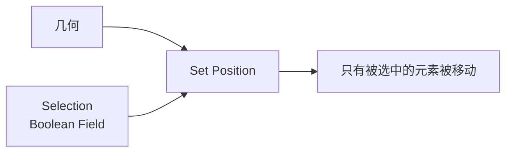
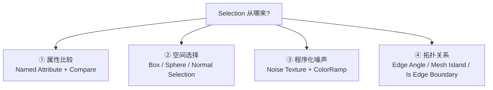
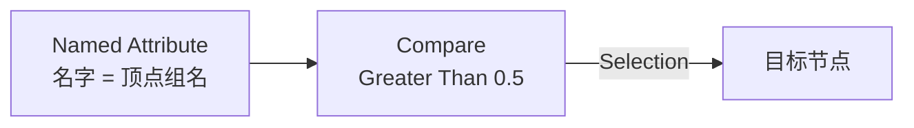
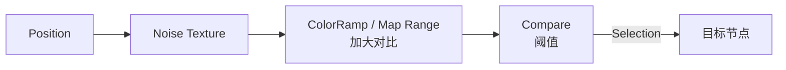
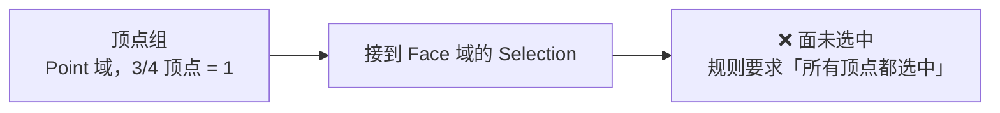
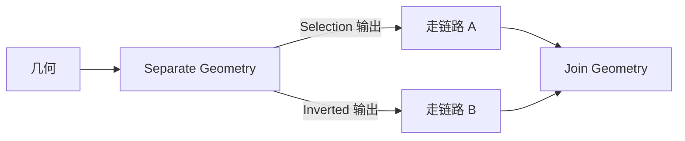
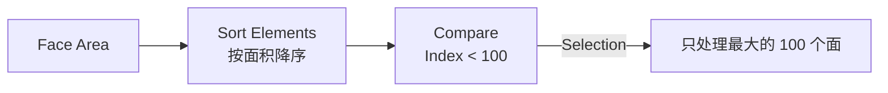

# 03 · 选择与筛选：Selection、遮罩与域转换

> 一句话：**Selection 是「限流」而不是「事后过滤」**。用它把节点的作用范围收窄，比全量处理完再删掉要快一个数量级——而且这是官方性能建议里的一条。
> 依据：官方手册 5.2 · [Performance](https://docs.blender.org/manual/en/latest/modeling/geometry_nodes/performance.html) / [Attributes](https://docs.blender.org/manual/en/latest/modeling/geometry_nodes/attributes_reference.html)

---

## 一、Selection 是什么

几何节点里大量节点都有一个 `Selection`（Boolean Field）输入口。它决定**这个节点对哪些元素生效**。



| 有 Selection 口的典型节点 | 用途 |
| ------------------------- | ---- |
| `Set Position` | 只移动选中的点 |
| `Delete Geometry` | 只删除选中的部分 |
| `Distribute Points on Faces` | 只在选中的面上撒点 ⭐（Stage 7 的坡度筛选就是它） |
| `Instance on Points` | 只在选中的点上放实例 |
| `Set Material` | 只给选中的部分换材质 |
| `Subdivision Surface` / `Extrude Mesh` / `Duplicate Elements` | 局部细分 / 挤出 / 复制 |
| `Scale Elements` / `Merge by Distance` | 局部缩放 / 局部合并 |

> 🎯 **手册性能页原话**：*Use the Selection input on nodes whenever possible. Avoid applying operations to entire geometry if only part needs modification.*
> 这是四条性能原则之一，不是风格问题。

---

## 二、四种遮罩来源



### ① 属性比较：顶点组 / 命名属性当遮罩



| 步骤 | 节点 |
| ---- | ---- |
| ① 读属性 | `Named Attribute`，名字填顶点组名（或任何命名属性） |
| ② 阈值化 | `Compare`（Float，Greater Than），顶点组值 0–1，阈值常取 0.5 |
| ③ 接到 Selection | 完成 |

> ⚠️ **顶点组在几何节点里就是一个 float / Point 域的命名属性**，按名字读。
> 这是「用权重绘制直接刷出散布区域」这条最舒服的工作流的基础。

### ② 空间选择：三个专用节点

| 节点 | 用途 | 典型参数 |
| ---- | ---- | -------- |
| **`Box Selection`** | 盒形区域内选中 | Min / Max + 可选旋转 |
| **`Sphere Selection`** | 球形区域内选中 | Center / Radius |
| **`Normal Selection`** | 按法线方向选中 | Normal + Threshold |

> 💡 `Normal Selection` 就是 Stage 7 手工搭的「法线 · Z → Compare」那条链的**官方封装版本**。
> 但手工搭能接任意矢量、能加 Noise，所以两种都要会。

### ③ 程序化噪声



> 🎯 Stage 7 的密度遮罩用的就是这条，只不过接的是 `Density` 而不是 `Selection`。**同一份噪声既能当密度、也能当选区。**

### ④ 拓扑关系：一批「读取结构」的节点

| 节点 | 输出 | 用途 |
| ---- | ---- | ---- |
| **`Edge Angle`** | 边夹角（+ 是否凹/凸） | ⭐ 只在折边处倒角、只在锐角边长东西 |
| **`Is Edge Boundary`** | 是否边界边 | 只在模型边缘处理 |
| **`Is Edge Loose`** | 是否松散边 | 清理 |
| **`Is Edge Manifold`** | 是否流形边 | 体检 |
| **`Is Face Planar`** | 面是否共面 | 只在平面区域处理 |
| **`Mesh Island`** | 连通块的编号 | ⭐ **对每个碎块单独处理**（每块石头单独随机缩放） |
| **`Face Neighbors` / `Vertex Neighbors`** | 邻居数量 | 找开放边、找极点 |
| **`Face Area`** | 面积 | 只在大面上撒点 |
| **`Is Edge Smooth` / `Is Face Smooth`** | 平滑标记 | 与着色联动 |
| **`Face Set`** | 雕刻面集 | 与雕刻联动 |
| **`Cluster by Connected`** | 按连通性聚类 | 结构分析 |
| **`Shortest Edge Paths`** | 最短路径 | 选边路径 |

> ⭐ **`Mesh Island` 是这一组里最实用的一个**：它给每个连通块一个编号，配合 `Random Value`（用 island index 当种子）就能实现「每块石头一个随机值」而不是「每个面一个随机值」。

---

## 三、域转换：为什么结果和你想的不一样

Selection 是 Boolean Field，所以它跨域时的行为**遵循 [01 篇](01-Field与Attribute-几何节点的语言.md) 那张布尔插值表**，不是平均。



| 常见错配 | 现象 | 救法 |
| -------- | ---- | ---- |
| Point → Face | 选了大部分顶点但面没反应 | 想要「任一」就先在 Point 域处理，或用 `Evaluate on Domain` 显式指定 |
| Face → Point | 几乎所有点都被选中（任一相连面） | 想收紧就改用 Corner 域或在 Face 域直接处理 |
| Edge → Face | 面要求所有边都选中，几乎永远不满足 | 直接在 Edge 域处理 |

> 🎯 **判据：你的操作发生在哪个域，就把 Selection 算在那个域。**
> 想删面 → 在 Face 域算 Selection；想移点 → 在 Point 域算。不要算完再让它隐式转。

---

## 四、两个专用筛选动作

| 节点 | 作用 | 典型用法 |
| ---- | ---- | -------- |
| **`Separate Geometry`** | 按 Selection 把几何**拆成两份**（选中的 / 未选中的） | ⭐ 「大石头走一条链路、小石头走另一条」 |
| **`Delete Geometry`** | 按 Selection **删掉**选中的部分 | 清理、开洞 |
| **`Split To Instances`** | 按几何岛拆成**实例** | ⭐ 把每个碎块变成独立实例，之后可单独变换 |



> 💡 **`Separate Geometry` + `Join Geometry` 是「同一批几何走不同处理」的标准写法**，比在一条链路上疯狂加 Switch 清晰得多。

---

## 五、三个「选取 N 个」的节点

| 节点 | 作用 | 要点 |
| ---- | ---- | ---- |
| **`Sort Elements`** | 按某个权重**排序**，输出排序后的 index | ⭐ 配 `Compare`（index < N）实现「只取最大的前 N 个」 |
| **`Index of Nearest`** | 找最近的元素的 index | 配 `Sample Index` 用 |
| **`Domain Size`** | 各域元素数 | 用来算「N 个 = 总数的百分之几」 |



> 🎯 **「只处理面积最大的前 100 个面」这类需求，只能用 `Sort Elements`**，没有别的捷径。

---

## 六、坑

- ❌ **不用 Selection，先全量处理再 `Delete Geometry`** → 白白算一遍 → Selection 是限流，不是过滤
- ❌ **按「平均」理解布尔的域插值** → Point→Face 是「所有顶点都选中」 → 选 3/4 = 没反应
- ❌ **在 Point 域算出 Selection 去删面** → 结果和预期完全不同 → 在目标域算
- ❌ **忘了 Selection 是 Boolean Field** → 接了个 Float 进去，靠隐式转换（>0 为 true）蒙混过关 → 阈值不明确，改参数就崩 → 显式加 `Compare`
- ❌ **用 `Normal Selection` 却想要自定义方向** → 它只认法线 → 想自定义就手工搭「矢量 · 方向 → Compare」
- ❌ **想「每个碎块一个随机值」却用了面的 index** → 得到每个面一个值 → 用 `Mesh Island` 的 index
- ❌ **顶点组名写错（含大小写 / 空格）** → `Named Attribute` 静默返回 0 → 全部未选中，不报错
- ❌ **和 UV 贴图同名的顶点组** → 访问冲突 → 改名
- ❌ **`Separate Geometry` 只接了 Selection 输出，忘了 Inverted** → 一半几何消失了
- ❌ **想「取前 N 个」却手动设阈值** → 数量不可控 → 用 `Sort Elements` + `Compare`

---

## 七、自检

| # | 自检点 | 通过标准 |
| - | ------ | -------- |
| ① | Selection 语义 | 说出「限流 vs 事后过滤」的差别，以及手册为什么推荐前者 |
| ② | 四种遮罩 | 说出四种遮罩来源并各举一个场景 |
| ③ | 顶点组遮罩 | 说出顶点组在 GN 里是什么（float / Point 域命名属性）以及怎么读 |
| ④ | 布尔插值 | 说出 Point → Face 的规则，并解释「选了 3/4 顶点但面没反应」 |
| ⑤ | 域判据 | 说出「在哪个域操作就在哪个域算 Selection」这条原则 |
| ⑥ | Mesh Island | 说出它的输出是什么、以及「每块石头一个随机值」该怎么搭 |
| ⑦ | Separate Geometry | 说出它和 `Delete Geometry` 的区别，以及两个输出口分别是什么 |
| ⑧ | 前 N 个 | 说出「只处理面积最大的 100 个面」该用什么节点组合 |
| ⑨ | 实操 | 用顶点组当遮罩，让散布只在刷过的区域发生 |

---

## 八、速查

```text
【Selection 是限流，不是过滤】
手册性能建议：能用 Selection 就别全量处理完再删

【四种遮罩来源】
① 属性比较  Named Attribute(顶点组名) → Compare > 0.5
② 空间选择  Box / Sphere / Normal Selection
③ 程序噪声  Position → Noise → ColorRamp → Compare
④ 拓扑关系  Edge Angle / Mesh Island / Is Edge Boundary / Face Area

【拓扑筛选节点速查】
Mesh Island        每连通块一个编号 ⭐ 每块石头一个随机值用它
Edge Angle         边夹角 + 凹凸       只在折边处倒角
Is Edge Boundary   边界边             只处理模型边缘
Is Edge Loose      松散边             清理
Is Face Planar     共面               只在平面区域处理
Face Area          面积               只在大面撒点
Face/Vertex Neighbors  邻居数         找开放边 / 极点
Is Edge/Face Smooth    平滑标记       与着色联动
Face Set           雕刻面集           与雕刻联动

【布尔域插值（不是平均！）】
Point→Face   所有顶点都选中 ❗
Point→Edge   两个顶点都选中
Edge→Face    所有边都选中（几乎永不满足）
Edge→Point   任一相连边
Face→Point   任一相连面
Face/Point→Corner  直接拷贝

【域判据】
在哪个域操作，就在哪个域算 Selection
想删面 → Face 域算   想移点 → Point 域算

【两个筛选动作】
Separate Geometry  拆成两份（Selection / Inverted）⭐ 不同链路不同处理
Delete Geometry    删掉选中的
Split To Instances 按几何岛拆成实例 ⭐ 之后可单独变换

【取前 N 个】
Face Area → Sort Elements（降序）→ Compare(Index < N) → Selection
没有捷径，只能用 Sort Elements

【坑】
Float 直接当 Selection → 隐式 >0 为 true，阈值不明确 → 显式加 Compare
顶点组名写错 → 静默返回 0，不报错
Separate Geometry 忘了接 Inverted → 一半几何消失
想每碎块一个随机值却用面 index → 用 Mesh Island 的 index
```

---

## 资源

- 官方手册 5.2 · [Performance](https://docs.blender.org/manual/en/latest/modeling/geometry_nodes/performance.html)
- 官方手册 5.2 · [Attributes](https://docs.blender.org/manual/en/latest/modeling/geometry_nodes/attributes_reference.html)
- 官方手册 5.2 · Mesh 节点族（Read / Operations 分类）

---

> **下一步**：[`04-采样与跨几何传值-Sample-Transfer.md`](04-采样与跨几何传值-Sample-Transfer.md) —— 遮罩解决了「在 A 内部选一部分」，接下来是更难的一件事：**从 B 上取值用到 A 上**。
