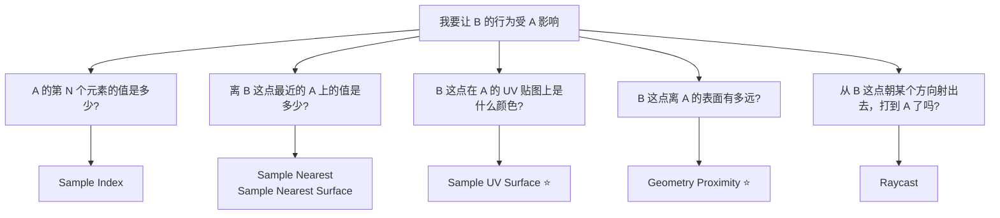
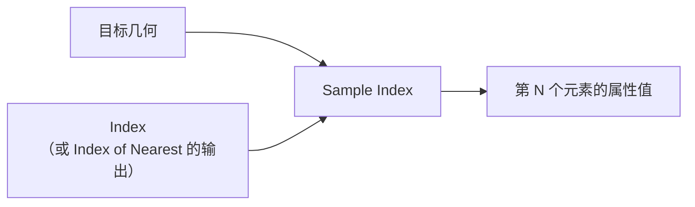
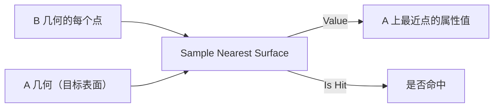
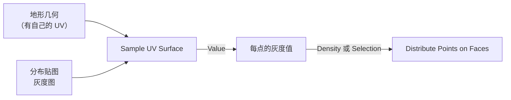
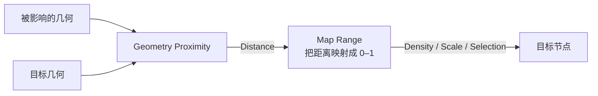
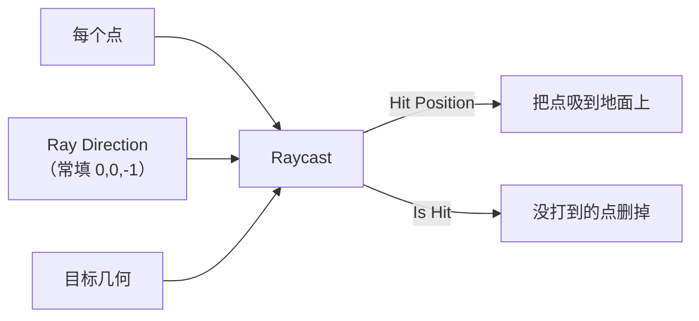
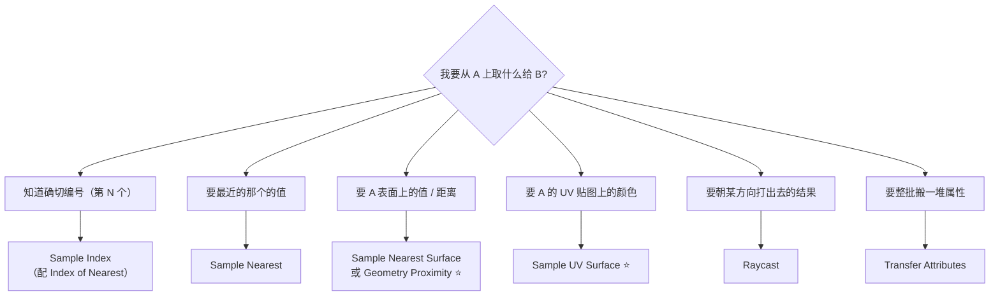

# 04 · 采样与跨几何传值：Sample 与 Transfer ⭐

> 一句话：**几何节点里最难的一步不是「算」，是「从另一套几何上取值」。** 匿名属性不能跨几何传递（[01 篇](01-Field与Attribute-几何节点的语言.md)），所以「把 A 的信息搬到 B」必须靠这一族的采样节点。
> 依据：官方手册 5.2 · Geometry › Sample / Mesh › Sample 分类

---

## 一、为什么需要这一族



> 💡 这一族节点是「**按贴图散布**」「**沿路径长树**」「**避开道路**」「**靠近水面长芦苇**」这类需求的唯一解法。
> 也是区分「会搭散布」和「会设计程序化系统」的分界线。

---

## 二、`Sample Index`：按编号取

| 项 | 说明 |
| -- | ---- |
| 用途 | 取几何上**第 N 个元素**的某个属性 |
| 输入 | Geometry / Value（Field）/ Index / Domain |
| 关键参数 | **Clamp** —— index 超出范围时，勾上是「夹到最后一个」，不勾是「返回默认值」 |
| 典型用法 | 从一条曲线上取第 N 个点的位置；从实例列表里取第 N 个 |
| 配套 | `Index of Nearest`（先找最近的 index，再 `Sample Index`） |



> ⚠️ **Clamp 的行为要心里有数**：不勾时越界会静默返回默认值（常是 0），表现为「有一部分元素拿到了 0」，很难查。

---

## 三、`Sample Nearest` 与 `Sample Nearest Surface`：按距离取

| 节点 | 作用 | 差别 |
| ---- | ---- | ---- |
| **`Sample Nearest`** | 在**同域元素**里找最近的一个，返回其 index | 元素级（点找点、面找面） |
| **`Sample Nearest Surface`** | 在**另一套几何的表面**上找最近点，返回其属性 | ⭐ 表面级，可跨几何 |
| **`Index of Nearest`** | 只返回最近元素的 index | 常配 `Sample Index` |



| 典型用途 | 链路 |
| -------- | ---- |
| **沿路径长树** | 一条引导曲线 → `Sample Nearest Surface` 算距离 → 距离小的地方密度高 |
| **避开道路** | 路面几何 → 距离小于阈值 → 反选 |
| **按区域分组** | 给每个区域放一个小平面 → 采样它的 ID → 按 ID 分流 |

---

## 四、`Sample UV Surface`：在 UV 空间里采样 ⭐

| 项 | 说明 |
| -- | ---- |
| 用途 | 在**另一套几何的 UV 贴图上**按 UV 坐标采样 |
| 输入 | Geometry（要有 UV 与贴图）/ Source Mesh UV Map / Sample UV / Value |
| ⭐ 独有能力 | **可以用一张贴图当分布图**——这是它区别于所有其它采样节点的地方 |
| 典型用法 | 画一张灰度图 → 用它决定哪里长草、哪里是裸土 |



| 步骤 | 操作 |
| ---- | ---- |
| ① | 地形展开 UV（主线 Stage 3 的活） |
| ② | 画一张灰度分布图（Blender 里可以直接用 Texture Paint 画，或外部画好导入） |
| ③ | `Sample UV Surface`，Value 输入接 `Image Texture` 的颜色（或直接接灰度属性） |
| ④ | 输出接到 `Distribute Points on Faces` 的 `Density` 或 `Selection` |

> 🎯 **这是「美术可控的程序化」的关键节点**：美术直接在贴图上画分布，程序按贴图散布。
> 比调 Noise 参数直观得多，也是工业界做植被的常规做法。

---

## 五、`Geometry Proximity`：距离场 ⭐

| 项 | 说明 |
| -- | ---- |
| 用途 | 算**每个点到目标几何的距离** |
| 输出 | `Position`（最近点位置）/ `Distance`（距离） |
| 模式 | Points / Edges / Faces |
| 典型用法 | 「离目标越近越怎样」——密度衰减、缩放衰减、颜色渐变 |



| 需求 | 怎么接 |
| ---- | ------ |
| 靠近水面长芦苇 | Distance → `Map Range`（近 = 1）→ Density |
| 远离道路才长树 | Distance → `Compare`（> 阈值）→ Selection |
| 越靠近中心越大 | Distance → `Map Range` 反转 → Scale |

> 💡 **`Map Range` 是 `Geometry Proximity` 的固定搭档**——距离是米，密度 / 缩放是 0–1，必须映射一次。

---

## 六、`Raycast`：按方向投射

| 项 | 说明 |
| -- | ---- |
| 用途 | 从每个点朝指定方向发射射线，返回命中信息 |
| 输出 | `Is Hit` / `Hit Position` / `Hit Normal` / `Hit Distance` / `Attribute` |
| 与 Proximity 的差别 | ⭐ **Proximity 是「离最近点有多远」（全方向），Raycast 是「朝这个方向打出去有多远」（单方向）** |
| 典型用法 | 沿「下」方向打 → 贴地；沿法线打 → 检测遮挡 |



> 🎯 **「把散布的东西贴到地面」的标准做法就是 Raycast 向下 + 用 Hit Position 覆盖位置**。
> 比 `Align Rotation to Vector` 更准——后者只对齐朝向，不管高度。

---

## 七、`Transfer Attributes`：整批搬运

| 项 | 说明 |
| -- | ---- |
| 用途 | 把属性从 Source 几何搬到目标几何 |
| 模式 | **Nearest Face Interpolated** / Nearest Face / Nearest Vertex / Index |
| 与 `Sample Nearest Surface` 的差别 | Transfer 是「**整批按最近面插值搬**」，带插值；Sample 是「**逐元素精确查询**」 |
| 典型用法 | 把高模的某个属性搬到低模；把一套几何的 UV 搬到另一套 |

| 模式 | 何时用 |
| ---- | ------ |
| **Nearest Face Interpolated** | ⭐ 默认首选，结果平滑 |
| **Nearest Face** | 想要「块」状不插值的结果 |
| **Nearest Vertex** | 目标很稀疏时 |
| **Index** | 两套几何元素一一对应时（最快） |

---

## 八、选型决策图



| 判据 | 选谁 |
| ---- | ---- |
| 要**距离**这个数值 | `Geometry Proximity` |
| 要**最近点的属性** | `Sample Nearest Surface` |
| 要**贴图颜色** | `Sample UV Surface` |
| 要**单方向命中** | `Raycast` |
| 要**离屏最近表面**还是**最近元素** | 表面 → Sample Nearest Surface；元素 → Sample Nearest |

---

## 九、坑

- ❌ **把匿名属性直接连到另一套几何** → 静默丢失（[01 篇](01-Field与Attribute-几何节点的语言.md)） → 必须用采样节点
- ❌ **`Sample Index` 越界** → 不勾 Clamp 时静默返回 0 → 表现为「有一部分拿到了 0」→ 勾 Clamp 或先 `Domain Size` 校验
- ❌ **用 `Geometry Proximity` 却想要贴图控制** → 它给的是距离，不是颜色 → 换 `Sample UV Surface`
- ❌ **`Geometry Proximity` 的输出直接当密度用** → 距离是米（可能是 0–50），密度要 0–5 → 中间必须插 `Map Range`
- ❌ **目标几何忘了给 UV 就用 `Sample UV Surface`** → 采样结果全 0 → 先展 UV
- ❌ **用 `Raycast` 但方向填反了** → 全都没命中 → `Is Hit` 全 false → 先检查方向矢量
- ❌ **`Transfer Attributes` 模式选 Index 但两套几何元素数不同** → 结果错乱 → 改 Nearest Face Interpolated
- ❌ **以为采样节点很便宜** → 手册明确把 proximity / raycast 列为**昂贵操作** → 限制输入规模、用 Selection 限流
- ❌ **在每一帧都重新采样一个大几何** → 视口会卡 → 考虑 `Bake`（[02 篇](02-节点组-接口-复用与资产化.md)）
- ❌ **目标几何是实例化的，采样没反应** → 采样需要真几何 → 先 `Realize Instances`（[05 篇](05-实例化深入-Instances与性能.md)）

---

## 十、自检

| # | 自检点 | 通过标准 |
| - | ------ | -------- |
| ① | 为什么需要采样 | 说出「匿名属性不能跨几何传递」这条限制 |
| ② | Sample Index | 说出 Clamp 开着和关着的差别 |
| ③ | 距离 vs 属性 | 说出 `Geometry Proximity` 与 `Sample Nearest Surface` 的输出差别 |
| ④ | 贴图驱动 | 给一个「按灰度图决定石头密度」的需求，说出该用哪个节点、链路是什么 |
| ⑤ | Raycast vs Proximity | 说出「全方向最近距离」与「单方向命中」的差别，各举一个场景 |
| ⑥ | Transfer 模式 | 说出四种模式，以及默认该选哪个 |
| ⑦ | 距离映射 | 说出为什么 `Geometry Proximity` 后面必须跟 `Map Range` |
| ⑧ | 实操 | 做一条「沿曲线长树」的链路：引导曲线 → `Sample Nearest Surface` 距离 → 密度 |

---

## 十一、速查

```text
【为什么需要采样】
匿名属性不能跨独立几何传递 → 必须用采样节点把 A 的值搬到 B

【选型】
要第 N 个的值        → Sample Index（配 Index of Nearest）
要最近元素的值       → Sample Nearest
要最近表面的值       → Sample Nearest Surface ⭐
要距离这个数值       → Geometry Proximity ⭐
要 UV 贴图上的颜色   → Sample UV Surface ⭐
要朝某方向打出去     → Raycast
要整批搬属性         → Transfer Attributes

【Sample Index】
Clamp ON   越界夹到最后一个
Clamp OFF  越界返回默认值（常是 0）⚠️ 静默，难查

【Geometry Proximity】
输出  Position（最近点位置）/ Distance（距离）
模式  Points / Edges / Faces
⚠️ 输出是米，接密度/缩放前必须 Map Range
用途  靠近水面长芦苇 / 远离道路才长树 / 越近越大

【Sample UV Surface ⭐】
独有能力：用一张贴图当分布图
链路：地形展 UV → 画灰度图 → Sample UV Surface → Density / Selection
🎯 「美术可控的程序化」的关键节点

【Raycast】
输出  Is Hit / Hit Position / Hit Normal / Hit Distance / Attribute
⭐ 与 Proximity 的差别：Proximity = 全方向最近；Raycast = 单方向命中
用途  Ray Direction (0,0,-1) → 用 Hit Position 把点吸到地面

【Transfer Attributes】
模式  Nearest Face Interpolated ⭐默认 / Nearest Face / Nearest Vertex / Index
⚠️ Index 模式要求两套几何元素一一对应

【坑】
Proximity 输出直接当密度 → 米 vs 0–5，必须 Map Range
目标几何没 UV → Sample UV Surface 全 0
目标几何是实例 → 采样无反应 → 先 Realize Instances
Proximity / Raycast 是昂贵操作 → 用 Selection 限流，必要时 Bake
```

---

## 资源

- 官方手册 5.2 · [Sample Index](https://docs.blender.org/manual/en/latest/modeling/geometry_nodes/geometry/sample/sample_index.html)
- 官方手册 5.2 · [Geometry Proximity](https://docs.blender.org/manual/en/latest/modeling/geometry_nodes/geometry/sample/geometry_proximity.html)
- 官方手册 5.2 · [Sample UV Surface](https://docs.blender.org/manual/en/latest/modeling/geometry_nodes/mesh/sample/sample_uv_surface.html)
- 官方手册 5.2 · [Performance](https://docs.blender.org/manual/en/latest/modeling/geometry_nodes/performance.html)

---

> **下一步**：[`05-实例化深入-Instances与性能.md`](05-实例化深入-Instances与性能.md) —— 你会采样了，接下来是几何节点里最容易把视口搞死的那一块：实例。
