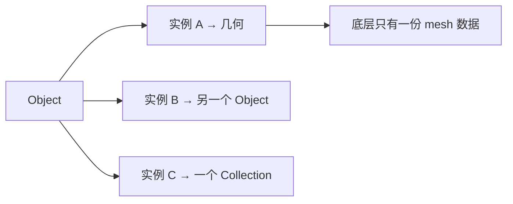
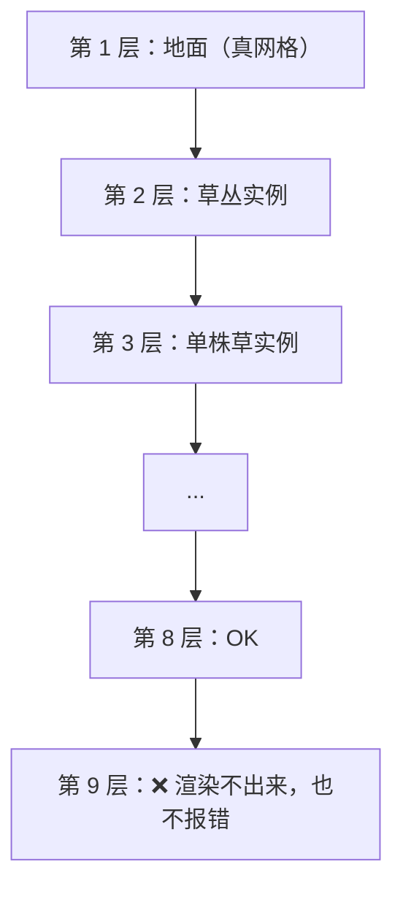
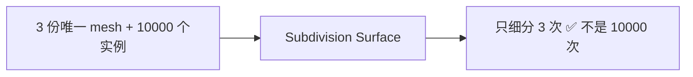
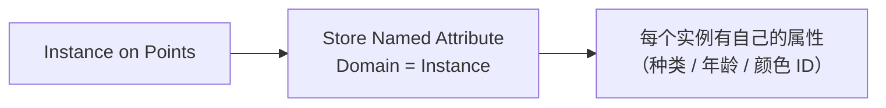
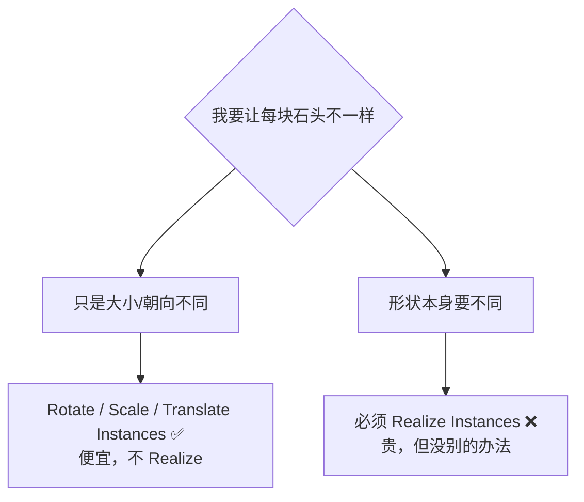
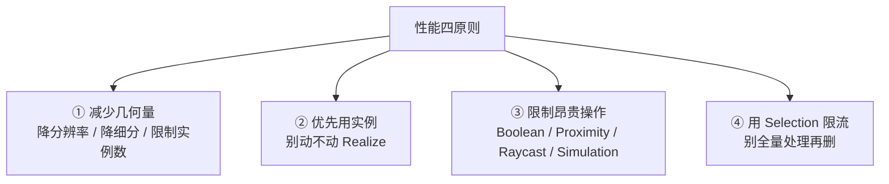

# 05 · 实例化深入：Instances 与性能 ⭐

> 一句话：**实例是「一份数据、多处引用」，不是复制。它让你可以摆 10 万个东西而不炸内存——但代价是「同一个实例的所有副本必须长得一样」，要不一样就得 Realize，而 Realize 是性能悬崖。**
> 依据：官方手册 5.2 · [Instances](https://docs.blender.org/manual/en/latest/modeling/geometry_nodes/instances.html) / [Performance](https://docs.blender.org/manual/en/latest/modeling/geometry_nodes/performance.html) / [glTF 2.0](https://docs.blender.org/manual/en/latest/addons/import_export/scene_gltf2.html)

---

## 一、三种实例

手册原话：*In addition to storing real data like a mesh or a curve, objects can store instances, which themselves can reference more geometry, an object, or a collection.*

| 类型 | 引用的是 |
| ---- | -------- |
| **几何实例** | 直接引用一份几何数据 |
| **物体实例** | 引用另一个 Object |
| **集合实例** | 引用一个 Collection（里面可以有多个物体） |



> 🎯 **实例的价值**：手册原话 *This optimization allows render engines like Cycles to handle the same geometry data in many different locations better than when the data is duplicated.*
> 对**游戏资产**这条线尤其重要——散布 1 万块石头，真几何是 1 万份 mesh，实例是 5 份 mesh + 1 万个变换矩阵。

---

## 二、8 层嵌套硬上限 ⭐

手册 Warning 原话：*Only eight levels of nested instancing are supported for rendering and viewing in the viewport. Though deeper trees of instances can be made inside geometry nodes, they must be realized at the end of the node tree.*



> ⚠️ **超了不报错，只是渲染不出来。** 这是最难查的一类问题——节点树看着没问题，视口里就是少东西。
> 救法：在节点树末尾加 `Realize Instances`，把层级压平。

---

## 三、什么时候必须 `Realize Instances`

| # | 情况 | 原因 |
| - | ---- | ---- |
| ① | **嵌套超过 8 层** | 渲染 / 视口硬上限 |
| ② | 需要**单独编辑某一个实例** | 实例是引用，改一个会改所有 |
| ③ | 要做**布尔 / 合并 / 焊接** | 这些操作需要真几何 |
| ④ | 要导出到**不支持 GPU 实例化的引擎** | 见第八节 |

> 🎯 手册原话：*When instances are realized they will take up more memory and manipulation to geometry will have to be processed individually rather than once per instancing geometry.*
> **原则：能不 Realize 就别 Realize。**（Stage 7 [04 篇](../../08-场景组装与作品集/04-几何节点散布入门.md) 已强调，这里是完整版）

### 「实例处理」的另一面：这是个优势

手册有一节专门讲 `Instance Processing`，结论很重要：

> *Almost all nodes that process geometry do so by processing each unique geometry separately rather than realized geometry.*
> 也就是说：在末尾放一个 `Subdivision Surface`，它只需要细分**三份**不同的 mesh，而不是每个实例都细一遍。



> ⚠️ **但这个优势的代价是：同一个实例的所有副本，操作结果必须完全一样。**
> 想让「每块石头的噪声位移不同」→ 必须 Realize，或者把差异做在**实例变换**上（缩放 / 旋转 / 位置），而不是几何上。

---

## 四、实例上能存什么：Instance 域

`Instance` 域只在几何节点里支持。这意味着你可以**给每个实例存一份独立的值**。



| 用途 | 做法 |
| ---- | ---- |
| **每类实例不同材质** | Instance 域存一个 ID → `Set Material` + `Material Selection` |
| **每个实例不同颜色** | Instance 域存 Color → 着色器里用 `Attribute` 节点读 |
| **下游按属性分流** | `Separate Geometry`（Domain = Instance） |

### 材质覆盖（游戏资产特别有用）

| 节点 | 作用 |
| ---- | ---- |
| **`Set Material`** | 给选中的元素（可设 Domain = Instance）换材质 |
| **`Material Selection`** | 输出「当前材质是否等于指定材质」的 Boolean |
| **`Replace Material`** | 在材质槽里整体替换（不是几何层面的覆盖） |
| **`Material Index` / `Set Material Index`** | 按 `material_index` 属性（Face 域）指定 |

> ⚠️ **实例上的材质覆盖，导出时不一定能保留。** glTF 的 `GPU Instances` 扩展**明确不支持材质变体**（Stage 7 已订正过）。
> 需要每个实例不同材质时，最稳的做法是：**Realize → 分成几组 → 每组一个材质**。

---

## 五、变换类节点：分清「改几何」还是「改实例」

| 节点 | 改的是 | 代价 |
| ---- | ------ | ---- |
| **`Rotate Instances`** | 实例的变换 | ⭐ 便宜；可指定 Pivot（绕底部旋转而非中心） |
| **`Scale Instances`** | 实例的变换 | 便宜 |
| **`Translate Instances`** | 实例的变换 | 便宜 |
| **`Set Instance Transform`** | 实例的完整变换矩阵 | 便宜 |
| **`Transform Geometry`** | **真几何** | ❌ 贵；会真正移动顶点 |
| **`Set Position`** | **真几何** | ❌ 贵 |



> 🎯 **判据：能靠「变换」解决的差异，绝不要用「改几何」解决。**
> 这条能省下的性能是数量级的。

### 读取与写入

| 节点 | 用途 |
| ---- | ---- |
| **`Instance Transform`** | 读出实例的变换矩阵 |
| **`Instance Rotation`** / **`Instance Scale`** | 只读出旋转 / 缩放 |
| **`Instance Bounds`** | 实例的包围盒（做剔除 / 对齐用） |
| **`Instance Reference`** | 判断两个实例是否引用同一份数据 |
| **`Instances to Points`** | 把实例变回点（**只留下变换信息**，几何丢掉） |
| **`Geometry to Instance`** | 反向：把几何变成一个实例 |
| **`Randomize Transforms`** | 一次性随机化位置 / 旋转 / 缩放 |
| **`Instance on Elements`** | 在**元素**（面 / 边 / 点）上放实例，而不是只在点上 |

> 💡 **`Instance on Elements` 是 5.0 新增的**（也有同名修改器）。它把散布从「点」扩展到了「面 / 边」——比如在面上贴地花、沿边放铆钉。

---

## 六、性能四条原则（手册原文归纳）



| 原则 | 手册原话要点 |
| ---- | ------------ |
| 减少几何量 | *High geometry counts are one of the most common causes of slow performance.* |
| 优先实例 | *Use Instance on Points … Avoid converting instances to real geometry unless required.* |
| 限制昂贵操作 | *Boolean operations can be slow on dense meshes. Proximity and raycast nodes may be costly. Simulation zones evaluate every frame.* |
| Selection 限流 | *Use the Selection input on nodes whenever possible.* |

### 另外两条容易忽略的

| 项 | 说明 |
| -- | ---- |
| **Field 惰性求值** | 手册：*Fields are evaluated lazily, but inefficient usage can still impact performance.* → 同一段 Field 被重复计算时用 `Capture Attribute` 缓存 |
| **节点栈上限** | 手册有一节 `Geometry Nodes Stack Limit`：深嵌套 / 递归式结构会耗尽栈，**可在 Preferences 里调**，但根本解法是减少嵌套深度、拆成多个小系统 |

---

## 七、调试卡顿时该怎么做（详见 [10 篇](10-调试与性能-Viewer-Spreadsheet-Profiling.md)）

| 步骤 | 操作 |
| ---- | ---- |
| ① | 开 **Timings 叠加层**，找出最慢的节点 |
| ② | 用 `M`（Mute）逐个屏蔽，隔离瓶颈 |
| ③ | 缩小输入规模测试（把 Density 调小） |
| ④ | 换更简单的几何对比 |

---

## 八、导出：实例进引擎的三条路

| 路 | 说明 | 限制 |
| -- | ---- | ---- |
| **① `Realize Instances`** | 变成真几何再导出 | 最稳；内存与面数会真涨 |
| **② glTF `Geometry Nodes Instances`** | 导出器把 GN 实例写出去 | **实验性** |
| **③ glTF `GPU Instances`** | `EXT_mesh_gpu_instancing` 扩展 | ⚠️ 硬限制：实例必须是网格、不能有子级、必须同属一个父物体、**不支持材质变体** |

> 📌 完整的导出开关与引擎验证见 Stage 7 [05 篇](../../08-场景组装与作品集/05-场景性能与空间分组.md) 与 [`../../07-资产规范与引擎导出/笔记.md`](../../07-资产规范与引擎导出/笔记.md)。

---

## 九、坑

- ❌ **一上来就 `Realize Instances`** → 视口当场卡死 → 能不 Realize 就别 Realize
- ❌ **嵌套超过 8 层没 Realize** → 渲染不出来也不报错 → 末尾压平
- ❌ **GN 实例和属性面板 `Instancing` 混用** → 手册明确 Warning 不支持
- ❌ **想让每块石头形状不同却不肯 Realize** → 实例的所有副本必须一样，这是原理不是 bug
- ❌ **用 `Transform Geometry` 做每实例随机旋转** → 真正移动顶点，贵一个数量级 → 用 `Rotate Instances`
- ❌ **在实例上覆盖材质就指望导出后还在** → `GPU Instances` 不支持材质变体 → Realize 后分组给材质
- ❌ **用 `Collection Info` 不开 `Pick Instances`** → 每个点放整个集合 → 面数 × N（Stage 7 已讲）
- ❌ **散布完去改源物体所在的集合** → GN 结果被覆盖
- ❌ **源物体没 `Ctrl+A → Scale`** → 散布出来大小乱七八糟
- ❌ **Instance 域属性存了却在 Face 域读** → 域错，值不对 → 检查 `Store Named Attribute` 的 Domain
- ❌ **深节点组嵌套导致栈溢出** → 手册有 Stack Limit 一节 → 减少嵌套、拆小系统
- ❌ **以为实例越多越省** → 省的是内存与处理，**draw call 不一定省**（Stage 7 [03 篇](../../08-场景组装与作品集/03-实例-复制-集合实例-性能视角.md)）

---

## 十、自检

| # | 自检点 | 通过标准 |
| - | ------ | -------- |
| ① | 三种实例 | 说出几何 / 物体 / 集合三种实例的区别 |
| ② | 8 层上限 | 说出嵌套上限是几层、超了会怎样（**不报错**）、怎么救 |
| ③ | Realize 时机 | 说出四种必须 Realize 的情况 |
| ④ | 实例处理优势 | 解释「为什么末尾放 SubD 只细分 3 次而不是 10000 次」，以及这个优势的代价 |
| ⑤ | 变换 vs 几何 | 说出 `Rotate Instances` 与 `Transform Geometry` 的差别，以及该怎么选 |
| ⑥ | Instance 域 | 说出 Instance 域能存什么、怎么给实例覆盖材质 |
| ⑦ | 性能四原则 | 报出四条原则 |
| ⑧ | 导出 | 说出实例进引擎的三条路，以及 `GPU Instances` 的一条硬限制 |
| ⑨ | 实操 | 散布 5000 个实例，视口仍可交互（不靠 Realize），并用 Timings 找出最慢节点 |

---

## 十一、速查

```text
【三种实例】
几何实例 → 引用一份几何
物体实例 → 引用另一个 Object
集合实例 → 引用一个 Collection
🎯 一份数据、多处引用：10000 块石头 = 5 份 mesh + 10000 个变换矩阵

【8 层嵌套硬上限 ⭐】
Only eight levels of nested instancing are supported
⚠️ 超了不报错，只是渲染不出来 → 末尾 Realize Instances 压平

【必须 Realize 的四种情况】
① 嵌套 > 8 层
② 要单独编辑某一个实例
③ 要做布尔 / 合并 / 焊接
④ 目标引擎不支持 GPU 实例化

【实例处理的优势 + 代价】
优势  末尾放 SubD → 只细分 3 份唯一 mesh，不是 10000 次
代价  同一实例的所有副本，操作结果必须一样
→ 想形状不同 → 只能 Realize；想大小/朝向不同 → 用变换节点（便宜）

【变换 vs 几何】
Rotate / Scale / Translate Instances   改实例变换 ⭐ 便宜
Set Instance Transform                 改完整变换矩阵
Randomize Transforms                   一次性随机化
Transform Geometry / Set Position      改真几何    ❌ 贵一个数量级
🎯 能靠变换解决的差异，绝不要改几何

【实例读写】
Instance Transform / Rotation / Scale  读出
Instance Bounds                         包围盒（剔除/对齐）
Instance Reference                      是否引用同一份数据
Instances to Points                     实例 → 点（丢几何，留变换）
Geometry to Instance                    几何 → 实例
Instance on Elements                    5.0 新增，在面/边上放实例（不只点）

【Instance 域】
Store Named Attribute，Domain = Instance → 每实例一份值
用途：每类不同材质 / 每实例不同颜色 / 下游分流
⚠️ GPU Instances 不支持材质变体 → 要变体就 Realize 后分组

【性能四原则】
① 减少几何量
② 优先用实例，别动不动 Realize
③ 限制昂贵操作（Boolean / Proximity / Raycast / Simulation）
④ 用 Selection 限流
+ Field 惰性求值：重复计算用 Capture Attribute 缓存
+ Stack Limit：深嵌套会耗尽栈，可在 Preferences 调，根本是拆小

【导出三条路】
① Realize Instances        最稳，面数真涨
② glTF Geometry Nodes Instances  实验性
③ glTF GPU Instances (EXT_mesh_gpu_instancing)
   ⚠️ 必须网格 / 不能有子级 / 同属一个父物体 / ❌ 不支持材质变体

【坑】
GN 实例不能混属性面板 Instancing（手册 Warning）
改源集合 → GN 结果被覆盖
源物体没 Apply Scale → 散布大小乱
实例省内存不省 draw call
```

---

## 资源

- 官方手册 5.2 · [Instances](https://docs.blender.org/manual/en/latest/modeling/geometry_nodes/instances.html)
- 官方手册 5.2 · [Performance](https://docs.blender.org/manual/en/latest/modeling/geometry_nodes/performance.html)
- 官方手册 5.2 · [glTF 2.0](https://docs.blender.org/manual/en/latest/addons/import_export/scene_gltf2.html)
- 主线：[`../../08-场景组装与作品集/03-实例-复制-集合实例-性能视角.md`](../../08-场景组装与作品集/03-实例-复制-集合实例-性能视角.md)

---

> **下一步**：[`06-曲线与程序化建模-楼梯与围栏.md`](06-曲线与程序化建模-楼梯与围栏.md) —— 实例这块稳住了，接下来是几何节点里最「出活」的一块：用曲线造东西。
