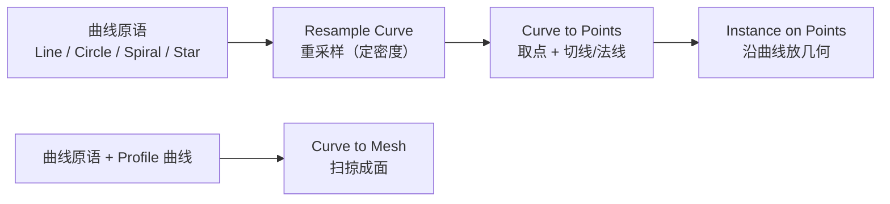
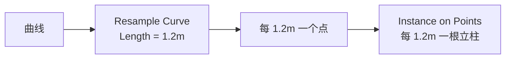
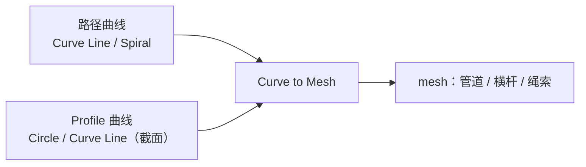
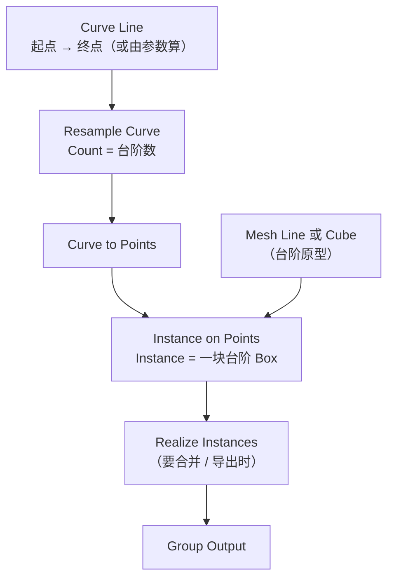
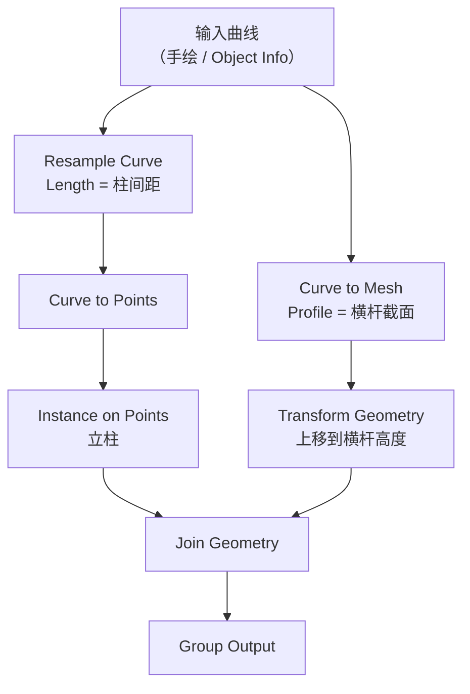

# 06 · 曲线与程序化建模：楼梯与围栏 ⭐

> 一句话：**曲线是程序化建模的骨架——先在曲线上定「在哪里、朝哪边」，再把它变成几何。** 楼梯、围栏、管道、绳索、线路，全都是这一套。
> 依据：官方手册 5.2 · Curve Nodes（Primitives / Operations / Read / Topology）

---

## 一、主链路：曲线 → 点 → 几何



> 🎯 **先分清楚两条出口**：
> `Curve to Points` → 沿曲线**放实例**（围栏立柱、路灯、树）
> `Curve to Mesh` → 沿曲线**扫掠出面**（管道、栏杆横杆、绳索）

---

## 二、曲线原语（Primitives）

| 节点 | 输出 | 典型用途 |
| ---- | ---- | -------- |
| **`Curve Line`** | 两点之间的直线 | 楼梯基准、栏杆基线 |
| **`Curve Circle`** | 圆 | 环形阵列、圆桌围栏 |
| **`Arc`** | 圆弧 | 拱门、圆角路径 |
| **`Spiral`** | 螺旋 | 螺旋楼梯 ⭐、绳索缠绕 |
| **`Quadrilateral`** | 四边形（梯形/平行四边/矩形） | 面板、窗框 |
| **`Star`** | 星形 | 齿轮、装饰 |
| **`Quadratic Bézier`** / **`Bézier Segment`** | 贝塞尔段 | 平滑过渡段 |
| **`Mesh Circle`** / **`Grid`** 等 | 网格原语（属 Mesh 分类） | 需要真面时用 |

> 💡 想让曲线**跟着场景里的手绘曲线走**，用 `Object Info`（勾选 As Instance 关闭、Geometry 输出）或直接把曲线物体作为 Group Input 的几何输入。

---

## 三、`Resample Curve`：定密度

| 模式 | 说明 |
| ---- | ---- |
| **Count** | 固定**总数**（改曲线长度，间距会变） |
| **Length** | 固定**间距**（改曲线长度，数量会变） ⭐ |



> 🎯 **做围栏选 Length**（间距恒定，符合现实）；**做固定段数的东西选 Count**（比如 12 级台阶）。

---

## 四、`Curve to Points`：取点与朝向

输出 `Points` / `Tangent` / `Normal` / `Rotation`。

| 输出 | 用途 |
| ---- | ---- |
| **Points** | 接 `Instance on Points` |
| **Tangent** | 沿曲线方向的切矢量（做朝向） |
| **Normal** | 法线 |
| **Rotation** | ⭐ 由切线 + 法线算好的旋转，直接接 `Instance on Points › Rotation` |

> 💡 **`Rotation` 输出是「让实例的某个轴对齐切线」的现成结果**，不用自己搭 `Align Rotation to Vector`。
> 但要注意它**只确定两个轴**，绕切线的第三个朝向仍是任意的 → 需要再叠一个随机 Z 旋转（Stage 7 已讲过的同一个道理）。

---

## 五、`Curve to Mesh`：扫掠成面



| 输入 | 说明 |
| ---- | ---- |
| **Curve** | 路径 |
| **Profile Curve** | 截面形状（一个小圆 = 管子，一条短线 = 扁带，一个星 = 异型材） |
| **Fill Caps** | 是否封两端（管子要封，带状不要） |

> 💡 手册 4.0 Release Notes 提到：*The Curve to Mesh node is significantly faster when the profile input is a single point.* 需要极高性能时用单点 profile。

### `Curve to Tube` 修改器 / 节点

5.0 新增的 **`Curve to Tube`**（既有修改器也有节点），是上面这条链路的**一键封装版**：给曲线直接加粗细。
简单管道优先用它；要异型截面或要控制封口，还是 `Curve to Mesh`。

---

## 六、两个修饰节点

| 节点 | 作用 | 典型用法 |
| ---- | ---- | -------- |
| **`Fillet Curve`** | 给折角加圆角 | ⭐ 围栏转角、楼梯扶手端头 |
| **`Trim Curve`** | 裁掉一段 | 做破损、做「只取中间 80%」 |
| **`Reverse Curve`** | 反向 | 方向搞反了 |
| **`Subdivide Curve`** | 加控制点 | 配合形变 |
| **`Interpolate Curves`** | 在两条曲线间插值 | 做渐变、做过渡 |
| **`Deform Curves on Surface`** | 把曲线贴到表面上 | ⭐ **沿地形铺路** |
| **`Fill Curve`** | 填充闭合曲线成面 | 做地板、做平台 |

---

## 七、实战一：程序化楼梯

**判据：改「台阶数」一个数字，整段楼梯跟着变，且不断裂。**



| 参数（Group Input） | 说明 |
| ------------------- | ---- |
| `台阶数` | 驱动 `Resample Curve` 的 Count |
| `踏步高` | 决定 `Curve Line` 的终点 Z |
| `踏步深` | 决定 `Curve Line` 的水平长度 |
| `台阶原型` | Geometry 输入，可换 |

```text
Curve Line 的终点 = (踏步深 × 台阶数, 0, 踏步高 × 台阶数)
```

> ⚠️ **最容易错的一步**：台阶原型 Box 的**原点要在底部中心**（主线 Stage 2 讲过的原点规则），否则每级台阶会错位半个身位。
> 解决：`Object Info` 之前先给原型 `Set Origin`，或在节点树里用 `Transform Geometry` 预偏移。

### 扶手与侧板

- 扶手：同一条 `Curve Line` 整体上移 → `Curve to Mesh`（圆 profile）或 `Curve to Tube`
- 立柱：`Resample Curve`（Count = 台阶数 / 2）→ `Instance on Points`
- 侧板：`Fill Curve` 或把楼梯轮廓挤出

---

## 八、实战二：程序化围栏

**判据：给任意一条手绘曲线，能沿它生成立柱 + 横杆，并可随机破损。**



| 步骤 | 节点 |
| ---- | ---- |
| ① 拿曲线 | Group Input（Geometry）或 `Object Info` |
| ② 定柱距 | `Resample Curve` → **Length 模式** |
| ③ 放立柱 | `Curve to Points` → `Instance on Points`（立柱原型） |
| ④ 做横杆 | 原曲线 → `Curve to Mesh`（profile = 一条短线或一个小矩形） |
| ⑤ 横杆上移 | `Transform Geometry`（可放两条，一上一下） |
| ⑥ 转角圆滑 | 加 `Fillet Curve` |
| ⑦ 随机破损 | `Random Value` → `Compare` → `Delete Geometry`（删掉几根立柱） |
| ⑧ 合并 | `Join Geometry` |

> 🎯 **`Random Value` + `Compare` + `Delete Geometry` 是「随机破损 / 随机缺失」的通用写法**，围栏、砖墙、瓦片都用得上。

---

## 九、实战三：管道与绳索

| 需求 | 链路 |
| ---- | ---- |
| **管道** | `Curve Line` + `Fillet Curve`（转角）→ `Curve to Mesh`（圆 profile，Fill Caps ON） |
| **绳索** | `Curve Line` → 加噪声位移（`Set Position` + Noise）→ `Curve to Mesh`（细圆 profile） |
| **螺旋管** | `Spiral` → `Curve to Mesh` |
| **线缆垂坠** | 曲线 → `Set Position` 用一条抛物线（Z = −k × x²）压一下 → `Curve to Mesh` |

> 💡 绳索的自然感靠两件事：**`Resample Curve` 给足够的点** + **`Set Position` 加低频噪声**。

---

## 十、坑

- ❌ **用 Count 模式做围栏** → 曲线一变长，柱距就变了 → 改用 **Length** 模式
- ❌ **台阶原型原点不在底部** → 每级错位半个身位 → 先 `Set Origin`
- ❌ **`Curve to Mesh` 没给 Profile** → 输出空几何，不报错 → 检查 Profile Curve 是否连上
- ❌ **管子没勾 Fill Caps** → 两端是开口 → 需要封口时勾上
- ❌ **`Curve to Points` 的 Rotation 直接当最终朝向** → 绕切线的第三轴不确定 → 再叠随机 Z 旋转
- ❌ **`Fillet Curve` 半径大于相邻段长度** → 报错或结果怪 → 半径调小
- ❌ **把 `Transform Geometry` 用在实例上** → 贵一个数量级 → 用 `Translate / Rotate Instances`（[05 篇](05-实例化深入-Instances与性能.md)）
- ❌ **手绘曲线作为输入但忘了 `Resample`** → 控制点疏密不均 → 立柱间距乱 → 一定先 Resample
- ❌ **曲线方向反了** → 阶梯从高往低走 → `Reverse Curve`
- ❌ **做随机破损却用 `Delete Geometry` 在错误的域** → 要么全删要么没删 → 检查 Domain 是 Instance 还是 Point
- ❌ **改了台阶数但 `Curve Line` 终点没跟着算** → 台阶数变了但总高不变，踏步高被压缩 → 终点要用乘法算出来

---

## 十一、自检

| # | 自检点 | 通过标准 |
| - | ------ | -------- |
| ① | 两条出口 | 说出 `Curve to Points` 与 `Curve to Mesh` 分别用在什么场景 |
| ② | Resample 模式 | 说出 Count 与 Length 的差别，以及做围栏该选哪个 |
| ③ | Rotation 输出 | 说出 `Curve to Points` 的 Rotation 只确定几个轴，以及缺的那个怎么补 |
| ④ | 楼梯 | 改台阶数，整段跟着变且不断裂 |
| ⑤ | 楼梯原点 | 说出台阶原型原点该在哪，错了会怎样 |
| ⑥ | 围栏 | 沿一条手绘曲线生成立柱 + 横杆，柱距恒定 |
| ⑦ | 随机破损 | 说出「Random Value → Compare → Delete Geometry」这条通用写法 |
| ⑧ | 管道 | 说出做一根带圆角转角的管子该用哪些节点 |
| ⑨ | 实操 | 做一个三段参数的程序化楼梯（台阶数 / 踏步高 / 踏步深），并 Mark as Asset |

---

## 十二、速查

```text
【两条出口】
Curve to Points → 沿曲线放实例（立柱 / 路灯 / 树）
Curve to Mesh   → 沿曲线扫掠成面（管道 / 横杆 / 绳索）

【原语】
Curve Line   直线（楼梯基准 / 栏杆基线）
Curve Circle 圆      Arc 圆弧
Spiral       螺旋 ⭐ 螺旋楼梯
Quadrilateral 四边形（梯形 / 平行四边 / 矩形）
Star         星形（齿轮 / 装饰）
Quadratic Bézier / Bézier Segment  平滑过渡段

【Resample Curve】
Count   固定总数（曲线变长 → 间距变）
Length  固定间距 ⭐（做围栏选它）
⚠️ 手绘曲线做输入必须 Resample，否则控制点疏密不均

【Curve to Points】
输出  Points / Tangent / Normal / Rotation
⭐ Rotation 是已算好的旋转，可直接接 Instance on Points › Rotation
⚠️ 只确定两个轴，绕切线的第三轴任意 → 再叠随机 Z 旋转

【Curve to Mesh】
Curve（路径）+ Profile Curve（截面）+ Fill Caps
圆 profile = 管子   短线 profile = 扁带   星 profile = 异型材
⚠️ 管子要勾 Fill Caps，带状不要
💡 profile 用单点时最快（4.0 优化）
5.0 新增 Curve to Tube（修改器 + 节点）= 一键封装版

【修饰】
Fillet Curve            折角圆角 ⭐（围栏转角 / 扶手端头）
Trim Curve              裁一段（破损 / 取中间段）
Reverse Curve           反向
Subdivide Curve         加控制点
Interpolate Curves      两曲线间插值
Deform Curves on Surface 曲线贴到表面 ⭐ 沿地形铺路
Fill Curve              闭合曲线填充成面

【程序化楼梯】
Curve Line 终点 = (踏步深 × 台阶数, 0, 踏步高 × 台阶数)
→ Resample(Count = 台阶数) → Curve to Points → Instance on Points(台阶 Box)
⚠️ 台阶原型原点必须在底部中心，否则每级错位半个身位
扶手：同曲线上移 → Curve to Mesh / Curve to Tube

【程序化围栏】
输入曲线 → Resample(Length = 柱距) → Curve to Points → Instance on Points(立柱)
原曲线 → Curve to Mesh(横杆截面) → Transform Geometry(上移) ×2
Fillet Curve 圆角转角 → Join Geometry

【通用写法：随机破损】
Random Value → Compare → Delete Geometry
（围栏缺柱 / 砖墙缺砖 / 瓦片缺失）
⚠️ 注意 Domain 是 Instance 还是 Point

【坑】
围栏用 Count → 柱距随长度变 → 改 Length
Curve to Mesh 没连 Profile → 输出空，不报错
Fillet 半径 > 相邻段长 → 报错
改台阶数但终点没跟着算 → 踏步高被压缩
```

---

## 资源

- 官方手册 5.2 · [Curve Nodes](https://docs.blender.org/manual/en/latest/modeling/geometry_nodes/curve/index.html)
- 官方手册 5.2 · [Curve to Mesh](https://docs.blender.org/manual/en/latest/modeling/geometry_nodes/curve/operations/curve_to_mesh.html)
- [4.0 GN Release Notes](https://developer.blender.org/docs/release_notes/4.0/geometry_nodes)（Curve to Mesh 性能优化）

---

> **下一步**：[`07-程序化变形-Noise-Proximity-Transform.md`](07-程序化变形-Noise-Proximity-Transform.md) —— 曲线造的是「规则几何」，接下来让几何按规则**形变**和**批量重复**。
