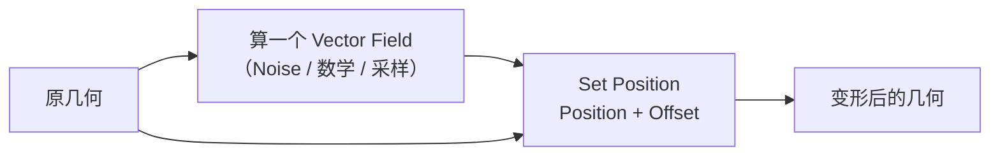
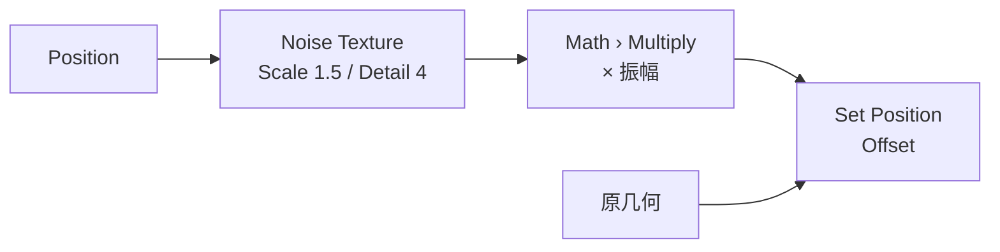
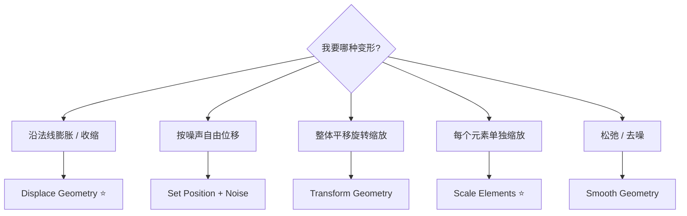
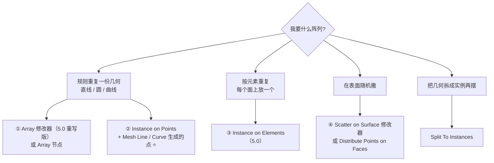
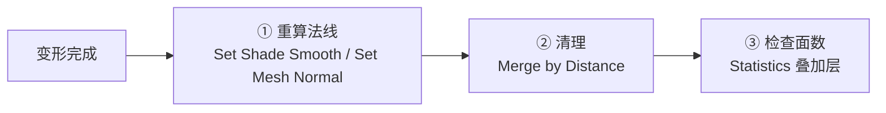

# 07 · 程序化变形：Noise、Proximity、Transform 与阵列

> 一句话：**变形 = 给每个元素算一个新位置；阵列 = 把同一份几何按规则摆 N 份。** 前者的核心是 `Set Position` + Field，后者的关键是选对四种做法里的哪一种。
> 依据：官方手册 5.2 · Geometry › Write / Operations、Mesh › Operations、Utilities › Texture

---

## 一、变形的主链路



> 🎯 **`Set Position` 是变形的总入口**：它接受一个 Vector Field，把每个点挪到新位置。
> 想「只挪一部分」→ 用 `Selection` 限流（[03 篇](03-选择与筛选-Selection-遮罩与域转换.md)）。

---

## 二、噪声：`Noise Texture` 与 `Voronoi`

| 节点 | 特征 | 用途 |
| ---- | ---- | ---- |
| **`Noise Texture`** | 连续、柔和的随机 | ⭐ 地形起伏、有机变形、密度遮罩 |
| **`Voronoi Texture`** | 胞状、有边界 | ⭐ 石块分块、龟裂、蜂窝、碎石分布 |
| **`White Noise Texture`** | 纯随机、无连续性 | 每元素一个纯随机值 |
| **`Musgrave Texture`** | 分形 | 山脉状起伏 |
| **`Wave Texture`** | 周期波 | 波纹、条纹 |
| **`Gabor Texture`** | 各向异性噪声 | 毛发、刷痕 |
| **`Magic Texture`** | 迷幻彩色 | 少用 |
| **`Brick Texture`** / **`Checker Texture`** | 规则图案 | 砖墙、棋盘 |

### 二维 vs 三维输入

| 类型 | 输入 | 何时用 |
| ---- | ---- | ------ |
| **1D / 3D** | 接 `Position`（Vector）→ 空间连续的噪声 | ⭐ 变形、起伏 |
| **2D** | 接 UV | 贴图空间的效果 |

> 💡 **`Noise Texture` 的 `Scale` 控制频率**，`Detail` / `Roughness` 控制细节层次。
> 想让噪声在不同物体间**不重复** → 用 `Vector Math › Add` 给 Position 加一个随机偏移当种子。

### 经典：有机起伏



> ⚠️ **Noise 输出是 Color（0–1），直接当 Offset 会把几何整个推到正方向。**
> 常见处理：`Subtract 0.5` 让它变成 −0.5 ~ 0.5，或乘一个振幅后再偏移。

---

## 三、几个专用变形节点

| 节点 | 作用 | 与 `Set Position` 的差别 |
| ---- | ---- | ------------------------ |
| **`Displace Geometry`** | 按法线方向位移 | ⭐ 内置「沿法线」语义，做膨胀 / 收缩最方便 |
| **`Smooth Geometry`** | 平滑（拉普拉斯） | 专门做松弛 / 去噪 |
| **`Transform Geometry`** | 整体平移 / 旋转 / 缩放 | 改的是**真几何**，不是实例 |
| **`Scale Elements`** | 按元素缩放（每个面 / 每个岛单独缩） | ⭐ 做「每块砖缩一点」「每个岛缩一点」 |
| **`Subdivision Surface`** | 细分 | 变形后常需要补细分 |
| **`Subdivide Mesh`** | 简单细分（不加平滑） | 需要更多点时 |
| **`Merge by Distance`** | 焊接 | 变形后清理 |
| **`Set Mesh Normal`** / **`Set Shade Smooth`** | 法线与着色 | 变形后法线可能要重算 |



---

## 四、`Geometry Proximity` 驱动的变形

这一节的完整说明在 [04 篇](04-采样与跨几何传值-Sample-Transfer.md)，这里只看变形用法：

| 需求 | 链路 |
| ---- | ---- |
| **靠近目标就鼓起来** | Distance → `Map Range`（近 = 大）→ `Displace Geometry` |
| **被目标推开** | Hit Position / Distance → `Set Position` 反向推 |
| **贴合另一个表面** | `Raycast` → Hit Position → `Set Position` |
| **按距离渐变缩放** | Distance → `Map Range` → `Scale Elements` 或实例 Scale |

> 💡 **「贴地」这类需求首选 `Raycast` 的 Hit Position**，比 `Geometry Proximity` 直接——前者给的是投影点，后者给的是最近点（不一定在垂直方向）。

---

## 五、阵列的四种做法（怎么选）

这是本支线最容易被绕晕的一块：Blender 里至少有四种「把东西重复 N 份」的方式。



| # | 做法 | 优点 | 缺点 | 何时用 |
| - | ---- | ---- | ---- | ------ |
| ① | **`Array` 修改器**（5.0 重写版） | 不用开节点编辑器；支持 Circle / Curve / 随机化 | 输出是**实例**，要合并必须 `Realize Instances` | 简单直线 / 环形阵列 |
| ② | **`Instance on Points`** + 点阵 | ⭐ 任意点来源（Mesh Line / Curve / Grid），完全可控 | 要搭节点树 | 复杂阵列、要每个不同 |
| ③ | **`Instance on Elements`**（5.0） | 直接在面 / 边 / 点上放 | 只能按元素 | 每面贴花、每边铆钉 |
| ④ | **`Scatter on Surface`** 修改器 / `Distribute Points on Faces` | 随机分布 | 不是规则阵列 | 碎石、植被 |

> ⚠️ **5.0 重写后的 `Array` 输出实例**——接 Boolean / Merge 之前必须 `Realize Instances`（主线 Stage 2 已强调）。
> 旧版 Array 保留为 **`Array (Legacy)`**，所以 5.2 里**有两个 Array**。

### 点从哪来

| 点来源 | 节点 | 用途 |
| ------ | ---- | ---- |
| 直线点阵 | **`Mesh Line`**（Mesh › Primitives） | 直线阵列 ⭐ |
| 网格点阵 | **`Grid`**（Mesh › Primitives） | 平面阵列 |
| 曲线上的点 | `Resample Curve` + `Curve to Points` | 沿路径阵列 |
| 面上的点 | `Distribute Points on Faces` | 随机散布 |
| 体积内的点 | **`Distribute Points in Volume`** | 体积填充 |
| 网格内的点 | **`Distribute Points in Grid`** | 规则体积填充 |
| 自己造 | **`Points`** 节点 | 从坐标列表造点 |

> 🎯 **`Mesh Line` 是规则阵列最省事的起点**：给它 Count 和 Offset，直接得到一排点，接 `Instance on Points` 就是阵列。

---

## 六、`Duplicate Elements` / `Sort Elements` / `Delete Geometry`

| 节点 | 作用 | 典型用法 |
| ---- | ---- | -------- |
| **`Duplicate Elements`** | 复制选中的元素（可指定复制量） | ⭐ 把一块砖复制成一堵墙 |
| **`Sort Elements`** | 排序，输出排序后的 index | 取前 N 个（[03 篇](03-选择与筛选-Selection-遮罩与域转换.md)） |
| **`Delete Geometry`** | 按 Selection 删除 | 开洞、清理 |
| **`Separate Geometry`** | 拆成两份 | 不同链路不同处理 |
| **`Split To Instances`** | 按几何岛拆成实例 | ⭐ 之后可单独变换每个碎块 |
| **`Split Edges`** | 拆边（面之间分离） | 做「每面独立」的效果 |
| **`Extrude Mesh`** | 挤出 | 做厚度、做台阶 |
| **`Mesh Boolean`** | 布尔 | ⚠️ 手册列为**昂贵操作** |

---

## 七、变形后必做的三件事



| 步骤 | 为什么 |
| ---- | ------ |
| **重算法线** | 位移后法线可能不对 → 渲染出黑斑 |
| **合并重叠顶点** | `Duplicate Elements` / `Split Edges` 后会产生重合顶点 |
| **检查面数** | 程序化最容易失控的就是面数 |

> ⚠️ **游戏资产这条线上，程序化的产出必须过一遍主线 Stage 6 的导出检查清单**（[`../../速查/导出检查清单.md`](../../速查/导出检查清单.md)）。

---

## 八、坑

- ❌ **Noise 输出（0–1）直接当 Offset** → 几何整体往正方向平移 → `Subtract 0.5` 或映射一下
- ❌ **忘了 `Resample` 就变形曲线** → 控制点不够，变形很生硬 → 先 `Resample Curve` / `Subdivide Mesh`
- ❌ **用 `Transform Geometry` 做每实例随机** → 贵一个数量级 → 用 `Rotate / Scale / Translate Instances`
- ❌ **`Array` 输出直接接 Boolean** → 完全没反应 → 先 `Realize Instances`
- ❌ **5.2 里找 Array 找到 Legacy 那个** → 参数完全不同 → 认准 5.0 重写版
- ❌ **变形后不重算法线** → 渲染黑斑 → `Set Shade Smooth` / `Set Mesh Normal`
- ❌ **程序化产出不看面数** → 一个楼梯 50 万面 → Statistics 叠加层看一眼
- ❌ **以为 `Displace Geometry` 和 `Set Position` 一样** → 前者沿**法线**，后者是绝对位移 → 要沿法线就用前者
- ❌ **`Mesh Boolean` 放在循环里** → 手册明确说它慢 → 尽量合并成一次
- ❌ **`Scale Elements` 忘记设 Domain** → 缩的是点不是面 → 检查域
- ❌ **程序化结果没 Apply 就导出** → 导出时勾 Apply Modifiers，或先 `Realize` + Apply

---

## 九、自检

| # | 自检点 | 通过标准 |
| - | ------ | -------- |
| ① | 变形主链路 | 说出「算 Vector Field → Set Position」这条链 |
| ② | Noise 陷阱 | 说出 Noise 输出范围，以及直接当 Offset 会怎样 |
| ③ | 变形节点选型 | 说出 `Displace Geometry` / `Set Position` / `Transform Geometry` / `Scale Elements` 各自的语义 |
| ④ | 阵列四选一 | 说出四种阵列做法，并会给一个需求选对 |
| ⑤ | Array 实例 | 说出 5.0 的 Array 输出是实例、以及接 Boolean 前要做什么 |
| ⑥ | 点来源 | 说出规则阵列最省事的起点节点（`Mesh Line`） |
| ⑦ | 变形后处理 | 说出变形后必做的三件事 |
| ⑧ | 实操 | 做一个「沿曲线阵列 + 每个实例按距离缩放」的链路 |

---

## 十、速查

```text
【变形主链路】
算一个 Vector Field → Set Position (Position + Offset)
只挪一部分 → 用 Selection 限流

【噪声节点】
Noise Texture   连续柔和 ⭐ 地形起伏 / 有机变形 / 密度遮罩
Voronoi Texture 胞状有边界 ⭐ 石块分块 / 龟裂 / 碎石分布
White Noise     纯随机（每元素独立）
Musgrave        分形山脉     Wave 周期波纹
Gabor           各向异性（毛发 / 刷痕）
Brick / Checker 规则图案
⚠️ 输出 0–1，直接当 Offset → 整体往正方向平移 → Subtract 0.5

【变形节点选型】
Displace Geometry   沿法线位移 ⭐ 膨胀 / 收缩
Set Position        绝对位移（自由）
Transform Geometry  整体平移旋转缩放（改真几何）
Scale Elements      每个元素单独缩放 ⭐ 每块砖缩一点
Smooth Geometry     松弛 / 去噪
Subdivision Surface / Subdivide Mesh  补细分
Merge by Distance   变形后清理

【Proximity 驱动】
靠近就鼓起    Distance → Map Range → Displace Geometry
被目标推开    Distance → Set Position 反向推
贴到表面      Raycast → Hit Position → Set Position ⭐
按距离缩放    Distance → Map Range → Scale Elements / 实例 Scale

【阵列四种做法】
① Array 修改器（5.0 重写）   简单直线 / 环形；⚠️ 输出实例，接 Boolean 前 Realize
                              ⚠️ 5.2 有两个 Array（新 + Legacy）
② Instance on Points + 点阵 ⭐ 完全可控，复杂阵列首选
③ Instance on Elements（5.0）按面 / 边 / 点放
④ Scatter on Surface / Distribute Points on Faces  随机散布

【点从哪来】
Mesh Line                    直线点阵 ⭐ 规则阵列最省事
Grid                         平面点阵
Resample + Curve to Points    沿路径
Distribute Points on Faces    随机表面
Distribute Points in Volume   体积内
Distribute Points in Grid     规则体积
Points                        从坐标列表造

【其它】
Duplicate Elements  复制选中元素（一块砖 → 一堵墙）
Sort Elements       排序 → 取前 N
Split To Instances  按几何岛拆成实例 ⭐
Split Edges         面之间分离
Extrude Mesh        挤出（做厚度 / 台阶）
Mesh Boolean        布尔 ⚠️ 手册列为昂贵操作

【变形后必做三件事】
① 重算法线  Set Shade Smooth / Set Mesh Normal
② 清理      Merge by Distance
③ 看面数    Statistics 叠加层
```

---

## 资源

- 官方手册 5.2 · [Geometry Nodes › Operations](https://docs.blender.org/manual/en/latest/modeling/geometry_nodes/geometry/index.html)
- 官方手册 5.2 · [Texture Nodes](https://docs.blender.org/manual/en/latest/modeling/geometry_nodes/texture/index.html)
- 官方手册 5.2 · [Performance](https://docs.blender.org/manual/en/latest/modeling/geometry_nodes/performance.html)

---

> **下一步**：[`08-区域与循环-Repeat-Simulation-Foreach.md`](08-区域与循环-Repeat-Simulation-Foreach.md) —— 上面所有东西都是「一次算完」。需要「迭代 N 次」或「上一帧影响下一帧」时，得用 Zone。
