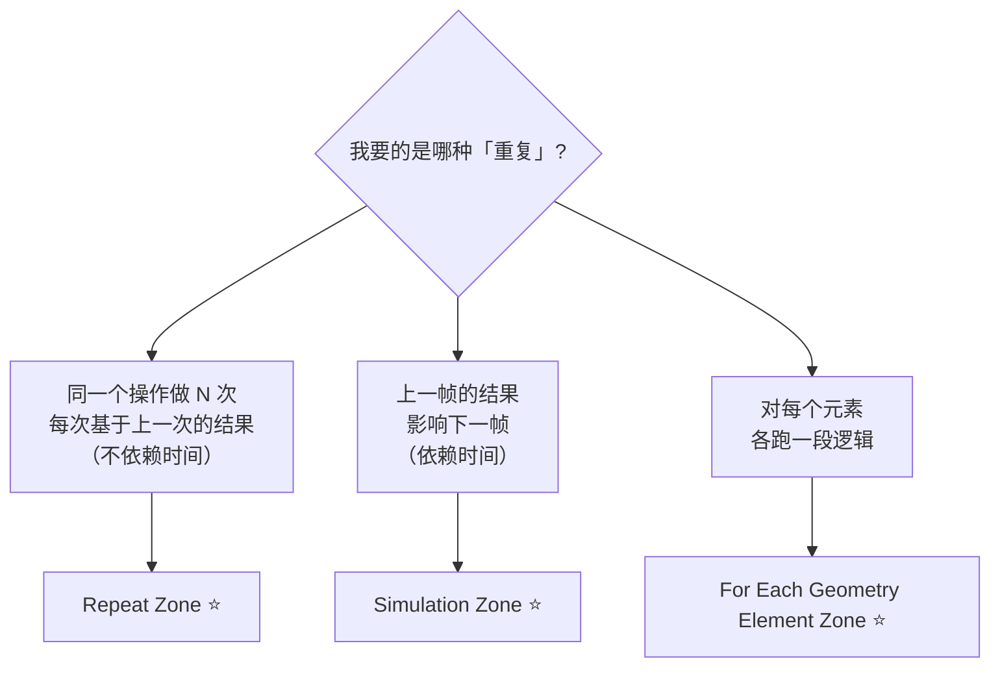
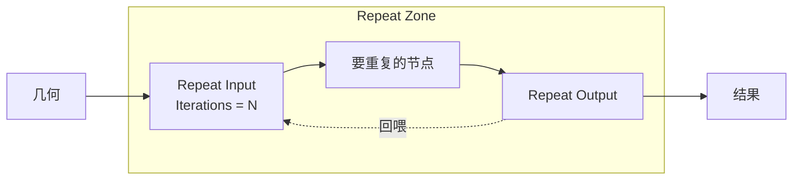
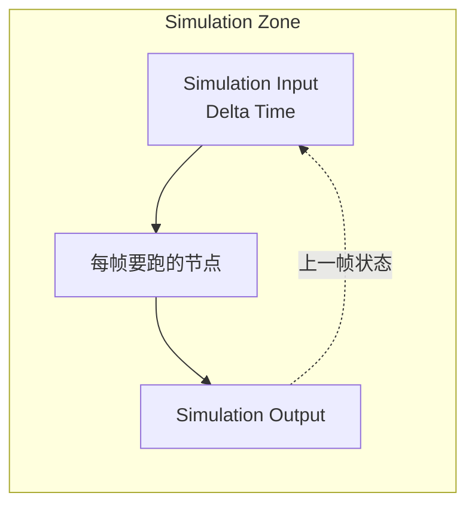
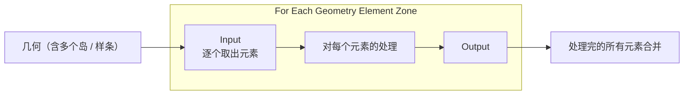
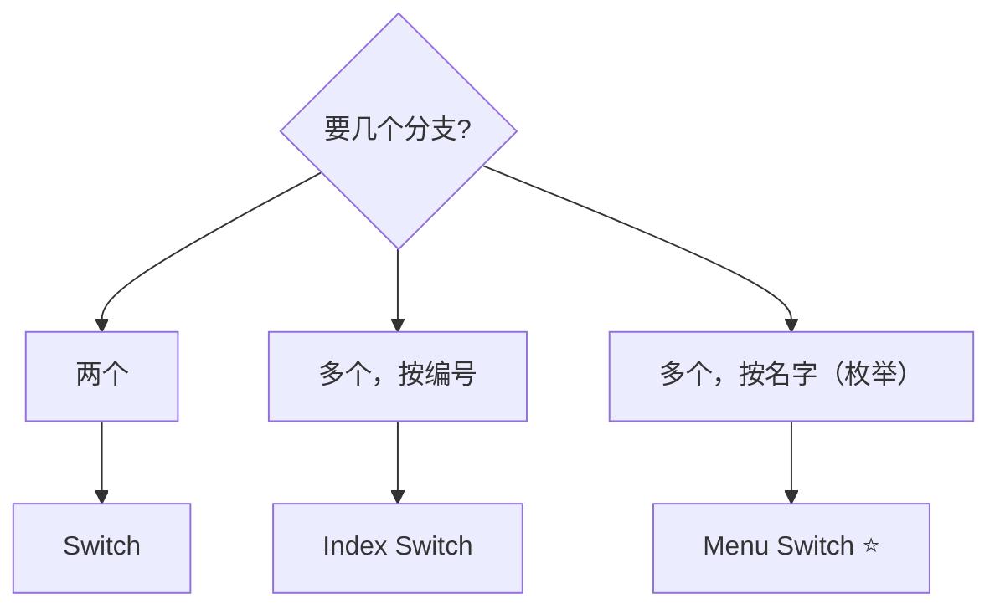

# 08 · 区域与循环：Repeat、Simulation、For Each ⭐

> 一句话：**Zone 是几何节点里唯一能让「结果回喂给自己」的结构。** Repeat 迭代 N 次，Simulation 上一帧影响下一帧，For Each 对每个元素跑一遍——三者别混用。
> 依据：官方手册 5.2 · [Simulation Zone](https://docs.blender.org/manual/en/latest/modeling/geometry_nodes/simulation/simulation_zone.html) / [Repeat Zone](https://docs.blender.org/manual/en/latest/modeling/geometry_nodes/utilities/repeat_zone.html) / [For Each Geometry Element Zone](https://docs.blender.org/manual/en/latest/modeling/geometry_nodes/utilities/for_each_geometry_element_zone.html)

---

## 一、三种 Zone 怎么选



| | **Repeat Zone** | **Simulation Zone** | **For Each Geometry Element Zone** |
| - | --------------- | ------------------- | ---------------------------------- |
| 依赖时间 | ❌ | ✅ | ❌ |
| 迭代次数 | 自己给的 Iterations | 帧数 | 元素个数 |
| 典型用途 | 递归生长、迭代平滑、迭代细分 | 物理模拟、粒子、布料、逐帧累积 | 对每个岛 / 每个样条单独处理 |
| 性能 | 每次改动重算 | ⚠️ **每帧都算**（手册明确说有开销） | 元素多时慢 |
| 能 Bake | — | ✅ 可烘焙缓存 | — |

---

## 二、Repeat Zone：迭代 N 次



| 项 | 说明 |
| -- | ---- |
| 结构 | `Repeat Input` / `Repeat Output` 一对，中间是要重复的节点 |
| **Iterations** | 迭代次数（可以是动态值） |
| 回喂 | Output 连回 Input，形成循环 |

| 典型用途 | 做法 |
| -------- | ---- |
| **递归生长** | 每次迭代在上一次的末端再加一段（树枝分叉、藤蔓） |
| **迭代平滑** | 把 `Blur Attribute` 放进 Zone，跑 5 次 = 更强平滑 |
| **迭代细分 + 位移** | 细分 → 位移 → 再细分 → 再位移（做分形地形） |
| **迭代扩散** | 每次迭代把选中范围往外扩一圈（做腐蚀 / 生长区域） |

> 💡 **4.0 加入 Repeat Zone**（4.0 GN Release Notes: *The new Repeat zone allows repeating nodes a dynamic number of times*）。
> 迭代次数可以是动态的——比如「迭代次数 = 某个属性值」。

---

## 三、Simulation Zone：上一帧影响下一帧



| 项 | 说明 |
| -- | ---- |
| 输入 | 几何 + **Delta Time**（时间步长） |
| 回喂 | 上一帧的状态 |
| ⚠️ 性能 | 手册：*Simulation zones evaluate every frame and can add overhead* |
| **可烘焙** | ✅ 把结果缓存下来，不必每帧重算 |
| `Skip` 输入 | 4.0 加入：可以跳过模拟 |

### 5.2 的模拟节点族（不只是 Simulation Zone）

手册里 `Simulation Nodes` 是一个完整分类：

| 节点 | 用途 |
| ---- | ---- |
| **`Simulation Zone`** | 通用逐帧模拟框架 |
| **`XPBD Solver`** | ⭐ 基于位置的动力学求解器（软体 / 绳索 / 布料的一种解法） |
| **`Cloth Dynamics`** | 布料 |
| **`Collider`** | 碰撞体 |
| **`Custom Effector`** / **`Custom Force`** / **`Set Effector`** | 自定义力场 |
| **`Hair Dynamics`** | 毛发动力学 |

> 🎯 **做游戏资产这条线，Simulation 用得不多**——它的产出通常是动画或缓存，不太能直接变成静态资产。
> 但它有一个静态用途：**用它「跑」出一个静态结果**（比如让一堆石头自然堆叠），然后 Bake / 应用成静态几何。

---

## 四、For Each Geometry Element Zone：对每个元素跑一遍



| 项 | 说明 |
| -- | ---- |
| 语义 | 把几何按元素（**几何岛 / 样条 / 实例**）拆开，对每个单独跑一段逻辑 |
| 与「直接处理整个几何」的差别 | 直接处理时，所有元素**共享**同一套求值；For Each 里，每个元素可以有**自己的**结果 |

| 典型用途 | 为什么必须用 For Each |
| -------- | --------------------- |
| **每个岛一个随机缩放** | 不用 For Each 时，随机值会按面 / 点算，一个岛内部不一致 |
| **每个样条单独生成** | 每条曲线走一次 `Curve to Mesh` |
| **每个实例单独做布尔** | 布尔需要真几何，且要逐个 |

> 💡 **好消息**：很多「每个元素一个值」的需求，`Mesh Island` 的 index 当随机种子就够了（[03 篇](03-选择与筛选-Selection-遮罩与域转换.md)），不必上 For Each。
> **只有当你需要「对每个元素跑一整段节点逻辑」时，才需要它。**

---

## 五、分支：Switch 三兄弟

| 节点 | 用途 | 要点 |
| ---- | ---- | ---- |
| **`Switch`** | 二选一（Boolean / Float / Integer / Vector / … / **Geometry**） | 最常用 |
| **`Index Switch`** | 按 index 多选一 | ⭐ 可加任意多个分支；index 越界时的行为要看 Clamp |
| **`Menu Switch`** | 按菜单项多选一 | 5.0 起支持；配合「菜单输入 socket」用 |



> 💡 5.0 起部分内建节点有了**菜单输入 socket**，配 `Menu Switch` 能做出「下拉选一种模式」这种干净的界面。
> 这在做「给用户用的节点组资产」时特别有用。

---

## 六、Baking：把 Zone 的结果缓存下来

| 项 | 说明 |
| -- | ---- |
| 用途 | 缓存昂贵计算（尤其 Simulation） |
| 两种方式 | `Bake` 节点 / Simulation Zone 烘焙 |
| ⚠️ 前提 | **必须先存 .blend** |
| ⚠️ 兼容 | 不保证跨版本可读 |
| Data-Block References | bake 后可改材质引用（**目前只支持材质**） |

详见 [02 篇](02-节点组-接口-复用与资产化.md) 第七节。

---

## 七、坑

- ❌ **用 Simulation Zone 做「迭代 N 次」的事** → 依赖帧率、结果不稳定 → 用 Repeat
- ❌ **用 Repeat Zone 做物理模拟** → 它不认时间 → 用 Simulation
- ❌ **Simulation 不 bake** → 每次播放都重算，还依赖帧率 → 定型后 bake
- ❌ **bake 前没存盘** → 手册明确要求先存 .blend
- ❌ **为了「每岛一个随机值」就上 For Each** → 慢 → 先用 `Mesh Island` + 随机种子
- ❌ **`Index Switch` 的 index 越界** → 结果不可预期 → 先 `Domain Size` 校验或配 Clamp
- ❌ **在 Repeat Zone 里放 `Mesh Boolean`** → 手册明确说 Boolean 慢 → 尽量合并成一次
- ❌ **Zone 嵌套太深** → 手册有 Stack Limit 一节 → 减少嵌套、拆小
- ❌ **把 Zone 当循环用去造 100 万个元素** → 面数失控 → 先算清楚 N 次迭代后有多少元素（常常是指数级）
- ❌ **Simulation 结果直接导出** → 它是每帧状态 → 先 bake 或应用到静态几何

---

## 八、自检

| # | 自检点 | 通过标准 |
| - | ------ | -------- |
| ① | 三种 Zone | 说出 Repeat / Simulation / For Each 的语义差别 |
| ② | 选型 | 给「递归生长」「物理模拟」「每岛单独处理」三个需求各选对 Zone |
| ③ | Simulation 性能 | 说出手册对 Simulation 的性能警告，以及补救手段（bake） |
| ④ | For Each 必要性 | 说出「每岛一个随机值」的更省事做法（Mesh Island 种子） |
| ⑤ | 三种 Switch | 说出 Switch / Index Switch / Menu Switch 的适用场景 |
| ⑥ | Bake 前提 | 说出 bake 前必须做什么 |
| ⑦ | 实操 | 用 Repeat Zone 做一次「迭代 5 次的迭代平滑」，并对比跑 1 次的差别 |

---

## 九、速查

```text
【三种 Zone】
Repeat Zone                    迭代 N 次，不依赖时间 ⭐ 递归生长 / 迭代平滑 / 迭代细分
Simulation Zone                上一帧影响下一帧 ⭐ 物理 / 粒子 / 布料 / 逐帧累积
For Each Geometry Element Zone 对每个元素各跑一段逻辑 ⭐ 每岛 / 每样条 / 每实例

【怎么选】
依赖时间吗？  是 → Simulation   否 → 继续
要迭代 N 次？是 → Repeat        否 → For Each

【Repeat Zone】
结构 Repeat Input / Output 一对，Output 回喂 Input
Iterations 可以是动态值（4.0 起支持）
用途 递归生长（树枝/藤蔓）/ 迭代平滑 / 迭代细分+位移 / 迭代扩散

【Simulation Zone】
输入 几何 + Delta Time
⚠️ 手册：evaluate every frame and can add overhead
✅ 可 bake 缓存
4.0 新增 Skip 输入
5.2 模拟节点族：Simulation Zone / XPBD Solver / Cloth Dynamics
              / Collider / Custom Effector / Custom Force / Hair Dynamics
💡 静态用途：跑出一个自然结果（石头堆叠）→ bake → 当静态几何用

【For Each Geometry Element Zone】
按元素（岛 / 样条 / 实例）拆开，各跑一段逻辑
❌ 不要为了「每岛一个随机值」用它 → Mesh Island index 当种子就够了
✅ 只有需要「对每个元素跑一整段节点逻辑」时才用

【Switch 三兄弟】
Switch        二选一（支持 Geometry）
Index Switch  按编号多选一
Menu Switch   按菜单项多选一 ⭐ 5.0 + 菜单输入 socket

【Baking】
两种方式 Bake 节点 / Simulation Zone 烘焙
⚠️ 必须先存 .blend
⚠️ 不保证跨版本可读
Data-Block References：bake 后可改材质引用（目前只支持材质）

【坑】
Simulation 做迭代 = 依赖帧率，结果不稳 → Repeat
Repeat 做物理 = 不认时间 → Simulation
为了每岛随机值上 For Each = 慢 → Mesh Island 种子
Zone 嵌套太深 → Stack Limit → 拆小
迭代造元素 → 常常是指数级，先算清楚
```

---

## 资源

- 官方手册 5.2 · [Simulation Zone](https://docs.blender.org/manual/en/latest/modeling/geometry_nodes/simulation/simulation_zone.html)
- 官方手册 5.2 · [Repeat Zone](https://docs.blender.org/manual/en/latest/modeling/geometry_nodes/utilities/repeat_zone.html)
- 官方手册 5.2 · [For Each Geometry Element Zone](https://docs.blender.org/manual/en/latest/modeling/geometry_nodes/utilities/for_each_geometry_element_zone.html)
- 官方手册 5.2 · [Baking](https://docs.blender.org/manual/en/latest/modeling/geometry_nodes/baking.html)
- [4.0 GN Release Notes](https://developer.blender.org/docs/release_notes/4.0/geometry_nodes)（Repeat Zone 加入）

---

> **下一步**：[`09-Volume与SDF-Grid体系与订正.md`](09-Volume与SDF-Grid体系与订正.md) —— 这一篇是对路线图说法的订正存档：5.0 到底新增了什么、为什么现在还别碰。
