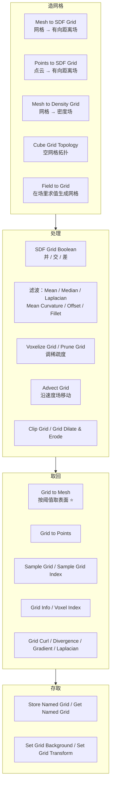
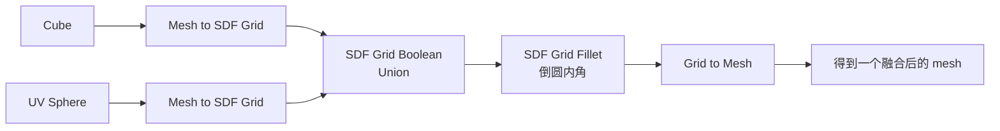

# 09 · Volume 与 SDF：5.0 的 Grid 体系（附对路线图说法的订正）

> 一句话：**路线图里「5.0 新增 SDF / Volume 节点」这句话把两代东西混成了一代——Volume 从 2.93 就有，5.0 真正新增的是 Grid。**
> 依据：[5.0 GN Release Notes](https://developer.blender.org/docs/release_notes/5.0/geometry_nodes/) · [2.93 GN Release Notes](https://wiki.blender.org/release_notes/2.93/geometry_nodes) · [4.0 GN Release Notes](https://developer.blender.org/docs/release_notes/4.0/geometry_nodes)

---

## 一、先订正：时间线到底是怎样的


| 版本 | 发生了什么 | 依据 |
| ---- | ---------- | ---- |
| **2.93** | 加入 `Volume to Mesh`、`Points to Volume`；GN 开始支持 volume 数据 | [2.93 Release Notes](https://wiki.blender.org/release_notes/2.93/geometry_nodes) |
| **3.2** | 加入 `Volume Cube` 原语节点（输出单张 density 网格） | commit 838c4a97f1（2022-06） |
| **4.0** | `Mesh to Volume` 现在生成**真正的 fog volume**，不再是转换后的 SDF；移除 `Exterior Band Width` 与 `Fill Interior` | [4.0 GN Release Notes](https://developer.blender.org/docs/release_notes/4.0/geometry_nodes) |
| **5.0** | ⭐ **Grid 体系**：新的 `Grid` socket + `Mesh to SDF Grid` / `Points to SDF Grid` / `Mesh to Density Grid` / `Grid to Mesh` / `Grid to Points` / `SDF Grid Boolean` + 一批滤波与采样节点 | [5.0 GN Release Notes · Volumes](https://developer.blender.org/docs/release_notes/5.0/geometry_nodes/) |

> 🎯 **所以「入门阶段先别碰」这个结论仍然成立，但理由变了**：
> 不是「这是新东西、不稳」，而是**这套东西解决的是「有机融合 / 布尔融合」这类问题，属于雕刻与特效范畴，不在游戏资产主线上**。
> 你主线上的布尔需求，用 `Mesh Boolean` 节点或 Bool Tool 就够了。

---

## 二、5.0 的 Grid 体系：一张图



---

## 三、关键节点速查

### 造 Grid

| 节点 | 作用 |
| ---- | ---- |
| **`Mesh to SDF Grid`** | ⭐ 网格 → 有向距离场（**布尔与融合的入口**） |
| **`Points to SDF Grid`** | 点云 → 有向距离场（做「一堆粒子融成一个形状」） |
| **`Mesh to Density Grid`** | 网格 → 密度场（**fog 类效果**） |
| **`Field to Grid`** | 在已有网格拓扑上按场求值生成新网格 |
| **`Cube Grid Topology`** | 定义一个立方体网格拓扑 |
| **`Volume Cube`** | 老节点（3.2 起）：一个含 density 网格的体素立方体 |

### 处理 Grid

| 节点 | 作用 |
| ---- | ---- |
| **`SDF Grid Boolean`** | ⭐ 对网格做布尔（并 / 交 / 差） |
| **`SDF Grid Offset`** | 整体膨胀 / 腐蚀（按世界空间距离偏移 SDF 表面） |
| **`SDF Grid Fillet`** | ⭐ **只对负主曲率区域作用，把凹内角倒圆** |
| **`SDF Grid Median`** | 降噪但保留锐利特征 |
| **`SDF Grid Mean`** | 快速可分离平均滤波（线性复杂度） |
| **`SDF Grid Laplacian`** | 近似平均曲率流（对真 SDF 更便宜） |
| **`SDF Grid Mean Curvature`** | 高曲率处平滑更多、平坦处更少 |
| **`Voxelize Grid`** / **`Prune Grid`** | 调整稀疏度（性能与精度权衡） |
| **`Advect Grid`** | 沿速度场移动体素值（流体类） |
| **`Clip Grid`** / **`Grid Dilate & Erode`** / **`Grid Mean`** / **`Grid Median`** | 裁剪与通用滤波 |

### 取回与查询

| 节点 | 作用 |
| ---- | ---- |
| **`Grid to Mesh`** | ⭐ 按阈值把网格的等值面转成 mesh（**回主线的唯一出口**） |
| **`Grid to Points`** | 转成点 |
| **`Sample Grid`** / **`Sample Grid Index`** | 采样网格值 |
| **`Grid Info`** / **`Voxel Index`** | 查询元信息与体素编号 |
| **`Grid Curl` / `Divergence` / `Gradient` / `Laplacian`** | 取网格值的微分性质 |
| **`Store Named Grid`** / **`Get Named Grid`** | ⭐ 网格进出几何（**除此之外，网格不作为几何的一部分处理**） |
| **`Set Grid Background`** / **`Set Grid Transform`** | 写背景值与变换 |

---

## 四、与老 Volume 节点的关系

| | 老 Volume（2.93 起） | 新 Grid（5.0） |
| - | --------------------- | -------------- |
| 数据 | Volume 对象（OpenVDB 雾体） | **Grid socket**（稀疏体素网格） |
| 是否属于几何 | 是（一种几何组件） | ❌ **手册原话：除了 `Store Named Grid` / `Get Named Grid` 进出之外，网格不作为几何的一部分处理** |
| 典型节点 | `Volume Cube` / `Volume to Mesh` / `Mesh to Volume` / `Points to Volume` | `Mesh to SDF Grid` / `SDF Grid Boolean` / `Grid to Mesh` / 滤波族 |
| 用途 | 雾、烟、体积渲染 | ⭐ **布尔融合、有机融合、程序化造型** |

> 💡 **`Volume to Mesh` 与 `Grid to Mesh` 是两个不同代的节点，都在 5.2 里**（手册 Mesh › Operations 里有 `Mesh to Volume` / `Volume to Mesh`，Volume › Operations 里有 `Grid to Mesh`）。
> 找节点时用搜索框，别在分类里翻。

---

## 五、为什么现在别碰（三条理由）

| # | 理由 |
| - | ---- |
| ① | **不在主线上**。它解决的是「有机融合 / 布尔融合」，属于雕刻与特效；游戏资产主线的布尔需求用 `Mesh Boolean` 节点就够了 |
| ② | **产出难进引擎**。网格 → mesh 的过程由 `Grid to Mesh` 的阈值决定，**面数与拓扑都不可控**，出来的常常是一大堆三角面，还要重拓扑才能用（回到主线 Stage 5） |
| ③ | **参数不直觉**。SDF 的 Offset / Fillet / 滤波这些参数没有「视觉直觉」，调起来靠试，很容易陷进去半天 |

> 🎯 **什么时候回头碰**：当你需要「把几个形状有机地融在一起」（比如石头长进墙里、树根盘住地面）且手工做很痛苦时。
> 在这之前，`Mesh Boolean` + 手工补面是更省时间的路。

---

## 六、最小可试链路（好奇时可以跑一遍）



| 步 | 操作 |
| - | ---- |
| ① | 两个几何 → 各自 `Mesh to SDF Grid` |
| ② | `SDF Grid Boolean` 选 Union |
| ③ | 可选：`SDF Grid Fillet` 或 `SDF Grid Offset` |
| ④ | `Grid to Mesh` 取回 mesh |
| ⑤ | 检查面数（**大概率爆表**） |

> ⚠️ **跑完第 ⑤ 步你会立刻理解第五节的第 ② 条理由。**

---

## 七、坑

- ❌ **以为 Volume 是 5.0 新增的** → 2.93 就有了 → 别在老教程里看到 Volume 节点就以为那是新东西
- ❌ **把 Grid 当成几何的一种** → 手册明确说它不是几何的一部分 → 必须用 `Store / Get Named Grid` 进出
- ❌ **用 `Volume to Mesh` 找 SDF 融合** → 那是老节点 → 用 `Grid to Mesh`
- ❌ **`Grid to Mesh` 后不看面数** → 几乎必然爆表 → 先看 Statistics
- ❌ **想靠 SDF 融合直接产出游戏资产** → 拓扑不可用 → 只能当高模，然后重拓扑 + 烘焙（主线 Stage 5）
- ❌ **把滤波参数当「平滑强度」调** → Median / Mean / Laplacian / Mean Curvature 各有不同语义 → 先看手册再调
- ❌ **`Mesh to Volume` 的老参数找不到了** → 4.0 移除了 `Exterior Band Width` 与 `Fill Interior`
- ❌ **跨版本读 bake 的 volume 数据** → volume 用 OpenVDB 存（可互操作），但手册说**几何数据不保证跨版本可读**

---

## 八、自检

| # | 自检点 | 通过标准 |
| - | ------ | -------- |
| ① | 订正 | 说出 Volume 从哪个版本就有、5.0 新增的到底是什么 |
| ② | Grid 定位 | 说出「Grid 不是几何的一部分」这条，以及进出手段 |
| ③ | 链路 | 说出「网格 → SDF → 布尔 → 回 mesh」的四个节点 |
| ④ | 两代节点 | 说出 `Volume to Mesh` 与 `Grid to Mesh` 的代际差别 |
| ⑤ | 别碰的理由 | 报出三条理由中的至少两条 |
| ⑥ | 何时回头 | 说出什么时候值得回来用这套 |

---

## 九、速查

```text
【订正：时间线】
2.93  Volume to Mesh / Points to Volume（Volume 起点）
3.2   Volume Cube
4.0   Mesh to Volume 改为生成 fog volume；移除 Exterior Band Width / Fill Interior
5.0   ⭐ 新增 Grid 体系（新 Grid socket + 一批节点）
→ 「5.0 新增 SDF / Volume 节点」不准确，新增的是 Grid

【Grid 链路】
Mesh to SDF Grid / Points to SDF Grid / Mesh to Density Grid
  → SDF Grid Boolean（并/交/差）
  → 滤波（Offset / Fillet / Median / Mean / Laplacian / Mean Curvature）
  → Grid to Mesh ⭐ 唯一回到 mesh 的出口

【存取】
Store Named Grid / Get Named Grid
⚠️ 除此之外，Grid 不作为几何的一部分处理

【两代对比】
老 Volume   Volume 对象（OpenVDB 雾体），是几何组件
            Volume Cube / Mesh to Volume / Volume to Mesh / Points to Volume
新 Grid     Grid socket（稀疏体素网格），❌ 不是几何组件
            Mesh to SDF Grid / SDF Grid Boolean / Grid to Mesh / 滤波族

【为什么现在别碰】
① 不在主线（有机融合属雕刻/特效，主线用 Mesh Boolean 够）
② 产出难进引擎（Grid to Mesh 面数与拓扑不可控，要重拓扑）
③ 参数不直觉（SDF 参数没有视觉直觉，容易陷进去）
→ 回头时机：需要「把几个形状有机融合」且手工很痛苦时

【坑】
Grid 当几何 → 错，必须 Store/Get Named Grid
用 Volume to Mesh 找 SDF 融合 → 该用 Grid to Mesh
Grid to Mesh 后不看面数 → 几乎必然爆表
想靠 SDF 直接出游戏资产 → 只能当高模 → 重拓扑 + 烘焙
```

---

## 资源

- [5.0 Geometry Nodes Release Notes · Volumes](https://developer.blender.org/docs/release_notes/5.0/geometry_nodes/)
- [2.93 Geometry Nodes Release Notes](https://wiki.blender.org/release_notes/2.93/geometry_nodes)
- [4.0 Geometry Nodes Release Notes](https://developer.blender.org/docs/release_notes/4.0/geometry_nodes)
- 官方手册 5.2 · [Volume Nodes](https://docs.blender.org/manual/en/latest/modeling/geometry_nodes/volume/index.html)
- 官方博客 · [Volume Grids in Geometry Nodes](https://code.blender.org/2025/10/volume-grids-in-geometry-nodes/)

---

> **下一步**：[`10-调试与性能-Viewer-Spreadsheet-Profiling.md`](10-调试与性能-Viewer-Spreadsheet-Profiling.md) —— 如果你在前面的任何一篇卡在「不知道算出来是什么」，直接跳到这篇。
