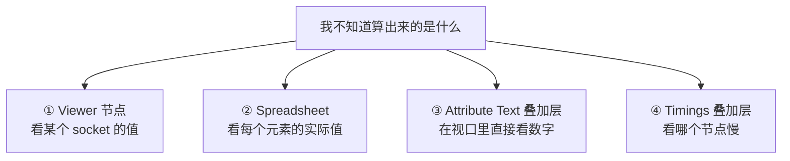
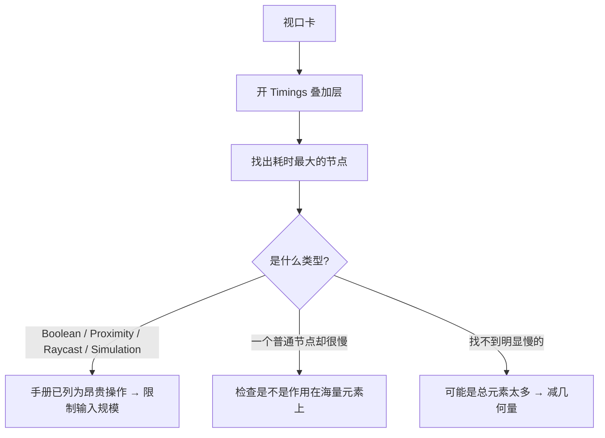
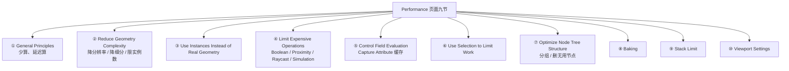

# 10 · 调试与性能：Viewer、Spreadsheet、Profiling

> 一句话：**几何节点卡住的时候，90% 不是「不会连」，而是「不知道自己算出来的是什么」。** 先把值看清楚，再去改节点。
> 依据：官方手册 5.2 · [Performance](https://docs.blender.org/manual/en/latest/modeling/geometry_nodes/performance.html) · [5.0 GN Release Notes · Viewer](https://developer.blender.org/docs/release_notes/5.0/geometry_nodes/)

---

## 一、调试的四件套



| 工具 | 看什么 | 什么时候用 |
| ---- | ------ | ---------- |
| **`Viewer` 节点** | 某个 socket 在某个几何上的值 | 「这段算出来的到底是什么」 |
| **`Spreadsheet`** | 每个元素的逐条数据 | 「第 5 个点的实际值是多少」 |
| **Attribute Text 叠加层** | 视口里直接显示数字 | ⭐ 「一眼看出哪块区域的值不对」 |
| **Timings 叠加层** | 每个节点的耗时 | 「卡在哪」 |

---

## 二、`Viewer` 节点

| 项 | 说明 |
| -- | ---- |
| 快捷键 | ⭐ **`Ctrl+Shift+LMB`** 点节点 → 自动接到 Viewer |
| 5.0 变化 | ① 支持查看**非几何数据**；② 支持**动态数量的输入**；③ **单值直接显示在节点上**；④ 取消连接时对应 socket 自动移除；⑤ 快捷键现在**切换** Viewer 而不只是开启 |
| ⚠️ 注意 | 5.0 起：**几何节点修改器没被求值时，Viewer 会显示警告** |


> 💡 **5.0 之前 Viewer 只能看几何**，看一个 Float 得先 `Store Named Attribute` 再去 Spreadsheet 找。5.0 之后直接连，省一大步。

### 常见「看什么」

| 你想确认 | 接什么到 Viewer |
| -------- | --------------- |
| 这一段算出来的遮罩对不对 | Boolean Field（看每点的 true/false） |
| 密度值范围是多少 | Float Field（配合 `Attribute Statistic` 看 Min/Max） |
| 位置算错了没有 | Vector Field |
| 实例数量对不对 | Geometry（看 Spreadsheet 的 Instance 行） |

---

## 三、Spreadsheet 编辑器

| 项 | 说明 |
| -- | ---- |
| 打开 | 编辑器类型切到 Spreadsheet |
| 5.0 变化 | ⭐ **支持同时显示多个几何的数据**；**支持展开查看 Bundle 的内容** |
| 用法 | 点节点头部的图标，把该节点的数据 pin 到 Spreadsheet |


> 🎯 **Spreadsheet 是唯一能确认「第 5 个点的实际值」的地方。** 自检里那条「说出第 5 个点的实际值」就是用它。

### 看什么

| 列 | 含义 |
| -- | ---- |
| 行 | 每个元素（点 / 面 / 实例…） |
| 列 | 每个属性（`position` / `id` / 你存的属性 / Viewer 的值） |

---

## 四、Attribute Text 叠加层 ⭐

| 项 | 说明 |
| -- | ---- |
| 位置 | 3D 视口的叠加层菜单里（与 Statistics 同一处） |
| 用途 | 在视口里**直接把属性值以文字形式画在元素上** |
| 5.0 改进 | *Attribute text overlays are more readable*（可读性提升） |

> 🎯 **这是最快的一类调试**：不用开 Spreadsheet，一眼就看出「这块区域的值是 0.9、那块是 0.1」，遮罩画错了立刻看出来。
> 尤其适合调**空间分布的遮罩**（坡度、噪声、距离）。

---

## 五、Timings 叠加层：找慢节点

| 项 | 说明 |
| -- | ---- |
| 位置 | 节点编辑器的叠加层（手册：`Overlay → Show Timing`） |
| 用途 | 在每个节点上显示**该节点的耗时** |
| 用法 | 打开后，最慢的节点会标出耗时数字 |



---

## 六、系统排查流程

| 步 | 操作 | 判据 |
| - | ---- | ---- |
| ① | **缩小规模** | 把 Density 调小 / 换一个 10 面的测试几何 → 还卡就是节点问题，不卡就是规模问题 |
| ② | **`M`（Mute）逐个屏蔽** | 屏蔽掉某个节点后流畅了 → 就是它 |
| ③ | **开 Timings** | 确认瓶颈节点 |
| ④ | **换更简单的几何对比** | 排除「是不是我的源物体太重」 |
| ⑤ | **迭代测试** | 手册原话：*Iterative testing helps pinpoint performance issues* |

> 💡 **`M`（Mute）是最被低估的调试手段**。手册明确把它列为定位慢操作的做法之一。屏蔽节点后几何会退化，但能立刻定位瓶颈。

---

## 七、性能：手册给的完整清单



| # | 原则 | 手册要点 |
| - | ---- | -------- |
| ① | 总原则 | *Minimize the amount of geometry processed. Avoid unnecessary evaluations.* |
| ② | 减少几何量 | 降分辨率、降细分、限制实例数、**只在必要时 Realize** |
| ③ | 优先实例 | *Instances reduce memory usage and improve evaluation speed.* |
| ④ | 限制昂贵操作 | **Boolean 在密集网格上慢**；**Proximity / Raycast 取决于输入规模**；**Simulation 每帧求值** |
| ⑤ | 控制 Field 求值 | Field 惰性求值，但重复计算仍浪费 → **用 `Capture Attribute` 缓存** |
| ⑥ | Selection 限流 | *Use the Selection input on nodes whenever possible.* |
| ⑦ | 优化树结构 | 分组、去掉无用节点与连线、保持数据流简单直接 |
| ⑧ | Baking | 缓存昂贵计算；**牺牲灵活性换性能，定型后再做** |
| ⑨ | **Stack Limit** | ⭐ 深嵌套 / 递归式结构会耗尽栈 → **可在 Preferences 调**，根本解法是减少嵌套、拆成多个小系统 |
| ⑩ | 视口设置 | 降视口细分、用简单着色、编辑时禁用不必要的修改器 |

---

## 八、坑

- ❌ **不看值就调参数** →  blind 调参，越调越乱 → 先接 Viewer 看清楚
- ❌ **只看视口不看 Spreadsheet** → 「看起来差不多」但实际值全 0 → 用 Spreadsheet 确认数值
- ❌ **用 Statistics 看 instance 数量以为那是面数** → 实例数和三角数是两回事 → 要面数得 Realize 后看
- ❌ **卡了就加内存 / 换电脑** → 多半是节点树结构问题 → 先跑上面的排查流程
- ❌ **一上来就 Bake** → 调参阶段每次改都要重 bake → 定型后再做
- ❌ **以为 Field 惰性求值就万事大吉** → 同一段被多个节点引用时会算多次 → `Capture Attribute`
- ❌ **深嵌套报错看不懂** → 那是 Stack Limit → 减少嵌套深度，别只去 Preferences 调大
- ❌ **Viewer 显示警告就以为节点坏了** → 5.0 起是「修改器没被求值」的警告 → 检查修改器是否被禁用/物体是否隐藏
- ❌ **调视图设置想解决节点树的性能** → 视口设置只影响显示，重算还是会发生 → 要从几何量与节点入手
- ❌ **忘了 `Ctrl+Shift+LMB` 现在能接任意类型** → 还在手动 `Store Named Attribute` → 5.0 之后直接连

---

## 九、自检

| # | 自检点 | 通过标准 |
| - | ------ | -------- |
| ① | Viewer | 会用 `Ctrl+Shift+LMB` 接 Viewer，并说出 5.0 的三条改进 |
| ② | Spreadsheet | 能说出某个节点输出的**第 5 个点的实际值** |
| ③ | Text 叠加层 | 会开 Attribute Text 叠加层，并说出它最适合调什么 |
| ④ | Timings | 会开 Timings 叠加层并找出最慢的节点 |
| ⑤ | 排查流程 | 说出五步排查法（缩小 / Mute / Timings / 换几何 / 迭代） |
| ⑥ | 性能原则 | 报出至少五条手册性能原则 |
| ⑦ | 昂贵操作 | 说出手册点名的三类昂贵节点 |
| ⑧ | Stack Limit | 说出深嵌套会怎样，以及根本解法是什么 |
| ⑨ | 实操 | 给一棵卡住的树做完整排查，写出「最慢节点是谁 + 为什么 + 怎么改」 |

---

## 十、速查

```text
【调试四件套】
Viewer 节点     看某个 socket 的值    Ctrl+Shift+LMB ⭐
Spreadsheet     看每个元素的实际值    点节点头部图标 pin
Attribute Text  视口里直接显示数字 ⭐ 调空间遮罩最快
Timings         每个节点耗时         找卡在哪

【Viewer 的 5.0 变化】
① 支持查看非几何数据（以前只能看几何）
② 支持动态数量的输入
③ 单值直接显示在节点上
④ 取消连接时 socket 自动移除
⑤ Ctrl+Shift+LMB 现在是「切换」不只是「开启」
⚠️ 修改器没被求值时 Viewer 显示警告

【Spreadsheet 的 5.0 变化】
① 可同时显示多个几何
② 可展开查看 Bundle 内容
🎯 唯一能确认「第 5 个点的实际值」的地方

【排查五步】
① 缩小规模（Density 调小 / 换 10 面测试几何）
② M（Mute）逐个屏蔽 → 定位
③ 开 Timings → 确认瓶颈
④ 换更简单几何对比 → 排除源物体问题
⑤ 迭代测试

【性能十原则】
① 少算、延迟算
② 减少几何量（降分辨率 / 降细分 / 限实例数 / 少 Realize）
③ 优先实例
④ 限制昂贵操作：Boolean（密集网格）/ Proximity / Raycast / Simulation（每帧）
⑤ 控制 Field 求值：重复计算用 Capture Attribute 缓存
⑥ Selection 限流
⑦ 优化树结构：分组 / 删无用节点 / 数据流简单直接
⑧ Baking：定型后再做
⑨ Stack Limit：深嵌套耗尽栈，可 Preferences 调，根本是拆小
⑩ 视口设置：降细分 / 简单着色 / 编辑时禁用修改器

【坑】
不看值就调参 → 先接 Viewer
只看视口 → 值可能全 0，用 Spreadsheet 确认
Statistics 的 instance 数 ≠ 三角数 → 要面数先 Realize
调参阶段就 Bake → 每次改都要重 bake
深嵌套报错 → Stack Limit → 拆小，别只调 Preferences
```

---

## 资源

- 官方手册 5.2 · [Performance](https://docs.blender.org/manual/en/latest/modeling/geometry_nodes/performance.html)
- 官方手册 5.2 · [Inspection](https://docs.blender.org/manual/en/latest/modeling/geometry_nodes/inspection.html)
- 官方手册 5.2 · [Viewer Node](https://docs.blender.org/manual/en/latest/modeling/geometry_nodes/output/viewer.html)
- [5.0 GN Release Notes · Viewer](https://developer.blender.org/docs/release_notes/5.0/geometry_nodes/)

---

> **下一步**：[`11-练习项目-程序化楼梯围栏与岩石地形.md`](11-练习项目-程序化楼梯围栏与岩石地形.md) —— 全部学完了，现在把 01–10 用一遍并跑通导出闭环。
