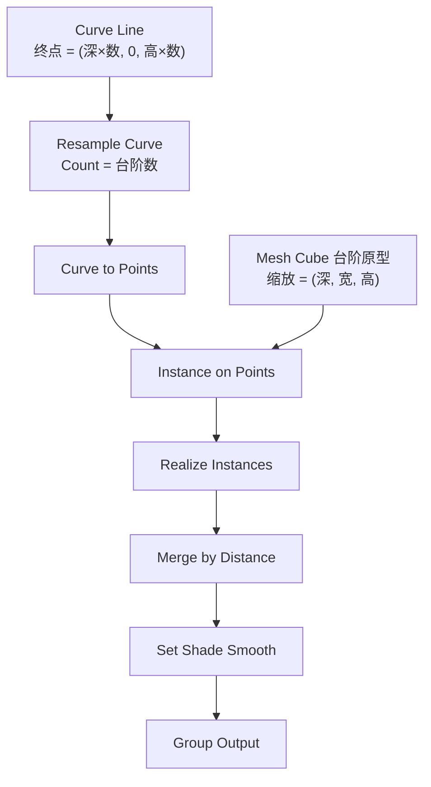
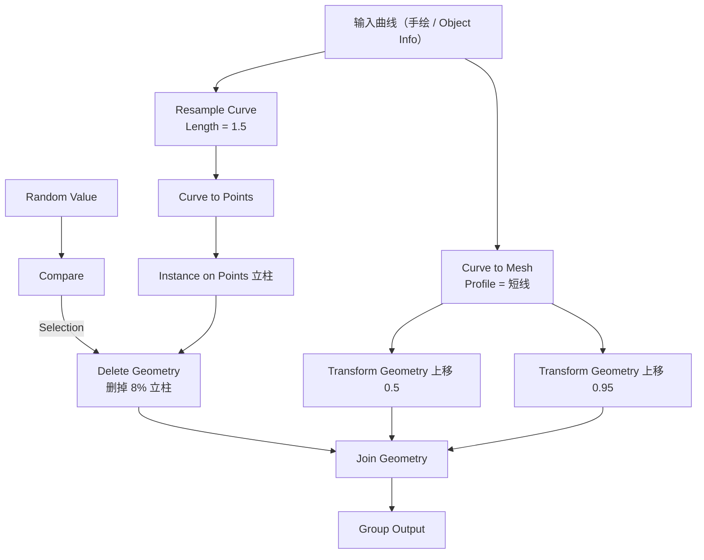
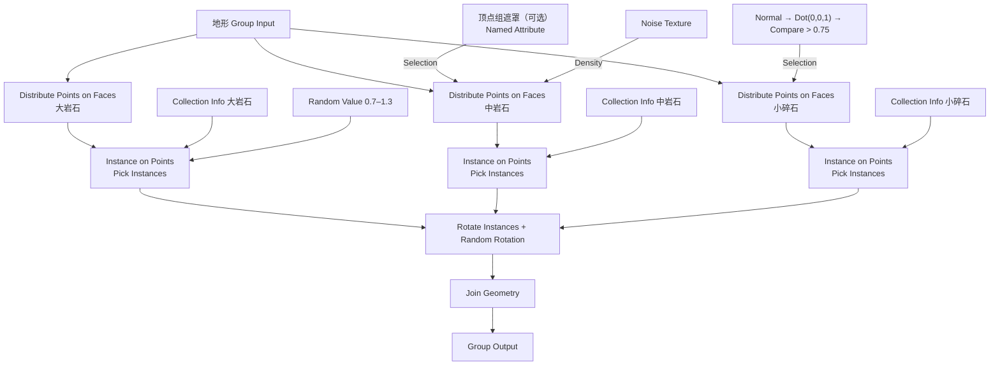
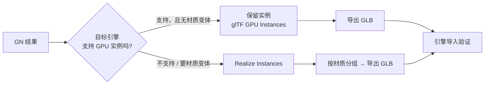

# 11 · 练习项目：程序化楼梯 / 围栏 + 岩石地形散布

> 一句话：**三个项目，从「改一个数字整体跟着变」到「跑通引擎闭环」。** 做不出来就说明前面的某一篇没吃透，回头补。
> 前置：[01](01-Field与Attribute-几何节点的语言.md) Field / [03](03-选择与筛选-Selection-遮罩与域转换.md) 筛选 / [04](04-采样与跨几何传值-Sample-Transfer.md) 采样 / [05](05-实例化深入-Instances与性能.md) 实例 / [06](06-曲线与程序化建模-楼梯与围栏.md) 曲线

文件放 `资产/练习文件/支线-几何节点深入/`。

---

## 项目一 · 程序化楼梯（验收：改台阶数整体跟着变）

### 目标参数

| 参数 | 值 | 说明 |
| ---- | -- | ---- |
| 台阶数 | 12（可改） | 驱动 `Resample Curve` 的 Count |
| 踏步高 | 0.17 m | 真实尺寸（主线 Stage 1 的单位规则） |
| 踏步深 | 0.28 m | 真实尺寸 |
| 梯段宽 | 1.2 m | |
| 面数预算 | < 800 tri | 环境道具（主线 Stage 6 预算表：PC 2,500） |

### 节点树

### 分步

| 步 | 操作 | 检查点 |
| - | ---- | ------ |
| ① | 建一个 Cube 当台阶原型，**原点设到底部中心** | ⭐ 忘了这步每级会错位半个身位 |
| ② | `Curve Line`，终点用乘法算：`(踏步深 × 台阶数, 0, 踏步高 × 台阶数)` | 改台阶数时**总高总长跟着变** |
| ③ | `Resample Curve` → Count = 台阶数 | |
| ④ | `Curve to Points` → `Instance on Points` | 台阶方向对不对 |
| ⑤ | `Realize Instances` → `Merge by Distance` → `Set Shade Smooth` | 变形后必做三件事（[07 篇](07-程序化变形-Noise-Proximity-Transform.md)） |
| ⑥ | 加扶手：同曲线上移 → `Curve to Mesh`（圆 profile） | |
| ⑦ | 加立柱：`Resample`（Count = 台阶数 / 2）→ `Instance on Points` | |
| ⑧ | `Ctrl+G` 打包成组，接口改名，Mark as Asset | 命名 `GN_Stairs_01` |

### 自检

- [ ] 把台阶数从 12 改成 20，整段跟着变且**不断裂、踏步高不压缩**（确认第 ② 步用了乘法）
- [ ] 面数 < 800 tri（Statistics 叠加层，**要 Realize 后看**）
- [ ] 导出 GLB 进引擎，比例正确

---

## 项目二 · 程序化围栏（验收：沿任意手绘曲线生成）

### 目标参数

| 参数 | 值 |
| ---- | -- |
| 柱间距 | 1.5 m（**Length 模式**） |
| 立柱截面 | 0.08 × 0.08 m |
| 立柱高 | 1.1 m |
| 横杆 | 两条，高 0.5 m 与 0.95 m |
| 破损率 | 8% 立柱缺失 |

### 节点树

### 分步

| 步 | 操作 | 检查点 |
| - | ---- | ------ |
| ① | 手绘一条曲线（Shift+A → Curve → Bezier / 或直接画） | |
| ② | `Object Info` 拿进来（或用 Group Input 的 Geometry） | |
| ③ | `Resample Curve` → **Length = 1.5**（不是 Count！） | 改曲线长度，柱距不变 |
| ④ | 立柱：`Curve to Points` → `Instance on Points` | |
| ⑤ | 横杆：原曲线 → `Curve to Mesh`（profile = 一条短线）→ 上移 ×2 | |
| ⑥ | 破损：`Random Value` → `Compare` → `Delete Geometry` | ⚠️ **Domain 要选 Instance** |
| ⑦ | 转角：`Fillet Curve` 加圆角 | 半径别大于相邻段长 |
| ⑧ | `Join Geometry` → 打包 → Mark as Asset | 命名 `GN_Fence_01` |

### 自检

- [ ] 换一条更长 / 更弯的曲线，围栏跟着走且**柱距恒定 1.5 m**
- [ ] 有约 8% 立柱缺失（不是全没、也不是全在）
- [ ] 转角是圆角，不是硬折

---

## 项目三 · 岩石地形散布（最终验收 ⭐）

### 目标参数

| 参数 | 值 |
| ---- | -- |
| 地形 | 10 m × 10 m（Density 按面积算） |
| 岩石 | 3 类（大 / 中 / 小），用 Stage 5 的岩石资产 |
| 大岩石密度 | 0.08 / m² |
| 中岩石密度 | 0.3 / m² |
| 小碎石密度 | 2 / m² |
| 坡度阈值 | 0.75（≈41°），陡坡不长小碎石 |
| 缩放随机 | 0.7 – 1.3 |
| 实例总数 | 控制在 3000 以内 |

### 节点树

### 分步

| 步 | 操作 | 检查点 |
| - | ---- | ------ |
| ① | 三块岩石各 `Ctrl+A → Scale` | ⭐ 忘了这步散布大小乱 |
| ② | 三个 `Distribute Points on Faces`，密度按上表 | ⚠️ Density 是**每平方米**点数 |
| ③ | `Collection Info` + `Instance on Points`，**开 `Pick Instances`** | 不开面数 × N |
| ④ | `Random Value`（Float）→ Scale，0.7–1.3 | 别超 0.5–2.0 |
| ⑤ | `Rotate Instances` + `Random Rotation` | |
| ⑥ | 坡度筛选：`Normal → Vector Math › Dot(0,0,1) → Compare > 0.75` → Selection | 陡崖上没小碎石 |
| ⑦ | 密度遮罩：`Noise Texture → Math › Multiply` → Density | 有疏有密 |
| ⑧ | 顶点组遮罩（可选）：`Named Attribute` → Selection | 只在刷过的区域长 |
| ⑨ | `Join Geometry` → **先不要 Realize** | 视口能流畅操作 |
| ⑩ | 锁 Seed | ⭐ 调好之后再锁，锁完别动 |
| ⑪ | 打包 → Mark as Asset | 命名 `GN_Scatter_Rocks_01` |

### 自检

- [ ] 陡坡上没有小碎石（坡度筛选生效）
- [ ] 分布有疏有密，不是均匀网格（Noise 遮罩生效）
- [ ] 3000 个实例时视口仍可交互（**没在开头 Realize**）
- [ ] 用 Timings 叠加层说出最慢的节点是谁
- [ ] 改 Seed 前后排布明显不同；锁 Seed 后其它改动不影响排布

---

## 最终验收：导出闭环 ⭐

| 检查项 | 判定 |
| ------ | ---- |
| 面数 | Realize 后用 Statistics 看，**三角化后再数**（主线 Stage 6：Faces ≠ Tris） |
| `Ctrl+A` | Rotation & Scale 已应用（Scale = 1,1,1） |
| 法线 | `Shift+N` 重算 |
| 材质 | 只有 Principled BSDF + 贴图，无 Blender 专有节点 |
| 修改器 | 导出时勾 `Apply Modifiers` |
| 清理 | `M → By Distance`；删掉空物体与参考图 |
| 命名 | `Prop_<名称>_<变体>_<序号>` |

> ⚠️ **通用铁律**：在做第 2 个资产之前，先拿第 1 个跑通「导出 → 导入 → 检查」的完整链路。
> 完整清单见 [`../../速查/导出检查清单.md`](../../速查/导出检查清单.md)。

---

## 做崩了怎么救

| 症状 | 根因 | 救法 |
| ---- | ---- | ---- |
| 台阶错位半个身位 | 原型原点不在底部 | 原型 `Set Origin → 底部中心` |
| 改台阶数踏步高被压缩 | `Curve Line` 终点写死了 | 终点用乘法算 |
| 围栏柱距随长度变 | 用了 Count | 改 **Length** |
| 围栏立柱全没了 / 全在 | `Delete Geometry` 域错了 | Domain 选 **Instance** |
| 散布出来面数爆表 | `Collection Info` 没开 `Pick Instances` | 勾上 |
| 散布大小乱七八糟 | 源物体没 Apply Scale | `Ctrl+A → Scale` |
| 视口卡死 | 开头就 `Realize Instances` | 去掉，只在末尾/导出时 Realize |
| 渲染出来少东西 | 嵌套超 8 层 | 末尾 `Realize Instances` |
| 陡崖上还是长了草 | 坡度阈值太低或 Selection 没接上 | 检查 `Compare` 阈值与连线 |
| 分布像个网格 | 没加 Noise 遮罩 | 加 `Noise Texture → Multiply → Density` |
| 改一个参数排布全变 | 动了 Seed | Seed 调好后锁死 |
| 导出后引擎里看不见 | 没 Realize 且引擎不支持 GPU 实例 | Realize 后导出 |

---

## 完成度记录

| # | 项目 | 完成度 | 日期 | 面数 / 实例数 | 引擎验证 |
| - | ---- | ------ | ---- | ------------- | -------- |
| 1 | 程序化楼梯 | ⬜ | | | ⬜ |
| 2 | 程序化围栏 | ⬜ | | | ⬜ |
| 3 | 岩石地形散布 | ⬜ | | | ⬜ |
| 4 | （选做）程序化管道 / 绳索 | ⬜ | | | ⬜ |

---

> **下一步**：回到 [`笔记.md`](笔记.md) 做 6 条自检，然后把踩过的坑同步到 [`../../速查/常见坑汇总.md`](../../速查/常见坑汇总.md)。
