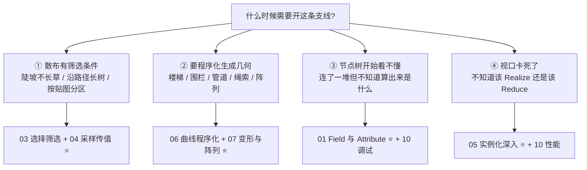
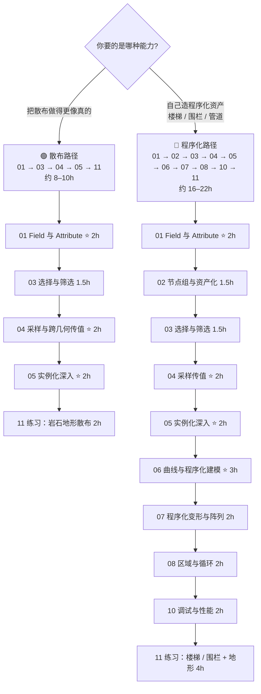
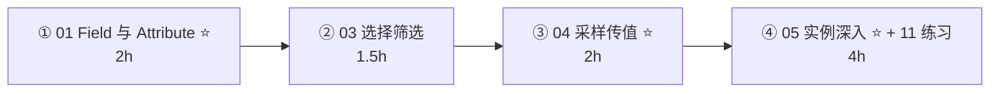
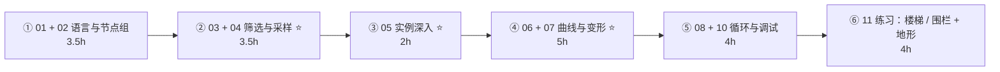

# 支线 · 几何节点深入（原 15–25h → 现：散布 ≈8–10h / 程序化 ≈16–22h）

> **一句话目标**：从「会照着搭一条散布链路」升级到「能自己设计程序化系统，并且知道算出来的东西是什么」。
> 状态：⬜ 未开始　|　开工：　　　|　完成：
> 环境：**Blender 5.2 LTS** · macOS　|　前置：[`../../08-场景组装与作品集/04-几何节点散布入门.md`](../../08-场景组装与作品集/04-几何节点散布入门.md) **必须先做完**（本支线不重复讲散布主链路）、[`../../03-非破坏性流程与资产管理/笔记.md`](../../03-非破坏性流程与资产管理/笔记.md)（修改器栈、`Realize Instances`）、[`../../07-资产规范与引擎导出/笔记.md`](../../07-资产规范与引擎导出/笔记.md)（导出闭环已跑通）
> 什么时候开：**Stage 7 的 `Scatter on Surface` 与 Stage 7 那套散布链路不够用时**。具体有四种触发信号，见第 1 节。

---

## 0. ⚠️ 先订正：路线图里关于这条支线的八条说法要更新

| # | 路线图 / 常见说法 | **5.2 的实际情况** | 依据 |
| - | ---------------- | ------------------ | ---- |
| 1 | 「5.0 新增 **SDF / Volume 节点**（布尔与有机融合的新解法，入门阶段先别碰）」 | ⚠️ **说法不准确，把两代东西混成了一代**。Volume 节点**早在 2.93 就有**（`Volume to Mesh`、`Points to Volume`），`Volume Cube` 于 3.2 加入，4.0 又把 `Mesh to Volume` 改成生成 fog volume。5.0 真正新增的是 **Grid（体素网格）体系**：新的 `Grid` socket + `Mesh to SDF Grid` / `Points to SDF Grid` / `Mesh to Density Grid` / `Grid to Mesh` / `Grid to Points` / `SDF Grid Boolean` 与一批滤波节点。**「入门别碰」的结论仍然成立，但理由变了**（见 [09](09-Volume与SDF-Grid体系与订正.md)） | [5.0 GN Release Notes · Volumes](https://developer.blender.org/docs/release_notes/5.0/geometry_nodes/) · [2.93 GN Release Notes](https://wiki.blender.org/release_notes/2.93/geometry_nodes) · [4.0 GN Release Notes](https://developer.blender.org/docs/release_notes/4.0/geometry_nodes) |
| 2 | 「几何节点基础：**Field / Attribute / 节点组**」（清单里只占一行） | ❌ **严重低估。这是几何节点唯一真正的新心智模型**，也是 90% 的人「看得懂教程、自己一动手就懵」的根因。Field 不是「一个值」，是**一段可被重复求值的指令**；同一个 Field 子树挂在两个数据流节点上会被**求值两次、结果不同**。这条不补，后面所有节点都是抄参数 | [手册 5.2 · Fields](https://docs.blender.org/manual/en/latest/modeling/geometry_nodes/fields.html) · [手册 5.2 · Attributes](https://docs.blender.org/manual/en/latest/modeling/geometry_nodes/attributes_reference.html) |
| 3 | 「实例化于点（Instance on Points）+ 随机化旋转缩放」 | 已在 Stage 7 的 [04 篇](../../08-场景组装与作品集/04-几何节点散布入门.md) 讲完基础。本支线深入的是另外四件事：**Instance 域属性**、**实例上的材质覆盖**、**8 层嵌套硬上限**、**`Realize Instances` 的性能悬崖**。另外补一个 Stage 7 没提的点：**几何节点实例不能和属性面板 `Instancing` 混用**（手册明确警告） | [手册 5.2 · Instances](https://docs.blender.org/manual/en/latest/modeling/geometry_nodes/instances.html) |
| 4 | 「按密度 / 坡度散布植被」 | 同上，基础已在 Stage 7。深入方向是**遮罩从哪来**（顶点组 / 命名属性 / UV 空间 / 另一套几何）与**多层生态散布**（大树下长灌木、灌木下长草）。核心是 `Sample UV Surface` 与 `Geometry Proximity` 这两个**跨几何取值的节点** | [手册 5.2 · Sample UV Surface](https://docs.blender.org/manual/en/latest/modeling/geometry_nodes/mesh/sample/sample_uv_surface.html) · [Geometry Proximity](https://docs.blender.org/manual/en/latest/modeling/geometry_nodes/geometry/sample/geometry_proximity.html) |
| 5 | 「程序化变形与阵列」 | 补一个容易忽略的事实：5.0 那批**基于几何节点的修改器，在几何节点里也有同名节点**——`Generate` 分类下有 **`Array Node`** / **`Curve to Tube Node`** / **`Scatter on Surface Node`**。也就是说「修改器 vs 节点」不是二选一，同一套东西可以在节点树里再套一层 | [手册 5.2 · Generate Nodes](https://docs.blender.org/manual/en/latest/modeling/geometry_nodes/generate/index.html) · [5.0 Modeling Release Notes](https://developer.blender.org/docs/release_notes/5.0/modeling/) |
| 6 | 「几何节点基础：…… / **节点组**」 | 补两条 5.0 才有的能力：① **Bundle**（`Combine / Separate / Join Bundle` + 新的 `Bundle` socket）——把多个值打包成一根连线，相当于编程语言里的 struct；② **Closure**（`Closure Zone` + `Evaluate Closure`）——把一段节点**注入**到节点组里执行，解决了「想改组内行为必须进组改」的老问题 | [5.0 GN Release Notes · Bundles / Closures](https://developer.blender.org/docs/release_notes/5.0/geometry_nodes/) |
| 7 | 原清单**完全没提调试手段** | ❌ 漏了。几何节点最容易卡死的地方不是「不会连」，而是**不知道自己算出来的是什么**。5.2 有完整的一套：`Viewer` 节点（5.0 起支持看非几何数据、支持动态数量的输入、单值直接显示在节点上）、`Spreadsheet`（5.0 起可同时看多个几何、可展开 Bundle）、**Attribute Text 叠加层**、**Timings 叠加层**（节点级耗时） | [5.0 GN Release Notes · Viewer](https://developer.blender.org/docs/release_notes/5.0/geometry_nodes/) · [手册 5.2 · Performance](https://docs.blender.org/manual/en/latest/modeling/geometry_nodes/performance.html) |
| 8 | 原清单**没提导出** | ⚠️ GN 的结果默认**不会**自动变成引擎能吃的网格。三条路：`Realize Instances` 变真几何 / glTF 的 `Geometry Nodes Instances`（实验）/ `GPU Instances`（`EXT_mesh_gpu_instancing`，有硬限制）。详见 Stage 7 [05 篇](../../08-场景组装与作品集/05-场景性能与空间分组.md) 与本支线 [05](05-实例化深入-Instances与性能.md) | [手册 5.2 · glTF 2.0](https://docs.blender.org/manual/en/latest/addons/import_export/scene_gltf2.html) |

> 📌 **已同步回**：第 1 条写进了 `Blender学习路线图.md` 的版本变化表与 Stage 7 订正段；第 3、7 条写进了 [`速查/常见坑汇总.md`](../../速查/常见坑汇总.md) 的「几何节点深入（支线）」段；第 8 条写进了 [`速查/导出检查清单.md`](../../速查/导出检查清单.md)。
> 📌 通用兜底：**找不到节点就在 `Add` 菜单的搜索框里打名字**，别在分类里翻；**快捷键按不出来一律 `F3` 搜命令名**。

---

## 1. 本支线在解决什么问题

Stage 7 的 [04 篇](../../08-场景组装与作品集/04-几何节点散布入门.md) 给你的是**一条能用的链路**：地形 → 撒点 → 放实例 → 随机化。它能解决 80% 的「撒碎石」需求。这一支线补的是另外一半：**当那条链路不够用时，你靠什么自己往下设计。**

```mermaid
flowchart TD
    NEW["本支线新增"]
    NEW --> N1["Field 的求值时机与上下文 ⭐"]
    NEW --> N2["7 种属性域与布尔插值规则"]
    NEW --> N3["命名属性 vs 匿名属性"]
    NEW --> N4["Selection 作为一等公民"]
    NEW --> N5["跨几何采样<br/>Sample Index / Nearest / UV Surface"]
    NEW --> N6["Instance 域与实例上覆盖材质"]
    NEW --> N7["曲线节点族<br/>Resample / to Mesh / Fillet / Trim"]
    NEW --> N8["三种 Zone<br/>Repeat / Simulation / ForEach"]
    NEW --> N9["Grid 与 SDF（5.0）"]
    NEW --> N10["Viewer / Spreadsheet / Timings"]
    OLD["主线已会 · 换个场景用"]
    OLD --> O1["Stage 7 的散布主链路"]
    OLD --> O2["修改器栈顺序语义"]
    OLD --> O3["Realize Instances（Stage 2 已会）"]
    OLD --> O4["Mark as Asset（Stage 2 / 7 已会）"]
    OLD --> O5["Ctrl+A Apply Scale（散布前必做）"]
```

> **和 Stage 7 最大的区别**：Stage 7 教你**用**几何节点，这一支线教你**读**几何节点——读得懂别人搭的树、读得懂自己算出来的中间值、读得懂为什么这里慢。
> **这也是一条「随时可以停」的支线**：01 + 05 看完就能解决大部分实际问题；06 之后的内容属于「我想做程序化资产」才需要。

---

## 2. 学习路径（两条路，按需选）

| # | 文件 | 核心问题 | 预估 | 散布路径 | 程序化路径 |
| - | ---- | -------- | ---- | -------- | ---------- |
| 01 | [`01-Field与Attribute-几何节点的语言.md`](01-Field与Attribute-几何节点的语言.md) ⭐ | Field 到底是什么、为什么同一段会算出两个结果 | 2h | ✅ | ✅ |
| 02 | [`02-节点组-接口-复用与资产化.md`](02-节点组-接口-复用与资产化.md) | 节点组怎样才算「好用」、Bundle / Closure 是什么 | 1.5h | | ✅ |
| 03 | [`03-选择与筛选-Selection-遮罩与域转换.md`](03-选择与筛选-Selection-遮罩与域转换.md) | 怎么只让一部分元素被处理、布尔域插值为什么特殊 | 1.5h | ✅ | ✅ |
| 04 | [`04-采样与跨几何传值-Sample-Transfer.md`](04-采样与跨几何传值-Sample-Transfer.md) ⭐ | 怎么从另一套几何上取值（顶点组 / UV / 最近点） | 2h | ✅ | ✅ |
| 05 | [`05-实例化深入-Instances与性能.md`](05-实例化深入-Instances与性能.md) ⭐ | 实例上能存什么、8 层上限、什么时候必须 Realize | 2h | ✅ | ✅ |
| 06 | [`06-曲线与程序化建模-楼梯与围栏.md`](06-曲线与程序化建模-楼梯与围栏.md) ⭐ | 曲线怎么变成几何、楼梯围栏管道怎么造 | 3h | | ✅ |
| 07 | [`07-程序化变形-Noise-Proximity-Transform.md`](07-程序化变形-Noise-Proximity-Transform.md) | 怎么让几何按规则动起来、阵列的四种做法 | 2h | | ✅ |
| 08 | [`08-区域与循环-Repeat-Simulation-Foreach.md`](08-区域与循环-Repeat-Simulation-Foreach.md) | 需要「迭代 N 次」或「上一帧影响下一帧」时怎么办 | 2h | | ✅ |
| 09 | [`09-Volume与SDF-Grid体系与订正.md`](09-Volume与SDF-Grid体系与订正.md) | 5.0 的 Grid 体系是什么、为什么现在别碰 | 1h（只读） | | 选读 |
| 10 | [`10-调试与性能-Viewer-Spreadsheet-Profiling.md`](10-调试与性能-Viewer-Spreadsheet-Profiling.md) | 算出来的东西怎么看、慢在哪怎么看 | 2h | | ✅ |
| 11 | [`11-练习项目-程序化楼梯围栏与岩石地形.md`](11-练习项目-程序化楼梯围栏与岩石地形.md) | 把 01–10 用一遍并跑通导出闭环 | 2–4h | ✅ | ✅ |

> **01 和 05 不要压缩**：前者决定「你能否读懂节点树」，后者决定「你的场景跑不跑得动」。
> **09 只读不练**：它是对路线图说法的订正存档，除非你要做布尔融合，否则知道「有这套东西、现在别碰」就够了。
> **10 请提前看**：如果你在 03 就开始「连了一堆但不知道算出来是什么」，直接跳到 10 的 Viewer / Spreadsheet 部分，看完再回来。

---

## 3. 必学清单

> 判断标准不是「我看过了」，而是「不看教程能当场做出来 / 说出来」。

### 模块 1 · Field 与 Attribute（[01](01-Field与Attribute-几何节点的语言.md)）⭐

- [ ] 说出 **Field 是「一段指令」而不是「一个值」**，并解释为什么同一段 Field 子树挂两个数据流节点会算出不同结果
- [ ] 认得四种 socket 形状：**圆（单值）/ 菱形（Field）/ 方（Geometry）/ 虚线连线（Field）**、接错时是**红实线**
- [ ] 报出 7 个属性域：Point / Edge / Face / Face Corner / Spline / Instance / Layer
- [ ] 说出**命名属性 vs 匿名属性**的区别，以及「匿名属性不能跨独立几何传递，要用采样节点」这条限制
- [ ] 会用一个 `Capture Attribute` 把「变形前的位置」存下来
- [ ] 会说 `Store Named Attribute` 唯一不可替代的用途：**存 2D Vector（UV）与 Byte Color**
- [ ] 说出 Point → Face 的**布尔插值规则**（面被选中要求所有顶点都选中）

### 模块 2 · 节点组与复用（[02](02-节点组-接口-复用与资产化.md)）

- [ ] 会给节点组的 Group Input 加/删接口、改名字、设默认值与范围
- [ ] 会 `Mark as Asset` 并在另一个文件里拖进来用
- [ ] 说出「什么时候该把一段节点打包成组」的两条判据
- [ ] 知道 5.0 的 **Bundle** 能解决什么问题（多值一根线）
- [ ] 知道 **Closure** 解决什么问题（不改组就能改组内行为）

### 模块 3 · 选择与筛选（[03](03-选择与筛选-Selection-遮罩与域转换.md)）

- [ ] 会用 `Selection` 输入限制节点作用范围（而不是全量处理后再删）
- [ ] 会用顶点组 / 命名属性当遮罩（`Named Attribute` + 名字）
- [ ] 会用 `Box / Sphere / Normal Selection` 做空间选择
- [ ] 会用一个浮点属性 + `Compare` 当阈值遮罩
- [ ] 说出「布尔域插值是『全选 / 任一 / 直接拷贝』而不是平均」这条规则

### 模块 4 · 采样与跨几何传值（[04](04-采样与跨几何传值-Sample-Transfer.md)）⭐

- [ ] 会用 `Sample Index` 从「第 N 个元素」取值（含 Clamp 的行为）
- [ ] 会用 `Sample Nearest` / `Sample Nearest Surface` 从最近点取值
- [ ] 会用 `Sample UV Surface` 在**另一套几何的 UV 空间**里采样（做贴图驱动分布）
- [ ] 会用 `Geometry Proximity` 做「离目标越近越怎样」
- [ ] 会用 `Raycast` 做投射方向上的命中查询
- [ ] 会用一个 `Transfer Attributes` 把属性从 A 搬到 B

### 模块 5 · 实例化深入（[05](05-实例化深入-Instances与性能.md)）⭐

- [ ] 说出三种实例类型与「实例 ≠ 复制」的含义
- [ ] 说出 **8 层嵌套**是渲染与视口的硬上限，超了必须末尾 `Realize Instances`
- [ ] 会在 Instance 域上存属性并用它做每个实例的差异化
- [ ] 会对实例覆盖材质（`Set Material` 在 Instance 域）
- [ ] 说出 **GN 实例不能和属性面板 `Instancing` 混用**
- [ ] 说出「什么时候必须 Realize」的四种情况
- [ ] 知道 glTF 的两个实例开关及其硬限制

### 模块 6 · 曲线与程序化建模（[06](06-曲线与程序化建模-楼梯与围栏.md)）⭐

- [ ] 会搭 `Curve Line / Circle / Spiral` + `Resample Curve` + `Curve to Points`
- [ ] 会用 `Curve to Mesh` 配一个 profile 曲线做管道 / 栏杆
- [ ] 会用 `Fillet Curve` 做圆角、`Trim Curve` 裁段
- [ ] 会做**程序化楼梯**（台阶数驱动，改数字就变）
- [ ] 会做**程序化围栏**（沿曲线立柱 + 横杆）

### 模块 7 · 程序化变形与阵列（[07](07-程序化变形-Noise-Proximity-Transform.md)）

- [ ] 会用 `Set Position` + `Noise Texture` 做有机起伏
- [ ] 会用 `Transform Geometry` 与 `Rotate / Scale / Translate Instances` 分清「改几何」与「改实例」
- [ ] 会用 `Displace Geometry` / `Smooth Geometry`
- [ ] 说出阵列的四种做法并会在场景里选（Array 修改器 / Array 节点 / `Instance on Points` / `Duplicate Elements`）
- [ ] 会用 `Sort Elements` / `Duplicate Elements` / `Delete Geometry`

### 模块 8 · 区域与循环（[08](08-区域与循环-Repeat-Simulation-Foreach.md)）

- [ ] 会用 `Repeat Zone` 做「迭代 N 次」
- [ ] 会用 `For Each Geometry Element Zone` 做「对每个元素跑一遍」
- [ ] 知道 `Simulation Zone` 是「上一帧影响下一帧」，与 Repeat 的区别
- [ ] 会用 `Index Switch` / `Menu Switch` 做分支
- [ ] 知道 Baking 能缓存结果、以及「必须先把 .blend 存盘才能 bake」

### 模块 9 · 调试与性能（[10](10-调试与性能-Viewer-Spreadsheet-Profiling.md)）

- [ ] 会用 `Ctrl+Shift+LMB` 接 `Viewer`、会用 Spreadsheet 看每个元素的实际值
- [ ] 会开 Attribute Text 叠加层与 Timings 叠加层
- [ ] 会用一个 `Mute`（`M`）隔离慢节点
- [ ] 说出四条性能原则（减少几何量 / 优先实例 / 限制昂贵节点 / 用 Selection 限流）
- [ ] 知道存在**节点栈上限**，深嵌套会失败

---

## 4. 时间怎么切

### 🟢 散布路径（约 8–10h 拆成 4 段）

### 🔵 程序化路径（约 16–22h 拆成 6 段）

> 单次动手不超过 **45 分钟**。节点树和建模一样依赖手眼协调，而且更容易「越连越乱」——**每搭完一段就 `Ctrl+G` 打包成组并命名**，别让一棵树上出现 40 个散装节点。

---

## 5. 练习项目

| # | 项目 | 要点 | 完成度 | 文件 |
| - | ---- | ---- | ------ | ---- |
| 1 | **岩石地形散布（散布路径验收）** | 坡度筛选 + Noise 密度遮罩 + 顶点组遮罩 + 三类石头嵌套 + 相机距离剔除 | ⬜ | `资产/练习文件/支线-几何节点深入/` |
| 2 | **程序化楼梯** | 台阶数 / 踏步高 / 踏步深三个参数驱动，改数字整段跟着变 | ⬜ | 同上 |
| 3 | **程序化围栏** | 沿任意曲线立柱 + 横杆 + 随机破损 | ⬜ | 同上 |
| 4 | **程序化管道 / 绳索** | `Curve to Mesh` + profile 曲线 + `Fillet Curve` | ⬜ | 同上 |
| 5 | **完整场景导出（最终验收）** | 上面任一套 + Realize + GLB 进引擎 | ⬜ | 同上 |

> 详细参数、面数账、「做崩了怎么救」见 [`11-练习项目-程序化楼梯围栏与岩石地形.md`](11-练习项目-程序化楼梯围栏与岩石地形.md)。
> 命名规范沿用主线：`Prop_<名称>_<变体>_<序号>`；节点组用 `GN_<功能>_<版本>`（规范见 [`../../07-资产规范与引擎导出/笔记.md`](../../07-资产规范与引擎导出/笔记.md)）。

---

## 6. 验收标准（可判定，不是感觉）

- [ ] 不看教程，能搭出一条**带两个筛选条件**的散布（坡度 + 密度遮罩）
- [ ] 能用顶点组或命名属性当遮罩，让散布只在指定区域发生
- [ ] 能做出一个**改一个数字就整体跟着变**的程序化楼梯
- [ ] 能用 `Viewer` + Spreadsheet 说出某个节点输出的**第 5 个点的实际值**
- [ ] 散布 5000+ 实例时视口仍可交互（没在开头就 `Realize`）
- [ ] 知道自己的节点树里**最慢的那个节点**是哪一个是（用 Timings 叠加层确认）
- [ ] **至少一次完整闭环**：GN 结果 → Realize / 导出 → 引擎导入 → 视觉一致

### 6 条自检（全部通过才算这条支线完成）

| # | 自检点 | 怎么判定 |
| - | ------ | -------- |
| ① | Field 说得清 | 解释「为什么同一个 Position 节点在两处输出不同」，并说出 `Capture Attribute` 什么时候必须插 |
| ② | 域说得清 | 报出 7 个域，并说出 Point → Face 的布尔插值规则 |
| ③ | 采样选得对 | 给一个「按贴图的红通道决定石头密度」的需求，说出该用 `Sample UV Surface` 而不是 `Geometry Proximity` |
| ④ | 实例有约束感 | 说出 8 层嵌套上限、GN 实例不能混面板 Instancing、以及三种必须 Realize 的情况 |
| ⑤ | 程序化做得出 | 做一个台阶数驱动的程序化楼梯，改台阶数整体跟着变且不断裂 |
| ⑥ | 闭环 | 导出 GLB 并在目标引擎里确认「几何 + 材质 + 数量」三者都正常 |

---

## 7. 常见坑

- ❌ **把 Field 当成一个值** → 以为同一段子树到处结果相同 → 实际上每个数据流节点各求值一次
- ❌ **改了几何之后再取 Position** → 拿到的是变形后的位置 → 要 `Capture Attribute` 存快照
- ❌ **匿名属性跨几何直连** → 属性丢失 → 改用 `Sample Index` / `Sample Nearest Surface`
- ❌ **布尔属性按「平均」理解** → 实际是「全选 / 任一 / 直接拷贝」规则 → Point→Face 要求**所有顶点**都选中
- ❌ **不用 `Selection` 输入，先全量处理再删** → 白白算一遍 → Selection 是限流手段，不是事后过滤
- ❌ **`Collection Info` 不开 `Pick Instances`** → 每个点放整个集合 → 面数 × N（Stage 7 已讲，这里最容易忘）
- ❌ **一上来就 `Realize Instances`** → 视口当场卡死 → 能不 Realize 就别 Realize
- ❌ **嵌套超过 8 层没 Realize** → 渲染不出来也不报错
- ❌ **GN 实例和属性面板 `Instancing` 混用** → 手册明确不支持
- ❌ **把 `Rotate Instances` 和 `Transform Geometry` 混着用** → 前者改实例变换、后者改真几何，代价差一个数量级
- ❌ **存 UV / Byte Color 用普通 socket** → 存不了 → 必须用 `Store Named Attribute`
- ❌ **`Distribute Points on Faces` 的 Density 抄教程固定值** → 它是每平方米点数，地形面积一变全错
- ❌ **改 Seed 上瘾** → 排布一直在变 → **调好之后锁死**
- ❌ **节点树不分组** → 两个月后自己都看不懂 → 每搭完一段就 `Ctrl+G`
- ❌ **照老教程找 `Align Euler to Vector` / `Rotate Euler`** → 5.2 已归入 **Deprecated** → 用 `Align Rotation to Vector` / `Rotate Rotation`
- ❌ **以为「5.0 新增 Volume 节点」** → Volume 从 2.93 就有，5.0 新增的是 **Grid**
- ❌ **bake 之前没存盘** → 手册明确要求先存 .blend → 存了再 bake

---

## 8. 资源

> 本支线**只允许 1–2 个主资源**（路线图第 7 节防弃坑规则）。

- **主资源 1**：本目录 [`01`](01-Field与Attribute-几何节点的语言.md)–[`11`](11-练习项目-程序化楼梯围栏与岩石地形.md)
- **主资源 2**：官方手册 5.2 LTS · [Fields](https://docs.blender.org/manual/en/latest/modeling/geometry_nodes/fields.html) / [Attributes](https://docs.blender.org/manual/en/latest/modeling/geometry_nodes/attributes_reference.html) / [Instances](https://docs.blender.org/manual/en/latest/modeling/geometry_nodes/instances.html) / [Performance](https://docs.blender.org/manual/en/latest/modeling/geometry_nodes/performance.html) / [Baking](https://docs.blender.org/manual/en/latest/modeling/geometry_nodes/baking.html)
- YouTube · **Erindale**（路线图原推荐，几何节点讲得最系统的之一）
- YouTube · **Harry Blends**、**CG Matter**、**Ducky 3D**（路线图原推荐）
- YouTube · **Blender Studio / Jacques Lucke** 的技术演讲（Bundle / Closure / Grid 这类 5.0 新东西，看官方讲解比看二手教程快）
- 免费素材：Blender 自带的 **Essentials 资产库**（5.0 又新增了一批内置节点组资产，直接拆开看是最好的教材）

---

## 我的记录

### ____-__-__ · 第 __ 次练习

- **练了什么**：
- **卡点**：
- **怎么解决的**：
- **下次要注意**：

---

## 阶段复盘

1. 学会了什么（3 条以内，用自己的话）：
2. 踩过的坑（≥3 条；够通用的同步到 `速查/常见坑汇总.md`）：
3. 还差什么：
4. 产出物清单（文件路径 + 节点组名 + 实例数 + 面数 + 引擎截图）：

---

> **下一步**：回到主线 [`../../08-场景组装与作品集/笔记.md`](../../08-场景组装与作品集/笔记.md)，把这套程序化能力用进「户外岩石地形」那个练习场景。
> 这条支线留下的最重要的一条判断习惯是：**先问「我要在哪个域上算」**——域（Point / Face / Instance / Spline）决定了属性往哪存、Selection 怎么插值、采样节点该选哪个。几何节点里绝大多数「连上了但不对」的问题，追到底都是域错了。**这是写进流程里的，不是连完才想的。**
