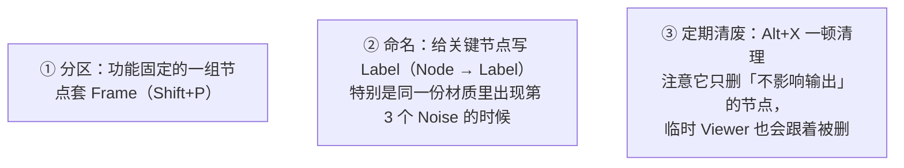

# 01 · Node Wrangler 与着色器编辑器效率（1–1.5h）

> **一句话**：程序化材质的节点树动辄几十个节点，真正的门槛从来不是「想不到」，而是「搭得太慢、改得太痛苦」。
> 依据：[Node Wrangler · Blender 5.2 手册](https://docs.blender.org/manual/en/latest/addons/node_wrangler.html)

---

## 一、为什么要先练快捷键

程序化材质有一个别的领域没有的特点：**你不知道自己要什么，所以要不停试**。一块锈铁从「感觉不对」到「差不多」，中间要改几十次。每一次改都涉及三类动作：


这三类动作如果每次都要「拖线 + 找菜单」，试错的次数会从 50 次掉到 5 次——**这才是「教程看得懂但自己做不出来」的真实原因之一**。

| 动作 | 不用 Node Wrangler | 用 Node Wrangler |
| ---- | ------------------ | ---------------- |
| 看某节点输出 | 拖线到 Material Output → 看完再删 | `Ctrl+Shift+LMB` 一点，再点一下回退 |
| 给噪声挂坐标 | `Shift+A` 加两个节点 + 拖 3 条线 | 选中噪声 → `Ctrl+T` |
| 两个信号相乘 | 加 Math 节点 + 拖 3 条线 + 改模式 | 选中两个节点 → `Ctrl+*` |
| 清理无效节点 | 肉眼检查 → 逐个删 | `Alt+X` |

---

## 二、必须会的十一个操作

> 手册里 Node Wrangler 有 30 多个操作，**入门只要这 11 个**。其余的要用时按 `Shift+W` 搜。

| # | 快捷键 | 名字 | 什么时候用 |
| - | ------ | ---- | ---------- |
| 1 | `Ctrl+Shift+LMB` | Preview Node Output | **最高频**。点任意节点预览它的输出；同一个节点连点会**轮换输出**；再点一次回到原来的树 |
| 2 | `Ctrl+T` | Add Texture Setup | 选中一个**纹理**节点，一键补上 `Texture Coordinate` + `Mapping` 并连好线 |
| 3 | `Shift+Ctrl+T` | Add Principled Setup | 选中一张 Image Texture（或在文件选择器里多选整套 PBR 图），一键搭出 Principled 全套 + 正确色彩空间 |
| 4 | `Ctrl+=` / `Ctrl+-` / `Ctrl+*` / `Ctrl+/` | Merge with Automatic Type Detection | 选中几个节点，按 Math / Mix 语义合并（加 / 减 / 乘 / 除），**自动判断该用 Math 还是 Mix** |
| 5 | `Ctrl+0` | Merge → Mix | 强制用 Mix 节点合并（保留两者的混合度控制权） |
| 6 | `Shift+Ctrl+RMB` 拖动 | Lazy Mix | 从 A 拖到 B，自动插入一个混合节点并把两端连好 |
| 7 | `Alt+X` | Delete Unused Nodes | 删掉所有不影响最终输出的节点（试错一轮之后必按） |
| 8 | `Alt+S` | Swap Links | 交换两个输出上的连线（A→B 变成 B→A） |
| 9 | `Alt+R` | Reload Images | 外部改了贴图，重新载入 |
| 10 | `Shift+P` | Join Nodes | 给选中的节点套一个 Frame（**程序化节点树没有 Frame 会失控**） |
| 11 | `Shift+W` | Node Wrangler 总菜单 | 忘了键位就从这里搜 |

### Mix Factor 微调（第 12 个，做遮罩时特别好用）

| 快捷键 | 效果 |
| ------ | ---- |
| `Alt+Right` / `Alt+Left` | 增减 0.1 |
| `Shift+Alt+Right` / `Shift+Alt+Left` | 增减 0.01（**精调用这个**） |
| `Shift+Ctrl+Alt+Left` / `Shift+Ctrl+Alt+Right` | 直接设成 0 / 1（快速 A/B 对比） |
| `Alt+Up` / `Alt+Down` | 依次切换所选 Math / Mix 的运算模式 |

> `Shift+Ctrl+Alt+Left/Right` 是这套流程里最爽的一个：把 Mix Factor 拨到 0 和 1 来回按，等于「有无这一层」的即时对比——比删节点再 undo 快得多。

---

## 三、macOS 上的三个坑

1. **`Ctrl` 会被系统抢**：macOS 用 `Ctrl+LMB` 当右键。`Ctrl+Shift+LMB` 一般能用；真正的冲突是一小部分 `Ctrl+Alt` 组合。按不出来就 `F3` 搜命令名，或者去 `Preferences → Keymap` 改。
2. **没有数字小键盘**：手册里的 `Ctrl+NumpadPlus` / `Ctrl+NumpadAsterisk` 这类备用键位在 MacBook 上不存在 → **统一用主键盘那一套**（`Ctrl+=` / `Ctrl+*` / `Ctrl+-` / `Ctrl+/`），或者开 `Emulate Numpad`。
3. **`Alt` 等于 macOS 的 `Option`**：肌肉记忆里「Alt = 左 Alt」在 Blender 里没问题，但如果开了外接键盘的自定义映射要重新确认。

---

## 四、程序化材质的编辑器卫生

节点树和代码一样会烂。这三条是这套目录后面九篇的前提：



> `Alt+X` 的另一个用法：它是「我刚才那一堆试错有没有副作用」的体检。按完之后如果画面变了，说明你以为没用的节点其实还在链路上——这本身就是一次排错。

---

## 五、键位不生效的通用排查

| 症状 | 原因 | 解法 |
| ---- | ---- | ---- |
| 按了快捷键画面没反应 | macOS 系统快捷键抢了 / 鼠标没停在节点上 | 看状态栏有没有报错 → `F3` 搜命令名确认功能存在 |
| `Ctrl+T` 出来的是 Environment Texture | 选中的是 Background（世界）着色器，手册里这是预期行为 | 材质本体上用才对 |
| `Ctrl+Shift+LMB` 预览后回不去 | 同一节点有多个输出，会轮换 | 再点几次就轮回来了；或者直接 `Ctrl+Z` |
| `Alt+X` 把刚拖好的线删了 | 那条线确实没连到输出上（**不是插件的错**） | 检查为什么它没接上 → 通常是中间环节断了一格 |
| 节点树乱到看不见 | 没有 Frame + 没有 Label | `Shift+P` 分区 + 给节点写 Label |
| Geometry Nodes 里 `Ctrl+Shift+LMB` 不对 | 手册说明：GN 的预览是 `Shift+Alt+LMB` | 材质编辑器里才是 `Ctrl+Shift+LMB` |

---

## 六、自检

| # | 自检点 | 通过标准 |
| - | ------ | -------- |
| ① | 预览 | **实操**：给一个有 15 个节点的树，30 秒内指出其中任意 3 个节点的输出值如何查看且不破坏原树 |
| ② | 挂坐标 | 给一个孤立的 Noise 节点，不看教程用一次操作补好 `Texture Coordinate + Mapping` |
| ③ | 自动合并 | 选中两个输出节点，不看教程按出「乘在一起」（`Ctrl+*`）并确认生成的是 Math 节点 |
| ④ | 清理 | 试错一轮后能用 `Alt+X` 收尾，并说出它删除的判定标准是什么 |
| ⑤ | 微调 Factor | 会用 `Shift+Ctrl+Alt+Left/Right` 做 A/B 对比，用 `Shift+Alt+左右` 做精调 |
| ⑥ | macOS 兜底 | 键位冲突时能说出两条兜底路径（`F3` / `Shift+W`） |

---

## 七、速查

```text
【看】
Ctrl+Shift+LMB          预览节点输出（连点轮换输出）
Alt+X                   删掉不影响输出的节点

【搭】
Ctrl+T                  给选中纹理补 Texture Coordinate + Mapping
Shift+Ctrl+T            一键 PBR 贴图组（整套图同时选）
Shift+Ctrl+RMB 拖动     Lazy Mix：拖过去自动插混合节点
Slash /                 给所选节点的每个输出加 Reroute

【改】
Ctrl+=                  合并（自动类型）→ 加
Ctrl+-                  合并（自动类型）→ 减
Ctrl+*                  合并（自动类型）→ 乘
Ctrl+/                  合并（自动类型）→ 除
Ctrl+0                  强制用 Mix 合并
Alt+S                   交换所选节点的输出连线

【调 Factor】
Alt+Left / Right        减 / 增 0.1
Shift+Alt+Left/Right    减 / 增 0.01
Shift+Ctrl+Alt+Left     设成 0（A/B 对比）
Shift+Ctrl+Alt+Right    设成 1
Alt+Up / Down           依次切换 Math / Mix 的运算模式

【维护】
Shift+P                 把所选节点装进 Frame
Alt+R                   重载贴图
Shift+=                 对齐所选节点
Shift+W                 总菜单（忘了键位就从这里搜）

【macOS】
键位冲突 → F3 搜命令名 / Preferences → Input → Emulate Numpad
```

---

## 资源

- [Node Wrangler · 官方手册 5.2](https://docs.blender.org/manual/en/latest/addons/node_wrangler.html)（本页全部键位的唯一权威）
- [`../05-材质PBR与烘焙/03-节点搭建与glTF兼容性.md`](../../05-材质PBR与烘焙/03-节点搭建与glTF兼容性.md)（glTF 认哪些输入的口径从这里继承）

---

> **下一步**：[`02-噪声家族-Noise-Voronoi-Wave-Gabor.md`](02-噪声家族-Noise-Voronoi-Wave-Gabor.md)。接下来开始攒食材：程序化材质所有的素材都来自那几个纹理节点，而它们各自能画出什么，决定了你能表达到什么程度。
